# TiCrafter Architecture Graphs

> Generated from `docs/architecture/graph.json`. Edit the graph, then run `node tools/architecture/render-graphs.mjs`.

Mermaid source lives in `docs/architecture/graphs/`. GitHub renders these fenced blocks directly. For local SVG rendering, run `npm run render:svg -- <input.mmd> <output.svg>`; it uses the installed Firefox browser and never downloads Chromium.

## Fleet overview

Systems and externals with aggregated relation counts.

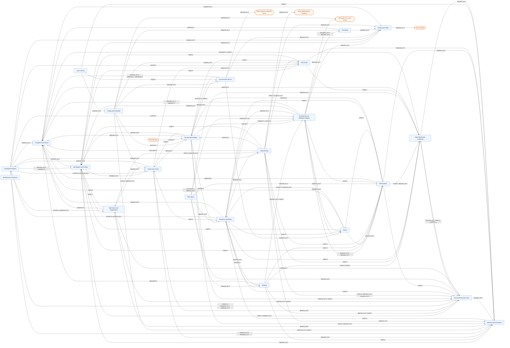
```mermaid
flowchart LR
n0["Coordinator Runtime"]
n1["Transport and Protocol"]
n2["Shared Infrastructure Plan"]
n3["Task Board"]
n4["Claims and Leases"]
n5["Edit Grants and Collaboration"]
n6["Bot Registry and Profiles"]
n7["World Model and Landmarks"]
n8["Perception"]
n9["Laya Decision Service"]
n10["Cloud Planner"]
n11["Skill Runtime"]
n12["Skill Library"]
n13["Building"]
n14["Bot Runtime and Mineflayer Adapter"]
n15["Autonomy and Safety"]
n16["Memory and Persistence"]
n17["Ops and Observability"]
n18["Config and Profiles"]
n19["Testing and Evaluation"]
n20["Laya Training"]
n21["Brains"]
n22["Bootstrap and Toolchain"]
n23(["Minecraft 1.20.1 LAN Server"])
n24(["Muse Spark Planner Endpoint"])
n25(["ONNX Runtime / WebGPU Driver"])
n26(["Host Hardware"])
n27(["Fleet Operator"])
n14 -->|depends_on×2| n15
n21 -->|depends_on×2| n14
n21 -->|depends_on×1| n11
n14 -->|depends_on×3| n18
n14 -->|depends_on×1| n23
n21 -->|reads×1| n6
n21 -->|subscribes×1, depends_on×1| n1
n14 -->|delegates_to×2, depends_on×2| n8
n14 -->|delegates_to×1| n21
n14 -->|delegates_to×1| n6
n14 -->|depends_on×1, publishes×1| n1
n14 -->|depends_on×2, delegates_to×1| n11
n6 -->|reads×1| n5
n6 -->|reads×1, delegates_to×1| n2
n6 -->|reads×1| n3
n6 -->|depends_on×2| n18
n6 -->|depends_on×1| n16
n6 -->|delegates_to×1| n4
n6 -->|reads×1| n11
n13 -->|depends_on×2, reads×1| n14
n13 -->|depends_on×1| n15
n13 -->|reads×4, writes×1| n7
n13 -->|depends_on×1, reads×2| n2
n13 -->|reads×1| n11
n13 -->|writes×1| n16
n13 -->|subscribes×1| n1
n4 -->|depends_on×3| n16
n4 -->|depends_on×2| n3
n4 -->|observes×1| n17
n4 -->|depends_on×1| n0
n4 -->|depends_on×1| n2
n18 -->|depends_on×1| n26
n0 -->|depends_on×4| n1
n0 -->|controls×2, delegates_to×2| n4
n0 -->|controls×1, delegates_to×1| n5
n0 -->|controls×1, delegates_to×1, depends_on×1| n2
n0 -->|controls×1| n3
n0 -->|depends_on×3, delegates_to×1| n16
n0 -->|delegates_to×1| n10
n0 -->|depends_on×3| n18
n0 -->|depends_on×2, publishes×1| n6
n9 -->|proposes_to×1| n21
n9 -->|depends_on×4| n18
n9 -->|depends_on×1, publishes×1, subscribes×1| n1
n9 -->|observes×2, writes×1| n17
n9 -->|depends_on×1| n25
n19 -->|depends_on×1| n4
n19 -->|depends_on×1| n3
n19 -->|depends_on×1| n8
n19 -->|depends_on×1| n23
n19 -->|depends_on×2| n9
n19 -->|observes×1| n17
n19 -->|depends_on×1, reads×1| n16
n27 -->|controls×1| n17
n5 -->|publishes×1| n1
n5 -->|reads×1, depends_on×1| n4
n5 -->|depends_on×3, reads×1| n2
n5 -->|depends_on×1| n16
n5 -->|reads×2| n6
n17 -->|reads×3, depends_on×1| n16
n17 -->|controls×1| n15
n17 -->|depends_on×3| n1
n17 -->|depends_on×1| n9
n17 -->|controls×1| n14
n17 -->|depends_on×2| n6
n17 -->|depends_on×1, reads×1| n2
n17 -->|reads×1| n4
n17 -->|reads×1| n3
n8 -->|publishes×1| n1
n8 -->|depends_on×1| n18
n10 -->|reads×1, proposes_to×1| n5
n10 -->|subscribes×1| n1
n10 -->|observes×2| n17
n10 -->|reads×1| n6
n10 -->|reads×4, depends_on×1, proposes_to×1| n2
n10 -->|reads×2, proposes_to×1| n3
n10 -->|reads×2| n7
n10 -->|depends_on×2| n18
n10 -->|depends_on×1| n24
n10 -->|depends_on×1| n16
n10 -->|reads×1| n11
n15 -->|validates×1, controls×1| n14
n15 -->|validates×1| n13
n15 -->|reads×1| n21
n15 -->|reads×4| n4
n15 -->|reads×2| n7
n15 -->|controls×1, proposes_to×1| n0
n15 -->|depends_on×2| n1
n21 -->|controls×1, depends_on×6| n15
n15 -->|writes×1| n16
n15 -->|reads×2| n2
n15 -->|proposes_to×1| n10
n2 -->|depends_on×9| n16
n2 -->|depends_on×2, reads×1, publishes×1| n7
n2 -->|publishes×1| n5
n11 -->|depends_on×1| n16
n11 -->|reads×1| n14
n11 -->|reads×1| n2
n11 -->|reads×1, depends_on×1| n7
n11 -->|publishes×2| n1
n11 -->|reads×1| n15
n11 -->|observes×1| n17
n11 -->|reads×1| n21
n12 -->|depends_on×8| n13
n12 -->|depends_on×2| n15
n12 -->|depends_on×12| n14
n12 -->|depends_on×4| n11
n12 -->|depends_on×4| n7
n12 -->|depends_on×3| n2
n3 -->|depends_on×3| n16
n3 -->|reads×1| n7
n3 -->|reads×1| n6
n20 -->|reads×1| n9
n20 -->|depends_on×1| n19
n20 -->|reads×2| n16
n1 -->|depends_on×1| n6
n1 -->|depends_on×1| n18
n1 -->|publishes×1| n7
n7 -->|depends_on×2| n16
n7 -->|reads×2| n2
n7 -->|subscribes×1, reads×1| n1
n0 -->|controls×1| n14
classDef system fill:#eef6ff,stroke:#2563eb,color:#0f172a;
classDef external fill:#fff7ed,stroke:#ea580c,color:#7c2d12;
class n0,n1,n2,n3,n4,n5,n6,n7,n8,n9,n10,n11,n12,n13,n14,n15,n16,n17,n18,n19,n20,n21,n22 system;
class n23,n24,n25,n26,n27 external;
```

## Cross-system dependencies

System-to-system view with relation types.

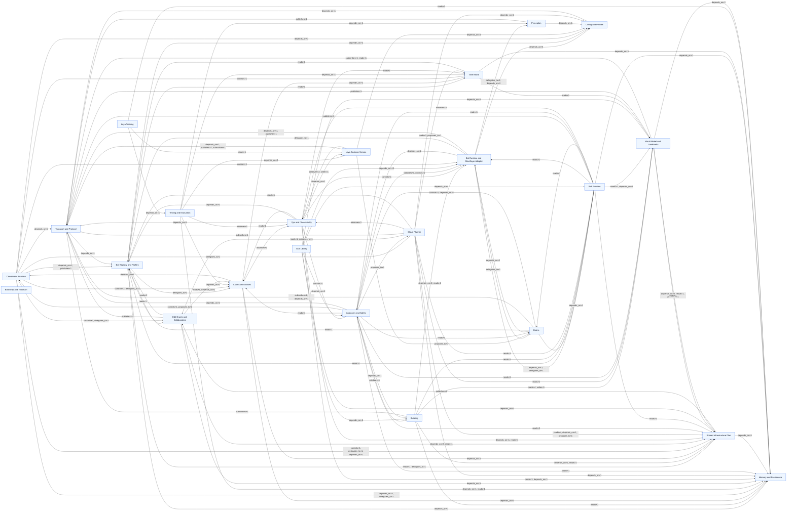
```mermaid
flowchart LR
n0["Coordinator Runtime"]
n1["Transport and Protocol"]
n2["Shared Infrastructure Plan"]
n3["Task Board"]
n4["Claims and Leases"]
n5["Edit Grants and Collaboration"]
n6["Bot Registry and Profiles"]
n7["World Model and Landmarks"]
n8["Perception"]
n9["Laya Decision Service"]
n10["Cloud Planner"]
n11["Skill Runtime"]
n12["Skill Library"]
n13["Building"]
n14["Bot Runtime and Mineflayer Adapter"]
n15["Autonomy and Safety"]
n16["Memory and Persistence"]
n17["Ops and Observability"]
n18["Config and Profiles"]
n19["Testing and Evaluation"]
n20["Laya Training"]
n21["Brains"]
n22["Bootstrap and Toolchain"]
n14 -->|depends_on×2| n15
n21 -->|depends_on×2| n14
n21 -->|depends_on×1| n11
n14 -->|depends_on×3| n18
n21 -->|reads×1| n6
n21 -->|subscribes×1, depends_on×1| n1
n14 -->|delegates_to×2, depends_on×2| n8
n14 -->|delegates_to×1| n21
n14 -->|delegates_to×1| n6
n14 -->|depends_on×1, publishes×1| n1
n14 -->|depends_on×2, delegates_to×1| n11
n6 -->|reads×1| n5
n6 -->|reads×1, delegates_to×1| n2
n6 -->|reads×1| n3
n6 -->|depends_on×2| n18
n6 -->|depends_on×1| n16
n6 -->|delegates_to×1| n4
n6 -->|reads×1| n11
n13 -->|depends_on×2, reads×1| n14
n13 -->|depends_on×1| n15
n13 -->|reads×4, writes×1| n7
n13 -->|depends_on×1, reads×2| n2
n13 -->|reads×1| n11
n13 -->|writes×1| n16
n13 -->|subscribes×1| n1
n4 -->|depends_on×3| n16
n4 -->|depends_on×2| n3
n4 -->|observes×1| n17
n4 -->|depends_on×1| n0
n4 -->|depends_on×1| n2
n0 -->|depends_on×4| n1
n0 -->|controls×2, delegates_to×2| n4
n0 -->|controls×1, delegates_to×1| n5
n0 -->|controls×1, delegates_to×1, depends_on×1| n2
n0 -->|controls×1| n3
n0 -->|depends_on×3, delegates_to×1| n16
n0 -->|delegates_to×1| n10
n0 -->|depends_on×3| n18
n0 -->|depends_on×2, publishes×1| n6
n9 -->|proposes_to×1| n21
n9 -->|depends_on×4| n18
n9 -->|depends_on×1, publishes×1, subscribes×1| n1
n9 -->|observes×2, writes×1| n17
n19 -->|depends_on×1| n4
n19 -->|depends_on×1| n3
n19 -->|depends_on×1| n8
n19 -->|depends_on×2| n9
n19 -->|observes×1| n17
n19 -->|depends_on×1, reads×1| n16
n5 -->|publishes×1| n1
n5 -->|reads×1, depends_on×1| n4
n5 -->|depends_on×3, reads×1| n2
n5 -->|depends_on×1| n16
n5 -->|reads×2| n6
n17 -->|reads×3, depends_on×1| n16
n17 -->|controls×1| n15
n17 -->|depends_on×3| n1
n17 -->|depends_on×1| n9
n17 -->|controls×1| n14
n17 -->|depends_on×2| n6
n17 -->|depends_on×1, reads×1| n2
n17 -->|reads×1| n4
n17 -->|reads×1| n3
n8 -->|publishes×1| n1
n8 -->|depends_on×1| n18
n10 -->|reads×1, proposes_to×1| n5
n10 -->|subscribes×1| n1
n10 -->|observes×2| n17
n10 -->|reads×1| n6
n10 -->|reads×4, depends_on×1, proposes_to×1| n2
n10 -->|reads×2, proposes_to×1| n3
n10 -->|reads×2| n7
n10 -->|depends_on×2| n18
n10 -->|depends_on×1| n16
n10 -->|reads×1| n11
n15 -->|validates×1, controls×1| n14
n15 -->|validates×1| n13
n15 -->|reads×1| n21
n15 -->|reads×4| n4
n15 -->|reads×2| n7
n15 -->|controls×1, proposes_to×1| n0
n15 -->|depends_on×2| n1
n21 -->|controls×1, depends_on×6| n15
n15 -->|writes×1| n16
n15 -->|reads×2| n2
n15 -->|proposes_to×1| n10
n2 -->|depends_on×9| n16
n2 -->|depends_on×2, reads×1, publishes×1| n7
n2 -->|publishes×1| n5
n11 -->|depends_on×1| n16
n11 -->|reads×1| n14
n11 -->|reads×1| n2
n11 -->|reads×1, depends_on×1| n7
n11 -->|publishes×2| n1
n11 -->|reads×1| n15
n11 -->|observes×1| n17
n11 -->|reads×1| n21
n12 -->|depends_on×8| n13
n12 -->|depends_on×2| n15
n12 -->|depends_on×12| n14
n12 -->|depends_on×4| n11
n12 -->|depends_on×4| n7
n12 -->|depends_on×3| n2
n3 -->|depends_on×3| n16
n3 -->|reads×1| n7
n3 -->|reads×1| n6
n20 -->|reads×1| n9
n20 -->|depends_on×1| n19
n20 -->|reads×2| n16
n1 -->|depends_on×1| n6
n1 -->|depends_on×1| n18
n1 -->|publishes×1| n7
n7 -->|depends_on×2| n16
n7 -->|reads×2| n2
n7 -->|subscribes×1, reads×1| n1
n0 -->|controls×1| n14
classDef system fill:#eef6ff,stroke:#2563eb,color:#0f172a;
class n0,n1,n2,n3,n4,n5,n6,n7,n8,n9,n10,n11,n12,n13,n14,n15,n16,n17,n18,n19,n20,n21,n22 system;
```

## Safety and control authority

Guardian veto, grant/claim control, ops stop path, and planner proposal path.

```mermaid
flowchart TD
n0["Coordinator Runtime"]
n9["Laya Decision Service"]
n10["Cloud Planner"]
n11["Skill Runtime"]
n13["Building"]
n14["Bot Runtime and Mineflayer Adapter"]
n15["Autonomy and Safety"]
n17["Ops and Observability"]
n21["Brains"]
n27(["Fleet Operator"])
n14 -->|delegates_to| n21
n14 -->|delegates_to| n11
n0 -->|delegates_to| n10
n9 -->|proposes_to| n21
n17 -->|controls| n15
n17 -->|controls| n14
n15 -->|validates| n14
n15 -->|validates| n13
n15 -->|controls| n14
n15 -->|controls| n0
n21 -->|controls| n15
n15 -->|proposes_to| n0
n15 -->|proposes_to| n10
n0 -->|controls| n14
n28["Command Router"]
n29["Coordinator Epoch Authority"]
n30["Global Scheduler"]
n31["Restart Recovery Orchestrator"]
n32["Bot Process Supervisor"]
n33["Model Loader"]
n34["Execution Provider Selector"]
n35["Batch Runner"]
n36["Single In-flight Guard"]
n37["Output Parser"]
n38["Confidence Calibrator"]
n39["Timeout and Fallback Handler"]
n40["OpenAI-Compatible Client"]
n41["Planner Context Builder"]
n42["Planner Trigger Evaluator"]
n43["Planner Schema Validator"]
n44["Planner Semantic Validator"]
n45["Planner Repair Loop"]
n46["SIP Mutation Translator"]
n47["Task DAG Translator"]
n48["Planner Budget Limiter"]
n49["Planner Arbitration Handler"]
n50["Keep Last Good Fallback"]
n51["Skill Context Builder"]
n52["Block Executor"]
n53["Connection Lifecycle"]
n54["Mineflayer Event Bridge"]
n55["World Cache Adapter"]
n56["Action Executor"]
n57["Guardian Hook"]
n58["Skill Host"]
n59["Reconnect Supervisor"]
n60["Action Veto Gate"]
n61["Recovery Ladder"]
n62["Emergency Stop Controller"]
n63["Ops API"]
n64["Pause and Resume Controller"]
n65["Fleet Emergency Stop"]
n66["Reflex Guardian Loop"]
n67["Deterministic Policy"]
n57 -->|delegates_to| n66
n55 -->|delegates_to| n51
n30 -->|delegates_to| n42
n38 -->|proposes_to| n67
n34 -->|controls| n33
n36 -->|controls| n35
n39 -->|controls| n37
n65 -->|controls| n62
n64 -->|controls| n58
n48 -->|controls| n40
n40 -->|delegates_to| n49
n45 -->|controls| n50
n43 -->|controls| n45
n44 -->|controls| n45
n42 -->|delegates_to| n41
n60 -->|validates| n56
n60 -->|validates| n52
n62 -->|controls| n56
n62 -->|controls| n28
n66 -->|controls| n60
n61 -->|proposes_to| n28
n61 -->|proposes_to| n42
n61 -->|controls| n62
n32 -->|controls| n53
classDef system fill:#eef6ff,stroke:#2563eb,color:#0f172a;
classDef component fill:#f8fafc,stroke:#64748b,color:#0f172a;
classDef external fill:#fff7ed,stroke:#ea580c,color:#7c2d12;
class n0,n9,n10,n11,n13,n14,n15,n17,n21 system;
class n28,n29,n30,n31,n32,n33,n34,n35,n36,n37,n38,n39,n40,n41,n42,n43,n44,n45,n46,n47,n48,n49,n50,n51,n52,n53,n54,n55,n56,n57,n58,n59,n60,n61,n62,n63,n64,n65,n66,n67 component;
class n27 external;
```

## Data flow

Perception, world model, SIP, decisions, skills, building, and persistence.

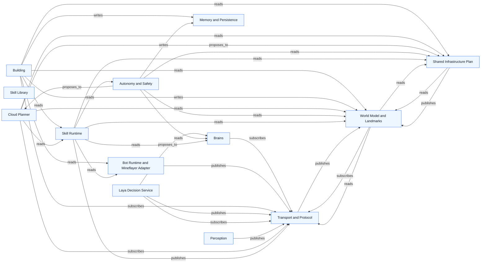
```mermaid
flowchart LR
n1["Transport and Protocol"]
n2["Shared Infrastructure Plan"]
n7["World Model and Landmarks"]
n8["Perception"]
n9["Laya Decision Service"]
n10["Cloud Planner"]
n11["Skill Runtime"]
n12["Skill Library"]
n13["Building"]
n14["Bot Runtime and Mineflayer Adapter"]
n15["Autonomy and Safety"]
n16["Memory and Persistence"]
n21["Brains"]
n21 -->|subscribes| n1
n14 -->|publishes| n1
n13 -->|reads| n7
n13 -->|writes| n7
n13 -->|reads| n11
n13 -->|reads| n14
n13 -->|writes| n16
n13 -->|reads| n2
n13 -->|subscribes| n1
n9 -->|proposes_to| n21
n9 -->|publishes| n1
n9 -->|subscribes| n1
n8 -->|publishes| n1
n10 -->|subscribes| n1
n10 -->|reads| n2
n10 -->|reads| n7
n10 -->|reads| n11
n10 -->|proposes_to| n2
n15 -->|reads| n21
n15 -->|reads| n7
n15 -->|writes| n16
n15 -->|reads| n2
n15 -->|proposes_to| n10
n2 -->|reads| n7
n2 -->|publishes| n7
n11 -->|reads| n14
n11 -->|reads| n2
n11 -->|reads| n7
n11 -->|publishes| n1
n11 -->|reads| n15
n11 -->|reads| n21
n1 -->|publishes| n7
n7 -->|reads| n2
n7 -->|subscribes| n1
n7 -->|reads| n1
classDef system fill:#eef6ff,stroke:#2563eb,color:#0f172a;
class n1,n2,n7,n8,n9,n10,n11,n12,n13,n14,n15,n16,n21 system;
```

## Per-system graphs

### Coordinator Runtime

Source: `docs/architecture/graphs/system-core.mmd`

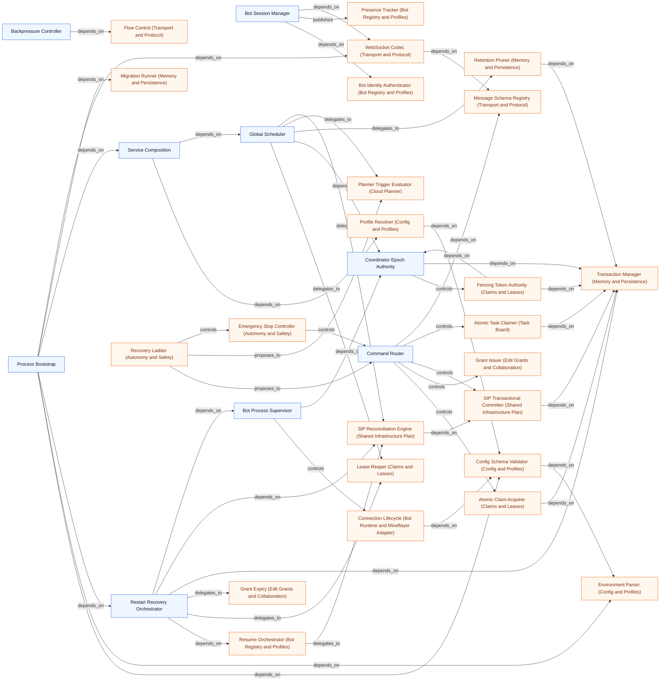
```mermaid
flowchart LR
n68["Process Bootstrap"]
n69["Service Composition"]
n70["Bot Session Manager"]
n28["Command Router"]
n29["Coordinator Epoch Authority"]
n30["Global Scheduler"]
n31["Restart Recovery Orchestrator"]
n71["Backpressure Controller"]
n32["Bot Process Supervisor"]
n130["Fencing Token Authority (Claims and Leases)"]
n131["Flow Control (Transport and Protocol)"]
n132["Atomic Claim Acquirer (Claims and Leases)"]
n133["Grant Issuer (Edit Grants and Collaboration)"]
n134["SIP Transactional Committer (Shared Infrastructure Plan)"]
n135["Atomic Task Claimer (Task Board)"]
n136["Message Schema Registry (Transport and Protocol)"]
n137["Transaction Manager (Memory and Persistence)"]
n138["Lease Reaper (Claims and Leases)"]
n139["Retention Pruner (Memory and Persistence)"]
n42["Planner Trigger Evaluator (Cloud Planner)"]
n140["SIP Reconciliation Engine (Shared Infrastructure Plan)"]
n141["Config Schema Validator (Config and Profiles)"]
n142["Environment Parser (Config and Profiles)"]
n143["Migration Runner (Memory and Persistence)"]
n144["WebSocket Codec (Transport and Protocol)"]
n145["Resume Orchestrator (Bot Registry and Profiles)"]
n146["Grant Expiry (Edit Grants and Collaboration)"]
n147["Profile Resolver (Config and Profiles)"]
n148["Bot Identity Authenticator (Bot Registry and Profiles)"]
n149["Presence Tracker (Bot Registry and Profiles)"]
n62["Emergency Stop Controller (Autonomy and Safety)"]
n61["Recovery Ladder (Autonomy and Safety)"]
n53["Connection Lifecycle (Bot Runtime and Mineflayer Adapter)"]
n53 -->|depends_on| n141
n145 -->|delegates_to| n140
n132 -->|depends_on| n137
n130 -->|depends_on| n29
n130 -->|depends_on| n137
n141 -->|depends_on| n142
n147 -->|depends_on| n141
n71 -->|depends_on| n131
n28 -->|controls| n132
n28 -->|controls| n133
n28 -->|controls| n134
n28 -->|controls| n135
n28 -->|depends_on| n136
n29 -->|controls| n130
n29 -->|depends_on| n137
n30 -->|delegates_to| n138
n30 -->|depends_on| n29
n30 -->|delegates_to| n139
n30 -->|delegates_to| n42
n30 -->|delegates_to| n140
n68 -->|depends_on| n141
n68 -->|depends_on| n142
n68 -->|depends_on| n31
n68 -->|depends_on| n69
n68 -->|depends_on| n143
n68 -->|depends_on| n144
n31 -->|depends_on| n145
n31 -->|delegates_to| n138
n31 -->|delegates_to| n146
n31 -->|depends_on| n137
n31 -->|depends_on| n140
n69 -->|depends_on| n147
n69 -->|depends_on| n30
n70 -->|depends_on| n148
n70 -->|publishes| n149
n70 -->|depends_on| n144
n139 -->|depends_on| n137
n62 -->|controls| n28
n61 -->|proposes_to| n28
n61 -->|proposes_to| n42
n61 -->|controls| n62
n140 -->|depends_on| n134
n134 -->|depends_on| n137
n135 -->|depends_on| n137
n144 -->|depends_on| n136
n32 -->|controls| n53
n32 -->|depends_on| n29
n31 -->|depends_on| n32
classDef internal fill:#eef6ff,stroke:#2563eb,color:#0f172a;
classDef external fill:#fff7ed,stroke:#ea580c,color:#7c2d12;
class n68,n69,n70,n28,n29,n30,n31,n71,n32 internal;
class n130,n131,n132,n133,n134,n135,n136,n137,n138,n139,n42,n140,n141,n142,n143,n144,n145,n146,n147,n148,n149,n62,n61,n53 external;
```

### Transport and Protocol

Source: `docs/architecture/graphs/system-transport.mmd`

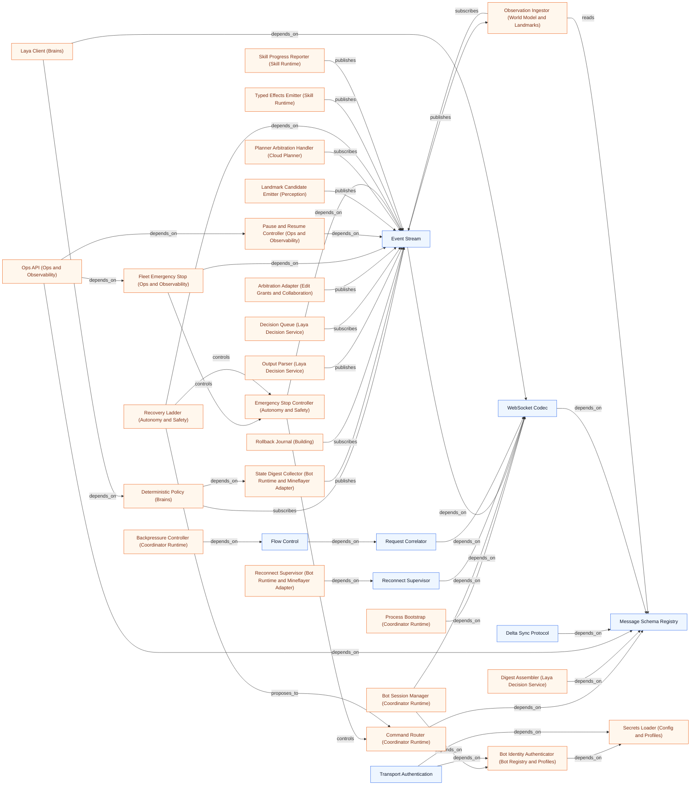
```mermaid
flowchart LR
n136["Message Schema Registry"]
n144["WebSocket Codec"]
n150["Request Correlator"]
n151["Event Stream"]
n152["Delta Sync Protocol"]
n153["Reconnect Supervisor"]
n154["Transport Authentication"]
n131["Flow Control"]
n67["Deterministic Policy (Brains)"]
n59["Reconnect Supervisor (Bot Runtime and Mineflayer Adapter)"]
n109["State Digest Collector (Bot Runtime and Mineflayer Adapter)"]
n106["Rollback Journal (Building)"]
n71["Backpressure Controller (Coordinator Runtime)"]
n28["Command Router (Coordinator Runtime)"]
n68["Process Bootstrap (Coordinator Runtime)"]
n70["Bot Session Manager (Coordinator Runtime)"]
n75["Digest Assembler (Laya Decision Service)"]
n37["Output Parser (Laya Decision Service)"]
n72["Decision Queue (Laya Decision Service)"]
n155["Arbitration Adapter (Edit Grants and Collaboration)"]
n65["Fleet Emergency Stop (Ops and Observability)"]
n63["Ops API (Ops and Observability)"]
n64["Pause and Resume Controller (Ops and Observability)"]
n156["Landmark Candidate Emitter (Perception)"]
n49["Planner Arbitration Handler (Cloud Planner)"]
n62["Emergency Stop Controller (Autonomy and Safety)"]
n61["Recovery Ladder (Autonomy and Safety)"]
n85["Typed Effects Emitter (Skill Runtime)"]
n82["Skill Progress Reporter (Skill Runtime)"]
n148["Bot Identity Authenticator (Bot Registry and Profiles)"]
n157["Secrets Loader (Config and Profiles)"]
n158["Observation Ingestor (World Model and Landmarks)"]
n129["Laya Client (Brains)"]
n67 -->|depends_on| n109
n67 -->|subscribes| n151
n59 -->|depends_on| n153
n109 -->|publishes| n151
n148 -->|depends_on| n157
n106 -->|subscribes| n151
n71 -->|depends_on| n131
n28 -->|depends_on| n136
n68 -->|depends_on| n144
n70 -->|depends_on| n148
n70 -->|depends_on| n144
n75 -->|depends_on| n136
n37 -->|publishes| n151
n72 -->|subscribes| n151
n155 -->|publishes| n151
n65 -->|controls| n62
n65 -->|depends_on| n151
n63 -->|depends_on| n65
n63 -->|depends_on| n64
n63 -->|depends_on| n136
n64 -->|depends_on| n151
n156 -->|publishes| n151
n49 -->|subscribes| n151
n62 -->|controls| n28
n62 -->|depends_on| n151
n61 -->|proposes_to| n28
n61 -->|controls| n62
n61 -->|depends_on| n151
n85 -->|publishes| n151
n82 -->|publishes| n151
n154 -->|depends_on| n148
n154 -->|depends_on| n157
n152 -->|depends_on| n136
n151 -->|depends_on| n144
n151 -->|publishes| n158
n131 -->|depends_on| n150
n153 -->|depends_on| n144
n150 -->|depends_on| n144
n144 -->|depends_on| n136
n158 -->|subscribes| n151
n158 -->|reads| n136
n129 -->|depends_on| n144
n129 -->|depends_on| n67
classDef internal fill:#eef6ff,stroke:#2563eb,color:#0f172a;
classDef external fill:#fff7ed,stroke:#ea580c,color:#7c2d12;
class n136,n144,n150,n151,n152,n153,n154,n131 internal;
class n67,n59,n109,n106,n71,n28,n68,n70,n75,n37,n72,n155,n65,n63,n64,n156,n49,n62,n61,n85,n82,n148,n157,n158,n129 external;
```

### Shared Infrastructure Plan

Source: `docs/architecture/graphs/system-sip.mmd`

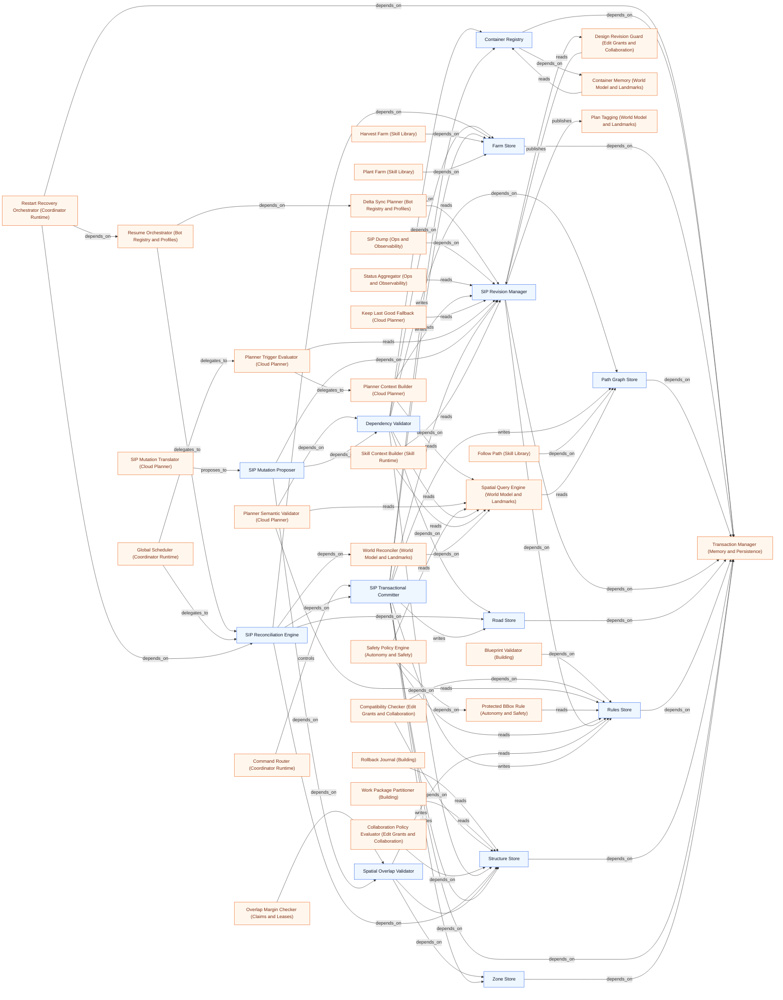
```mermaid
flowchart LR
n159["Zone Store"]
n160["Structure Store"]
n161["Road Store"]
n162["Farm Store"]
n163["Container Registry"]
n164["Path Graph Store"]
n165["Rules Store"]
n166["SIP Revision Manager"]
n167["Spatial Overlap Validator"]
n168["Dependency Validator"]
n169["SIP Mutation Proposer"]
n134["SIP Transactional Committer"]
n140["SIP Reconciliation Engine"]
n170["Delta Sync Planner (Bot Registry and Profiles)"]
n145["Resume Orchestrator (Bot Registry and Profiles)"]
n88["Blueprint Validator (Building)"]
n106["Rollback Journal (Building)"]
n100["Work Package Partitioner (Building)"]
n171["Overlap Margin Checker (Claims and Leases)"]
n28["Command Router (Coordinator Runtime)"]
n30["Global Scheduler (Coordinator Runtime)"]
n31["Restart Recovery Orchestrator (Coordinator Runtime)"]
n172["Compatibility Checker (Edit Grants and Collaboration)"]
n173["Design Revision Guard (Edit Grants and Collaboration)"]
n174["Collaboration Policy Evaluator (Edit Grants and Collaboration)"]
n123["SIP Dump (Ops and Observability)"]
n122["Status Aggregator (Ops and Observability)"]
n41["Planner Context Builder (Cloud Planner)"]
n50["Keep Last Good Fallback (Cloud Planner)"]
n44["Planner Semantic Validator (Cloud Planner)"]
n46["SIP Mutation Translator (Cloud Planner)"]
n42["Planner Trigger Evaluator (Cloud Planner)"]
n117["Protected BBox Rule (Autonomy and Safety)"]
n120["Safety Policy Engine (Autonomy and Safety)"]
n137["Transaction Manager (Memory and Persistence)"]
n175["Container Memory (World Model and Landmarks)"]
n176["Spatial Query Engine (World Model and Landmarks)"]
n177["World Reconciler (World Model and Landmarks)"]
n178["Plan Tagging (World Model and Landmarks)"]
n51["Skill Context Builder (Skill Runtime)"]
n179["Follow Path (Skill Library)"]
n180["Harvest Farm (Skill Library)"]
n181["Plant Farm (Skill Library)"]
n170 -->|reads| n166
n145 -->|depends_on| n170
n145 -->|delegates_to| n140
n88 -->|depends_on| n165
n106 -->|reads| n160
n100 -->|reads| n160
n171 -->|depends_on| n167
n28 -->|controls| n134
n30 -->|delegates_to| n42
n30 -->|delegates_to| n140
n31 -->|depends_on| n145
n31 -->|depends_on| n137
n31 -->|depends_on| n140
n172 -->|depends_on| n165
n172 -->|depends_on| n160
n173 -->|reads| n166
n174 -->|depends_on| n160
n123 -->|depends_on| n166
n122 -->|reads| n166
n41 -->|reads| n166
n41 -->|reads| n176
n50 -->|reads| n166
n44 -->|depends_on| n168
n44 -->|reads| n165
n44 -->|reads| n176
n46 -->|proposes_to| n169
n42 -->|delegates_to| n41
n42 -->|reads| n166
n117 -->|reads| n165
n120 -->|depends_on| n117
n120 -->|reads| n165
n120 -->|reads| n176
n163 -->|depends_on| n137
n163 -->|depends_on| n175
n168 -->|depends_on| n163
n168 -->|depends_on| n162
n168 -->|depends_on| n164
n168 -->|depends_on| n161
n168 -->|depends_on| n160
n168 -->|reads| n176
n162 -->|depends_on| n137
n169 -->|depends_on| n168
n169 -->|depends_on| n166
n169 -->|depends_on| n167
n164 -->|depends_on| n137
n140 -->|depends_on| n162
n140 -->|depends_on| n161
n140 -->|depends_on| n160
n140 -->|depends_on| n134
n140 -->|depends_on| n177
n166 -->|publishes| n173
n166 -->|depends_on| n137
n166 -->|depends_on| n165
n166 -->|publishes| n178
n161 -->|depends_on| n137
n165 -->|depends_on| n137
n167 -->|reads| n165
n167 -->|depends_on| n160
n167 -->|depends_on| n159
n160 -->|depends_on| n137
n134 -->|depends_on| n137
n134 -->|writes| n163
n134 -->|writes| n162
n134 -->|writes| n164
n134 -->|depends_on| n166
n134 -->|writes| n161
n134 -->|writes| n165
n134 -->|writes| n160
n134 -->|writes| n159
n159 -->|depends_on| n137
n51 -->|reads| n166
n51 -->|reads| n176
n179 -->|depends_on| n164
n180 -->|depends_on| n162
n181 -->|depends_on| n162
n175 -->|reads| n163
n176 -->|reads| n164
n177 -->|depends_on| n176
classDef internal fill:#eef6ff,stroke:#2563eb,color:#0f172a;
classDef external fill:#fff7ed,stroke:#ea580c,color:#7c2d12;
class n159,n160,n161,n162,n163,n164,n165,n166,n167,n168,n169,n134,n140 internal;
class n170,n145,n88,n106,n100,n171,n28,n30,n31,n172,n173,n174,n123,n122,n41,n50,n44,n46,n42,n117,n120,n137,n175,n176,n177,n178,n51,n179,n180,n181 external;
```

### Task Board

Source: `docs/architecture/graphs/system-tasks.mmd`

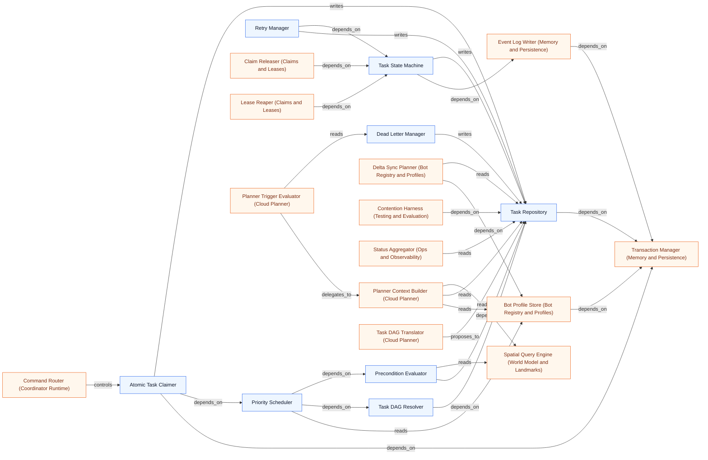
```mermaid
flowchart LR
n182["Task Repository"]
n183["Task DAG Resolver"]
n184["Precondition Evaluator"]
n185["Priority Scheduler"]
n135["Atomic Task Claimer"]
n186["Retry Manager"]
n187["Dead Letter Manager"]
n188["Task State Machine"]
n170["Delta Sync Planner (Bot Registry and Profiles)"]
n189["Claim Releaser (Claims and Leases)"]
n138["Lease Reaper (Claims and Leases)"]
n28["Command Router (Coordinator Runtime)"]
n190["Contention Harness (Testing and Evaluation)"]
n122["Status Aggregator (Ops and Observability)"]
n41["Planner Context Builder (Cloud Planner)"]
n47["Task DAG Translator (Cloud Planner)"]
n42["Planner Trigger Evaluator (Cloud Planner)"]
n137["Transaction Manager (Memory and Persistence)"]
n176["Spatial Query Engine (World Model and Landmarks)"]
n191["Bot Profile Store (Bot Registry and Profiles)"]
n192["Event Log Writer (Memory and Persistence)"]
n170 -->|depends_on| n191
n170 -->|reads| n182
n191 -->|depends_on| n137
n189 -->|depends_on| n188
n138 -->|depends_on| n188
n28 -->|controls| n135
n190 -->|depends_on| n182
n192 -->|depends_on| n137
n122 -->|reads| n182
n41 -->|reads| n191
n41 -->|reads| n182
n41 -->|reads| n176
n47 -->|proposes_to| n182
n42 -->|delegates_to| n41
n42 -->|reads| n187
n135 -->|depends_on| n137
n135 -->|depends_on| n185
n135 -->|writes| n182
n183 -->|depends_on| n182
n187 -->|writes| n182
n184 -->|depends_on| n182
n184 -->|reads| n176
n185 -->|reads| n191
n185 -->|depends_on| n183
n185 -->|depends_on| n184
n186 -->|writes| n182
n186 -->|depends_on| n188
n182 -->|depends_on| n137
n188 -->|depends_on| n192
n188 -->|writes| n182
classDef internal fill:#eef6ff,stroke:#2563eb,color:#0f172a;
classDef external fill:#fff7ed,stroke:#ea580c,color:#7c2d12;
class n182,n183,n184,n185,n135,n186,n187,n188 internal;
class n170,n189,n138,n28,n190,n122,n41,n47,n42,n137,n176,n191,n192 external;
```

### Claims and Leases

Source: `docs/architecture/graphs/system-claims.mmd`

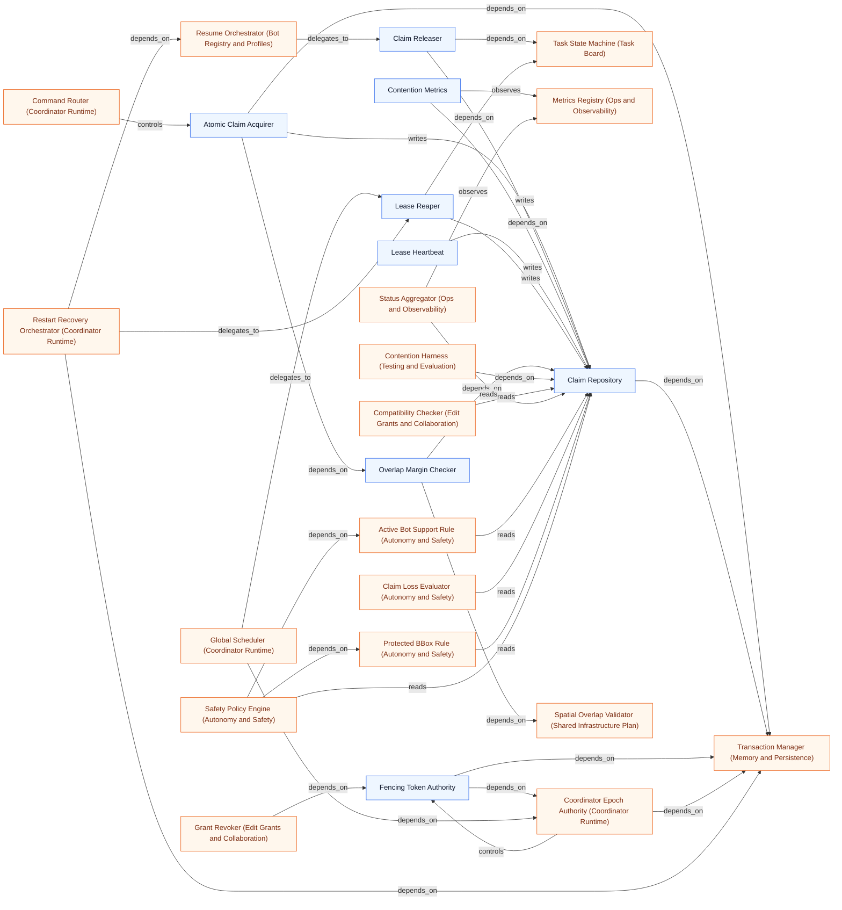
```mermaid
flowchart LR
n193["Claim Repository"]
n171["Overlap Margin Checker"]
n132["Atomic Claim Acquirer"]
n194["Lease Heartbeat"]
n138["Lease Reaper"]
n130["Fencing Token Authority"]
n189["Claim Releaser"]
n195["Contention Metrics"]
n145["Resume Orchestrator (Bot Registry and Profiles)"]
n137["Transaction Manager (Memory and Persistence)"]
n188["Task State Machine (Task Board)"]
n124["Metrics Registry (Ops and Observability)"]
n29["Coordinator Epoch Authority (Coordinator Runtime)"]
n167["Spatial Overlap Validator (Shared Infrastructure Plan)"]
n28["Command Router (Coordinator Runtime)"]
n30["Global Scheduler (Coordinator Runtime)"]
n31["Restart Recovery Orchestrator (Coordinator Runtime)"]
n190["Contention Harness (Testing and Evaluation)"]
n172["Compatibility Checker (Edit Grants and Collaboration)"]
n196["Grant Revoker (Edit Grants and Collaboration)"]
n122["Status Aggregator (Ops and Observability)"]
n118["Active Bot Support Rule (Autonomy and Safety)"]
n116["Claim Loss Evaluator (Autonomy and Safety)"]
n117["Protected BBox Rule (Autonomy and Safety)"]
n120["Safety Policy Engine (Autonomy and Safety)"]
n145 -->|delegates_to| n189
n132 -->|writes| n193
n132 -->|depends_on| n171
n132 -->|depends_on| n137
n189 -->|writes| n193
n189 -->|depends_on| n188
n193 -->|depends_on| n137
n195 -->|depends_on| n193
n195 -->|observes| n124
n130 -->|depends_on| n29
n130 -->|depends_on| n137
n194 -->|writes| n193
n138 -->|writes| n193
n138 -->|depends_on| n188
n171 -->|depends_on| n193
n171 -->|depends_on| n167
n28 -->|controls| n132
n29 -->|controls| n130
n29 -->|depends_on| n137
n30 -->|delegates_to| n138
n30 -->|depends_on| n29
n31 -->|depends_on| n145
n31 -->|delegates_to| n138
n31 -->|depends_on| n137
n190 -->|depends_on| n193
n172 -->|reads| n193
n196 -->|depends_on| n130
n122 -->|reads| n193
n122 -->|observes| n124
n118 -->|reads| n193
n116 -->|reads| n193
n117 -->|reads| n193
n120 -->|reads| n193
n120 -->|depends_on| n118
n120 -->|depends_on| n117
classDef internal fill:#eef6ff,stroke:#2563eb,color:#0f172a;
classDef external fill:#fff7ed,stroke:#ea580c,color:#7c2d12;
class n193,n171,n132,n194,n138,n130,n189,n195 internal;
class n145,n137,n188,n124,n29,n167,n28,n30,n31,n190,n172,n196,n122,n118,n116,n117,n120 external;
```

### Edit Grants and Collaboration

Source: `docs/architecture/graphs/system-grants.mmd`

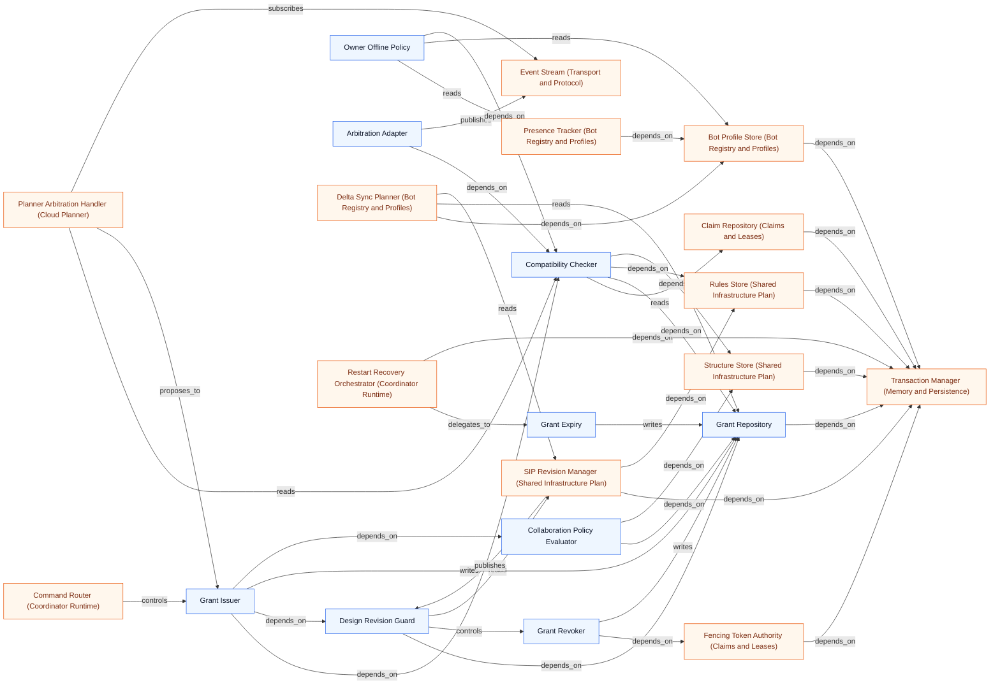
```mermaid
flowchart LR
n197["Grant Repository"]
n174["Collaboration Policy Evaluator"]
n172["Compatibility Checker"]
n173["Design Revision Guard"]
n133["Grant Issuer"]
n196["Grant Revoker"]
n198["Owner Offline Policy"]
n146["Grant Expiry"]
n155["Arbitration Adapter"]
n170["Delta Sync Planner (Bot Registry and Profiles)"]
n28["Command Router (Coordinator Runtime)"]
n31["Restart Recovery Orchestrator (Coordinator Runtime)"]
n151["Event Stream (Transport and Protocol)"]
n193["Claim Repository (Claims and Leases)"]
n165["Rules Store (Shared Infrastructure Plan)"]
n160["Structure Store (Shared Infrastructure Plan)"]
n166["SIP Revision Manager (Shared Infrastructure Plan)"]
n137["Transaction Manager (Memory and Persistence)"]
n130["Fencing Token Authority (Claims and Leases)"]
n149["Presence Tracker (Bot Registry and Profiles)"]
n191["Bot Profile Store (Bot Registry and Profiles)"]
n49["Planner Arbitration Handler (Cloud Planner)"]
n170 -->|depends_on| n191
n170 -->|reads| n197
n170 -->|reads| n166
n149 -->|depends_on| n191
n191 -->|depends_on| n137
n193 -->|depends_on| n137
n130 -->|depends_on| n137
n28 -->|controls| n133
n31 -->|delegates_to| n146
n31 -->|depends_on| n137
n155 -->|depends_on| n172
n155 -->|publishes| n151
n172 -->|reads| n193
n172 -->|depends_on| n197
n172 -->|depends_on| n165
n172 -->|depends_on| n160
n173 -->|depends_on| n197
n173 -->|controls| n196
n173 -->|reads| n166
n146 -->|writes| n197
n133 -->|depends_on| n172
n133 -->|depends_on| n173
n133 -->|writes| n197
n133 -->|depends_on| n174
n197 -->|depends_on| n137
n196 -->|depends_on| n130
n196 -->|writes| n197
n198 -->|reads| n149
n198 -->|reads| n191
n198 -->|depends_on| n172
n174 -->|depends_on| n197
n174 -->|depends_on| n160
n49 -->|reads| n172
n49 -->|proposes_to| n133
n49 -->|subscribes| n151
n166 -->|publishes| n173
n166 -->|depends_on| n137
n166 -->|depends_on| n165
n165 -->|depends_on| n137
n160 -->|depends_on| n137
classDef internal fill:#eef6ff,stroke:#2563eb,color:#0f172a;
classDef external fill:#fff7ed,stroke:#ea580c,color:#7c2d12;
class n197,n174,n172,n173,n133,n196,n198,n146,n155 internal;
class n170,n28,n31,n151,n193,n165,n160,n166,n137,n130,n149,n191,n49 external;
```

### Bot Registry and Profiles

Source: `docs/architecture/graphs/system-bots.mmd`

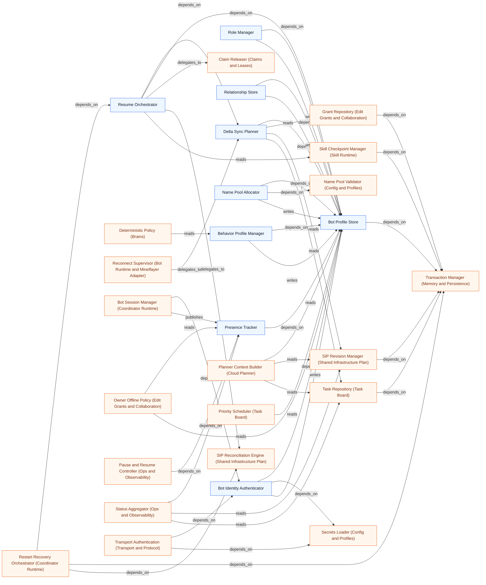
```mermaid
flowchart LR
n148["Bot Identity Authenticator"]
n191["Bot Profile Store"]
n199["Role Manager"]
n200["Behavior Profile Manager"]
n201["Relationship Store"]
n149["Presence Tracker"]
n170["Delta Sync Planner"]
n145["Resume Orchestrator"]
n202["Name Pool Allocator"]
n67["Deterministic Policy (Brains)"]
n59["Reconnect Supervisor (Bot Runtime and Mineflayer Adapter)"]
n197["Grant Repository (Edit Grants and Collaboration)"]
n166["SIP Revision Manager (Shared Infrastructure Plan)"]
n182["Task Repository (Task Board)"]
n157["Secrets Loader (Config and Profiles)"]
n203["Name Pool Validator (Config and Profiles)"]
n137["Transaction Manager (Memory and Persistence)"]
n189["Claim Releaser (Claims and Leases)"]
n140["SIP Reconciliation Engine (Shared Infrastructure Plan)"]
n83["Skill Checkpoint Manager (Skill Runtime)"]
n31["Restart Recovery Orchestrator (Coordinator Runtime)"]
n70["Bot Session Manager (Coordinator Runtime)"]
n198["Owner Offline Policy (Edit Grants and Collaboration)"]
n64["Pause and Resume Controller (Ops and Observability)"]
n122["Status Aggregator (Ops and Observability)"]
n41["Planner Context Builder (Cloud Planner)"]
n185["Priority Scheduler (Task Board)"]
n154["Transport Authentication (Transport and Protocol)"]
n67 -->|reads| n200
n59 -->|delegates_to| n170
n200 -->|depends_on| n191
n170 -->|depends_on| n191
n170 -->|reads| n197
n170 -->|reads| n166
n170 -->|reads| n182
n148 -->|depends_on| n191
n148 -->|depends_on| n157
n202 -->|depends_on| n191
n202 -->|depends_on| n203
n149 -->|depends_on| n191
n191 -->|depends_on| n137
n201 -->|depends_on| n191
n145 -->|depends_on| n170
n145 -->|depends_on| n191
n145 -->|delegates_to| n189
n145 -->|delegates_to| n140
n145 -->|reads| n83
n199 -->|depends_on| n191
n31 -->|depends_on| n145
n31 -->|depends_on| n137
n31 -->|depends_on| n140
n70 -->|depends_on| n148
n70 -->|publishes| n149
n197 -->|depends_on| n137
n198 -->|reads| n149
n198 -->|reads| n191
n64 -->|depends_on| n149
n122 -->|depends_on| n149
n122 -->|reads| n166
n122 -->|reads| n182
n41 -->|reads| n191
n41 -->|reads| n166
n41 -->|reads| n182
n166 -->|depends_on| n137
n83 -->|depends_on| n137
n185 -->|reads| n191
n182 -->|depends_on| n137
n154 -->|depends_on| n148
n154 -->|depends_on| n157
n148 -->|writes| n191
n199 -->|writes| n191
n200 -->|writes| n191
n201 -->|writes| n191
n202 -->|writes| n191
classDef internal fill:#eef6ff,stroke:#2563eb,color:#0f172a;
classDef external fill:#fff7ed,stroke:#ea580c,color:#7c2d12;
class n148,n191,n199,n200,n201,n149,n170,n145,n202 internal;
class n67,n59,n197,n166,n182,n157,n203,n137,n189,n140,n83,n31,n70,n198,n64,n122,n41,n185,n154 external;
```

### World Model and Landmarks

Source: `docs/architecture/graphs/system-world.mmd`

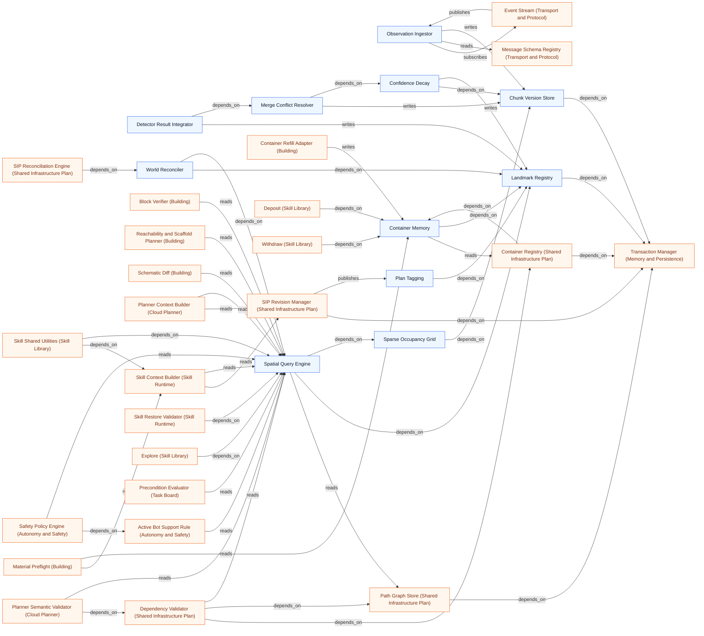
```mermaid
flowchart LR
n158["Observation Ingestor"]
n204["Chunk Version Store"]
n205["Sparse Occupancy Grid"]
n206["Merge Conflict Resolver"]
n207["Confidence Decay"]
n208["Landmark Registry"]
n209["Detector Result Integrator"]
n178["Plan Tagging"]
n176["Spatial Query Engine"]
n175["Container Memory"]
n177["World Reconciler"]
n103["Block Verifier (Building)"]
n105["Container Refill Adapter (Building)"]
n104["Material Preflight (Building)"]
n102["Reachability and Scaffold Planner (Building)"]
n99["Schematic Diff (Building)"]
n41["Planner Context Builder (Cloud Planner)"]
n44["Planner Semantic Validator (Cloud Planner)"]
n118["Active Bot Support Rule (Autonomy and Safety)"]
n120["Safety Policy Engine (Autonomy and Safety)"]
n163["Container Registry (Shared Infrastructure Plan)"]
n168["Dependency Validator (Shared Infrastructure Plan)"]
n140["SIP Reconciliation Engine (Shared Infrastructure Plan)"]
n166["SIP Revision Manager (Shared Infrastructure Plan)"]
n51["Skill Context Builder (Skill Runtime)"]
n84["Skill Restore Validator (Skill Runtime)"]
n210["Deposit (Skill Library)"]
n211["Explore (Skill Library)"]
n212["Skill Shared Utilities (Skill Library)"]
n213["Withdraw (Skill Library)"]
n184["Precondition Evaluator (Task Board)"]
n151["Event Stream (Transport and Protocol)"]
n137["Transaction Manager (Memory and Persistence)"]
n136["Message Schema Registry (Transport and Protocol)"]
n164["Path Graph Store (Shared Infrastructure Plan)"]
n103 -->|reads| n176
n105 -->|writes| n175
n104 -->|reads| n51
n104 -->|reads| n175
n102 -->|reads| n176
n99 -->|reads| n176
n41 -->|reads| n166
n41 -->|reads| n176
n44 -->|depends_on| n168
n44 -->|reads| n176
n118 -->|reads| n176
n120 -->|depends_on| n118
n120 -->|reads| n176
n163 -->|depends_on| n137
n163 -->|depends_on| n175
n168 -->|depends_on| n163
n168 -->|depends_on| n164
n168 -->|reads| n176
n164 -->|depends_on| n137
n140 -->|depends_on| n177
n166 -->|depends_on| n137
n166 -->|publishes| n178
n51 -->|reads| n166
n51 -->|reads| n176
n84 -->|depends_on| n176
n210 -->|depends_on| n175
n211 -->|depends_on| n176
n212 -->|depends_on| n51
n212 -->|depends_on| n176
n213 -->|depends_on| n175
n184 -->|reads| n176
n151 -->|publishes| n158
n204 -->|depends_on| n137
n207 -->|depends_on| n204
n207 -->|writes| n208
n175 -->|reads| n163
n175 -->|depends_on| n208
n209 -->|writes| n208
n209 -->|depends_on| n206
n208 -->|depends_on| n137
n206 -->|writes| n204
n206 -->|depends_on| n207
n158 -->|subscribes| n151
n158 -->|reads| n136
n158 -->|writes| n204
n205 -->|depends_on| n204
n178 -->|depends_on| n208
n176 -->|reads| n164
n176 -->|depends_on| n208
n176 -->|depends_on| n205
n177 -->|depends_on| n208
n177 -->|depends_on| n176
classDef internal fill:#eef6ff,stroke:#2563eb,color:#0f172a;
classDef external fill:#fff7ed,stroke:#ea580c,color:#7c2d12;
class n158,n204,n205,n206,n207,n208,n209,n178,n176,n175,n177 internal;
class n103,n105,n104,n102,n99,n41,n44,n118,n120,n163,n168,n140,n166,n51,n84,n210,n211,n212,n213,n184,n151,n137,n136,n164 external;
```

### Perception

Source: `docs/architecture/graphs/system-perception.mmd`

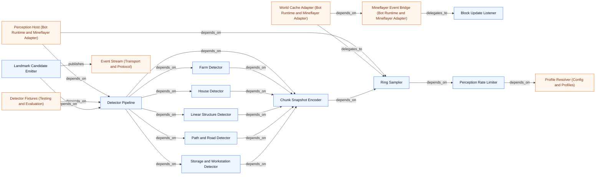
```mermaid
flowchart LR
n214["Ring Sampler"]
n215["Chunk Snapshot Encoder"]
n216["Block Update Listener"]
n217["Path and Road Detector"]
n218["House Detector"]
n219["Farm Detector"]
n220["Storage and Workstation Detector"]
n221["Linear Structure Detector"]
n222["Detector Pipeline"]
n156["Landmark Candidate Emitter"]
n223["Perception Rate Limiter"]
n54["Mineflayer Event Bridge (Bot Runtime and Mineflayer Adapter)"]
n110["Perception Host (Bot Runtime and Mineflayer Adapter)"]
n55["World Cache Adapter (Bot Runtime and Mineflayer Adapter)"]
n224["Detector Fixtures (Testing and Evaluation)"]
n151["Event Stream (Transport and Protocol)"]
n147["Profile Resolver (Config and Profiles)"]
n54 -->|delegates_to| n216
n110 -->|depends_on| n222
n110 -->|depends_on| n214
n55 -->|depends_on| n54
n55 -->|delegates_to| n214
n224 -->|depends_on| n222
n215 -->|depends_on| n214
n222 -->|depends_on| n215
n222 -->|depends_on| n219
n222 -->|depends_on| n218
n222 -->|depends_on| n221
n222 -->|depends_on| n217
n222 -->|depends_on| n220
n219 -->|depends_on| n215
n218 -->|depends_on| n215
n156 -->|depends_on| n222
n156 -->|publishes| n151
n221 -->|depends_on| n215
n217 -->|depends_on| n215
n223 -->|depends_on| n147
n214 -->|depends_on| n223
n220 -->|depends_on| n215
classDef internal fill:#eef6ff,stroke:#2563eb,color:#0f172a;
classDef external fill:#fff7ed,stroke:#ea580c,color:#7c2d12;
class n214,n215,n216,n217,n218,n219,n220,n221,n222,n156,n223 internal;
class n54,n110,n55,n224,n151,n147 external;
```

### Laya Decision Service

Source: `docs/architecture/graphs/system-decision.mmd`

```mermaid
flowchart LR
n33["Model Loader"]
n34["Execution Provider Selector"]
n72["Decision Queue"]
n73["Decision Rate Limiter"]
n74["Digest Cache"]
n75["Digest Assembler"]
n35["Batch Runner"]
n36["Single In-flight Guard"]
n37["Output Parser"]
n38["Confidence Calibrator"]
n39["Timeout and Fallback Handler"]
n76["Latency Metrics"]
n67["Deterministic Policy (Brains)"]
n141["Config Schema Validator (Config and Profiles)"]
n136["Message Schema Registry (Transport and Protocol)"]
n225["Hardware Probe (Config and Profiles)"]
n125["Structured Logger (Ops and Observability)"]
n124["Metrics Registry (Ops and Observability)"]
n226["Laya Runtime Resolver (Config and Profiles)"]
n25(["ONNX Runtime / WebGPU Driver"])
n151["Event Stream (Transport and Protocol)"]
n147["Profile Resolver (Config and Profiles)"]
n227["Laya Benchmark Harness (Testing and Evaluation)"]
n126["Health and Readiness (Ops and Observability)"]
n228["Calibration Fitter (Laya Training)"]
n67 -->|subscribes| n151
n225 -->|depends_on| n147
n226 -->|depends_on| n225
n226 -->|depends_on| n147
n147 -->|depends_on| n141
n35 -->|depends_on| n74
n35 -->|depends_on| n33
n35 -->|depends_on| n72
n38 -->|proposes_to| n67
n38 -->|depends_on| n141
n38 -->|depends_on| n37
n75 -->|depends_on| n136
n74 -->|depends_on| n72
n34 -->|depends_on| n225
n34 -->|controls| n33
n34 -->|observes| n125
n76 -->|observes| n124
n76 -->|writes| n124
n33 -->|depends_on| n226
n33 -->|depends_on| n25
n37 -->|depends_on| n35
n37 -->|publishes| n151
n72 -->|subscribes| n151
n73 -->|depends_on| n147
n73 -->|depends_on| n72
n36 -->|controls| n35
n39 -->|controls| n37
n39 -->|depends_on| n72
n227 -->|depends_on| n76
n227 -->|depends_on| n33
n126 -->|depends_on| n33
n228 -->|reads| n38
classDef internal fill:#eef6ff,stroke:#2563eb,color:#0f172a;
classDef external fill:#fff7ed,stroke:#ea580c,color:#7c2d12;
class n33,n34,n72,n73,n74,n75,n35,n36,n37,n38,n39,n76 internal;
class n67,n141,n136,n225,n125,n124,n226,n151,n147,n227,n126,n228,n25 external;
```

### Cloud Planner

Source: `docs/architecture/graphs/system-planner.mmd`

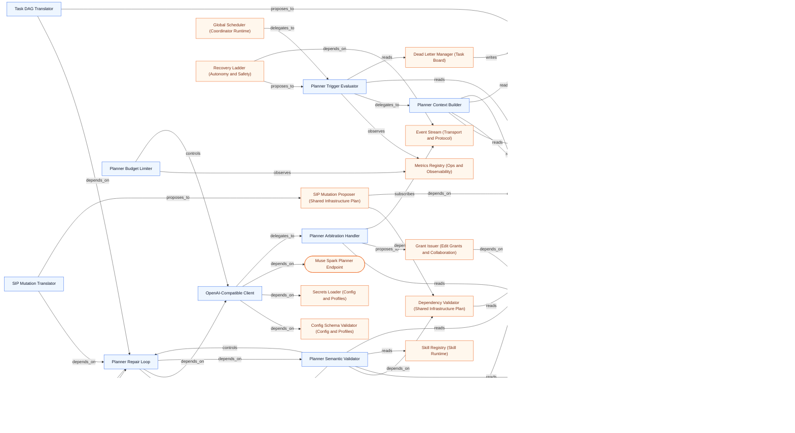
```mermaid
flowchart LR
n40["OpenAI-Compatible Client"]
n41["Planner Context Builder"]
n42["Planner Trigger Evaluator"]
n43["Planner Schema Validator"]
n44["Planner Semantic Validator"]
n45["Planner Repair Loop"]
n46["SIP Mutation Translator"]
n47["Task DAG Translator"]
n48["Planner Budget Limiter"]
n77["Plan Cache"]
n49["Planner Arbitration Handler"]
n50["Keep Last Good Fallback"]
n30["Global Scheduler (Coordinator Runtime)"]
n172["Compatibility Checker (Edit Grants and Collaboration)"]
n133["Grant Issuer (Edit Grants and Collaboration)"]
n151["Event Stream (Transport and Protocol)"]
n124["Metrics Registry (Ops and Observability)"]
n191["Bot Profile Store (Bot Registry and Profiles)"]
n166["SIP Revision Manager (Shared Infrastructure Plan)"]
n182["Task Repository (Task Board)"]
n176["Spatial Query Engine (World Model and Landmarks)"]
n141["Config Schema Validator (Config and Profiles)"]
n157["Secrets Loader (Config and Profiles)"]
n24(["Muse Spark Planner Endpoint"])
n137["Transaction Manager (Memory and Persistence)"]
n168["Dependency Validator (Shared Infrastructure Plan)"]
n165["Rules Store (Shared Infrastructure Plan)"]
n79["Skill Registry (Skill Runtime)"]
n169["SIP Mutation Proposer (Shared Infrastructure Plan)"]
n187["Dead Letter Manager (Task Board)"]
n61["Recovery Ladder (Autonomy and Safety)"]
n191 -->|depends_on| n137
n30 -->|delegates_to| n42
n172 -->|depends_on| n165
n133 -->|depends_on| n172
n49 -->|reads| n172
n49 -->|proposes_to| n133
n49 -->|subscribes| n151
n48 -->|observes| n124
n48 -->|controls| n40
n41 -->|reads| n191
n41 -->|reads| n166
n41 -->|reads| n182
n41 -->|reads| n176
n50 -->|depends_on| n77
n50 -->|reads| n166
n40 -->|depends_on| n141
n40 -->|depends_on| n157
n40 -->|depends_on| n24
n40 -->|delegates_to| n49
n77 -->|depends_on| n137
n45 -->|controls| n50
n45 -->|depends_on| n40
n45 -->|depends_on| n43
n45 -->|depends_on| n44
n43 -->|controls| n45
n44 -->|controls| n45
n44 -->|depends_on| n43
n44 -->|depends_on| n168
n44 -->|reads| n165
n44 -->|reads| n79
n44 -->|reads| n176
n46 -->|depends_on| n45
n46 -->|proposes_to| n169
n47 -->|depends_on| n45
n47 -->|proposes_to| n182
n42 -->|observes| n124
n42 -->|delegates_to| n41
n42 -->|reads| n166
n42 -->|reads| n187
n61 -->|proposes_to| n42
n61 -->|depends_on| n151
n168 -->|reads| n176
n169 -->|depends_on| n168
n169 -->|depends_on| n166
n166 -->|depends_on| n137
n166 -->|depends_on| n165
n165 -->|depends_on| n137
n187 -->|writes| n182
n182 -->|depends_on| n137
classDef internal fill:#eef6ff,stroke:#2563eb,color:#0f172a;
classDef external fill:#fff7ed,stroke:#ea580c,color:#7c2d12;
class n40,n41,n42,n43,n44,n45,n46,n47,n48,n77,n49,n50 internal;
class n30,n172,n133,n151,n124,n191,n166,n182,n176,n141,n157,n137,n168,n165,n79,n169,n187,n61,n24 external;
```

### Skill Runtime

Source: `docs/architecture/graphs/system-skill-runtime.mmd`

```mermaid
flowchart LR
n78["Skill Contract"]
n79["Skill Registry"]
n80["Skill Lifecycle Executor"]
n81["Skill Tick Scheduler"]
n51["Skill Context Builder"]
n82["Skill Progress Reporter"]
n83["Skill Checkpoint Manager"]
n84["Skill Restore Validator"]
n85["Typed Effects Emitter"]
n86["Skill Preemption Handler"]
n128["Affordance Enumerator (Brains)"]
n58["Skill Host (Bot Runtime and Mineflayer Adapter)"]
n55["World Cache Adapter (Bot Runtime and Mineflayer Adapter)"]
n145["Resume Orchestrator (Bot Registry and Profiles)"]
n104["Material Preflight (Building)"]
n44["Planner Semantic Validator (Cloud Planner)"]
n137["Transaction Manager (Memory and Persistence)"]
n166["SIP Revision Manager (Shared Infrastructure Plan)"]
n176["Spatial Query Engine (World Model and Landmarks)"]
n151["Event Stream (Transport and Protocol)"]
n60["Action Veto Gate (Autonomy and Safety)"]
n124["Metrics Registry (Ops and Observability)"]
n66["Reflex Guardian Loop (Brains)"]
n229["Craft (Skill Library)"]
n230["Navigate (Skill Library)"]
n231["Place Build (Skill Library)"]
n212["Skill Shared Utilities (Skill Library)"]
n128 -->|depends_on| n55
n128 -->|depends_on| n66
n128 -->|depends_on| n79
n58 -->|depends_on| n80
n58 -->|depends_on| n81
n55 -->|delegates_to| n51
n145 -->|reads| n83
n104 -->|reads| n51
n44 -->|reads| n79
n44 -->|reads| n176
n60 -->|reads| n66
n66 -->|controls| n60
n166 -->|depends_on| n137
n83 -->|depends_on| n137
n51 -->|reads| n55
n51 -->|reads| n166
n51 -->|depends_on| n83
n51 -->|reads| n176
n85 -->|publishes| n151
n80 -->|depends_on| n51
n80 -->|depends_on| n85
n80 -->|depends_on| n78
n80 -->|depends_on| n79
n86 -->|reads| n60
n86 -->|depends_on| n80
n82 -->|observes| n124
n82 -->|publishes| n151
n84 -->|depends_on| n83
n84 -->|depends_on| n176
n79 -->|depends_on| n78
n81 -->|reads| n66
n81 -->|depends_on| n80
n229 -->|depends_on| n51
n230 -->|depends_on| n78
n231 -->|depends_on| n51
n212 -->|depends_on| n51
n212 -->|depends_on| n176
classDef internal fill:#eef6ff,stroke:#2563eb,color:#0f172a;
classDef external fill:#fff7ed,stroke:#ea580c,color:#7c2d12;
class n78,n79,n80,n81,n51,n82,n83,n84,n85,n86 internal;
class n128,n58,n55,n145,n104,n44,n137,n166,n176,n151,n60,n124,n66,n229,n230,n231,n212 external;
```

### Skill Library

Source: `docs/architecture/graphs/system-skills.mmd`

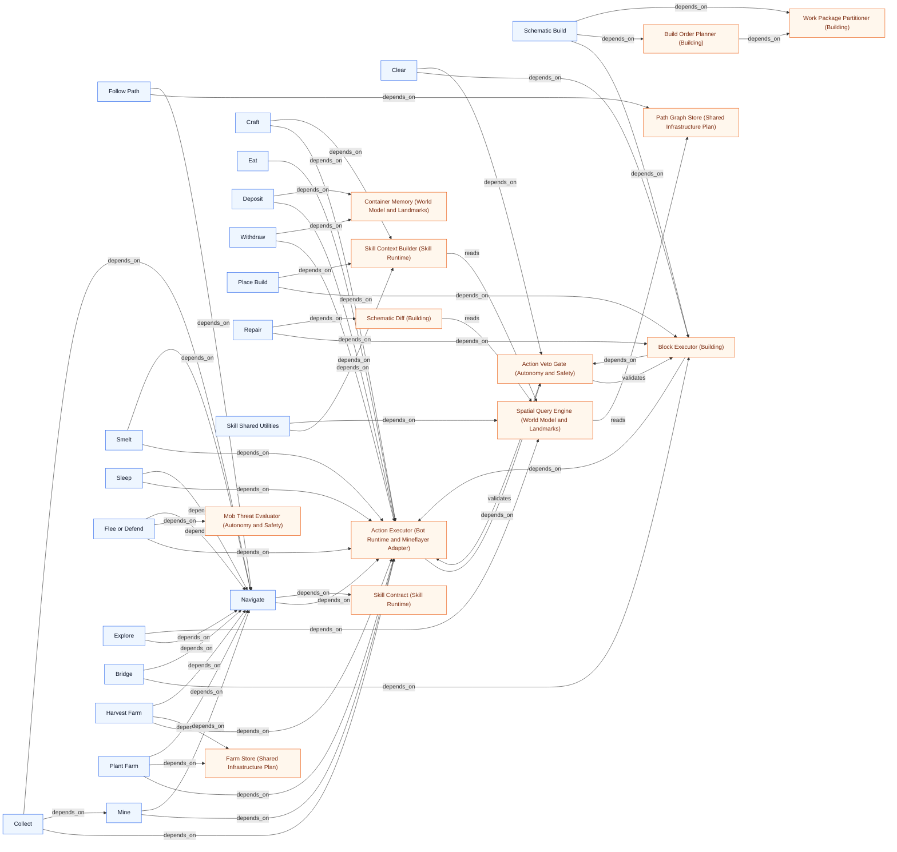
```mermaid
flowchart LR
n230["Navigate"]
n179["Follow Path"]
n232["Mine"]
n233["Collect"]
n229["Craft"]
n234["Smelt"]
n235["Eat"]
n210["Deposit"]
n213["Withdraw"]
n236["Sleep"]
n237["Flee or Defend"]
n211["Explore"]
n238["Bridge"]
n239["Clear"]
n231["Place Build"]
n240["Schematic Build"]
n241["Repair"]
n180["Harvest Farm"]
n181["Plant Farm"]
n212["Skill Shared Utilities"]
n52["Block Executor (Building)"]
n60["Action Veto Gate (Autonomy and Safety)"]
n56["Action Executor (Bot Runtime and Mineflayer Adapter)"]
n51["Skill Context Builder (Skill Runtime)"]
n175["Container Memory (World Model and Landmarks)"]
n176["Spatial Query Engine (World Model and Landmarks)"]
n112["Mob Threat Evaluator (Autonomy and Safety)"]
n164["Path Graph Store (Shared Infrastructure Plan)"]
n162["Farm Store (Shared Infrastructure Plan)"]
n78["Skill Contract (Skill Runtime)"]
n99["Schematic Diff (Building)"]
n101["Build Order Planner (Building)"]
n100["Work Package Partitioner (Building)"]
n56 -->|depends_on| n60
n52 -->|depends_on| n56
n52 -->|depends_on| n60
n101 -->|depends_on| n100
n99 -->|reads| n176
n60 -->|validates| n56
n60 -->|validates| n52
n51 -->|reads| n176
n238 -->|depends_on| n52
n238 -->|depends_on| n230
n239 -->|depends_on| n52
n239 -->|depends_on| n60
n233 -->|depends_on| n56
n233 -->|depends_on| n232
n233 -->|depends_on| n230
n229 -->|depends_on| n56
n229 -->|depends_on| n51
n210 -->|depends_on| n56
n210 -->|depends_on| n175
n235 -->|depends_on| n56
n211 -->|depends_on| n230
n211 -->|depends_on| n176
n237 -->|depends_on| n56
n237 -->|depends_on| n112
n237 -->|depends_on| n230
n179 -->|depends_on| n164
n179 -->|depends_on| n230
n180 -->|depends_on| n56
n180 -->|depends_on| n162
n180 -->|depends_on| n230
n232 -->|depends_on| n56
n232 -->|depends_on| n230
n230 -->|depends_on| n56
n230 -->|depends_on| n78
n231 -->|depends_on| n52
n231 -->|depends_on| n51
n181 -->|depends_on| n56
n181 -->|depends_on| n162
n181 -->|depends_on| n230
n241 -->|depends_on| n52
n241 -->|depends_on| n99
n240 -->|depends_on| n52
n240 -->|depends_on| n101
n240 -->|depends_on| n100
n212 -->|depends_on| n51
n212 -->|depends_on| n176
n236 -->|depends_on| n56
n236 -->|depends_on| n230
n234 -->|depends_on| n56
n234 -->|depends_on| n230
n213 -->|depends_on| n56
n213 -->|depends_on| n175
n176 -->|reads| n164
classDef internal fill:#eef6ff,stroke:#2563eb,color:#0f172a;
classDef external fill:#fff7ed,stroke:#ea580c,color:#7c2d12;
class n230,n179,n232,n233,n229,n234,n235,n210,n213,n236,n237,n211,n238,n239,n231,n240,n241,n180,n181,n212 internal;
class n52,n60,n56,n51,n175,n176,n112,n164,n162,n78,n99,n101,n100 external;
```

### Building

Source: `docs/architecture/graphs/system-building.mmd`

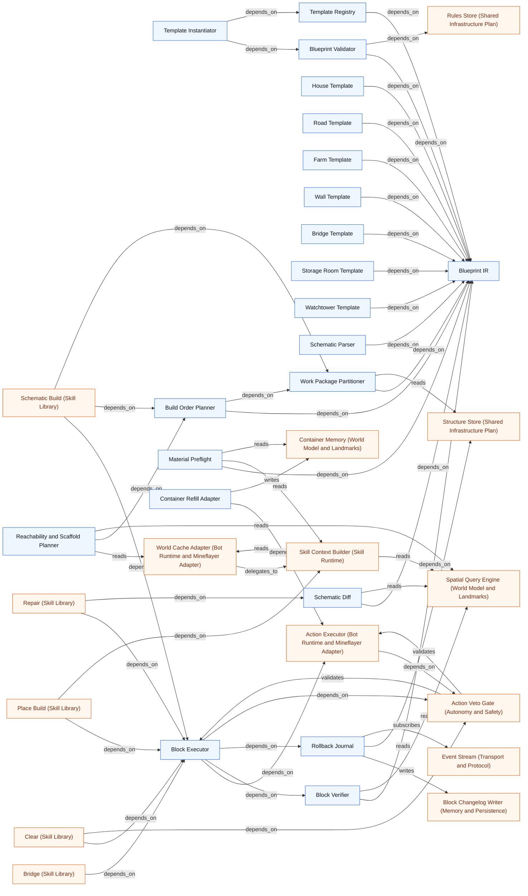
```mermaid
flowchart LR
n87["Blueprint IR"]
n88["Blueprint Validator"]
n89["Template Registry"]
n90["House Template"]
n91["Road Template"]
n92["Farm Template"]
n93["Wall Template"]
n94["Bridge Template"]
n95["Storage Room Template"]
n96["Watchtower Template"]
n97["Template Instantiator"]
n98["Schematic Parser"]
n99["Schematic Diff"]
n100["Work Package Partitioner"]
n101["Build Order Planner"]
n102["Reachability and Scaffold Planner"]
n103["Block Verifier"]
n52["Block Executor"]
n104["Material Preflight"]
n105["Container Refill Adapter"]
n106["Rollback Journal"]
n56["Action Executor (Bot Runtime and Mineflayer Adapter)"]
n60["Action Veto Gate (Autonomy and Safety)"]
n176["Spatial Query Engine (World Model and Landmarks)"]
n165["Rules Store (Shared Infrastructure Plan)"]
n175["Container Memory (World Model and Landmarks)"]
n51["Skill Context Builder (Skill Runtime)"]
n55["World Cache Adapter (Bot Runtime and Mineflayer Adapter)"]
n242["Block Changelog Writer (Memory and Persistence)"]
n160["Structure Store (Shared Infrastructure Plan)"]
n151["Event Stream (Transport and Protocol)"]
n238["Bridge (Skill Library)"]
n239["Clear (Skill Library)"]
n231["Place Build (Skill Library)"]
n241["Repair (Skill Library)"]
n240["Schematic Build (Skill Library)"]
n56 -->|depends_on| n60
n55 -->|delegates_to| n51
n52 -->|depends_on| n56
n52 -->|depends_on| n103
n52 -->|depends_on| n106
n52 -->|depends_on| n60
n103 -->|depends_on| n87
n103 -->|reads| n176
n88 -->|depends_on| n87
n88 -->|depends_on| n165
n101 -->|depends_on| n87
n101 -->|depends_on| n100
n105 -->|depends_on| n56
n105 -->|writes| n175
n104 -->|depends_on| n87
n104 -->|reads| n51
n104 -->|reads| n175
n102 -->|reads| n55
n102 -->|depends_on| n101
n102 -->|reads| n176
n106 -->|writes| n242
n106 -->|reads| n160
n106 -->|subscribes| n151
n99 -->|depends_on| n87
n99 -->|reads| n176
n98 -->|depends_on| n87
n94 -->|depends_on| n87
n92 -->|depends_on| n87
n90 -->|depends_on| n87
n97 -->|depends_on| n88
n97 -->|depends_on| n89
n89 -->|depends_on| n87
n91 -->|depends_on| n87
n95 -->|depends_on| n87
n93 -->|depends_on| n87
n96 -->|depends_on| n87
n100 -->|depends_on| n87
n100 -->|reads| n160
n60 -->|validates| n56
n60 -->|validates| n52
n51 -->|reads| n55
n51 -->|reads| n176
n238 -->|depends_on| n52
n239 -->|depends_on| n52
n239 -->|depends_on| n60
n231 -->|depends_on| n52
n231 -->|depends_on| n51
n241 -->|depends_on| n52
n241 -->|depends_on| n99
n240 -->|depends_on| n52
n240 -->|depends_on| n101
n240 -->|depends_on| n100
classDef internal fill:#eef6ff,stroke:#2563eb,color:#0f172a;
classDef external fill:#fff7ed,stroke:#ea580c,color:#7c2d12;
class n87,n88,n89,n90,n91,n92,n93,n94,n95,n96,n97,n98,n99,n100,n101,n102,n103,n52,n104,n105,n106 internal;
class n56,n60,n176,n165,n175,n51,n55,n242,n160,n151,n238,n239,n231,n241,n240 external;
```

### Bot Runtime and Mineflayer Adapter

Source: `docs/architecture/graphs/system-bot-runtime.mmd`

```mermaid
flowchart LR
n53["Connection Lifecycle"]
n107["Join and Auth"]
n54["Mineflayer Event Bridge"]
n55["World Cache Adapter"]
n108["Reach and Rate Guard"]
n56["Action Executor"]
n109["State Digest Collector"]
n57["Guardian Hook"]
n58["Skill Host"]
n110["Perception Host"]
n59["Reconnect Supervisor"]
n60["Action Veto Gate (Autonomy and Safety)"]
n128["Affordance Enumerator (Brains)"]
n141["Config Schema Validator (Config and Profiles)"]
n23(["Minecraft 1.20.1 LAN Server"])
n67["Deterministic Policy (Brains)"]
n216["Block Update Listener (Perception)"]
n66["Reflex Guardian Loop (Brains)"]
n147["Profile Resolver (Config and Profiles)"]
n222["Detector Pipeline (Perception)"]
n214["Ring Sampler (Perception)"]
n170["Delta Sync Planner (Bot Registry and Profiles)"]
n153["Reconnect Supervisor (Transport and Protocol)"]
n80["Skill Lifecycle Executor (Skill Runtime)"]
n81["Skill Tick Scheduler (Skill Runtime)"]
n151["Event Stream (Transport and Protocol)"]
n51["Skill Context Builder (Skill Runtime)"]
n52["Block Executor (Building)"]
n105["Container Refill Adapter (Building)"]
n102["Reachability and Scaffold Planner (Building)"]
n64["Pause and Resume Controller (Ops and Observability)"]
n62["Emergency Stop Controller (Autonomy and Safety)"]
n233["Collect (Skill Library)"]
n229["Craft (Skill Library)"]
n210["Deposit (Skill Library)"]
n235["Eat (Skill Library)"]
n237["Flee or Defend (Skill Library)"]
n180["Harvest Farm (Skill Library)"]
n232["Mine (Skill Library)"]
n230["Navigate (Skill Library)"]
n181["Plant Farm (Skill Library)"]
n236["Sleep (Skill Library)"]
n234["Smelt (Skill Library)"]
n213["Withdraw (Skill Library)"]
n32["Bot Process Supervisor (Coordinator Runtime)"]
n56 -->|depends_on| n53
n56 -->|depends_on| n108
n56 -->|depends_on| n60
n128 -->|depends_on| n55
n128 -->|depends_on| n66
n53 -->|depends_on| n141
n53 -->|depends_on| n23
n67 -->|depends_on| n128
n67 -->|depends_on| n109
n67 -->|subscribes| n151
n54 -->|depends_on| n53
n54 -->|delegates_to| n216
n57 -->|depends_on| n60
n57 -->|delegates_to| n66
n107 -->|depends_on| n53
n107 -->|depends_on| n147
n110 -->|depends_on| n222
n110 -->|depends_on| n214
n108 -->|depends_on| n141
n59 -->|depends_on| n53
n59 -->|delegates_to| n170
n59 -->|depends_on| n153
n58 -->|depends_on| n80
n58 -->|depends_on| n81
n109 -->|depends_on| n53
n109 -->|depends_on| n55
n109 -->|publishes| n151
n55 -->|depends_on| n54
n55 -->|delegates_to| n214
n55 -->|delegates_to| n51
n52 -->|depends_on| n56
n52 -->|depends_on| n60
n105 -->|depends_on| n56
n102 -->|reads| n55
n147 -->|depends_on| n141
n64 -->|controls| n58
n64 -->|depends_on| n151
n60 -->|validates| n56
n60 -->|validates| n52
n60 -->|reads| n66
n62 -->|controls| n56
n62 -->|depends_on| n151
n66 -->|controls| n60
n51 -->|reads| n55
n80 -->|depends_on| n51
n81 -->|reads| n66
n81 -->|depends_on| n80
n233 -->|depends_on| n56
n233 -->|depends_on| n232
n233 -->|depends_on| n230
n229 -->|depends_on| n56
n229 -->|depends_on| n51
n210 -->|depends_on| n56
n235 -->|depends_on| n56
n237 -->|depends_on| n56
n237 -->|depends_on| n230
n180 -->|depends_on| n56
n180 -->|depends_on| n230
n232 -->|depends_on| n56
n232 -->|depends_on| n230
n230 -->|depends_on| n56
n181 -->|depends_on| n56
n181 -->|depends_on| n230
n236 -->|depends_on| n56
n236 -->|depends_on| n230
n234 -->|depends_on| n56
n234 -->|depends_on| n230
n213 -->|depends_on| n56
n32 -->|controls| n53
classDef internal fill:#eef6ff,stroke:#2563eb,color:#0f172a;
classDef external fill:#fff7ed,stroke:#ea580c,color:#7c2d12;
class n53,n107,n54,n55,n108,n56,n109,n57,n58,n110,n59 internal;
class n60,n128,n141,n67,n216,n66,n147,n222,n214,n170,n153,n80,n81,n151,n51,n52,n105,n102,n64,n62,n233,n229,n210,n235,n237,n180,n232,n230,n181,n236,n234,n213,n32,n23 external;
```

### Autonomy and Safety

Source: `docs/architecture/graphs/system-safety.mmd`

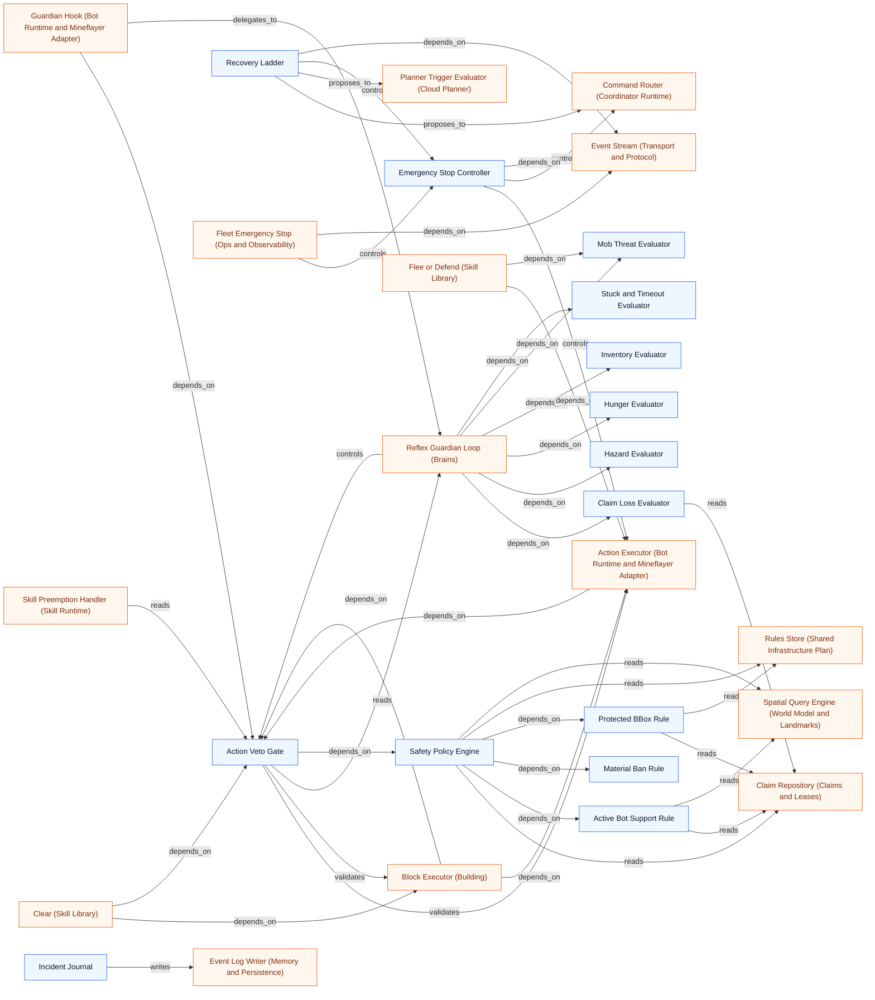
```mermaid
flowchart LR
n111["Hazard Evaluator"]
n112["Mob Threat Evaluator"]
n113["Hunger Evaluator"]
n114["Stuck and Timeout Evaluator"]
n115["Inventory Evaluator"]
n116["Claim Loss Evaluator"]
n117["Protected BBox Rule"]
n118["Active Bot Support Rule"]
n119["Material Ban Rule"]
n120["Safety Policy Engine"]
n60["Action Veto Gate"]
n61["Recovery Ladder"]
n62["Emergency Stop Controller"]
n121["Incident Journal"]
n56["Action Executor (Bot Runtime and Mineflayer Adapter)"]
n57["Guardian Hook (Bot Runtime and Mineflayer Adapter)"]
n52["Block Executor (Building)"]
n65["Fleet Emergency Stop (Ops and Observability)"]
n66["Reflex Guardian Loop (Brains)"]
n193["Claim Repository (Claims and Leases)"]
n176["Spatial Query Engine (World Model and Landmarks)"]
n28["Command Router (Coordinator Runtime)"]
n151["Event Stream (Transport and Protocol)"]
n192["Event Log Writer (Memory and Persistence)"]
n165["Rules Store (Shared Infrastructure Plan)"]
n42["Planner Trigger Evaluator (Cloud Planner)"]
n86["Skill Preemption Handler (Skill Runtime)"]
n239["Clear (Skill Library)"]
n237["Flee or Defend (Skill Library)"]
n56 -->|depends_on| n60
n57 -->|depends_on| n60
n57 -->|delegates_to| n66
n52 -->|depends_on| n56
n52 -->|depends_on| n60
n65 -->|controls| n62
n65 -->|depends_on| n151
n60 -->|validates| n56
n60 -->|validates| n52
n60 -->|reads| n66
n60 -->|depends_on| n120
n118 -->|reads| n193
n118 -->|reads| n176
n116 -->|reads| n193
n62 -->|controls| n56
n62 -->|controls| n28
n62 -->|depends_on| n151
n66 -->|controls| n60
n66 -->|depends_on| n116
n66 -->|depends_on| n111
n66 -->|depends_on| n113
n66 -->|depends_on| n115
n66 -->|depends_on| n112
n66 -->|depends_on| n114
n121 -->|writes| n192
n117 -->|reads| n193
n117 -->|reads| n165
n61 -->|proposes_to| n28
n61 -->|proposes_to| n42
n61 -->|controls| n62
n61 -->|depends_on| n151
n120 -->|reads| n193
n120 -->|depends_on| n118
n120 -->|depends_on| n119
n120 -->|depends_on| n117
n120 -->|reads| n165
n120 -->|reads| n176
n86 -->|reads| n60
n239 -->|depends_on| n52
n239 -->|depends_on| n60
n237 -->|depends_on| n56
n237 -->|depends_on| n112
classDef internal fill:#eef6ff,stroke:#2563eb,color:#0f172a;
classDef external fill:#fff7ed,stroke:#ea580c,color:#7c2d12;
class n111,n112,n113,n114,n115,n116,n117,n118,n119,n120,n60,n61,n62,n121 internal;
class n56,n57,n52,n65,n66,n193,n176,n28,n151,n192,n165,n42,n86,n239,n237 external;
```

### Memory and Persistence

Source: `docs/architecture/graphs/system-memory.mmd`

```mermaid
flowchart LR
n243["SQLite Runtime"]
n143["Migration Runner"]
n137["Transaction Manager"]
n192["Event Log Writer"]
n242["Block Changelog Writer"]
n139["Retention Pruner"]
n244["Snapshot Export"]
n245["Schema Version Registry"]
n246["Episode Store"]
n191["Bot Profile Store (Bot Registry and Profiles)"]
n106["Rollback Journal (Building)"]
n132["Atomic Claim Acquirer (Claims and Leases)"]
n193["Claim Repository (Claims and Leases)"]
n130["Fencing Token Authority (Claims and Leases)"]
n29["Coordinator Epoch Authority (Coordinator Runtime)"]
n30["Global Scheduler (Coordinator Runtime)"]
n68["Process Bootstrap (Coordinator Runtime)"]
n31["Restart Recovery Orchestrator (Coordinator Runtime)"]
n247["Replay Engine (Testing and Evaluation)"]
n197["Grant Repository (Edit Grants and Collaboration)"]
n127["Audit Viewer (Ops and Observability)"]
n126["Health and Readiness (Ops and Observability)"]
n77["Plan Cache (Cloud Planner)"]
n121["Incident Journal (Autonomy and Safety)"]
n163["Container Registry (Shared Infrastructure Plan)"]
n162["Farm Store (Shared Infrastructure Plan)"]
n164["Path Graph Store (Shared Infrastructure Plan)"]
n166["SIP Revision Manager (Shared Infrastructure Plan)"]
n161["Road Store (Shared Infrastructure Plan)"]
n165["Rules Store (Shared Infrastructure Plan)"]
n160["Structure Store (Shared Infrastructure Plan)"]
n134["SIP Transactional Committer (Shared Infrastructure Plan)"]
n159["Zone Store (Shared Infrastructure Plan)"]
n83["Skill Checkpoint Manager (Skill Runtime)"]
n135["Atomic Task Claimer (Task Board)"]
n182["Task Repository (Task Board)"]
n188["Task State Machine (Task Board)"]
n248["Trace Exporter (Laya Training)"]
n204["Chunk Version Store (World Model and Landmarks)"]
n208["Landmark Registry (World Model and Landmarks)"]
n191 -->|depends_on| n137
n106 -->|writes| n242
n106 -->|reads| n160
n132 -->|writes| n193
n132 -->|depends_on| n137
n193 -->|depends_on| n137
n130 -->|depends_on| n29
n130 -->|depends_on| n137
n29 -->|controls| n130
n29 -->|depends_on| n137
n30 -->|depends_on| n29
n30 -->|delegates_to| n139
n68 -->|depends_on| n31
n68 -->|depends_on| n143
n31 -->|depends_on| n137
n247 -->|depends_on| n192
n197 -->|depends_on| n137
n242 -->|depends_on| n137
n192 -->|depends_on| n137
n143 -->|depends_on| n243
n139 -->|depends_on| n242
n139 -->|depends_on| n192
n139 -->|depends_on| n137
n245 -->|depends_on| n143
n244 -->|depends_on| n137
n137 -->|depends_on| n243
n127 -->|reads| n242
n127 -->|reads| n192
n126 -->|depends_on| n243
n77 -->|depends_on| n137
n121 -->|writes| n192
n163 -->|depends_on| n137
n162 -->|depends_on| n137
n164 -->|depends_on| n137
n166 -->|depends_on| n137
n166 -->|depends_on| n165
n161 -->|depends_on| n137
n165 -->|depends_on| n137
n160 -->|depends_on| n137
n134 -->|depends_on| n137
n134 -->|writes| n163
n134 -->|writes| n162
n134 -->|writes| n164
n134 -->|depends_on| n166
n134 -->|writes| n161
n134 -->|writes| n165
n134 -->|writes| n160
n134 -->|writes| n159
n159 -->|depends_on| n137
n83 -->|depends_on| n137
n135 -->|depends_on| n137
n135 -->|writes| n182
n182 -->|depends_on| n137
n188 -->|depends_on| n192
n188 -->|writes| n182
n248 -->|reads| n192
n204 -->|depends_on| n137
n208 -->|depends_on| n137
n247 -->|reads| n246
n248 -->|reads| n246
n127 -->|reads| n246
n139 -->|depends_on| n246
classDef internal fill:#eef6ff,stroke:#2563eb,color:#0f172a;
classDef external fill:#fff7ed,stroke:#ea580c,color:#7c2d12;
class n243,n143,n137,n192,n242,n139,n244,n245,n246 internal;
class n191,n106,n132,n193,n130,n29,n30,n68,n31,n247,n197,n127,n126,n77,n121,n163,n162,n164,n166,n161,n165,n160,n134,n159,n83,n135,n182,n188,n248,n204,n208 external;
```

### Ops and Observability

Source: `docs/architecture/graphs/system-ops.mmd`

```mermaid
flowchart LR
n63["Ops API"]
n122["Status Aggregator"]
n64["Pause and Resume Controller"]
n65["Fleet Emergency Stop"]
n123["SIP Dump"]
n124["Metrics Registry"]
n125["Structured Logger"]
n126["Health and Readiness"]
n127["Audit Viewer"]
n195["Contention Metrics (Claims and Leases)"]
n34["Execution Provider Selector (Laya Decision Service)"]
n76["Latency Metrics (Laya Decision Service)"]
n249["Metrics Reporter (Testing and Evaluation)"]
n27(["Fleet Operator"])
n242["Block Changelog Writer (Memory and Persistence)"]
n192["Event Log Writer (Memory and Persistence)"]
n62["Emergency Stop Controller (Autonomy and Safety)"]
n151["Event Stream (Transport and Protocol)"]
n33["Model Loader (Laya Decision Service)"]
n243["SQLite Runtime (Memory and Persistence)"]
n136["Message Schema Registry (Transport and Protocol)"]
n58["Skill Host (Bot Runtime and Mineflayer Adapter)"]
n149["Presence Tracker (Bot Registry and Profiles)"]
n166["SIP Revision Manager (Shared Infrastructure Plan)"]
n193["Claim Repository (Claims and Leases)"]
n182["Task Repository (Task Board)"]
n48["Planner Budget Limiter (Cloud Planner)"]
n42["Planner Trigger Evaluator (Cloud Planner)"]
n82["Skill Progress Reporter (Skill Runtime)"]
n246["Episode Store (Memory and Persistence)"]
n195 -->|depends_on| n193
n195 -->|observes| n124
n34 -->|controls| n33
n34 -->|observes| n125
n76 -->|observes| n124
n76 -->|writes| n124
n249 -->|observes| n124
n27 -->|controls| n63
n127 -->|reads| n242
n127 -->|reads| n192
n65 -->|controls| n62
n65 -->|depends_on| n151
n126 -->|depends_on| n33
n126 -->|depends_on| n243
n126 -->|depends_on| n122
n63 -->|depends_on| n65
n63 -->|depends_on| n64
n63 -->|depends_on| n122
n63 -->|depends_on| n136
n64 -->|controls| n58
n64 -->|depends_on| n149
n64 -->|depends_on| n151
n123 -->|depends_on| n166
n122 -->|depends_on| n149
n122 -->|reads| n193
n122 -->|observes| n124
n122 -->|reads| n166
n122 -->|reads| n182
n48 -->|observes| n124
n42 -->|observes| n124
n42 -->|reads| n166
n62 -->|depends_on| n151
n82 -->|observes| n124
n82 -->|publishes| n151
n127 -->|reads| n246
classDef internal fill:#eef6ff,stroke:#2563eb,color:#0f172a;
classDef external fill:#fff7ed,stroke:#ea580c,color:#7c2d12;
class n63,n122,n64,n65,n123,n124,n125,n126,n127 internal;
class n195,n34,n76,n249,n242,n192,n62,n151,n33,n243,n136,n58,n149,n166,n193,n182,n48,n42,n82,n246,n27 external;
```

### Config and Profiles

Source: `docs/architecture/graphs/system-config.mmd`

```mermaid
flowchart LR
n142["Environment Parser"]
n141["Config Schema Validator"]
n147["Profile Resolver"]
n225["Hardware Probe"]
n157["Secrets Loader"]
n203["Name Pool Validator"]
n226["Laya Runtime Resolver"]
n250["Fail Fast Handler"]
n53["Connection Lifecycle (Bot Runtime and Mineflayer Adapter)"]
n107["Join and Auth (Bot Runtime and Mineflayer Adapter)"]
n108["Reach and Rate Guard (Bot Runtime and Mineflayer Adapter)"]
n148["Bot Identity Authenticator (Bot Registry and Profiles)"]
n202["Name Pool Allocator (Bot Registry and Profiles)"]
n26(["Host Hardware"])
n68["Process Bootstrap (Coordinator Runtime)"]
n69["Service Composition (Coordinator Runtime)"]
n38["Confidence Calibrator (Laya Decision Service)"]
n34["Execution Provider Selector (Laya Decision Service)"]
n33["Model Loader (Laya Decision Service)"]
n73["Decision Rate Limiter (Laya Decision Service)"]
n223["Perception Rate Limiter (Perception)"]
n40["OpenAI-Compatible Client (Cloud Planner)"]
n154["Transport Authentication (Transport and Protocol)"]
n53 -->|depends_on| n141
n107 -->|depends_on| n53
n107 -->|depends_on| n147
n108 -->|depends_on| n141
n148 -->|depends_on| n157
n202 -->|depends_on| n203
n141 -->|depends_on| n142
n250 -->|depends_on| n141
n225 -->|depends_on| n147
n225 -->|depends_on| n26
n226 -->|depends_on| n225
n226 -->|depends_on| n147
n203 -->|depends_on| n141
n147 -->|depends_on| n141
n157 -->|depends_on| n142
n68 -->|depends_on| n141
n68 -->|depends_on| n142
n68 -->|depends_on| n69
n69 -->|depends_on| n147
n38 -->|depends_on| n141
n34 -->|depends_on| n225
n34 -->|controls| n33
n33 -->|depends_on| n226
n73 -->|depends_on| n147
n223 -->|depends_on| n147
n40 -->|depends_on| n141
n40 -->|depends_on| n157
n154 -->|depends_on| n148
n154 -->|depends_on| n157
classDef internal fill:#eef6ff,stroke:#2563eb,color:#0f172a;
classDef external fill:#fff7ed,stroke:#ea580c,color:#7c2d12;
class n142,n141,n147,n225,n157,n203,n226,n250 internal;
class n53,n107,n108,n148,n202,n68,n69,n38,n34,n33,n73,n223,n40,n154,n26 external;
```

### Testing and Evaluation

Source: `docs/architecture/graphs/system-eval.mmd`

```mermaid
flowchart LR
n251["Unit Fixtures"]
n224["Detector Fixtures"]
n252["Docker Server Harness"]
n253["Scenario Runner"]
n247["Replay Engine"]
n190["Contention Harness"]
n249["Metrics Reporter"]
n254["Soak Runner"]
n255["Architecture Guard Tests"]
n227["Laya Benchmark Harness"]
n193["Claim Repository (Claims and Leases)"]
n182["Task Repository (Task Board)"]
n222["Detector Pipeline (Perception)"]
n23(["Minecraft 1.20.1 LAN Server"])
n76["Latency Metrics (Laya Decision Service)"]
n33["Model Loader (Laya Decision Service)"]
n124["Metrics Registry (Ops and Observability)"]
n192["Event Log Writer (Memory and Persistence)"]
n256["Promotion Gate (Laya Training)"]
n246["Episode Store (Memory and Persistence)"]
n76 -->|observes| n124
n76 -->|writes| n124
n255 -->|depends_on| n251
n190 -->|depends_on| n193
n190 -->|delegates_to| n253
n190 -->|depends_on| n182
n224 -->|depends_on| n251
n224 -->|depends_on| n222
n252 -->|depends_on| n251
n252 -->|depends_on| n23
n227 -->|depends_on| n76
n227 -->|depends_on| n33
n227 -->|delegates_to| n253
n249 -->|observes| n124
n247 -->|depends_on| n253
n247 -->|depends_on| n192
n253 -->|controls| n252
n253 -->|publishes| n249
n254 -->|depends_on| n249
n254 -->|delegates_to| n253
n256 -->|depends_on| n227
n247 -->|reads| n246
classDef internal fill:#eef6ff,stroke:#2563eb,color:#0f172a;
classDef external fill:#fff7ed,stroke:#ea580c,color:#7c2d12;
class n251,n224,n252,n253,n247,n190,n249,n254,n255,n227 internal;
class n193,n182,n222,n76,n33,n124,n192,n256,n246,n23 external;
```

### Laya Training

Source: `docs/architecture/graphs/system-training.mmd`

```mermaid
flowchart LR
n248["Trace Exporter"]
n257["Labeling Pipeline"]
n258["Reward Computer"]
n259["Fine-tune Runner"]
n260["ONNX Exporter"]
n228["Calibration Fitter"]
n256["Promotion Gate"]
n38["Confidence Calibrator (Laya Decision Service)"]
n227["Laya Benchmark Harness (Testing and Evaluation)"]
n192["Event Log Writer (Memory and Persistence)"]
n246["Episode Store (Memory and Persistence)"]
n228 -->|reads| n38
n228 -->|depends_on| n248
n259 -->|depends_on| n257
n259 -->|depends_on| n258
n257 -->|depends_on| n248
n260 -->|depends_on| n259
n256 -->|depends_on| n227
n256 -->|depends_on| n228
n256 -->|depends_on| n260
n258 -->|depends_on| n248
n248 -->|reads| n192
n248 -->|reads| n246
classDef internal fill:#eef6ff,stroke:#2563eb,color:#0f172a;
classDef external fill:#fff7ed,stroke:#ea580c,color:#7c2d12;
class n248,n257,n258,n259,n260,n228,n256 internal;
class n38,n227,n192,n246 external;
```

### Brains

Source: `docs/architecture/graphs/system-brains.mmd`

```mermaid
flowchart LR
n66["Reflex Guardian Loop"]
n128["Affordance Enumerator"]
n67["Deterministic Policy"]
n129["Laya Client"]
n55["World Cache Adapter (Bot Runtime and Mineflayer Adapter)"]
n79["Skill Registry (Skill Runtime)"]
n109["State Digest Collector (Bot Runtime and Mineflayer Adapter)"]
n200["Behavior Profile Manager (Bot Registry and Profiles)"]
n151["Event Stream (Transport and Protocol)"]
n57["Guardian Hook (Bot Runtime and Mineflayer Adapter)"]
n38["Confidence Calibrator (Laya Decision Service)"]
n60["Action Veto Gate (Autonomy and Safety)"]
n116["Claim Loss Evaluator (Autonomy and Safety)"]
n111["Hazard Evaluator (Autonomy and Safety)"]
n113["Hunger Evaluator (Autonomy and Safety)"]
n115["Inventory Evaluator (Autonomy and Safety)"]
n112["Mob Threat Evaluator (Autonomy and Safety)"]
n114["Stuck and Timeout Evaluator (Autonomy and Safety)"]
n81["Skill Tick Scheduler (Skill Runtime)"]
n144["WebSocket Codec (Transport and Protocol)"]
n128 -->|depends_on| n55
n128 -->|depends_on| n66
n128 -->|depends_on| n79
n67 -->|depends_on| n128
n67 -->|depends_on| n109
n67 -->|reads| n200
n67 -->|subscribes| n151
n57 -->|depends_on| n60
n57 -->|delegates_to| n66
n109 -->|depends_on| n55
n109 -->|publishes| n151
n38 -->|proposes_to| n67
n60 -->|reads| n66
n66 -->|controls| n60
n66 -->|depends_on| n116
n66 -->|depends_on| n111
n66 -->|depends_on| n113
n66 -->|depends_on| n115
n66 -->|depends_on| n112
n66 -->|depends_on| n114
n81 -->|reads| n66
n151 -->|depends_on| n144
n129 -->|depends_on| n128
n129 -->|depends_on| n144
n129 -->|depends_on| n67
classDef internal fill:#eef6ff,stroke:#2563eb,color:#0f172a;
classDef external fill:#fff7ed,stroke:#ea580c,color:#7c2d12;
class n66,n128,n67,n129 internal;
class n55,n79,n109,n200,n151,n57,n38,n60,n116,n111,n113,n115,n112,n114,n81,n144 external;
```

### Bootstrap and Toolchain

Source: `docs/architecture/graphs/system-toolchain.mmd`

```mermaid
flowchart LR
n261["Bootstrap Orchestrator"]
n262["Capability Check"]
n263["Python Environment"]
n264["Minecraft Server Controller"]
n265["Firefox SVG Renderer"]
n261 -->|depends_on| n262
n261 -->|depends_on| n263
n261 -->|depends_on| n264
n261 -->|depends_on| n265
classDef internal fill:#eef6ff,stroke:#2563eb,color:#0f172a;
classDef external fill:#fff7ed,stroke:#ea580c,color:#7c2d12;
class n261,n262,n263,n264,n265 internal;
```
