# TiCrafter Architecture Graphs

> Generated from `docs/architecture/graph.json`. Edit the graph, then run `bun tools/architecture/render-graphs.mjs`.

Mermaid source lives in `docs/architecture/graphs/`. GitHub renders these fenced blocks directly. For local SVG rendering, run `bun run render:svg -- <input.mmd> <output.svg>`; it uses the installed Firefox browser and never downloads Chromium.

## Fleet overview

Systems and externals with aggregated relation counts.

```mermaid
flowchart LR
n0["Coordinator Runtime"]
n1["Transport and Protocol"]
n2["Shared Infrastructure Plan"]
n3["Task Board"]
n4["Claims and Leases"]
n5["Edit Grants and Collaboration"]
n6["Bot Registry and Profiles"]
n7["World Model and Landmarks"]
n8["Perception"]
n9["Laya Decision Service"]
n10["Cloud Planner Advisor"]
n11["Skill Runtime"]
n12["Skill Library"]
n13["Building"]
n14["Bot Runtime and Mineflayer Adapter"]
n15["Autonomy and Safety"]
n16["Memory and Persistence"]
n17["Ops and Observability"]
n18["Config and Profiles"]
n19["Testing and Evaluation"]
n20["Laya Training"]
n21["Brains"]
n22["Agency"]
n23["Bootstrap and Toolchain"]
n24(["Minecraft 1.20.1 LAN Server"])
n25(["Muse Spark Planner Endpoint"])
n26(["ONNX Runtime / WebGPU Driver"])
n27(["Host Hardware"])
n28(["Fleet Operator"])
n14 -->|depends_on×2| n15
n21 -->|depends_on×2| n14
n21 -->|depends_on×1| n11
n14 -->|depends_on×3| n18
n14 -->|depends_on×1| n24
n21 -->|reads×1| n6
n21 -->|subscribes×1, depends_on×1| n1
n14 -->|delegates_to×2, depends_on×2| n8
n14 -->|delegates_to×3| n21
n14 -->|delegates_to×1, persists_to×1| n6
n14 -->|depends_on×1, publishes×2| n1
n14 -->|depends_on×2, delegates_to×1| n11
n6 -->|reads×1| n5
n6 -->|reads×1, delegates_to×1| n2
n6 -->|reads×1| n3
n6 -->|depends_on×2| n18
n6 -->|depends_on×2| n16
n6 -->|delegates_to×1| n4
n6 -->|reads×1| n11
n13 -->|depends_on×2, reads×1| n14
n13 -->|depends_on×1| n15
n13 -->|reads×4, writes×1| n7
n13 -->|depends_on×1, reads×2| n2
n13 -->|reads×1| n11
n13 -->|writes×1| n16
n13 -->|subscribes×1| n1
n4 -->|depends_on×3| n16
n4 -->|depends_on×2| n3
n4 -->|observes×1| n17
n4 -->|depends_on×1| n0
n4 -->|depends_on×1| n2
n18 -->|depends_on×1| n27
n0 -->|depends_on×4| n1
n0 -->|controls×2, delegates_to×2| n4
n0 -->|controls×1, delegates_to×1| n5
n0 -->|controls×1, delegates_to×1, depends_on×1| n2
n0 -->|controls×1| n3
n0 -->|depends_on×3, delegates_to×1| n16
n0 -->|delegates_to×1| n10
n0 -->|depends_on×3| n18
n0 -->|depends_on×2, publishes×1| n6
n9 -->|proposes_to×1| n21
n9 -->|depends_on×4| n18
n9 -->|depends_on×1, publishes×1, subscribes×1| n1
n9 -->|observes×2, writes×1| n17
n9 -->|depends_on×1| n26
n19 -->|depends_on×1| n4
n19 -->|depends_on×1| n3
n19 -->|depends_on×1| n8
n19 -->|depends_on×1| n24
n19 -->|depends_on×2| n9
n19 -->|observes×1| n17
n19 -->|depends_on×1, reads×1| n16
n28 -->|controls×1| n17
n5 -->|publishes×1| n1
n5 -->|reads×1, depends_on×1| n4
n5 -->|depends_on×3, reads×1| n2
n5 -->|depends_on×1| n16
n5 -->|reads×2| n6
n17 -->|reads×4, depends_on×1, writes×2| n16
n17 -->|controls×1| n15
n17 -->|depends_on×3| n1
n17 -->|depends_on×1| n9
n17 -->|controls×1| n14
n17 -->|depends_on×2, reads×1| n6
n17 -->|depends_on×1, reads×1| n2
n17 -->|reads×1| n4
n17 -->|reads×1| n3
n8 -->|publishes×2| n1
n8 -->|depends_on×1| n18
n10 -->|reads×1, proposes_to×1| n5
n10 -->|subscribes×1| n1
n10 -->|observes×2| n17
n10 -->|reads×1| n6
n10 -->|reads×4, depends_on×1, proposes_to×1| n2
n10 -->|reads×2, proposes_to×1| n3
n10 -->|reads×2| n7
n10 -->|depends_on×2| n18
n10 -->|depends_on×1| n25
n10 -->|depends_on×1| n16
n10 -->|reads×1| n11
n15 -->|validates×1, controls×1| n14
n15 -->|validates×1| n13
n15 -->|reads×1| n21
n15 -->|reads×4| n4
n15 -->|reads×2| n7
n15 -->|controls×1, proposes_to×1| n0
n15 -->|depends_on×2| n1
n21 -->|controls×1, depends_on×6| n15
n15 -->|writes×1| n16
n15 -->|reads×2| n2
n15 -->|proposes_to×1| n10
n2 -->|depends_on×9| n16
n2 -->|depends_on×2, reads×1, publishes×1| n7
n2 -->|publishes×1| n5
n11 -->|depends_on×1| n16
n11 -->|reads×1| n14
n11 -->|reads×1| n2
n11 -->|reads×1, depends_on×1| n7
n11 -->|publishes×2| n1
n11 -->|reads×1| n15
n11 -->|observes×1| n17
n11 -->|reads×1| n21
n12 -->|depends_on×8| n13
n12 -->|depends_on×2| n15
n12 -->|depends_on×12| n14
n12 -->|depends_on×4| n11
n12 -->|depends_on×4| n7
n12 -->|depends_on×3| n2
n3 -->|depends_on×3| n16
n3 -->|reads×1| n7
n3 -->|reads×1| n6
n20 -->|reads×1| n9
n20 -->|depends_on×1| n19
n20 -->|reads×2| n16
n1 -->|depends_on×1| n6
n1 -->|depends_on×1| n18
n1 -->|publishes×1| n7
n7 -->|depends_on×2| n16
n7 -->|reads×2| n2
n7 -->|subscribes×1, reads×1| n1
n0 -->|controls×1| n14
n14 -->|depends_on×4| n22
n14 -->|persists_to×1| n16
n4 -->|depends_on×1| n1
n22 -->|proposes_to×1| n14
n6 -->|depends_on×1| n22
classDef system fill:#eef6ff,stroke:#2563eb,color:#0f172a;
classDef external fill:#fff7ed,stroke:#ea580c,color:#7c2d12;
class n0,n1,n2,n3,n4,n5,n6,n7,n8,n9,n10,n11,n12,n13,n14,n15,n16,n17,n18,n19,n20,n21,n22,n23 system;
class n24,n25,n26,n27,n28 external;
```

## Cross-system dependencies

System-to-system view with relation types.

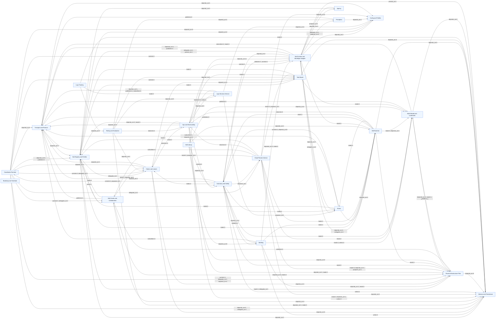
```mermaid
flowchart LR
n0["Coordinator Runtime"]
n1["Transport and Protocol"]
n2["Shared Infrastructure Plan"]
n3["Task Board"]
n4["Claims and Leases"]
n5["Edit Grants and Collaboration"]
n6["Bot Registry and Profiles"]
n7["World Model and Landmarks"]
n8["Perception"]
n9["Laya Decision Service"]
n10["Cloud Planner Advisor"]
n11["Skill Runtime"]
n12["Skill Library"]
n13["Building"]
n14["Bot Runtime and Mineflayer Adapter"]
n15["Autonomy and Safety"]
n16["Memory and Persistence"]
n17["Ops and Observability"]
n18["Config and Profiles"]
n19["Testing and Evaluation"]
n20["Laya Training"]
n21["Brains"]
n22["Agency"]
n23["Bootstrap and Toolchain"]
n14 -->|depends_on×2| n15
n21 -->|depends_on×2| n14
n21 -->|depends_on×1| n11
n14 -->|depends_on×3| n18
n21 -->|reads×1| n6
n21 -->|subscribes×1, depends_on×1| n1
n14 -->|delegates_to×2, depends_on×2| n8
n14 -->|delegates_to×3| n21
n14 -->|delegates_to×1, persists_to×1| n6
n14 -->|depends_on×1, publishes×2| n1
n14 -->|depends_on×2, delegates_to×1| n11
n6 -->|reads×1| n5
n6 -->|reads×1, delegates_to×1| n2
n6 -->|reads×1| n3
n6 -->|depends_on×2| n18
n6 -->|depends_on×2| n16
n6 -->|delegates_to×1| n4
n6 -->|reads×1| n11
n13 -->|depends_on×2, reads×1| n14
n13 -->|depends_on×1| n15
n13 -->|reads×4, writes×1| n7
n13 -->|depends_on×1, reads×2| n2
n13 -->|reads×1| n11
n13 -->|writes×1| n16
n13 -->|subscribes×1| n1
n4 -->|depends_on×3| n16
n4 -->|depends_on×2| n3
n4 -->|observes×1| n17
n4 -->|depends_on×1| n0
n4 -->|depends_on×1| n2
n0 -->|depends_on×4| n1
n0 -->|controls×2, delegates_to×2| n4
n0 -->|controls×1, delegates_to×1| n5
n0 -->|controls×1, delegates_to×1, depends_on×1| n2
n0 -->|controls×1| n3
n0 -->|depends_on×3, delegates_to×1| n16
n0 -->|delegates_to×1| n10
n0 -->|depends_on×3| n18
n0 -->|depends_on×2, publishes×1| n6
n9 -->|proposes_to×1| n21
n9 -->|depends_on×4| n18
n9 -->|depends_on×1, publishes×1, subscribes×1| n1
n9 -->|observes×2, writes×1| n17
n19 -->|depends_on×1| n4
n19 -->|depends_on×1| n3
n19 -->|depends_on×1| n8
n19 -->|depends_on×2| n9
n19 -->|observes×1| n17
n19 -->|depends_on×1, reads×1| n16
n5 -->|publishes×1| n1
n5 -->|reads×1, depends_on×1| n4
n5 -->|depends_on×3, reads×1| n2
n5 -->|depends_on×1| n16
n5 -->|reads×2| n6
n17 -->|reads×4, depends_on×1, writes×2| n16
n17 -->|controls×1| n15
n17 -->|depends_on×3| n1
n17 -->|depends_on×1| n9
n17 -->|controls×1| n14
n17 -->|depends_on×2, reads×1| n6
n17 -->|depends_on×1, reads×1| n2
n17 -->|reads×1| n4
n17 -->|reads×1| n3
n8 -->|publishes×2| n1
n8 -->|depends_on×1| n18
n10 -->|reads×1, proposes_to×1| n5
n10 -->|subscribes×1| n1
n10 -->|observes×2| n17
n10 -->|reads×1| n6
n10 -->|reads×4, depends_on×1, proposes_to×1| n2
n10 -->|reads×2, proposes_to×1| n3
n10 -->|reads×2| n7
n10 -->|depends_on×2| n18
n10 -->|depends_on×1| n16
n10 -->|reads×1| n11
n15 -->|validates×1, controls×1| n14
n15 -->|validates×1| n13
n15 -->|reads×1| n21
n15 -->|reads×4| n4
n15 -->|reads×2| n7
n15 -->|controls×1, proposes_to×1| n0
n15 -->|depends_on×2| n1
n21 -->|controls×1, depends_on×6| n15
n15 -->|writes×1| n16
n15 -->|reads×2| n2
n15 -->|proposes_to×1| n10
n2 -->|depends_on×9| n16
n2 -->|depends_on×2, reads×1, publishes×1| n7
n2 -->|publishes×1| n5
n11 -->|depends_on×1| n16
n11 -->|reads×1| n14
n11 -->|reads×1| n2
n11 -->|reads×1, depends_on×1| n7
n11 -->|publishes×2| n1
n11 -->|reads×1| n15
n11 -->|observes×1| n17
n11 -->|reads×1| n21
n12 -->|depends_on×8| n13
n12 -->|depends_on×2| n15
n12 -->|depends_on×12| n14
n12 -->|depends_on×4| n11
n12 -->|depends_on×4| n7
n12 -->|depends_on×3| n2
n3 -->|depends_on×3| n16
n3 -->|reads×1| n7
n3 -->|reads×1| n6
n20 -->|reads×1| n9
n20 -->|depends_on×1| n19
n20 -->|reads×2| n16
n1 -->|depends_on×1| n6
n1 -->|depends_on×1| n18
n1 -->|publishes×1| n7
n7 -->|depends_on×2| n16
n7 -->|reads×2| n2
n7 -->|subscribes×1, reads×1| n1
n0 -->|controls×1| n14
n14 -->|depends_on×4| n22
n14 -->|persists_to×1| n16
n4 -->|depends_on×1| n1
n22 -->|proposes_to×1| n14
n6 -->|depends_on×1| n22
classDef system fill:#eef6ff,stroke:#2563eb,color:#0f172a;
class n0,n1,n2,n3,n4,n5,n6,n7,n8,n9,n10,n11,n12,n13,n14,n15,n16,n17,n18,n19,n20,n21,n22,n23 system;
```

## Safety and control authority

Guardian veto, grant/claim control, ops stop path, and planner proposal path.

```mermaid
flowchart TD
n0["Coordinator Runtime"]
n9["Laya Decision Service"]
n10["Cloud Planner Advisor"]
n11["Skill Runtime"]
n13["Building"]
n14["Bot Runtime and Mineflayer Adapter"]
n15["Autonomy and Safety"]
n17["Ops and Observability"]
n21["Brains"]
n28(["Fleet Operator"])
n14 -->|delegates_to| n21
n14 -->|delegates_to| n11
n0 -->|delegates_to| n10
n9 -->|proposes_to| n21
n17 -->|controls| n15
n17 -->|controls| n14
n15 -->|validates| n14
n15 -->|validates| n13
n15 -->|controls| n14
n15 -->|controls| n0
n21 -->|controls| n15
n15 -->|proposes_to| n0
n15 -->|proposes_to| n10
n0 -->|controls| n14
n29["Command Router"]
n30["Coordinator Epoch Authority"]
n31["Global Scheduler"]
n32["Restart Recovery Orchestrator"]
n33["Bot Process Supervisor"]
n34["Model Loader"]
n35["Execution Provider Selector"]
n36["Batch Runner"]
n37["Single In-flight Guard"]
n38["Output Parser"]
n39["Confidence Calibrator"]
n40["Timeout and Fallback Handler"]
n41["OpenAI-Compatible Client"]
n42["Planner Context Builder"]
n43["Planner Trigger Evaluator"]
n44["Planner Schema Validator"]
n45["Planner Semantic Validator"]
n46["Planner Repair Loop"]
n47["SIP Mutation Translator"]
n48["Task DAG Translator"]
n49["Planner Budget Limiter"]
n50["Planner Arbitration Handler"]
n51["Keep Last Good Fallback"]
n52["Skill Context Builder"]
n53["Block Executor"]
n54["Connection Lifecycle"]
n55["Mineflayer Event Bridge"]
n56["World Cache Adapter"]
n57["Action Executor"]
n58["Guardian Hook"]
n59["Skill Host"]
n60["Agent Loop"]
n61["Chat Adapter"]
n62["Reconnect Supervisor"]
n63["Action Veto Gate"]
n64["Recovery Ladder"]
n65["Emergency Stop Controller"]
n66["Ops API"]
n67["Pause and Resume Controller"]
n68["Fleet Emergency Stop"]
n69["Reflex Guardian Loop"]
n70["Deterministic Policy"]
n71["Laya Client"]
n58 -->|delegates_to| n69
n56 -->|delegates_to| n52
n31 -->|delegates_to| n43
n39 -->|proposes_to| n70
n35 -->|controls| n34
n37 -->|controls| n36
n40 -->|controls| n38
n68 -->|controls| n65
n67 -->|controls| n59
n49 -->|controls| n41
n41 -->|delegates_to| n50
n46 -->|controls| n51
n44 -->|controls| n46
n45 -->|controls| n46
n43 -->|delegates_to| n42
n63 -->|validates| n57
n63 -->|validates| n53
n65 -->|controls| n57
n65 -->|controls| n29
n69 -->|controls| n63
n64 -->|proposes_to| n29
n64 -->|proposes_to| n43
n64 -->|controls| n65
n33 -->|controls| n54
n60 -->|delegates_to| n71
n60 -->|delegates_to| n70
n60 -->|delegates_to| n59
classDef system fill:#eef6ff,stroke:#2563eb,color:#0f172a;
classDef component fill:#f8fafc,stroke:#64748b,color:#0f172a;
classDef external fill:#fff7ed,stroke:#ea580c,color:#7c2d12;
class n0,n9,n10,n11,n13,n14,n15,n17,n21 system;
class n29,n30,n31,n32,n33,n34,n35,n36,n37,n38,n39,n40,n41,n42,n43,n44,n45,n46,n47,n48,n49,n50,n51,n52,n53,n54,n55,n56,n57,n58,n59,n60,n61,n62,n63,n64,n65,n66,n67,n68,n69,n70,n71 component;
class n28 external;
```

## Data flow

Perception, world model, SIP, decisions, skills, building, and persistence.

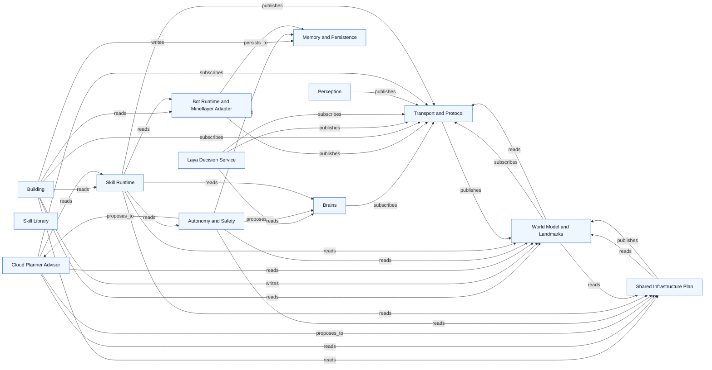
```mermaid
flowchart LR
n1["Transport and Protocol"]
n2["Shared Infrastructure Plan"]
n7["World Model and Landmarks"]
n8["Perception"]
n9["Laya Decision Service"]
n10["Cloud Planner Advisor"]
n11["Skill Runtime"]
n12["Skill Library"]
n13["Building"]
n14["Bot Runtime and Mineflayer Adapter"]
n15["Autonomy and Safety"]
n16["Memory and Persistence"]
n21["Brains"]
n21 -->|subscribes| n1
n14 -->|publishes| n1
n13 -->|reads| n7
n13 -->|writes| n7
n13 -->|reads| n11
n13 -->|reads| n14
n13 -->|writes| n16
n13 -->|reads| n2
n13 -->|subscribes| n1
n9 -->|proposes_to| n21
n9 -->|publishes| n1
n9 -->|subscribes| n1
n8 -->|publishes| n1
n10 -->|subscribes| n1
n10 -->|reads| n2
n10 -->|reads| n7
n10 -->|reads| n11
n10 -->|proposes_to| n2
n15 -->|reads| n21
n15 -->|reads| n7
n15 -->|writes| n16
n15 -->|reads| n2
n15 -->|proposes_to| n10
n2 -->|reads| n7
n2 -->|publishes| n7
n11 -->|reads| n14
n11 -->|reads| n2
n11 -->|reads| n7
n11 -->|publishes| n1
n11 -->|reads| n15
n11 -->|reads| n21
n1 -->|publishes| n7
n7 -->|reads| n2
n7 -->|subscribes| n1
n7 -->|reads| n1
n14 -->|persists_to| n16
classDef system fill:#eef6ff,stroke:#2563eb,color:#0f172a;
class n1,n2,n7,n8,n9,n10,n11,n12,n13,n14,n15,n16,n21 system;
```

## Per-system graphs

### Coordinator Runtime

Source: `docs/architecture/graphs/system-core.mmd`

```mermaid
flowchart LR
n72["Process Bootstrap"]
n73["Service Composition"]
n74["Bot Session Manager"]
n29["Command Router"]
n30["Coordinator Epoch Authority"]
n31["Global Scheduler"]
n32["Restart Recovery Orchestrator"]
n75["Backpressure Controller"]
n33["Bot Process Supervisor"]
n149["Fencing Token Authority (Claims and Leases)"]
n150["Flow Control (Transport and Protocol)"]
n151["Atomic Claim Acquirer (Claims and Leases)"]
n152["Grant Issuer (Edit Grants and Collaboration)"]
n153["SIP Transactional Committer (Shared Infrastructure Plan)"]
n154["Atomic Task Claimer (Task Board)"]
n155["Message Schema Registry (Transport and Protocol)"]
n156["Transaction Manager (Memory and Persistence)"]
n157["Lease Reaper (Claims and Leases)"]
n158["Retention Pruner (Memory and Persistence)"]
n43["Planner Trigger Evaluator (Cloud Planner Advisor)"]
n159["SIP Reconciliation Engine (Shared Infrastructure Plan)"]
n160["Config Schema Validator (Config and Profiles)"]
n161["Environment Parser (Config and Profiles)"]
n162["Migration Runner (Memory and Persistence)"]
n163["WebSocket Codec (Transport and Protocol)"]
n164["Resume Orchestrator (Bot Registry and Profiles)"]
n165["Grant Expiry (Edit Grants and Collaboration)"]
n166["Profile Resolver (Config and Profiles)"]
n167["Bot Identity Authenticator (Bot Registry and Profiles)"]
n168["Presence Tracker (Bot Registry and Profiles)"]
n65["Emergency Stop Controller (Autonomy and Safety)"]
n64["Recovery Ladder (Autonomy and Safety)"]
n54["Connection Lifecycle (Bot Runtime and Mineflayer Adapter)"]
n54 -->|depends_on| n160
n164 -->|delegates_to| n159
n151 -->|depends_on| n156
n149 -->|depends_on| n30
n149 -->|depends_on| n156
n160 -->|depends_on| n161
n166 -->|depends_on| n160
n75 -->|depends_on| n150
n29 -->|controls| n151
n29 -->|controls| n152
n29 -->|controls| n153
n29 -->|controls| n154
n29 -->|depends_on| n155
n30 -->|controls| n149
n30 -->|depends_on| n156
n31 -->|delegates_to| n157
n31 -->|depends_on| n30
n31 -->|delegates_to| n158
n31 -->|delegates_to| n43
n31 -->|delegates_to| n159
n72 -->|depends_on| n160
n72 -->|depends_on| n161
n72 -->|depends_on| n32
n72 -->|depends_on| n73
n72 -->|depends_on| n162
n72 -->|depends_on| n163
n32 -->|depends_on| n164
n32 -->|delegates_to| n157
n32 -->|delegates_to| n165
n32 -->|depends_on| n156
n32 -->|depends_on| n159
n73 -->|depends_on| n166
n73 -->|depends_on| n31
n74 -->|depends_on| n167
n74 -->|publishes| n168
n74 -->|depends_on| n163
n158 -->|depends_on| n156
n65 -->|controls| n29
n64 -->|proposes_to| n29
n64 -->|proposes_to| n43
n64 -->|controls| n65
n159 -->|depends_on| n153
n153 -->|depends_on| n156
n154 -->|depends_on| n156
n163 -->|depends_on| n155
n33 -->|controls| n54
n33 -->|depends_on| n30
n32 -->|depends_on| n33
classDef internal fill:#eef6ff,stroke:#2563eb,color:#0f172a;
classDef external fill:#fff7ed,stroke:#ea580c,color:#7c2d12;
class n72,n73,n74,n29,n30,n31,n32,n75,n33 internal;
class n149,n150,n151,n152,n153,n154,n155,n156,n157,n158,n43,n159,n160,n161,n162,n163,n164,n165,n166,n167,n168,n65,n64,n54 external;
```

### Transport and Protocol

Source: `docs/architecture/graphs/system-transport.mmd`

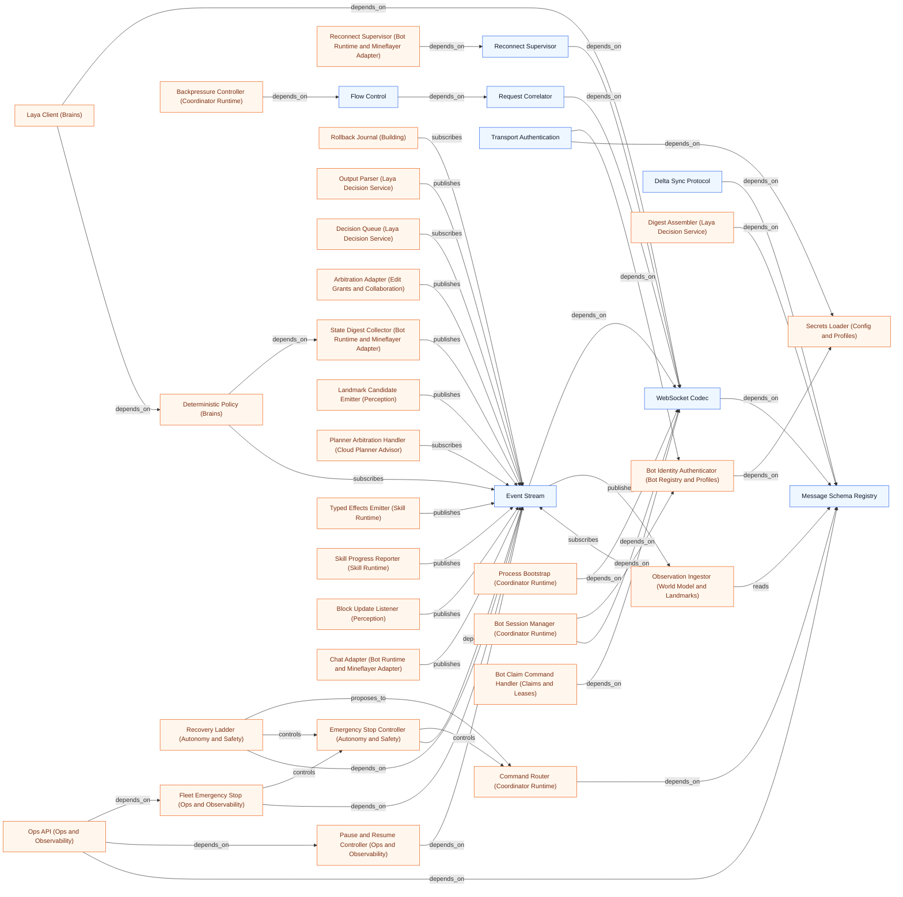
```mermaid
flowchart LR
n155["Message Schema Registry"]
n163["WebSocket Codec"]
n169["Request Correlator"]
n170["Event Stream"]
n171["Delta Sync Protocol"]
n172["Reconnect Supervisor"]
n173["Transport Authentication"]
n150["Flow Control"]
n70["Deterministic Policy (Brains)"]
n62["Reconnect Supervisor (Bot Runtime and Mineflayer Adapter)"]
n127["State Digest Collector (Bot Runtime and Mineflayer Adapter)"]
n110["Rollback Journal (Building)"]
n75["Backpressure Controller (Coordinator Runtime)"]
n29["Command Router (Coordinator Runtime)"]
n72["Process Bootstrap (Coordinator Runtime)"]
n74["Bot Session Manager (Coordinator Runtime)"]
n79["Digest Assembler (Laya Decision Service)"]
n38["Output Parser (Laya Decision Service)"]
n76["Decision Queue (Laya Decision Service)"]
n174["Arbitration Adapter (Edit Grants and Collaboration)"]
n68["Fleet Emergency Stop (Ops and Observability)"]
n66["Ops API (Ops and Observability)"]
n67["Pause and Resume Controller (Ops and Observability)"]
n175["Landmark Candidate Emitter (Perception)"]
n50["Planner Arbitration Handler (Cloud Planner Advisor)"]
n65["Emergency Stop Controller (Autonomy and Safety)"]
n64["Recovery Ladder (Autonomy and Safety)"]
n89["Typed Effects Emitter (Skill Runtime)"]
n86["Skill Progress Reporter (Skill Runtime)"]
n167["Bot Identity Authenticator (Bot Registry and Profiles)"]
n176["Secrets Loader (Config and Profiles)"]
n177["Observation Ingestor (World Model and Landmarks)"]
n71["Laya Client (Brains)"]
n178["Block Update Listener (Perception)"]
n61["Chat Adapter (Bot Runtime and Mineflayer Adapter)"]
n179["Bot Claim Command Handler (Claims and Leases)"]
n70 -->|depends_on| n127
n70 -->|subscribes| n170
n62 -->|depends_on| n172
n127 -->|publishes| n170
n167 -->|depends_on| n176
n110 -->|subscribes| n170
n75 -->|depends_on| n150
n29 -->|depends_on| n155
n72 -->|depends_on| n163
n74 -->|depends_on| n167
n74 -->|depends_on| n163
n79 -->|depends_on| n155
n38 -->|publishes| n170
n76 -->|subscribes| n170
n174 -->|publishes| n170
n68 -->|controls| n65
n68 -->|depends_on| n170
n66 -->|depends_on| n68
n66 -->|depends_on| n67
n66 -->|depends_on| n155
n67 -->|depends_on| n170
n175 -->|publishes| n170
n50 -->|subscribes| n170
n65 -->|controls| n29
n65 -->|depends_on| n170
n64 -->|proposes_to| n29
n64 -->|controls| n65
n64 -->|depends_on| n170
n89 -->|publishes| n170
n86 -->|publishes| n170
n173 -->|depends_on| n167
n173 -->|depends_on| n176
n171 -->|depends_on| n155
n170 -->|depends_on| n163
n170 -->|publishes| n177
n150 -->|depends_on| n169
n172 -->|depends_on| n163
n169 -->|depends_on| n163
n163 -->|depends_on| n155
n177 -->|subscribes| n170
n177 -->|reads| n155
n71 -->|depends_on| n163
n71 -->|depends_on| n70
n178 -->|publishes| n170
n61 -->|publishes| n170
n179 -->|depends_on| n163
classDef internal fill:#eef6ff,stroke:#2563eb,color:#0f172a;
classDef external fill:#fff7ed,stroke:#ea580c,color:#7c2d12;
class n155,n163,n169,n170,n171,n172,n173,n150 internal;
class n70,n62,n127,n110,n75,n29,n72,n74,n79,n38,n76,n174,n68,n66,n67,n175,n50,n65,n64,n89,n86,n167,n176,n177,n71,n178,n61,n179 external;
```

### Shared Infrastructure Plan

Source: `docs/architecture/graphs/system-sip.mmd`

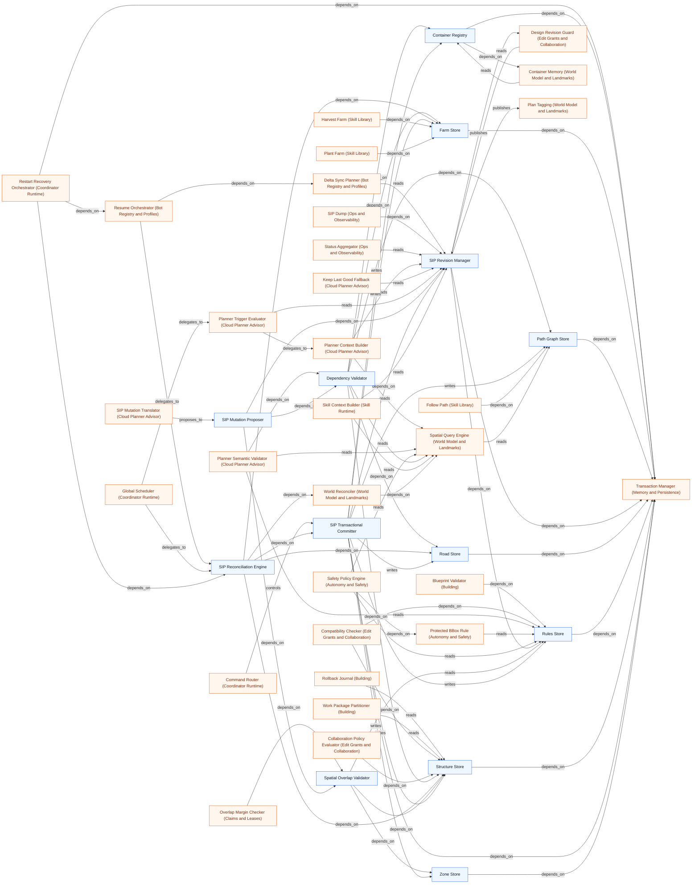
```mermaid
flowchart LR
n180["Zone Store"]
n181["Structure Store"]
n182["Road Store"]
n183["Farm Store"]
n184["Container Registry"]
n185["Path Graph Store"]
n186["Rules Store"]
n187["SIP Revision Manager"]
n188["Spatial Overlap Validator"]
n189["Dependency Validator"]
n190["SIP Mutation Proposer"]
n153["SIP Transactional Committer"]
n159["SIP Reconciliation Engine"]
n191["Delta Sync Planner (Bot Registry and Profiles)"]
n164["Resume Orchestrator (Bot Registry and Profiles)"]
n92["Blueprint Validator (Building)"]
n110["Rollback Journal (Building)"]
n104["Work Package Partitioner (Building)"]
n192["Overlap Margin Checker (Claims and Leases)"]
n29["Command Router (Coordinator Runtime)"]
n31["Global Scheduler (Coordinator Runtime)"]
n32["Restart Recovery Orchestrator (Coordinator Runtime)"]
n193["Compatibility Checker (Edit Grants and Collaboration)"]
n194["Design Revision Guard (Edit Grants and Collaboration)"]
n195["Collaboration Policy Evaluator (Edit Grants and Collaboration)"]
n143["SIP Dump (Ops and Observability)"]
n141["Status Aggregator (Ops and Observability)"]
n42["Planner Context Builder (Cloud Planner Advisor)"]
n51["Keep Last Good Fallback (Cloud Planner Advisor)"]
n45["Planner Semantic Validator (Cloud Planner Advisor)"]
n47["SIP Mutation Translator (Cloud Planner Advisor)"]
n43["Planner Trigger Evaluator (Cloud Planner Advisor)"]
n136["Protected BBox Rule (Autonomy and Safety)"]
n139["Safety Policy Engine (Autonomy and Safety)"]
n156["Transaction Manager (Memory and Persistence)"]
n196["Container Memory (World Model and Landmarks)"]
n197["Spatial Query Engine (World Model and Landmarks)"]
n198["World Reconciler (World Model and Landmarks)"]
n199["Plan Tagging (World Model and Landmarks)"]
n52["Skill Context Builder (Skill Runtime)"]
n200["Follow Path (Skill Library)"]
n201["Harvest Farm (Skill Library)"]
n202["Plant Farm (Skill Library)"]
n191 -->|reads| n187
n164 -->|depends_on| n191
n164 -->|delegates_to| n159
n92 -->|depends_on| n186
n110 -->|reads| n181
n104 -->|reads| n181
n192 -->|depends_on| n188
n29 -->|controls| n153
n31 -->|delegates_to| n43
n31 -->|delegates_to| n159
n32 -->|depends_on| n164
n32 -->|depends_on| n156
n32 -->|depends_on| n159
n193 -->|depends_on| n186
n193 -->|depends_on| n181
n194 -->|reads| n187
n195 -->|depends_on| n181
n143 -->|depends_on| n187
n141 -->|reads| n187
n42 -->|reads| n187
n42 -->|reads| n197
n51 -->|reads| n187
n45 -->|depends_on| n189
n45 -->|reads| n186
n45 -->|reads| n197
n47 -->|proposes_to| n190
n43 -->|delegates_to| n42
n43 -->|reads| n187
n136 -->|reads| n186
n139 -->|depends_on| n136
n139 -->|reads| n186
n139 -->|reads| n197
n184 -->|depends_on| n156
n184 -->|depends_on| n196
n189 -->|depends_on| n184
n189 -->|depends_on| n183
n189 -->|depends_on| n185
n189 -->|depends_on| n182
n189 -->|depends_on| n181
n189 -->|reads| n197
n183 -->|depends_on| n156
n190 -->|depends_on| n189
n190 -->|depends_on| n187
n190 -->|depends_on| n188
n185 -->|depends_on| n156
n159 -->|depends_on| n183
n159 -->|depends_on| n182
n159 -->|depends_on| n181
n159 -->|depends_on| n153
n159 -->|depends_on| n198
n187 -->|publishes| n194
n187 -->|depends_on| n156
n187 -->|depends_on| n186
n187 -->|publishes| n199
n182 -->|depends_on| n156
n186 -->|depends_on| n156
n188 -->|reads| n186
n188 -->|depends_on| n181
n188 -->|depends_on| n180
n181 -->|depends_on| n156
n153 -->|depends_on| n156
n153 -->|writes| n184
n153 -->|writes| n183
n153 -->|writes| n185
n153 -->|depends_on| n187
n153 -->|writes| n182
n153 -->|writes| n186
n153 -->|writes| n181
n153 -->|writes| n180
n180 -->|depends_on| n156
n52 -->|reads| n187
n52 -->|reads| n197
n200 -->|depends_on| n185
n201 -->|depends_on| n183
n202 -->|depends_on| n183
n196 -->|reads| n184
n197 -->|reads| n185
n198 -->|depends_on| n197
classDef internal fill:#eef6ff,stroke:#2563eb,color:#0f172a;
classDef external fill:#fff7ed,stroke:#ea580c,color:#7c2d12;
class n180,n181,n182,n183,n184,n185,n186,n187,n188,n189,n190,n153,n159 internal;
class n191,n164,n92,n110,n104,n192,n29,n31,n32,n193,n194,n195,n143,n141,n42,n51,n45,n47,n43,n136,n139,n156,n196,n197,n198,n199,n52,n200,n201,n202 external;
```

### Task Board

Source: `docs/architecture/graphs/system-tasks.mmd`

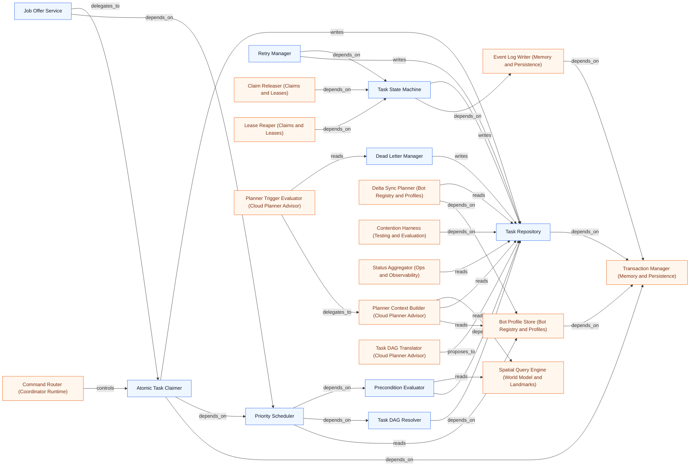
```mermaid
flowchart LR
n203["Task Repository"]
n204["Task DAG Resolver"]
n205["Precondition Evaluator"]
n206["Priority Scheduler"]
n154["Atomic Task Claimer"]
n207["Job Offer Service"]
n208["Retry Manager"]
n209["Dead Letter Manager"]
n210["Task State Machine"]
n191["Delta Sync Planner (Bot Registry and Profiles)"]
n211["Claim Releaser (Claims and Leases)"]
n157["Lease Reaper (Claims and Leases)"]
n29["Command Router (Coordinator Runtime)"]
n212["Contention Harness (Testing and Evaluation)"]
n141["Status Aggregator (Ops and Observability)"]
n42["Planner Context Builder (Cloud Planner Advisor)"]
n48["Task DAG Translator (Cloud Planner Advisor)"]
n43["Planner Trigger Evaluator (Cloud Planner Advisor)"]
n156["Transaction Manager (Memory and Persistence)"]
n197["Spatial Query Engine (World Model and Landmarks)"]
n213["Bot Profile Store (Bot Registry and Profiles)"]
n214["Event Log Writer (Memory and Persistence)"]
n191 -->|depends_on| n213
n191 -->|reads| n203
n213 -->|depends_on| n156
n211 -->|depends_on| n210
n157 -->|depends_on| n210
n29 -->|controls| n154
n212 -->|depends_on| n203
n214 -->|depends_on| n156
n141 -->|reads| n203
n42 -->|reads| n213
n42 -->|reads| n203
n42 -->|reads| n197
n48 -->|proposes_to| n203
n43 -->|delegates_to| n42
n43 -->|reads| n209
n154 -->|depends_on| n156
n154 -->|depends_on| n206
n154 -->|writes| n203
n204 -->|depends_on| n203
n209 -->|writes| n203
n205 -->|depends_on| n203
n205 -->|reads| n197
n206 -->|reads| n213
n206 -->|depends_on| n204
n206 -->|depends_on| n205
n208 -->|writes| n203
n208 -->|depends_on| n210
n203 -->|depends_on| n156
n210 -->|depends_on| n214
n210 -->|writes| n203
n207 -->|depends_on| n206
n207 -->|delegates_to| n154
classDef internal fill:#eef6ff,stroke:#2563eb,color:#0f172a;
classDef external fill:#fff7ed,stroke:#ea580c,color:#7c2d12;
class n203,n204,n205,n206,n154,n207,n208,n209,n210 internal;
class n191,n211,n157,n29,n212,n141,n42,n48,n43,n156,n197,n213,n214 external;
```

### Claims and Leases

Source: `docs/architecture/graphs/system-claims.mmd`

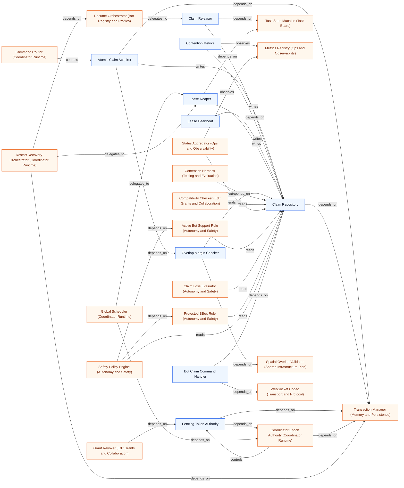
```mermaid
flowchart LR
n215["Claim Repository"]
n192["Overlap Margin Checker"]
n151["Atomic Claim Acquirer"]
n216["Lease Heartbeat"]
n157["Lease Reaper"]
n149["Fencing Token Authority"]
n211["Claim Releaser"]
n179["Bot Claim Command Handler"]
n217["Contention Metrics"]
n164["Resume Orchestrator (Bot Registry and Profiles)"]
n156["Transaction Manager (Memory and Persistence)"]
n210["Task State Machine (Task Board)"]
n144["Metrics Registry (Ops and Observability)"]
n30["Coordinator Epoch Authority (Coordinator Runtime)"]
n188["Spatial Overlap Validator (Shared Infrastructure Plan)"]
n29["Command Router (Coordinator Runtime)"]
n31["Global Scheduler (Coordinator Runtime)"]
n32["Restart Recovery Orchestrator (Coordinator Runtime)"]
n212["Contention Harness (Testing and Evaluation)"]
n193["Compatibility Checker (Edit Grants and Collaboration)"]
n218["Grant Revoker (Edit Grants and Collaboration)"]
n141["Status Aggregator (Ops and Observability)"]
n137["Active Bot Support Rule (Autonomy and Safety)"]
n135["Claim Loss Evaluator (Autonomy and Safety)"]
n136["Protected BBox Rule (Autonomy and Safety)"]
n139["Safety Policy Engine (Autonomy and Safety)"]
n163["WebSocket Codec (Transport and Protocol)"]
n164 -->|delegates_to| n211
n151 -->|writes| n215
n151 -->|depends_on| n192
n151 -->|depends_on| n156
n211 -->|writes| n215
n211 -->|depends_on| n210
n215 -->|depends_on| n156
n217 -->|depends_on| n215
n217 -->|observes| n144
n149 -->|depends_on| n30
n149 -->|depends_on| n156
n216 -->|writes| n215
n157 -->|writes| n215
n157 -->|depends_on| n210
n192 -->|depends_on| n215
n192 -->|depends_on| n188
n29 -->|controls| n151
n30 -->|controls| n149
n30 -->|depends_on| n156
n31 -->|delegates_to| n157
n31 -->|depends_on| n30
n32 -->|depends_on| n164
n32 -->|delegates_to| n157
n32 -->|depends_on| n156
n212 -->|depends_on| n215
n193 -->|reads| n215
n218 -->|depends_on| n149
n141 -->|reads| n215
n141 -->|observes| n144
n137 -->|reads| n215
n135 -->|reads| n215
n136 -->|reads| n215
n139 -->|reads| n215
n139 -->|depends_on| n137
n139 -->|depends_on| n136
n179 -->|depends_on| n215
n179 -->|depends_on| n163
classDef internal fill:#eef6ff,stroke:#2563eb,color:#0f172a;
classDef external fill:#fff7ed,stroke:#ea580c,color:#7c2d12;
class n215,n192,n151,n216,n157,n149,n211,n179,n217 internal;
class n164,n156,n210,n144,n30,n188,n29,n31,n32,n212,n193,n218,n141,n137,n135,n136,n139,n163 external;
```

### Edit Grants and Collaboration

Source: `docs/architecture/graphs/system-grants.mmd`

```mermaid
flowchart LR
n219["Grant Repository"]
n195["Collaboration Policy Evaluator"]
n193["Compatibility Checker"]
n194["Design Revision Guard"]
n152["Grant Issuer"]
n218["Grant Revoker"]
n220["Owner Offline Policy"]
n165["Grant Expiry"]
n174["Arbitration Adapter"]
n191["Delta Sync Planner (Bot Registry and Profiles)"]
n29["Command Router (Coordinator Runtime)"]
n32["Restart Recovery Orchestrator (Coordinator Runtime)"]
n170["Event Stream (Transport and Protocol)"]
n215["Claim Repository (Claims and Leases)"]
n186["Rules Store (Shared Infrastructure Plan)"]
n181["Structure Store (Shared Infrastructure Plan)"]
n187["SIP Revision Manager (Shared Infrastructure Plan)"]
n156["Transaction Manager (Memory and Persistence)"]
n149["Fencing Token Authority (Claims and Leases)"]
n168["Presence Tracker (Bot Registry and Profiles)"]
n213["Bot Profile Store (Bot Registry and Profiles)"]
n50["Planner Arbitration Handler (Cloud Planner Advisor)"]
n191 -->|depends_on| n213
n191 -->|reads| n219
n191 -->|reads| n187
n168 -->|depends_on| n213
n213 -->|depends_on| n156
n215 -->|depends_on| n156
n149 -->|depends_on| n156
n29 -->|controls| n152
n32 -->|delegates_to| n165
n32 -->|depends_on| n156
n174 -->|depends_on| n193
n174 -->|publishes| n170
n193 -->|reads| n215
n193 -->|depends_on| n219
n193 -->|depends_on| n186
n193 -->|depends_on| n181
n194 -->|depends_on| n219
n194 -->|controls| n218
n194 -->|reads| n187
n165 -->|writes| n219
n152 -->|depends_on| n193
n152 -->|depends_on| n194
n152 -->|writes| n219
n152 -->|depends_on| n195
n219 -->|depends_on| n156
n218 -->|depends_on| n149
n218 -->|writes| n219
n220 -->|reads| n168
n220 -->|reads| n213
n220 -->|depends_on| n193
n195 -->|depends_on| n219
n195 -->|depends_on| n181
n50 -->|reads| n193
n50 -->|proposes_to| n152
n50 -->|subscribes| n170
n187 -->|publishes| n194
n187 -->|depends_on| n156
n187 -->|depends_on| n186
n186 -->|depends_on| n156
n181 -->|depends_on| n156
classDef internal fill:#eef6ff,stroke:#2563eb,color:#0f172a;
classDef external fill:#fff7ed,stroke:#ea580c,color:#7c2d12;
class n219,n195,n193,n194,n152,n218,n220,n165,n174 internal;
class n191,n29,n32,n170,n215,n186,n181,n187,n156,n149,n168,n213,n50 external;
```

### Bot Registry and Profiles

Source: `docs/architecture/graphs/system-bots.mmd`

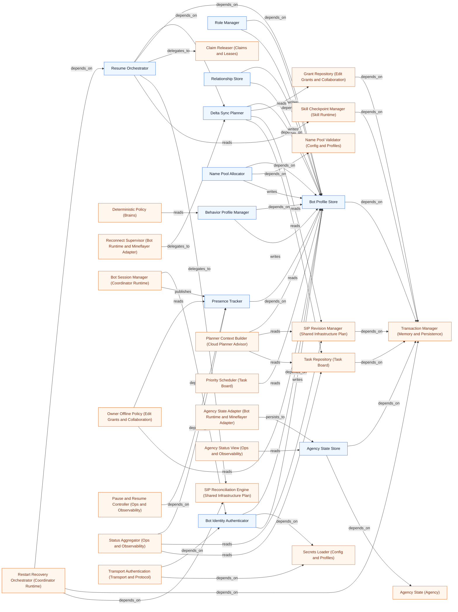
```mermaid
flowchart LR
n167["Bot Identity Authenticator"]
n213["Bot Profile Store"]
n221["Role Manager"]
n222["Behavior Profile Manager"]
n223["Relationship Store"]
n168["Presence Tracker"]
n191["Delta Sync Planner"]
n164["Resume Orchestrator"]
n224["Agency State Store"]
n225["Name Pool Allocator"]
n70["Deterministic Policy (Brains)"]
n62["Reconnect Supervisor (Bot Runtime and Mineflayer Adapter)"]
n219["Grant Repository (Edit Grants and Collaboration)"]
n187["SIP Revision Manager (Shared Infrastructure Plan)"]
n203["Task Repository (Task Board)"]
n176["Secrets Loader (Config and Profiles)"]
n226["Name Pool Validator (Config and Profiles)"]
n156["Transaction Manager (Memory and Persistence)"]
n211["Claim Releaser (Claims and Leases)"]
n159["SIP Reconciliation Engine (Shared Infrastructure Plan)"]
n87["Skill Checkpoint Manager (Skill Runtime)"]
n32["Restart Recovery Orchestrator (Coordinator Runtime)"]
n74["Bot Session Manager (Coordinator Runtime)"]
n220["Owner Offline Policy (Edit Grants and Collaboration)"]
n67["Pause and Resume Controller (Ops and Observability)"]
n141["Status Aggregator (Ops and Observability)"]
n42["Planner Context Builder (Cloud Planner Advisor)"]
n206["Priority Scheduler (Task Board)"]
n173["Transport Authentication (Transport and Protocol)"]
n129["Agency State Adapter (Bot Runtime and Mineflayer Adapter)"]
n142["Agency Status View (Ops and Observability)"]
n227["Agency State (Agency)"]
n70 -->|reads| n222
n62 -->|delegates_to| n191
n222 -->|depends_on| n213
n191 -->|depends_on| n213
n191 -->|reads| n219
n191 -->|reads| n187
n191 -->|reads| n203
n167 -->|depends_on| n213
n167 -->|depends_on| n176
n225 -->|depends_on| n213
n225 -->|depends_on| n226
n168 -->|depends_on| n213
n213 -->|depends_on| n156
n223 -->|depends_on| n213
n164 -->|depends_on| n191
n164 -->|depends_on| n213
n164 -->|delegates_to| n211
n164 -->|delegates_to| n159
n164 -->|reads| n87
n221 -->|depends_on| n213
n32 -->|depends_on| n164
n32 -->|depends_on| n156
n32 -->|depends_on| n159
n74 -->|depends_on| n167
n74 -->|publishes| n168
n219 -->|depends_on| n156
n220 -->|reads| n168
n220 -->|reads| n213
n67 -->|depends_on| n168
n141 -->|depends_on| n168
n141 -->|reads| n187
n141 -->|reads| n203
n42 -->|reads| n213
n42 -->|reads| n187
n42 -->|reads| n203
n187 -->|depends_on| n156
n87 -->|depends_on| n156
n206 -->|reads| n213
n203 -->|depends_on| n156
n173 -->|depends_on| n167
n173 -->|depends_on| n176
n167 -->|writes| n213
n221 -->|writes| n213
n222 -->|writes| n213
n223 -->|writes| n213
n225 -->|writes| n213
n129 -->|persists_to| n224
n224 -->|depends_on| n156
n142 -->|reads| n224
n224 -->|depends_on| n227
classDef internal fill:#eef6ff,stroke:#2563eb,color:#0f172a;
classDef external fill:#fff7ed,stroke:#ea580c,color:#7c2d12;
class n167,n213,n221,n222,n223,n168,n191,n164,n224,n225 internal;
class n70,n62,n219,n187,n203,n176,n226,n156,n211,n159,n87,n32,n74,n220,n67,n141,n42,n206,n173,n129,n142,n227 external;
```

### World Model and Landmarks

Source: `docs/architecture/graphs/system-world.mmd`

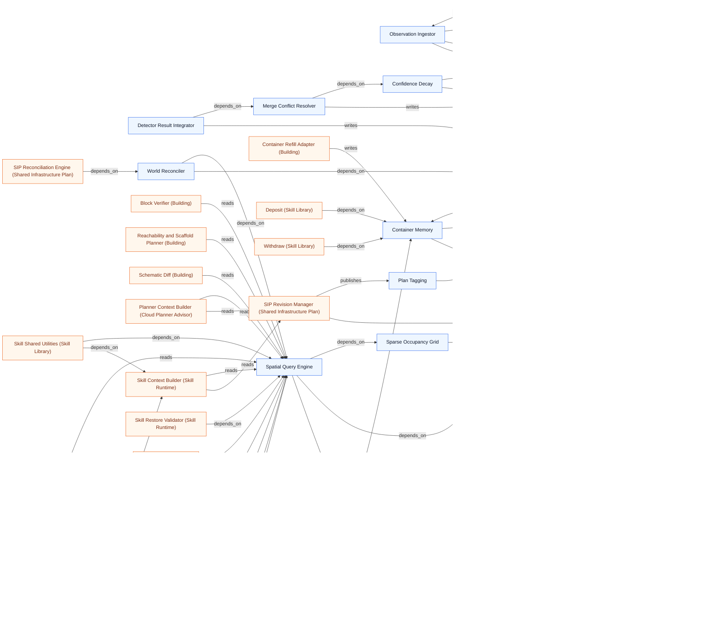
```mermaid
flowchart LR
n177["Observation Ingestor"]
n228["Chunk Version Store"]
n229["Sparse Occupancy Grid"]
n230["Merge Conflict Resolver"]
n231["Confidence Decay"]
n232["Landmark Registry"]
n233["Detector Result Integrator"]
n199["Plan Tagging"]
n197["Spatial Query Engine"]
n196["Container Memory"]
n198["World Reconciler"]
n107["Block Verifier (Building)"]
n109["Container Refill Adapter (Building)"]
n108["Material Preflight (Building)"]
n106["Reachability and Scaffold Planner (Building)"]
n103["Schematic Diff (Building)"]
n42["Planner Context Builder (Cloud Planner Advisor)"]
n45["Planner Semantic Validator (Cloud Planner Advisor)"]
n137["Active Bot Support Rule (Autonomy and Safety)"]
n139["Safety Policy Engine (Autonomy and Safety)"]
n184["Container Registry (Shared Infrastructure Plan)"]
n189["Dependency Validator (Shared Infrastructure Plan)"]
n159["SIP Reconciliation Engine (Shared Infrastructure Plan)"]
n187["SIP Revision Manager (Shared Infrastructure Plan)"]
n52["Skill Context Builder (Skill Runtime)"]
n88["Skill Restore Validator (Skill Runtime)"]
n234["Deposit (Skill Library)"]
n235["Explore (Skill Library)"]
n236["Skill Shared Utilities (Skill Library)"]
n237["Withdraw (Skill Library)"]
n205["Precondition Evaluator (Task Board)"]
n170["Event Stream (Transport and Protocol)"]
n156["Transaction Manager (Memory and Persistence)"]
n155["Message Schema Registry (Transport and Protocol)"]
n185["Path Graph Store (Shared Infrastructure Plan)"]
n107 -->|reads| n197
n109 -->|writes| n196
n108 -->|reads| n52
n108 -->|reads| n196
n106 -->|reads| n197
n103 -->|reads| n197
n42 -->|reads| n187
n42 -->|reads| n197
n45 -->|depends_on| n189
n45 -->|reads| n197
n137 -->|reads| n197
n139 -->|depends_on| n137
n139 -->|reads| n197
n184 -->|depends_on| n156
n184 -->|depends_on| n196
n189 -->|depends_on| n184
n189 -->|depends_on| n185
n189 -->|reads| n197
n185 -->|depends_on| n156
n159 -->|depends_on| n198
n187 -->|depends_on| n156
n187 -->|publishes| n199
n52 -->|reads| n187
n52 -->|reads| n197
n88 -->|depends_on| n197
n234 -->|depends_on| n196
n235 -->|depends_on| n197
n236 -->|depends_on| n52
n236 -->|depends_on| n197
n237 -->|depends_on| n196
n205 -->|reads| n197
n170 -->|publishes| n177
n228 -->|depends_on| n156
n231 -->|depends_on| n228
n231 -->|writes| n232
n196 -->|reads| n184
n196 -->|depends_on| n232
n233 -->|writes| n232
n233 -->|depends_on| n230
n232 -->|depends_on| n156
n230 -->|writes| n228
n230 -->|depends_on| n231
n177 -->|subscribes| n170
n177 -->|reads| n155
n177 -->|writes| n228
n229 -->|depends_on| n228
n199 -->|depends_on| n232
n197 -->|reads| n185
n197 -->|depends_on| n232
n197 -->|depends_on| n229
n198 -->|depends_on| n232
n198 -->|depends_on| n197
classDef internal fill:#eef6ff,stroke:#2563eb,color:#0f172a;
classDef external fill:#fff7ed,stroke:#ea580c,color:#7c2d12;
class n177,n228,n229,n230,n231,n232,n233,n199,n197,n196,n198 internal;
class n107,n109,n108,n106,n103,n42,n45,n137,n139,n184,n189,n159,n187,n52,n88,n234,n235,n236,n237,n205,n170,n156,n155,n185 external;
```

### Perception

Source: `docs/architecture/graphs/system-perception.mmd`

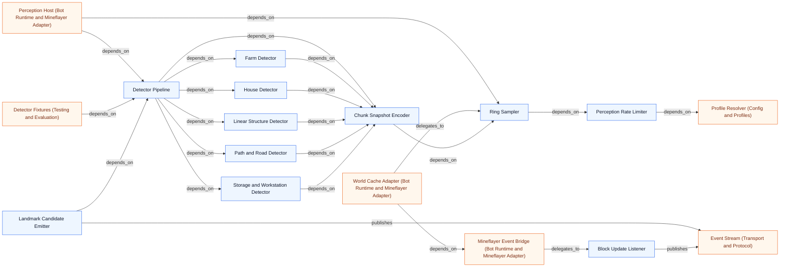
```mermaid
flowchart LR
n238["Ring Sampler"]
n239["Chunk Snapshot Encoder"]
n178["Block Update Listener"]
n240["Path and Road Detector"]
n241["House Detector"]
n242["Farm Detector"]
n243["Storage and Workstation Detector"]
n244["Linear Structure Detector"]
n245["Detector Pipeline"]
n175["Landmark Candidate Emitter"]
n246["Perception Rate Limiter"]
n55["Mineflayer Event Bridge (Bot Runtime and Mineflayer Adapter)"]
n128["Perception Host (Bot Runtime and Mineflayer Adapter)"]
n56["World Cache Adapter (Bot Runtime and Mineflayer Adapter)"]
n247["Detector Fixtures (Testing and Evaluation)"]
n170["Event Stream (Transport and Protocol)"]
n166["Profile Resolver (Config and Profiles)"]
n55 -->|delegates_to| n178
n128 -->|depends_on| n245
n128 -->|depends_on| n238
n56 -->|depends_on| n55
n56 -->|delegates_to| n238
n247 -->|depends_on| n245
n239 -->|depends_on| n238
n245 -->|depends_on| n239
n245 -->|depends_on| n242
n245 -->|depends_on| n241
n245 -->|depends_on| n244
n245 -->|depends_on| n240
n245 -->|depends_on| n243
n242 -->|depends_on| n239
n241 -->|depends_on| n239
n175 -->|depends_on| n245
n175 -->|publishes| n170
n244 -->|depends_on| n239
n240 -->|depends_on| n239
n246 -->|depends_on| n166
n238 -->|depends_on| n246
n243 -->|depends_on| n239
n178 -->|publishes| n170
classDef internal fill:#eef6ff,stroke:#2563eb,color:#0f172a;
classDef external fill:#fff7ed,stroke:#ea580c,color:#7c2d12;
class n238,n239,n178,n240,n241,n242,n243,n244,n245,n175,n246 internal;
class n55,n128,n56,n247,n170,n166 external;
```

### Laya Decision Service

Source: `docs/architecture/graphs/system-decision.mmd`

```mermaid
flowchart LR
n34["Model Loader"]
n35["Execution Provider Selector"]
n76["Decision Queue"]
n77["Decision Rate Limiter"]
n78["Digest Cache"]
n79["Digest Assembler"]
n36["Batch Runner"]
n37["Single In-flight Guard"]
n38["Output Parser"]
n39["Confidence Calibrator"]
n40["Timeout and Fallback Handler"]
n80["Latency Metrics"]
n70["Deterministic Policy (Brains)"]
n160["Config Schema Validator (Config and Profiles)"]
n155["Message Schema Registry (Transport and Protocol)"]
n248["Hardware Probe (Config and Profiles)"]
n145["Structured Logger (Ops and Observability)"]
n144["Metrics Registry (Ops and Observability)"]
n249["Laya Runtime Resolver (Config and Profiles)"]
n26(["ONNX Runtime / WebGPU Driver"])
n170["Event Stream (Transport and Protocol)"]
n166["Profile Resolver (Config and Profiles)"]
n250["Laya Benchmark Harness (Testing and Evaluation)"]
n146["Health and Readiness (Ops and Observability)"]
n251["Calibration Fitter (Laya Training)"]
n70 -->|subscribes| n170
n248 -->|depends_on| n166
n249 -->|depends_on| n248
n249 -->|depends_on| n166
n166 -->|depends_on| n160
n36 -->|depends_on| n78
n36 -->|depends_on| n34
n36 -->|depends_on| n76
n39 -->|proposes_to| n70
n39 -->|depends_on| n160
n39 -->|depends_on| n38
n79 -->|depends_on| n155
n78 -->|depends_on| n76
n35 -->|depends_on| n248
n35 -->|controls| n34
n35 -->|observes| n145
n80 -->|observes| n144
n80 -->|writes| n144
n34 -->|depends_on| n249
n34 -->|depends_on| n26
n38 -->|depends_on| n36
n38 -->|publishes| n170
n76 -->|subscribes| n170
n77 -->|depends_on| n166
n77 -->|depends_on| n76
n37 -->|controls| n36
n40 -->|controls| n38
n40 -->|depends_on| n76
n250 -->|depends_on| n80
n250 -->|depends_on| n34
n146 -->|depends_on| n34
n251 -->|reads| n39
classDef internal fill:#eef6ff,stroke:#2563eb,color:#0f172a;
classDef external fill:#fff7ed,stroke:#ea580c,color:#7c2d12;
class n34,n35,n76,n77,n78,n79,n36,n37,n38,n39,n40,n80 internal;
class n70,n160,n155,n248,n145,n144,n249,n170,n166,n250,n146,n251,n26 external;
```

### Cloud Planner Advisor

Source: `docs/architecture/graphs/system-planner.mmd`

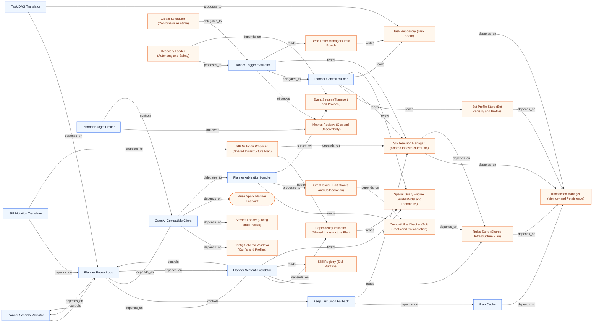
```mermaid
flowchart LR
n41["OpenAI-Compatible Client"]
n42["Planner Context Builder"]
n43["Planner Trigger Evaluator"]
n44["Planner Schema Validator"]
n45["Planner Semantic Validator"]
n46["Planner Repair Loop"]
n47["SIP Mutation Translator"]
n48["Task DAG Translator"]
n49["Planner Budget Limiter"]
n81["Plan Cache"]
n50["Planner Arbitration Handler"]
n51["Keep Last Good Fallback"]
n31["Global Scheduler (Coordinator Runtime)"]
n193["Compatibility Checker (Edit Grants and Collaboration)"]
n152["Grant Issuer (Edit Grants and Collaboration)"]
n170["Event Stream (Transport and Protocol)"]
n144["Metrics Registry (Ops and Observability)"]
n213["Bot Profile Store (Bot Registry and Profiles)"]
n187["SIP Revision Manager (Shared Infrastructure Plan)"]
n203["Task Repository (Task Board)"]
n197["Spatial Query Engine (World Model and Landmarks)"]
n160["Config Schema Validator (Config and Profiles)"]
n176["Secrets Loader (Config and Profiles)"]
n25(["Muse Spark Planner Endpoint"])
n156["Transaction Manager (Memory and Persistence)"]
n189["Dependency Validator (Shared Infrastructure Plan)"]
n186["Rules Store (Shared Infrastructure Plan)"]
n83["Skill Registry (Skill Runtime)"]
n190["SIP Mutation Proposer (Shared Infrastructure Plan)"]
n209["Dead Letter Manager (Task Board)"]
n64["Recovery Ladder (Autonomy and Safety)"]
n213 -->|depends_on| n156
n31 -->|delegates_to| n43
n193 -->|depends_on| n186
n152 -->|depends_on| n193
n50 -->|reads| n193
n50 -->|proposes_to| n152
n50 -->|subscribes| n170
n49 -->|observes| n144
n49 -->|controls| n41
n42 -->|reads| n213
n42 -->|reads| n187
n42 -->|reads| n203
n42 -->|reads| n197
n51 -->|depends_on| n81
n51 -->|reads| n187
n41 -->|depends_on| n160
n41 -->|depends_on| n176
n41 -->|depends_on| n25
n41 -->|delegates_to| n50
n81 -->|depends_on| n156
n46 -->|controls| n51
n46 -->|depends_on| n41
n46 -->|depends_on| n44
n46 -->|depends_on| n45
n44 -->|controls| n46
n45 -->|controls| n46
n45 -->|depends_on| n44
n45 -->|depends_on| n189
n45 -->|reads| n186
n45 -->|reads| n83
n45 -->|reads| n197
n47 -->|depends_on| n46
n47 -->|proposes_to| n190
n48 -->|depends_on| n46
n48 -->|proposes_to| n203
n43 -->|observes| n144
n43 -->|delegates_to| n42
n43 -->|reads| n187
n43 -->|reads| n209
n64 -->|proposes_to| n43
n64 -->|depends_on| n170
n189 -->|reads| n197
n190 -->|depends_on| n189
n190 -->|depends_on| n187
n187 -->|depends_on| n156
n187 -->|depends_on| n186
n186 -->|depends_on| n156
n209 -->|writes| n203
n203 -->|depends_on| n156
classDef internal fill:#eef6ff,stroke:#2563eb,color:#0f172a;
classDef external fill:#fff7ed,stroke:#ea580c,color:#7c2d12;
class n41,n42,n43,n44,n45,n46,n47,n48,n49,n81,n50,n51 internal;
class n31,n193,n152,n170,n144,n213,n187,n203,n197,n160,n176,n156,n189,n186,n83,n190,n209,n64,n25 external;
```

### Skill Runtime

Source: `docs/architecture/graphs/system-skill-runtime.mmd`

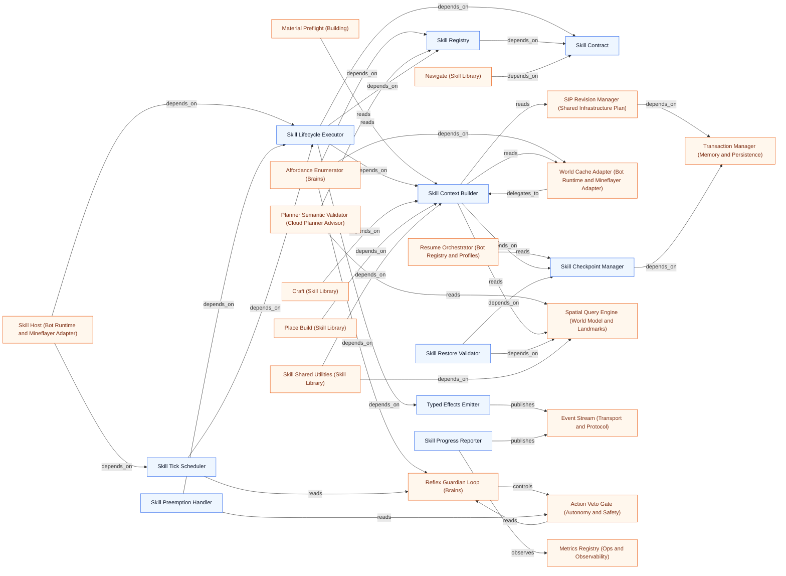
```mermaid
flowchart LR
n82["Skill Contract"]
n83["Skill Registry"]
n84["Skill Lifecycle Executor"]
n85["Skill Tick Scheduler"]
n52["Skill Context Builder"]
n86["Skill Progress Reporter"]
n87["Skill Checkpoint Manager"]
n88["Skill Restore Validator"]
n89["Typed Effects Emitter"]
n90["Skill Preemption Handler"]
n148["Affordance Enumerator (Brains)"]
n59["Skill Host (Bot Runtime and Mineflayer Adapter)"]
n56["World Cache Adapter (Bot Runtime and Mineflayer Adapter)"]
n164["Resume Orchestrator (Bot Registry and Profiles)"]
n108["Material Preflight (Building)"]
n45["Planner Semantic Validator (Cloud Planner Advisor)"]
n156["Transaction Manager (Memory and Persistence)"]
n187["SIP Revision Manager (Shared Infrastructure Plan)"]
n197["Spatial Query Engine (World Model and Landmarks)"]
n170["Event Stream (Transport and Protocol)"]
n63["Action Veto Gate (Autonomy and Safety)"]
n144["Metrics Registry (Ops and Observability)"]
n69["Reflex Guardian Loop (Brains)"]
n252["Craft (Skill Library)"]
n253["Navigate (Skill Library)"]
n254["Place Build (Skill Library)"]
n236["Skill Shared Utilities (Skill Library)"]
n148 -->|depends_on| n56
n148 -->|depends_on| n69
n148 -->|depends_on| n83
n59 -->|depends_on| n84
n59 -->|depends_on| n85
n56 -->|delegates_to| n52
n164 -->|reads| n87
n108 -->|reads| n52
n45 -->|reads| n83
n45 -->|reads| n197
n63 -->|reads| n69
n69 -->|controls| n63
n187 -->|depends_on| n156
n87 -->|depends_on| n156
n52 -->|reads| n56
n52 -->|reads| n187
n52 -->|depends_on| n87
n52 -->|reads| n197
n89 -->|publishes| n170
n84 -->|depends_on| n52
n84 -->|depends_on| n89
n84 -->|depends_on| n82
n84 -->|depends_on| n83
n90 -->|reads| n63
n90 -->|depends_on| n84
n86 -->|observes| n144
n86 -->|publishes| n170
n88 -->|depends_on| n87
n88 -->|depends_on| n197
n83 -->|depends_on| n82
n85 -->|reads| n69
n85 -->|depends_on| n84
n252 -->|depends_on| n52
n253 -->|depends_on| n82
n254 -->|depends_on| n52
n236 -->|depends_on| n52
n236 -->|depends_on| n197
classDef internal fill:#eef6ff,stroke:#2563eb,color:#0f172a;
classDef external fill:#fff7ed,stroke:#ea580c,color:#7c2d12;
class n82,n83,n84,n85,n52,n86,n87,n88,n89,n90 internal;
class n148,n59,n56,n164,n108,n45,n156,n187,n197,n170,n63,n144,n69,n252,n253,n254,n236 external;
```

### Skill Library

Source: `docs/architecture/graphs/system-skills.mmd`

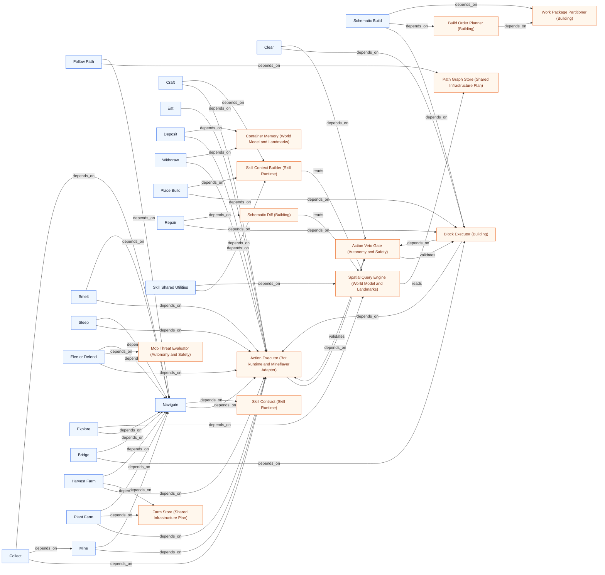
```mermaid
flowchart LR
n253["Navigate"]
n200["Follow Path"]
n255["Mine"]
n256["Collect"]
n252["Craft"]
n257["Smelt"]
n258["Eat"]
n234["Deposit"]
n237["Withdraw"]
n259["Sleep"]
n260["Flee or Defend"]
n235["Explore"]
n261["Bridge"]
n262["Clear"]
n254["Place Build"]
n263["Schematic Build"]
n264["Repair"]
n201["Harvest Farm"]
n202["Plant Farm"]
n236["Skill Shared Utilities"]
n53["Block Executor (Building)"]
n63["Action Veto Gate (Autonomy and Safety)"]
n57["Action Executor (Bot Runtime and Mineflayer Adapter)"]
n52["Skill Context Builder (Skill Runtime)"]
n196["Container Memory (World Model and Landmarks)"]
n197["Spatial Query Engine (World Model and Landmarks)"]
n131["Mob Threat Evaluator (Autonomy and Safety)"]
n185["Path Graph Store (Shared Infrastructure Plan)"]
n183["Farm Store (Shared Infrastructure Plan)"]
n82["Skill Contract (Skill Runtime)"]
n103["Schematic Diff (Building)"]
n105["Build Order Planner (Building)"]
n104["Work Package Partitioner (Building)"]
n57 -->|depends_on| n63
n53 -->|depends_on| n57
n53 -->|depends_on| n63
n105 -->|depends_on| n104
n103 -->|reads| n197
n63 -->|validates| n57
n63 -->|validates| n53
n52 -->|reads| n197
n261 -->|depends_on| n53
n261 -->|depends_on| n253
n262 -->|depends_on| n53
n262 -->|depends_on| n63
n256 -->|depends_on| n57
n256 -->|depends_on| n255
n256 -->|depends_on| n253
n252 -->|depends_on| n57
n252 -->|depends_on| n52
n234 -->|depends_on| n57
n234 -->|depends_on| n196
n258 -->|depends_on| n57
n235 -->|depends_on| n253
n235 -->|depends_on| n197
n260 -->|depends_on| n57
n260 -->|depends_on| n131
n260 -->|depends_on| n253
n200 -->|depends_on| n185
n200 -->|depends_on| n253
n201 -->|depends_on| n57
n201 -->|depends_on| n183
n201 -->|depends_on| n253
n255 -->|depends_on| n57
n255 -->|depends_on| n253
n253 -->|depends_on| n57
n253 -->|depends_on| n82
n254 -->|depends_on| n53
n254 -->|depends_on| n52
n202 -->|depends_on| n57
n202 -->|depends_on| n183
n202 -->|depends_on| n253
n264 -->|depends_on| n53
n264 -->|depends_on| n103
n263 -->|depends_on| n53
n263 -->|depends_on| n105
n263 -->|depends_on| n104
n236 -->|depends_on| n52
n236 -->|depends_on| n197
n259 -->|depends_on| n57
n259 -->|depends_on| n253
n257 -->|depends_on| n57
n257 -->|depends_on| n253
n237 -->|depends_on| n57
n237 -->|depends_on| n196
n197 -->|reads| n185
classDef internal fill:#eef6ff,stroke:#2563eb,color:#0f172a;
classDef external fill:#fff7ed,stroke:#ea580c,color:#7c2d12;
class n253,n200,n255,n256,n252,n257,n258,n234,n237,n259,n260,n235,n261,n262,n254,n263,n264,n201,n202,n236 internal;
class n53,n63,n57,n52,n196,n197,n131,n185,n183,n82,n103,n105,n104 external;
```

### Building

Source: `docs/architecture/graphs/system-building.mmd`

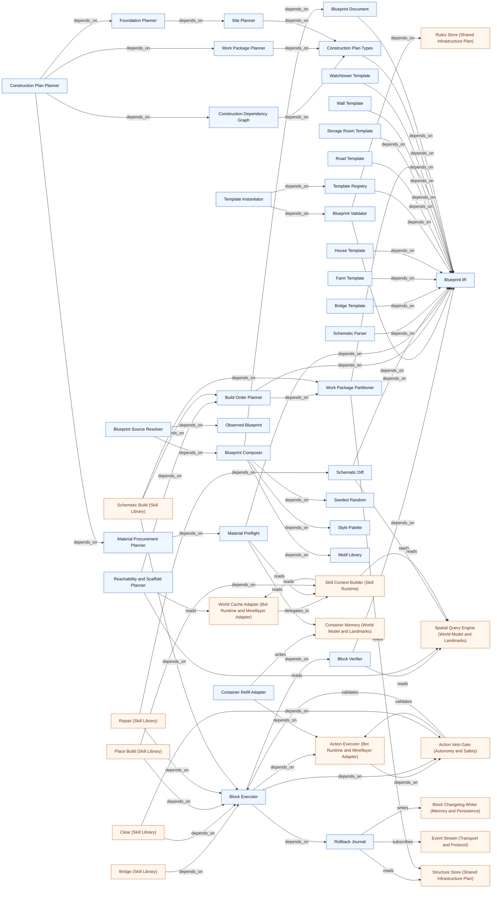
```mermaid
flowchart LR
n91["Blueprint IR"]
n92["Blueprint Validator"]
n93["Template Registry"]
n94["House Template"]
n95["Road Template"]
n96["Farm Template"]
n97["Wall Template"]
n98["Bridge Template"]
n99["Storage Room Template"]
n100["Watchtower Template"]
n101["Template Instantiator"]
n102["Schematic Parser"]
n103["Schematic Diff"]
n104["Work Package Partitioner"]
n105["Build Order Planner"]
n106["Reachability and Scaffold Planner"]
n107["Block Verifier"]
n53["Block Executor"]
n108["Material Preflight"]
n109["Container Refill Adapter"]
n110["Rollback Journal"]
n111["Construction Plan Types"]
n112["Blueprint Document"]
n113["Seeded Random"]
n114["Style Palette"]
n115["Motif Library"]
n116["Blueprint Composer"]
n117["Observed Blueprint"]
n118["Blueprint Source Resolver"]
n119["Site Planner"]
n120["Foundation Planner"]
n121["Construction Dependency Graph"]
n122["Work Package Planner"]
n123["Construction Plan Planner"]
n124["Material Procurement Planner"]
n57["Action Executor (Bot Runtime and Mineflayer Adapter)"]
n63["Action Veto Gate (Autonomy and Safety)"]
n197["Spatial Query Engine (World Model and Landmarks)"]
n186["Rules Store (Shared Infrastructure Plan)"]
n196["Container Memory (World Model and Landmarks)"]
n52["Skill Context Builder (Skill Runtime)"]
n56["World Cache Adapter (Bot Runtime and Mineflayer Adapter)"]
n265["Block Changelog Writer (Memory and Persistence)"]
n181["Structure Store (Shared Infrastructure Plan)"]
n170["Event Stream (Transport and Protocol)"]
n261["Bridge (Skill Library)"]
n262["Clear (Skill Library)"]
n254["Place Build (Skill Library)"]
n264["Repair (Skill Library)"]
n263["Schematic Build (Skill Library)"]
n57 -->|depends_on| n63
n56 -->|delegates_to| n52
n53 -->|depends_on| n57
n53 -->|depends_on| n107
n53 -->|depends_on| n110
n53 -->|depends_on| n63
n107 -->|depends_on| n91
n107 -->|reads| n197
n92 -->|depends_on| n91
n92 -->|depends_on| n186
n105 -->|depends_on| n91
n105 -->|depends_on| n104
n109 -->|depends_on| n57
n109 -->|writes| n196
n108 -->|depends_on| n91
n108 -->|reads| n52
n108 -->|reads| n196
n106 -->|reads| n56
n106 -->|depends_on| n105
n106 -->|reads| n197
n110 -->|writes| n265
n110 -->|reads| n181
n110 -->|subscribes| n170
n103 -->|depends_on| n91
n103 -->|reads| n197
n102 -->|depends_on| n91
n98 -->|depends_on| n91
n96 -->|depends_on| n91
n94 -->|depends_on| n91
n101 -->|depends_on| n92
n101 -->|depends_on| n93
n93 -->|depends_on| n91
n95 -->|depends_on| n91
n99 -->|depends_on| n91
n97 -->|depends_on| n91
n100 -->|depends_on| n91
n104 -->|depends_on| n91
n104 -->|reads| n181
n63 -->|validates| n57
n63 -->|validates| n53
n52 -->|reads| n56
n52 -->|reads| n197
n261 -->|depends_on| n53
n262 -->|depends_on| n53
n262 -->|depends_on| n63
n254 -->|depends_on| n53
n254 -->|depends_on| n52
n264 -->|depends_on| n53
n264 -->|depends_on| n103
n263 -->|depends_on| n53
n263 -->|depends_on| n105
n263 -->|depends_on| n104
n111 -->|depends_on| n91
n112 -->|depends_on| n91
n116 -->|depends_on| n112
n116 -->|depends_on| n113
n116 -->|depends_on| n114
n116 -->|depends_on| n115
n118 -->|depends_on| n116
n118 -->|depends_on| n117
n120 -->|depends_on| n119
n121 -->|depends_on| n111
n122 -->|depends_on| n111
n123 -->|depends_on| n120
n123 -->|depends_on| n121
n123 -->|depends_on| n122
n123 -->|depends_on| n124
n124 -->|depends_on| n108
n119 -->|depends_on| n111
classDef internal fill:#eef6ff,stroke:#2563eb,color:#0f172a;
classDef external fill:#fff7ed,stroke:#ea580c,color:#7c2d12;
class n91,n92,n93,n94,n95,n96,n97,n98,n99,n100,n101,n102,n103,n104,n105,n106,n107,n53,n108,n109,n110,n111,n112,n113,n114,n115,n116,n117,n118,n119,n120,n121,n122,n123,n124 internal;
class n57,n63,n197,n186,n196,n52,n56,n265,n181,n170,n261,n262,n254,n264,n263 external;
```

### Bot Runtime and Mineflayer Adapter

Source: `docs/architecture/graphs/system-bot-runtime.mmd`

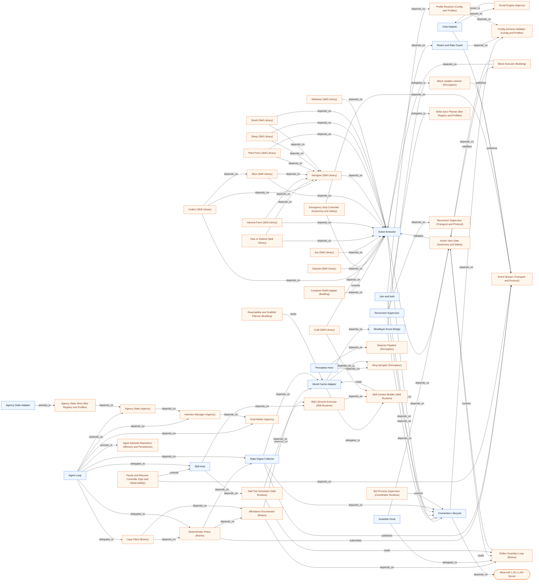
```mermaid
flowchart LR
n54["Connection Lifecycle"]
n125["Join and Auth"]
n55["Mineflayer Event Bridge"]
n56["World Cache Adapter"]
n126["Reach and Rate Guard"]
n57["Action Executor"]
n127["State Digest Collector"]
n58["Guardian Hook"]
n59["Skill Host"]
n128["Perception Host"]
n60["Agent Loop"]
n61["Chat Adapter"]
n129["Agency State Adapter"]
n62["Reconnect Supervisor"]
n63["Action Veto Gate (Autonomy and Safety)"]
n148["Affordance Enumerator (Brains)"]
n160["Config Schema Validator (Config and Profiles)"]
n24(["Minecraft 1.20.1 LAN Server"])
n70["Deterministic Policy (Brains)"]
n178["Block Update Listener (Perception)"]
n69["Reflex Guardian Loop (Brains)"]
n166["Profile Resolver (Config and Profiles)"]
n245["Detector Pipeline (Perception)"]
n238["Ring Sampler (Perception)"]
n191["Delta Sync Planner (Bot Registry and Profiles)"]
n172["Reconnect Supervisor (Transport and Protocol)"]
n84["Skill Lifecycle Executor (Skill Runtime)"]
n85["Skill Tick Scheduler (Skill Runtime)"]
n170["Event Stream (Transport and Protocol)"]
n52["Skill Context Builder (Skill Runtime)"]
n53["Block Executor (Building)"]
n109["Container Refill Adapter (Building)"]
n106["Reachability and Scaffold Planner (Building)"]
n67["Pause and Resume Controller (Ops and Observability)"]
n65["Emergency Stop Controller (Autonomy and Safety)"]
n256["Collect (Skill Library)"]
n252["Craft (Skill Library)"]
n234["Deposit (Skill Library)"]
n258["Eat (Skill Library)"]
n260["Flee or Defend (Skill Library)"]
n201["Harvest Farm (Skill Library)"]
n255["Mine (Skill Library)"]
n253["Navigate (Skill Library)"]
n202["Plant Farm (Skill Library)"]
n259["Sleep (Skill Library)"]
n257["Smelt (Skill Library)"]
n237["Withdraw (Skill Library)"]
n33["Bot Process Supervisor (Coordinator Runtime)"]
n266["Goal Arbiter (Agency)"]
n267["Intention Manager (Agency)"]
n227["Agency State (Agency)"]
n71["Laya Client (Brains)"]
n268["Social Engine (Agency)"]
n224["Agency State Store (Bot Registry and Profiles)"]
n269["Agent Episode Repository (Memory and Persistence)"]
n57 -->|depends_on| n54
n57 -->|depends_on| n126
n57 -->|depends_on| n63
n148 -->|depends_on| n56
n148 -->|depends_on| n69
n54 -->|depends_on| n160
n54 -->|depends_on| n24
n70 -->|depends_on| n148
n70 -->|depends_on| n127
n70 -->|subscribes| n170
n55 -->|depends_on| n54
n55 -->|delegates_to| n178
n58 -->|depends_on| n63
n58 -->|delegates_to| n69
n125 -->|depends_on| n54
n125 -->|depends_on| n166
n128 -->|depends_on| n245
n128 -->|depends_on| n238
n126 -->|depends_on| n160
n62 -->|depends_on| n54
n62 -->|delegates_to| n191
n62 -->|depends_on| n172
n59 -->|depends_on| n84
n59 -->|depends_on| n85
n127 -->|depends_on| n54
n127 -->|depends_on| n56
n127 -->|publishes| n170
n56 -->|depends_on| n55
n56 -->|delegates_to| n238
n56 -->|delegates_to| n52
n53 -->|depends_on| n57
n53 -->|depends_on| n63
n109 -->|depends_on| n57
n106 -->|reads| n56
n166 -->|depends_on| n160
n67 -->|controls| n59
n67 -->|depends_on| n170
n63 -->|validates| n57
n63 -->|validates| n53
n63 -->|reads| n69
n65 -->|controls| n57
n65 -->|depends_on| n170
n69 -->|controls| n63
n52 -->|reads| n56
n84 -->|depends_on| n52
n85 -->|reads| n69
n85 -->|depends_on| n84
n256 -->|depends_on| n57
n256 -->|depends_on| n255
n256 -->|depends_on| n253
n252 -->|depends_on| n57
n252 -->|depends_on| n52
n234 -->|depends_on| n57
n258 -->|depends_on| n57
n260 -->|depends_on| n57
n260 -->|depends_on| n253
n201 -->|depends_on| n57
n201 -->|depends_on| n253
n255 -->|depends_on| n57
n255 -->|depends_on| n253
n253 -->|depends_on| n57
n202 -->|depends_on| n57
n202 -->|depends_on| n253
n259 -->|depends_on| n57
n259 -->|depends_on| n253
n257 -->|depends_on| n57
n257 -->|depends_on| n253
n237 -->|depends_on| n57
n33 -->|controls| n54
n71 -->|depends_on| n148
n71 -->|depends_on| n70
n178 -->|publishes| n170
n60 -->|depends_on| n266
n60 -->|depends_on| n267
n60 -->|depends_on| n227
n60 -->|delegates_to| n71
n60 -->|delegates_to| n70
n60 -->|depends_on| n127
n60 -->|delegates_to| n59
n61 -->|depends_on| n268
n61 -->|publishes| n170
n129 -->|persists_to| n224
n60 -->|persists_to| n269
n267 -->|depends_on| n266
n227 -->|depends_on| n267
n268 -->|proposes_to| n61
n224 -->|depends_on| n227
classDef internal fill:#eef6ff,stroke:#2563eb,color:#0f172a;
classDef external fill:#fff7ed,stroke:#ea580c,color:#7c2d12;
class n54,n125,n55,n56,n126,n57,n127,n58,n59,n128,n60,n61,n129,n62 internal;
class n63,n148,n160,n70,n178,n69,n166,n245,n238,n191,n172,n84,n85,n170,n52,n53,n109,n106,n67,n65,n256,n252,n234,n258,n260,n201,n255,n253,n202,n259,n257,n237,n33,n266,n267,n227,n71,n268,n224,n269,n24 external;
```

### Autonomy and Safety

Source: `docs/architecture/graphs/system-safety.mmd`

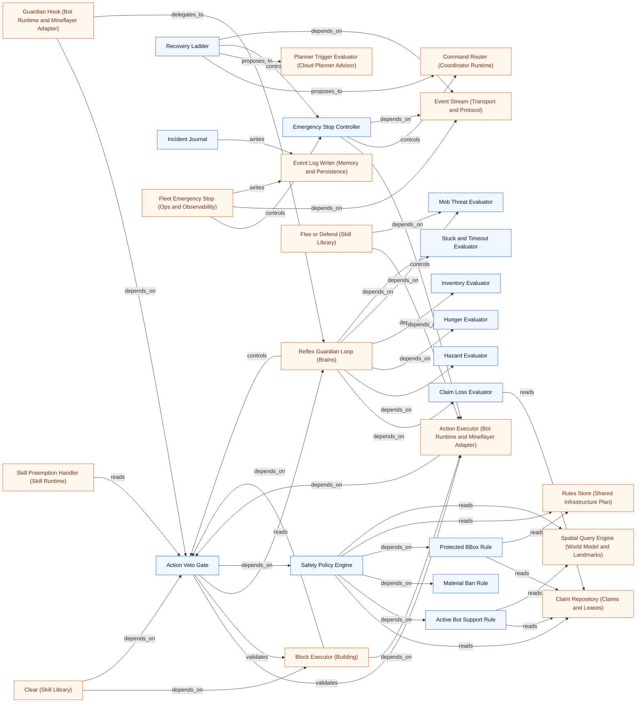
```mermaid
flowchart LR
n130["Hazard Evaluator"]
n131["Mob Threat Evaluator"]
n132["Hunger Evaluator"]
n133["Stuck and Timeout Evaluator"]
n134["Inventory Evaluator"]
n135["Claim Loss Evaluator"]
n136["Protected BBox Rule"]
n137["Active Bot Support Rule"]
n138["Material Ban Rule"]
n139["Safety Policy Engine"]
n63["Action Veto Gate"]
n64["Recovery Ladder"]
n65["Emergency Stop Controller"]
n140["Incident Journal"]
n57["Action Executor (Bot Runtime and Mineflayer Adapter)"]
n58["Guardian Hook (Bot Runtime and Mineflayer Adapter)"]
n53["Block Executor (Building)"]
n68["Fleet Emergency Stop (Ops and Observability)"]
n69["Reflex Guardian Loop (Brains)"]
n215["Claim Repository (Claims and Leases)"]
n197["Spatial Query Engine (World Model and Landmarks)"]
n29["Command Router (Coordinator Runtime)"]
n170["Event Stream (Transport and Protocol)"]
n214["Event Log Writer (Memory and Persistence)"]
n186["Rules Store (Shared Infrastructure Plan)"]
n43["Planner Trigger Evaluator (Cloud Planner Advisor)"]
n90["Skill Preemption Handler (Skill Runtime)"]
n262["Clear (Skill Library)"]
n260["Flee or Defend (Skill Library)"]
n57 -->|depends_on| n63
n58 -->|depends_on| n63
n58 -->|delegates_to| n69
n53 -->|depends_on| n57
n53 -->|depends_on| n63
n68 -->|controls| n65
n68 -->|depends_on| n170
n63 -->|validates| n57
n63 -->|validates| n53
n63 -->|reads| n69
n63 -->|depends_on| n139
n137 -->|reads| n215
n137 -->|reads| n197
n135 -->|reads| n215
n65 -->|controls| n57
n65 -->|controls| n29
n65 -->|depends_on| n170
n69 -->|controls| n63
n69 -->|depends_on| n135
n69 -->|depends_on| n130
n69 -->|depends_on| n132
n69 -->|depends_on| n134
n69 -->|depends_on| n131
n69 -->|depends_on| n133
n140 -->|writes| n214
n136 -->|reads| n215
n136 -->|reads| n186
n64 -->|proposes_to| n29
n64 -->|proposes_to| n43
n64 -->|controls| n65
n64 -->|depends_on| n170
n139 -->|reads| n215
n139 -->|depends_on| n137
n139 -->|depends_on| n138
n139 -->|depends_on| n136
n139 -->|reads| n186
n139 -->|reads| n197
n90 -->|reads| n63
n262 -->|depends_on| n53
n262 -->|depends_on| n63
n260 -->|depends_on| n57
n260 -->|depends_on| n131
n68 -->|writes| n214
classDef internal fill:#eef6ff,stroke:#2563eb,color:#0f172a;
classDef external fill:#fff7ed,stroke:#ea580c,color:#7c2d12;
class n130,n131,n132,n133,n134,n135,n136,n137,n138,n139,n63,n64,n65,n140 internal;
class n57,n58,n53,n68,n69,n215,n197,n29,n170,n214,n186,n43,n90,n262,n260 external;
```

### Memory and Persistence

Source: `docs/architecture/graphs/system-memory.mmd`

```mermaid
flowchart LR
n270["SQLite Runtime"]
n162["Migration Runner"]
n156["Transaction Manager"]
n214["Event Log Writer"]
n265["Block Changelog Writer"]
n158["Retention Pruner"]
n271["Snapshot Export"]
n272["Schema Version Registry"]
n273["Episode Store"]
n269["Agent Episode Repository"]
n213["Bot Profile Store (Bot Registry and Profiles)"]
n110["Rollback Journal (Building)"]
n151["Atomic Claim Acquirer (Claims and Leases)"]
n215["Claim Repository (Claims and Leases)"]
n149["Fencing Token Authority (Claims and Leases)"]
n30["Coordinator Epoch Authority (Coordinator Runtime)"]
n31["Global Scheduler (Coordinator Runtime)"]
n72["Process Bootstrap (Coordinator Runtime)"]
n32["Restart Recovery Orchestrator (Coordinator Runtime)"]
n274["Replay Engine (Testing and Evaluation)"]
n219["Grant Repository (Edit Grants and Collaboration)"]
n147["Audit Viewer (Ops and Observability)"]
n146["Health and Readiness (Ops and Observability)"]
n81["Plan Cache (Cloud Planner Advisor)"]
n140["Incident Journal (Autonomy and Safety)"]
n184["Container Registry (Shared Infrastructure Plan)"]
n183["Farm Store (Shared Infrastructure Plan)"]
n185["Path Graph Store (Shared Infrastructure Plan)"]
n187["SIP Revision Manager (Shared Infrastructure Plan)"]
n182["Road Store (Shared Infrastructure Plan)"]
n186["Rules Store (Shared Infrastructure Plan)"]
n181["Structure Store (Shared Infrastructure Plan)"]
n153["SIP Transactional Committer (Shared Infrastructure Plan)"]
n180["Zone Store (Shared Infrastructure Plan)"]
n87["Skill Checkpoint Manager (Skill Runtime)"]
n154["Atomic Task Claimer (Task Board)"]
n203["Task Repository (Task Board)"]
n210["Task State Machine (Task Board)"]
n275["Trace Exporter (Laya Training)"]
n228["Chunk Version Store (World Model and Landmarks)"]
n232["Landmark Registry (World Model and Landmarks)"]
n67["Pause and Resume Controller (Ops and Observability)"]
n68["Fleet Emergency Stop (Ops and Observability)"]
n60["Agent Loop (Bot Runtime and Mineflayer Adapter)"]
n224["Agency State Store (Bot Registry and Profiles)"]
n142["Agency Status View (Ops and Observability)"]
n213 -->|depends_on| n156
n110 -->|writes| n265
n110 -->|reads| n181
n151 -->|writes| n215
n151 -->|depends_on| n156
n215 -->|depends_on| n156
n149 -->|depends_on| n30
n149 -->|depends_on| n156
n30 -->|controls| n149
n30 -->|depends_on| n156
n31 -->|depends_on| n30
n31 -->|delegates_to| n158
n72 -->|depends_on| n32
n72 -->|depends_on| n162
n32 -->|depends_on| n156
n274 -->|depends_on| n214
n219 -->|depends_on| n156
n265 -->|depends_on| n156
n214 -->|depends_on| n156
n162 -->|depends_on| n270
n158 -->|depends_on| n265
n158 -->|depends_on| n214
n158 -->|depends_on| n156
n272 -->|depends_on| n162
n271 -->|depends_on| n156
n156 -->|depends_on| n270
n147 -->|reads| n265
n147 -->|reads| n214
n146 -->|depends_on| n270
n81 -->|depends_on| n156
n140 -->|writes| n214
n184 -->|depends_on| n156
n183 -->|depends_on| n156
n185 -->|depends_on| n156
n187 -->|depends_on| n156
n187 -->|depends_on| n186
n182 -->|depends_on| n156
n186 -->|depends_on| n156
n181 -->|depends_on| n156
n153 -->|depends_on| n156
n153 -->|writes| n184
n153 -->|writes| n183
n153 -->|writes| n185
n153 -->|depends_on| n187
n153 -->|writes| n182
n153 -->|writes| n186
n153 -->|writes| n181
n153 -->|writes| n180
n180 -->|depends_on| n156
n87 -->|depends_on| n156
n154 -->|depends_on| n156
n154 -->|writes| n203
n203 -->|depends_on| n156
n210 -->|depends_on| n214
n210 -->|writes| n203
n275 -->|reads| n214
n228 -->|depends_on| n156
n232 -->|depends_on| n156
n274 -->|reads| n273
n275 -->|reads| n273
n147 -->|reads| n273
n158 -->|depends_on| n273
n67 -->|writes| n214
n68 -->|writes| n214
n60 -->|persists_to| n269
n224 -->|depends_on| n156
n269 -->|depends_on| n156
n142 -->|reads| n224
n142 -->|reads| n269
classDef internal fill:#eef6ff,stroke:#2563eb,color:#0f172a;
classDef external fill:#fff7ed,stroke:#ea580c,color:#7c2d12;
class n270,n162,n156,n214,n265,n158,n271,n272,n273,n269 internal;
class n213,n110,n151,n215,n149,n30,n31,n72,n32,n274,n219,n147,n146,n81,n140,n184,n183,n185,n187,n182,n186,n181,n153,n180,n87,n154,n203,n210,n275,n228,n232,n67,n68,n60,n224,n142 external;
```

### Ops and Observability

Source: `docs/architecture/graphs/system-ops.mmd`

```mermaid
flowchart LR
n66["Ops API"]
n141["Status Aggregator"]
n142["Agency Status View"]
n67["Pause and Resume Controller"]
n68["Fleet Emergency Stop"]
n143["SIP Dump"]
n144["Metrics Registry"]
n145["Structured Logger"]
n146["Health and Readiness"]
n147["Audit Viewer"]
n217["Contention Metrics (Claims and Leases)"]
n35["Execution Provider Selector (Laya Decision Service)"]
n80["Latency Metrics (Laya Decision Service)"]
n276["Metrics Reporter (Testing and Evaluation)"]
n28(["Fleet Operator"])
n265["Block Changelog Writer (Memory and Persistence)"]
n214["Event Log Writer (Memory and Persistence)"]
n65["Emergency Stop Controller (Autonomy and Safety)"]
n170["Event Stream (Transport and Protocol)"]
n34["Model Loader (Laya Decision Service)"]
n270["SQLite Runtime (Memory and Persistence)"]
n155["Message Schema Registry (Transport and Protocol)"]
n59["Skill Host (Bot Runtime and Mineflayer Adapter)"]
n168["Presence Tracker (Bot Registry and Profiles)"]
n187["SIP Revision Manager (Shared Infrastructure Plan)"]
n215["Claim Repository (Claims and Leases)"]
n203["Task Repository (Task Board)"]
n49["Planner Budget Limiter (Cloud Planner Advisor)"]
n43["Planner Trigger Evaluator (Cloud Planner Advisor)"]
n86["Skill Progress Reporter (Skill Runtime)"]
n273["Episode Store (Memory and Persistence)"]
n224["Agency State Store (Bot Registry and Profiles)"]
n269["Agent Episode Repository (Memory and Persistence)"]
n217 -->|depends_on| n215
n217 -->|observes| n144
n35 -->|controls| n34
n35 -->|observes| n145
n80 -->|observes| n144
n80 -->|writes| n144
n276 -->|observes| n144
n28 -->|controls| n66
n147 -->|reads| n265
n147 -->|reads| n214
n68 -->|controls| n65
n68 -->|depends_on| n170
n146 -->|depends_on| n34
n146 -->|depends_on| n270
n146 -->|depends_on| n141
n66 -->|depends_on| n68
n66 -->|depends_on| n67
n66 -->|depends_on| n141
n66 -->|depends_on| n155
n67 -->|controls| n59
n67 -->|depends_on| n168
n67 -->|depends_on| n170
n143 -->|depends_on| n187
n141 -->|depends_on| n168
n141 -->|reads| n215
n141 -->|observes| n144
n141 -->|reads| n187
n141 -->|reads| n203
n49 -->|observes| n144
n43 -->|observes| n144
n43 -->|reads| n187
n65 -->|depends_on| n170
n86 -->|observes| n144
n86 -->|publishes| n170
n147 -->|reads| n273
n67 -->|writes| n214
n68 -->|writes| n214
n142 -->|reads| n224
n142 -->|reads| n269
n66 -->|depends_on| n142
classDef internal fill:#eef6ff,stroke:#2563eb,color:#0f172a;
classDef external fill:#fff7ed,stroke:#ea580c,color:#7c2d12;
class n66,n141,n142,n67,n68,n143,n144,n145,n146,n147 internal;
class n217,n35,n80,n276,n265,n214,n65,n170,n34,n270,n155,n59,n168,n187,n215,n203,n49,n43,n86,n273,n224,n269,n28 external;
```

### Config and Profiles

Source: `docs/architecture/graphs/system-config.mmd`

```mermaid
flowchart LR
n161["Environment Parser"]
n160["Config Schema Validator"]
n166["Profile Resolver"]
n248["Hardware Probe"]
n176["Secrets Loader"]
n226["Name Pool Validator"]
n249["Laya Runtime Resolver"]
n277["Fail Fast Handler"]
n54["Connection Lifecycle (Bot Runtime and Mineflayer Adapter)"]
n125["Join and Auth (Bot Runtime and Mineflayer Adapter)"]
n126["Reach and Rate Guard (Bot Runtime and Mineflayer Adapter)"]
n167["Bot Identity Authenticator (Bot Registry and Profiles)"]
n225["Name Pool Allocator (Bot Registry and Profiles)"]
n27(["Host Hardware"])
n72["Process Bootstrap (Coordinator Runtime)"]
n73["Service Composition (Coordinator Runtime)"]
n39["Confidence Calibrator (Laya Decision Service)"]
n35["Execution Provider Selector (Laya Decision Service)"]
n34["Model Loader (Laya Decision Service)"]
n77["Decision Rate Limiter (Laya Decision Service)"]
n246["Perception Rate Limiter (Perception)"]
n41["OpenAI-Compatible Client (Cloud Planner Advisor)"]
n173["Transport Authentication (Transport and Protocol)"]
n54 -->|depends_on| n160
n125 -->|depends_on| n54
n125 -->|depends_on| n166
n126 -->|depends_on| n160
n167 -->|depends_on| n176
n225 -->|depends_on| n226
n160 -->|depends_on| n161
n277 -->|depends_on| n160
n248 -->|depends_on| n166
n248 -->|depends_on| n27
n249 -->|depends_on| n248
n249 -->|depends_on| n166
n226 -->|depends_on| n160
n166 -->|depends_on| n160
n176 -->|depends_on| n161
n72 -->|depends_on| n160
n72 -->|depends_on| n161
n72 -->|depends_on| n73
n73 -->|depends_on| n166
n39 -->|depends_on| n160
n35 -->|depends_on| n248
n35 -->|controls| n34
n34 -->|depends_on| n249
n77 -->|depends_on| n166
n246 -->|depends_on| n166
n41 -->|depends_on| n160
n41 -->|depends_on| n176
n173 -->|depends_on| n167
n173 -->|depends_on| n176
classDef internal fill:#eef6ff,stroke:#2563eb,color:#0f172a;
classDef external fill:#fff7ed,stroke:#ea580c,color:#7c2d12;
class n161,n160,n166,n248,n176,n226,n249,n277 internal;
class n54,n125,n126,n167,n225,n72,n73,n39,n35,n34,n77,n246,n41,n173,n27 external;
```

### Testing and Evaluation

Source: `docs/architecture/graphs/system-eval.mmd`

```mermaid
flowchart LR
n278["Unit Fixtures"]
n247["Detector Fixtures"]
n279["Docker Server Harness"]
n280["Scenario Runner"]
n274["Replay Engine"]
n212["Contention Harness"]
n276["Metrics Reporter"]
n281["Soak Runner"]
n282["Architecture Guard Tests"]
n250["Laya Benchmark Harness"]
n215["Claim Repository (Claims and Leases)"]
n203["Task Repository (Task Board)"]
n245["Detector Pipeline (Perception)"]
n24(["Minecraft 1.20.1 LAN Server"])
n80["Latency Metrics (Laya Decision Service)"]
n34["Model Loader (Laya Decision Service)"]
n144["Metrics Registry (Ops and Observability)"]
n214["Event Log Writer (Memory and Persistence)"]
n283["Promotion Gate (Laya Training)"]
n273["Episode Store (Memory and Persistence)"]
n80 -->|observes| n144
n80 -->|writes| n144
n282 -->|depends_on| n278
n212 -->|depends_on| n215
n212 -->|delegates_to| n280
n212 -->|depends_on| n203
n247 -->|depends_on| n278
n247 -->|depends_on| n245
n279 -->|depends_on| n278
n279 -->|depends_on| n24
n250 -->|depends_on| n80
n250 -->|depends_on| n34
n250 -->|delegates_to| n280
n276 -->|observes| n144
n274 -->|depends_on| n280
n274 -->|depends_on| n214
n280 -->|controls| n279
n280 -->|publishes| n276
n281 -->|depends_on| n276
n281 -->|delegates_to| n280
n283 -->|depends_on| n250
n274 -->|reads| n273
classDef internal fill:#eef6ff,stroke:#2563eb,color:#0f172a;
classDef external fill:#fff7ed,stroke:#ea580c,color:#7c2d12;
class n278,n247,n279,n280,n274,n212,n276,n281,n282,n250 internal;
class n215,n203,n245,n80,n34,n144,n214,n283,n273,n24 external;
```

### Laya Training

Source: `docs/architecture/graphs/system-training.mmd`

```mermaid
flowchart LR
n275["Trace Exporter"]
n284["Labeling Pipeline"]
n285["Reward Computer"]
n286["Fine-tune Runner"]
n287["ONNX Exporter"]
n251["Calibration Fitter"]
n283["Promotion Gate"]
n39["Confidence Calibrator (Laya Decision Service)"]
n250["Laya Benchmark Harness (Testing and Evaluation)"]
n214["Event Log Writer (Memory and Persistence)"]
n273["Episode Store (Memory and Persistence)"]
n251 -->|reads| n39
n251 -->|depends_on| n275
n286 -->|depends_on| n284
n286 -->|depends_on| n285
n284 -->|depends_on| n275
n287 -->|depends_on| n286
n283 -->|depends_on| n250
n283 -->|depends_on| n251
n283 -->|depends_on| n287
n285 -->|depends_on| n275
n275 -->|reads| n214
n275 -->|reads| n273
classDef internal fill:#eef6ff,stroke:#2563eb,color:#0f172a;
classDef external fill:#fff7ed,stroke:#ea580c,color:#7c2d12;
class n275,n284,n285,n286,n287,n251,n283 internal;
class n39,n250,n214,n273 external;
```

### Brains

Source: `docs/architecture/graphs/system-brains.mmd`

```mermaid
flowchart LR
n69["Reflex Guardian Loop"]
n148["Affordance Enumerator"]
n70["Deterministic Policy"]
n71["Laya Client"]
n56["World Cache Adapter (Bot Runtime and Mineflayer Adapter)"]
n83["Skill Registry (Skill Runtime)"]
n127["State Digest Collector (Bot Runtime and Mineflayer Adapter)"]
n222["Behavior Profile Manager (Bot Registry and Profiles)"]
n170["Event Stream (Transport and Protocol)"]
n58["Guardian Hook (Bot Runtime and Mineflayer Adapter)"]
n39["Confidence Calibrator (Laya Decision Service)"]
n63["Action Veto Gate (Autonomy and Safety)"]
n135["Claim Loss Evaluator (Autonomy and Safety)"]
n130["Hazard Evaluator (Autonomy and Safety)"]
n132["Hunger Evaluator (Autonomy and Safety)"]
n134["Inventory Evaluator (Autonomy and Safety)"]
n131["Mob Threat Evaluator (Autonomy and Safety)"]
n133["Stuck and Timeout Evaluator (Autonomy and Safety)"]
n85["Skill Tick Scheduler (Skill Runtime)"]
n163["WebSocket Codec (Transport and Protocol)"]
n60["Agent Loop (Bot Runtime and Mineflayer Adapter)"]
n148 -->|depends_on| n56
n148 -->|depends_on| n69
n148 -->|depends_on| n83
n70 -->|depends_on| n148
n70 -->|depends_on| n127
n70 -->|reads| n222
n70 -->|subscribes| n170
n58 -->|depends_on| n63
n58 -->|delegates_to| n69
n127 -->|depends_on| n56
n127 -->|publishes| n170
n39 -->|proposes_to| n70
n63 -->|reads| n69
n69 -->|controls| n63
n69 -->|depends_on| n135
n69 -->|depends_on| n130
n69 -->|depends_on| n132
n69 -->|depends_on| n134
n69 -->|depends_on| n131
n69 -->|depends_on| n133
n85 -->|reads| n69
n170 -->|depends_on| n163
n71 -->|depends_on| n148
n71 -->|depends_on| n163
n71 -->|depends_on| n70
n60 -->|delegates_to| n71
n60 -->|delegates_to| n70
n60 -->|depends_on| n127
classDef internal fill:#eef6ff,stroke:#2563eb,color:#0f172a;
classDef external fill:#fff7ed,stroke:#ea580c,color:#7c2d12;
class n69,n148,n70,n71 internal;
class n56,n83,n127,n222,n170,n58,n39,n63,n135,n130,n132,n134,n131,n133,n85,n163,n60 external;
```

### Agency

Source: `docs/architecture/graphs/system-agency.mmd`

```mermaid
flowchart LR
n288["Personality Model"]
n289["Needs Model"]
n290["Goal Catalog"]
n291["Goal Generator"]
n266["Goal Arbiter"]
n267["Intention Manager"]
n292["Routine Model"]
n268["Social Engine"]
n227["Agency State"]
n60["Agent Loop (Bot Runtime and Mineflayer Adapter)"]
n61["Chat Adapter (Bot Runtime and Mineflayer Adapter)"]
n224["Agency State Store (Bot Registry and Profiles)"]
n60 -->|depends_on| n266
n60 -->|depends_on| n267
n60 -->|depends_on| n227
n61 -->|depends_on| n268
n291 -->|depends_on| n290
n291 -->|depends_on| n289
n291 -->|depends_on| n288
n266 -->|depends_on| n291
n266 -->|depends_on| n289
n266 -->|depends_on| n288
n267 -->|depends_on| n266
n268 -->|depends_on| n288
n227 -->|depends_on| n289
n227 -->|depends_on| n288
n227 -->|depends_on| n267
n227 -->|depends_on| n292
n268 -->|proposes_to| n61
n224 -->|depends_on| n227
classDef internal fill:#eef6ff,stroke:#2563eb,color:#0f172a;
classDef external fill:#fff7ed,stroke:#ea580c,color:#7c2d12;
class n288,n289,n290,n291,n266,n267,n292,n268,n227 internal;
class n60,n61,n224 external;
```

### Bootstrap and Toolchain

Source: `docs/architecture/graphs/system-toolchain.mmd`

```mermaid
flowchart LR
n293["Bootstrap Orchestrator"]
n294["Capability Check"]
n295["Python Environment"]
n296["Minecraft Server Controller"]
n297["Firefox SVG Renderer"]
n293 -->|depends_on| n294
n293 -->|depends_on| n295
n293 -->|depends_on| n296
n293 -->|depends_on| n297
classDef internal fill:#eef6ff,stroke:#2563eb,color:#0f172a;
classDef external fill:#fff7ed,stroke:#ea580c,color:#7c2d12;
class n293,n294,n295,n296,n297 internal;
```
