# TiCrafter Architecture Graphs

> Generated from `docs/architecture/graph.json`. Edit the graph, then run `node tools/architecture/render-graphs.mjs`.

Mermaid source lives in `docs/architecture/graphs/`. GitHub renders these fenced blocks directly. For local SVG rendering, use a Mermaid CLI such as `npx @mermaid-js/mermaid-cli`.

## Fleet overview

Systems and externals with aggregated relation counts.

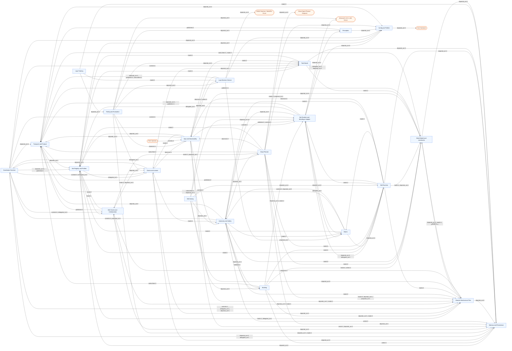
```mermaid
flowchart LR
n0["Coordinator Runtime"]
n1["Transport and Protocol"]
n2["Shared Infrastructure Plan"]
n3["Task Board"]
n4["Claims and Leases"]
n5["Edit Grants and Collaboration"]
n6["Bot Registry and Profiles"]
n7["World Model and Landmarks"]
n8["Perception"]
n9["Laya Decision Service"]
n10["Cloud Planner"]
n11["Skill Runtime"]
n12["Skill Library"]
n13["Building"]
n14["Bot Runtime and Mineflayer Adapter"]
n15["Autonomy and Safety"]
n16["Memory and Persistence"]
n17["Ops and Observability"]
n18["Config and Profiles"]
n19["Testing and Evaluation"]
n20["Laya Training"]
n21["Brains"]
n22(["Minecraft 1.20.1 LAN Server"])
n23(["Muse Spark Planner Endpoint"])
n24(["ONNX Runtime / WebGPU Driver"])
n25(["Host Hardware"])
n26(["Fleet Operator"])
n14 -->|depends_on×2| n15
n21 -->|depends_on×2| n14
n21 -->|depends_on×1| n11
n14 -->|depends_on×3| n18
n14 -->|depends_on×1| n22
n21 -->|reads×1| n6
n21 -->|subscribes×1, depends_on×1| n1
n14 -->|delegates_to×2, depends_on×2| n8
n14 -->|delegates_to×1| n21
n14 -->|delegates_to×1| n6
n14 -->|depends_on×1, publishes×1| n1
n14 -->|depends_on×2, delegates_to×1| n11
n6 -->|reads×1| n5
n6 -->|reads×1, delegates_to×1| n2
n6 -->|reads×1| n3
n6 -->|depends_on×2| n18
n6 -->|depends_on×1| n16
n6 -->|delegates_to×1| n4
n6 -->|reads×1| n11
n13 -->|depends_on×2, reads×1| n14
n13 -->|depends_on×1| n15
n13 -->|reads×4, writes×1| n7
n13 -->|depends_on×1, reads×2| n2
n13 -->|reads×1| n11
n13 -->|writes×1| n16
n13 -->|subscribes×1| n1
n4 -->|depends_on×3| n16
n4 -->|depends_on×2| n3
n4 -->|observes×1| n17
n4 -->|depends_on×1| n0
n4 -->|depends_on×1| n2
n18 -->|depends_on×1| n25
n0 -->|depends_on×4| n1
n0 -->|controls×2, delegates_to×2| n4
n0 -->|controls×1, delegates_to×1| n5
n0 -->|controls×1, delegates_to×1, depends_on×1| n2
n0 -->|controls×1| n3
n0 -->|depends_on×3, delegates_to×1| n16
n0 -->|delegates_to×1| n10
n0 -->|depends_on×3| n18
n0 -->|depends_on×2, publishes×1| n6
n9 -->|proposes_to×1| n21
n9 -->|depends_on×4| n18
n9 -->|depends_on×1, publishes×1, subscribes×1| n1
n9 -->|observes×2, writes×1| n17
n9 -->|depends_on×1| n24
n19 -->|depends_on×1| n4
n19 -->|depends_on×1| n3
n19 -->|depends_on×1| n8
n19 -->|depends_on×1| n22
n19 -->|depends_on×2| n9
n19 -->|observes×1| n17
n19 -->|depends_on×1, reads×1| n16
n26 -->|controls×1| n17
n5 -->|publishes×1| n1
n5 -->|reads×1, depends_on×1| n4
n5 -->|depends_on×3, reads×1| n2
n5 -->|depends_on×1| n16
n5 -->|reads×2| n6
n17 -->|reads×3, depends_on×1| n16
n17 -->|controls×1| n15
n17 -->|depends_on×3| n1
n17 -->|depends_on×1| n9
n17 -->|controls×1| n14
n17 -->|depends_on×2| n6
n17 -->|depends_on×1, reads×1| n2
n17 -->|reads×1| n4
n17 -->|reads×1| n3
n8 -->|publishes×1| n1
n8 -->|depends_on×1| n18
n10 -->|reads×1, proposes_to×1| n5
n10 -->|subscribes×1| n1
n10 -->|observes×2| n17
n10 -->|reads×1| n6
n10 -->|reads×4, depends_on×1, proposes_to×1| n2
n10 -->|reads×2, proposes_to×1| n3
n10 -->|reads×2| n7
n10 -->|depends_on×2| n18
n10 -->|depends_on×1| n23
n10 -->|depends_on×1| n16
n10 -->|reads×1| n11
n15 -->|validates×1, controls×1| n14
n15 -->|validates×1| n13
n15 -->|reads×1| n21
n15 -->|reads×4| n4
n15 -->|reads×2| n7
n15 -->|controls×1, proposes_to×1| n0
n15 -->|depends_on×2| n1
n21 -->|controls×1, depends_on×6| n15
n15 -->|writes×1| n16
n15 -->|reads×2| n2
n15 -->|proposes_to×1| n10
n2 -->|depends_on×9| n16
n2 -->|depends_on×2, reads×1, publishes×1| n7
n2 -->|publishes×1| n5
n11 -->|depends_on×1| n16
n11 -->|reads×1| n14
n11 -->|reads×1| n2
n11 -->|reads×1, depends_on×1| n7
n11 -->|publishes×2| n1
n11 -->|reads×1| n15
n11 -->|observes×1| n17
n11 -->|reads×1| n21
n12 -->|depends_on×8| n13
n12 -->|depends_on×2| n15
n12 -->|depends_on×12| n14
n12 -->|depends_on×4| n11
n12 -->|depends_on×4| n7
n12 -->|depends_on×3| n2
n3 -->|depends_on×3| n16
n3 -->|reads×1| n7
n3 -->|reads×1| n6
n20 -->|reads×1| n9
n20 -->|depends_on×1| n19
n20 -->|reads×2| n16
n1 -->|depends_on×1| n6
n1 -->|depends_on×1| n18
n1 -->|publishes×1| n7
n7 -->|depends_on×2| n16
n7 -->|reads×2| n2
n7 -->|subscribes×1, reads×1| n1
n0 -->|controls×1| n14
classDef system fill:#eef6ff,stroke:#2563eb,color:#0f172a;
classDef external fill:#fff7ed,stroke:#ea580c,color:#7c2d12;
class n0,n1,n2,n3,n4,n5,n6,n7,n8,n9,n10,n11,n12,n13,n14,n15,n16,n17,n18,n19,n20,n21 system;
class n22,n23,n24,n25,n26 external;
```

## Cross-system dependencies

System-to-system view with relation types.

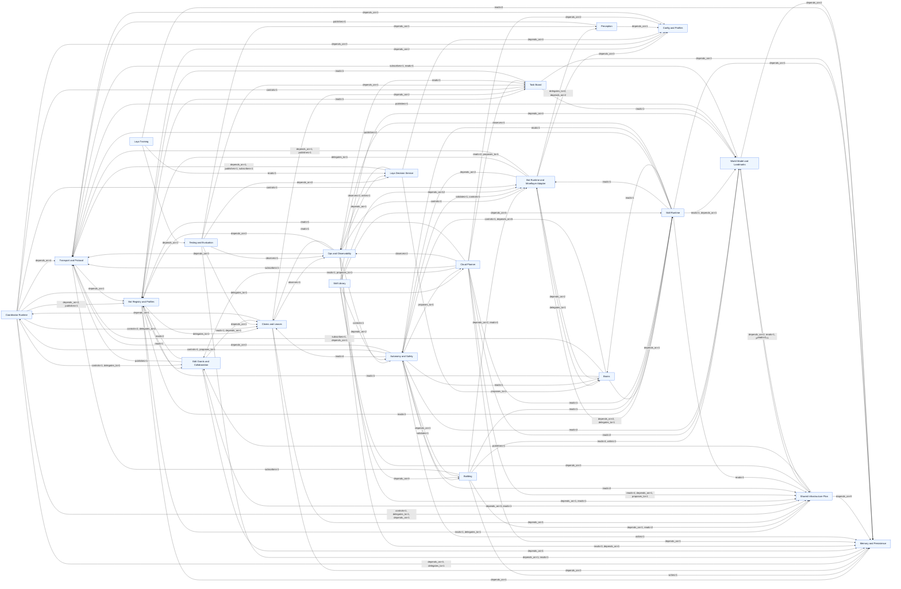
```mermaid
flowchart LR
n0["Coordinator Runtime"]
n1["Transport and Protocol"]
n2["Shared Infrastructure Plan"]
n3["Task Board"]
n4["Claims and Leases"]
n5["Edit Grants and Collaboration"]
n6["Bot Registry and Profiles"]
n7["World Model and Landmarks"]
n8["Perception"]
n9["Laya Decision Service"]
n10["Cloud Planner"]
n11["Skill Runtime"]
n12["Skill Library"]
n13["Building"]
n14["Bot Runtime and Mineflayer Adapter"]
n15["Autonomy and Safety"]
n16["Memory and Persistence"]
n17["Ops and Observability"]
n18["Config and Profiles"]
n19["Testing and Evaluation"]
n20["Laya Training"]
n21["Brains"]
n14 -->|depends_on×2| n15
n21 -->|depends_on×2| n14
n21 -->|depends_on×1| n11
n14 -->|depends_on×3| n18
n21 -->|reads×1| n6
n21 -->|subscribes×1, depends_on×1| n1
n14 -->|delegates_to×2, depends_on×2| n8
n14 -->|delegates_to×1| n21
n14 -->|delegates_to×1| n6
n14 -->|depends_on×1, publishes×1| n1
n14 -->|depends_on×2, delegates_to×1| n11
n6 -->|reads×1| n5
n6 -->|reads×1, delegates_to×1| n2
n6 -->|reads×1| n3
n6 -->|depends_on×2| n18
n6 -->|depends_on×1| n16
n6 -->|delegates_to×1| n4
n6 -->|reads×1| n11
n13 -->|depends_on×2, reads×1| n14
n13 -->|depends_on×1| n15
n13 -->|reads×4, writes×1| n7
n13 -->|depends_on×1, reads×2| n2
n13 -->|reads×1| n11
n13 -->|writes×1| n16
n13 -->|subscribes×1| n1
n4 -->|depends_on×3| n16
n4 -->|depends_on×2| n3
n4 -->|observes×1| n17
n4 -->|depends_on×1| n0
n4 -->|depends_on×1| n2
n0 -->|depends_on×4| n1
n0 -->|controls×2, delegates_to×2| n4
n0 -->|controls×1, delegates_to×1| n5
n0 -->|controls×1, delegates_to×1, depends_on×1| n2
n0 -->|controls×1| n3
n0 -->|depends_on×3, delegates_to×1| n16
n0 -->|delegates_to×1| n10
n0 -->|depends_on×3| n18
n0 -->|depends_on×2, publishes×1| n6
n9 -->|proposes_to×1| n21
n9 -->|depends_on×4| n18
n9 -->|depends_on×1, publishes×1, subscribes×1| n1
n9 -->|observes×2, writes×1| n17
n19 -->|depends_on×1| n4
n19 -->|depends_on×1| n3
n19 -->|depends_on×1| n8
n19 -->|depends_on×2| n9
n19 -->|observes×1| n17
n19 -->|depends_on×1, reads×1| n16
n5 -->|publishes×1| n1
n5 -->|reads×1, depends_on×1| n4
n5 -->|depends_on×3, reads×1| n2
n5 -->|depends_on×1| n16
n5 -->|reads×2| n6
n17 -->|reads×3, depends_on×1| n16
n17 -->|controls×1| n15
n17 -->|depends_on×3| n1
n17 -->|depends_on×1| n9
n17 -->|controls×1| n14
n17 -->|depends_on×2| n6
n17 -->|depends_on×1, reads×1| n2
n17 -->|reads×1| n4
n17 -->|reads×1| n3
n8 -->|publishes×1| n1
n8 -->|depends_on×1| n18
n10 -->|reads×1, proposes_to×1| n5
n10 -->|subscribes×1| n1
n10 -->|observes×2| n17
n10 -->|reads×1| n6
n10 -->|reads×4, depends_on×1, proposes_to×1| n2
n10 -->|reads×2, proposes_to×1| n3
n10 -->|reads×2| n7
n10 -->|depends_on×2| n18
n10 -->|depends_on×1| n16
n10 -->|reads×1| n11
n15 -->|validates×1, controls×1| n14
n15 -->|validates×1| n13
n15 -->|reads×1| n21
n15 -->|reads×4| n4
n15 -->|reads×2| n7
n15 -->|controls×1, proposes_to×1| n0
n15 -->|depends_on×2| n1
n21 -->|controls×1, depends_on×6| n15
n15 -->|writes×1| n16
n15 -->|reads×2| n2
n15 -->|proposes_to×1| n10
n2 -->|depends_on×9| n16
n2 -->|depends_on×2, reads×1, publishes×1| n7
n2 -->|publishes×1| n5
n11 -->|depends_on×1| n16
n11 -->|reads×1| n14
n11 -->|reads×1| n2
n11 -->|reads×1, depends_on×1| n7
n11 -->|publishes×2| n1
n11 -->|reads×1| n15
n11 -->|observes×1| n17
n11 -->|reads×1| n21
n12 -->|depends_on×8| n13
n12 -->|depends_on×2| n15
n12 -->|depends_on×12| n14
n12 -->|depends_on×4| n11
n12 -->|depends_on×4| n7
n12 -->|depends_on×3| n2
n3 -->|depends_on×3| n16
n3 -->|reads×1| n7
n3 -->|reads×1| n6
n20 -->|reads×1| n9
n20 -->|depends_on×1| n19
n20 -->|reads×2| n16
n1 -->|depends_on×1| n6
n1 -->|depends_on×1| n18
n1 -->|publishes×1| n7
n7 -->|depends_on×2| n16
n7 -->|reads×2| n2
n7 -->|subscribes×1, reads×1| n1
n0 -->|controls×1| n14
classDef system fill:#eef6ff,stroke:#2563eb,color:#0f172a;
class n0,n1,n2,n3,n4,n5,n6,n7,n8,n9,n10,n11,n12,n13,n14,n15,n16,n17,n18,n19,n20,n21 system;
```

## Safety and control authority

Guardian veto, grant/claim control, ops stop path, and planner proposal path.

```mermaid
flowchart TD
n0["Coordinator Runtime"]
n9["Laya Decision Service"]
n10["Cloud Planner"]
n11["Skill Runtime"]
n13["Building"]
n14["Bot Runtime and Mineflayer Adapter"]
n15["Autonomy and Safety"]
n17["Ops and Observability"]
n21["Brains"]
n26(["Fleet Operator"])
n14 -->|delegates_to| n21
n14 -->|delegates_to| n11
n0 -->|delegates_to| n10
n9 -->|proposes_to| n21
n17 -->|controls| n15
n17 -->|controls| n14
n15 -->|validates| n14
n15 -->|validates| n13
n15 -->|controls| n14
n15 -->|controls| n0
n21 -->|controls| n15
n15 -->|proposes_to| n0
n15 -->|proposes_to| n10
n0 -->|controls| n14
n27["Command Router"]
n28["Coordinator Epoch Authority"]
n29["Global Scheduler"]
n30["Restart Recovery Orchestrator"]
n31["Bot Process Supervisor"]
n32["Model Loader"]
n33["Execution Provider Selector"]
n34["Batch Runner"]
n35["Single In-flight Guard"]
n36["Output Parser"]
n37["Confidence Calibrator"]
n38["Timeout and Fallback Handler"]
n39["OpenAI-Compatible Client"]
n40["Planner Context Builder"]
n41["Planner Trigger Evaluator"]
n42["Planner Schema Validator"]
n43["Planner Semantic Validator"]
n44["Planner Repair Loop"]
n45["SIP Mutation Translator"]
n46["Task DAG Translator"]
n47["Planner Budget Limiter"]
n48["Planner Arbitration Handler"]
n49["Keep Last Good Fallback"]
n50["Skill Context Builder"]
n51["Block Executor"]
n52["Connection Lifecycle"]
n53["Mineflayer Event Bridge"]
n54["World Cache Adapter"]
n55["Action Executor"]
n56["Guardian Hook"]
n57["Skill Host"]
n58["Reconnect Supervisor"]
n59["Action Veto Gate"]
n60["Recovery Ladder"]
n61["Emergency Stop Controller"]
n62["Ops API"]
n63["Pause and Resume Controller"]
n64["Fleet Emergency Stop"]
n65["Reflex Guardian Loop"]
n66["Deterministic Policy"]
n56 -->|delegates_to| n65
n54 -->|delegates_to| n50
n29 -->|delegates_to| n41
n37 -->|proposes_to| n66
n33 -->|controls| n32
n35 -->|controls| n34
n38 -->|controls| n36
n64 -->|controls| n61
n63 -->|controls| n57
n47 -->|controls| n39
n39 -->|delegates_to| n48
n44 -->|controls| n49
n42 -->|controls| n44
n43 -->|controls| n44
n41 -->|delegates_to| n40
n59 -->|validates| n55
n59 -->|validates| n51
n61 -->|controls| n55
n61 -->|controls| n27
n65 -->|controls| n59
n60 -->|proposes_to| n27
n60 -->|proposes_to| n41
n60 -->|controls| n61
n31 -->|controls| n52
classDef system fill:#eef6ff,stroke:#2563eb,color:#0f172a;
classDef component fill:#f8fafc,stroke:#64748b,color:#0f172a;
classDef external fill:#fff7ed,stroke:#ea580c,color:#7c2d12;
class n0,n9,n10,n11,n13,n14,n15,n17,n21 system;
class n27,n28,n29,n30,n31,n32,n33,n34,n35,n36,n37,n38,n39,n40,n41,n42,n43,n44,n45,n46,n47,n48,n49,n50,n51,n52,n53,n54,n55,n56,n57,n58,n59,n60,n61,n62,n63,n64,n65,n66 component;
class n26 external;
```

## Data flow

Perception, world model, SIP, decisions, skills, building, and persistence.

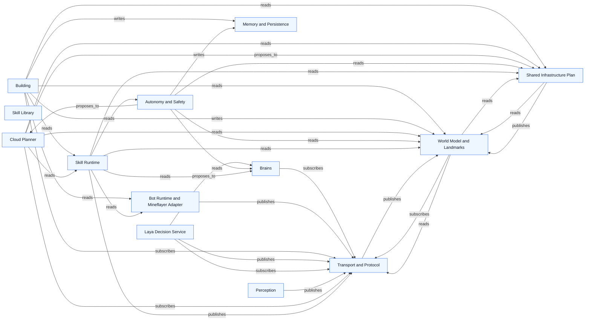
```mermaid
flowchart LR
n1["Transport and Protocol"]
n2["Shared Infrastructure Plan"]
n7["World Model and Landmarks"]
n8["Perception"]
n9["Laya Decision Service"]
n10["Cloud Planner"]
n11["Skill Runtime"]
n12["Skill Library"]
n13["Building"]
n14["Bot Runtime and Mineflayer Adapter"]
n15["Autonomy and Safety"]
n16["Memory and Persistence"]
n21["Brains"]
n21 -->|subscribes| n1
n14 -->|publishes| n1
n13 -->|reads| n7
n13 -->|writes| n7
n13 -->|reads| n11
n13 -->|reads| n14
n13 -->|writes| n16
n13 -->|reads| n2
n13 -->|subscribes| n1
n9 -->|proposes_to| n21
n9 -->|publishes| n1
n9 -->|subscribes| n1
n8 -->|publishes| n1
n10 -->|subscribes| n1
n10 -->|reads| n2
n10 -->|reads| n7
n10 -->|reads| n11
n10 -->|proposes_to| n2
n15 -->|reads| n21
n15 -->|reads| n7
n15 -->|writes| n16
n15 -->|reads| n2
n15 -->|proposes_to| n10
n2 -->|reads| n7
n2 -->|publishes| n7
n11 -->|reads| n14
n11 -->|reads| n2
n11 -->|reads| n7
n11 -->|publishes| n1
n11 -->|reads| n15
n11 -->|reads| n21
n1 -->|publishes| n7
n7 -->|reads| n2
n7 -->|subscribes| n1
n7 -->|reads| n1
classDef system fill:#eef6ff,stroke:#2563eb,color:#0f172a;
class n1,n2,n7,n8,n9,n10,n11,n12,n13,n14,n15,n16,n21 system;
```

## Per-system graphs

### Coordinator Runtime

Source: `docs/architecture/graphs/system-core.mmd`

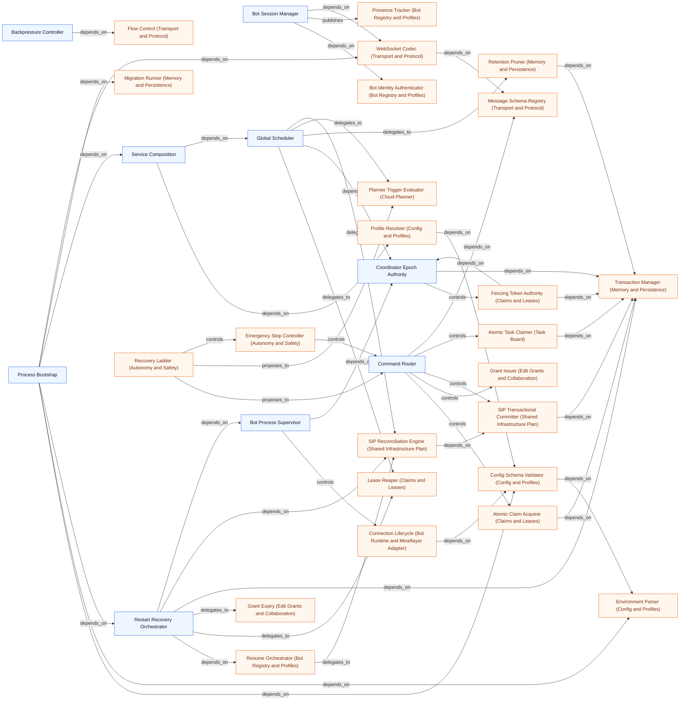
```mermaid
flowchart LR
n67["Process Bootstrap"]
n68["Service Composition"]
n69["Bot Session Manager"]
n27["Command Router"]
n28["Coordinator Epoch Authority"]
n29["Global Scheduler"]
n30["Restart Recovery Orchestrator"]
n70["Backpressure Controller"]
n31["Bot Process Supervisor"]
n129["Fencing Token Authority (Claims and Leases)"]
n130["Flow Control (Transport and Protocol)"]
n131["Atomic Claim Acquirer (Claims and Leases)"]
n132["Grant Issuer (Edit Grants and Collaboration)"]
n133["SIP Transactional Committer (Shared Infrastructure Plan)"]
n134["Atomic Task Claimer (Task Board)"]
n135["Message Schema Registry (Transport and Protocol)"]
n136["Transaction Manager (Memory and Persistence)"]
n137["Lease Reaper (Claims and Leases)"]
n138["Retention Pruner (Memory and Persistence)"]
n41["Planner Trigger Evaluator (Cloud Planner)"]
n139["SIP Reconciliation Engine (Shared Infrastructure Plan)"]
n140["Config Schema Validator (Config and Profiles)"]
n141["Environment Parser (Config and Profiles)"]
n142["Migration Runner (Memory and Persistence)"]
n143["WebSocket Codec (Transport and Protocol)"]
n144["Resume Orchestrator (Bot Registry and Profiles)"]
n145["Grant Expiry (Edit Grants and Collaboration)"]
n146["Profile Resolver (Config and Profiles)"]
n147["Bot Identity Authenticator (Bot Registry and Profiles)"]
n148["Presence Tracker (Bot Registry and Profiles)"]
n61["Emergency Stop Controller (Autonomy and Safety)"]
n60["Recovery Ladder (Autonomy and Safety)"]
n52["Connection Lifecycle (Bot Runtime and Mineflayer Adapter)"]
n52 -->|depends_on| n140
n144 -->|delegates_to| n139
n131 -->|depends_on| n136
n129 -->|depends_on| n28
n129 -->|depends_on| n136
n140 -->|depends_on| n141
n146 -->|depends_on| n140
n70 -->|depends_on| n130
n27 -->|controls| n131
n27 -->|controls| n132
n27 -->|controls| n133
n27 -->|controls| n134
n27 -->|depends_on| n135
n28 -->|controls| n129
n28 -->|depends_on| n136
n29 -->|delegates_to| n137
n29 -->|depends_on| n28
n29 -->|delegates_to| n138
n29 -->|delegates_to| n41
n29 -->|delegates_to| n139
n67 -->|depends_on| n140
n67 -->|depends_on| n141
n67 -->|depends_on| n30
n67 -->|depends_on| n68
n67 -->|depends_on| n142
n67 -->|depends_on| n143
n30 -->|depends_on| n144
n30 -->|delegates_to| n137
n30 -->|delegates_to| n145
n30 -->|depends_on| n136
n30 -->|depends_on| n139
n68 -->|depends_on| n146
n68 -->|depends_on| n29
n69 -->|depends_on| n147
n69 -->|publishes| n148
n69 -->|depends_on| n143
n138 -->|depends_on| n136
n61 -->|controls| n27
n60 -->|proposes_to| n27
n60 -->|proposes_to| n41
n60 -->|controls| n61
n139 -->|depends_on| n133
n133 -->|depends_on| n136
n134 -->|depends_on| n136
n143 -->|depends_on| n135
n31 -->|controls| n52
n31 -->|depends_on| n28
n30 -->|depends_on| n31
classDef internal fill:#eef6ff,stroke:#2563eb,color:#0f172a;
classDef external fill:#fff7ed,stroke:#ea580c,color:#7c2d12;
class n67,n68,n69,n27,n28,n29,n30,n70,n31 internal;
class n129,n130,n131,n132,n133,n134,n135,n136,n137,n138,n41,n139,n140,n141,n142,n143,n144,n145,n146,n147,n148,n61,n60,n52 external;
```

### Transport and Protocol

Source: `docs/architecture/graphs/system-transport.mmd`

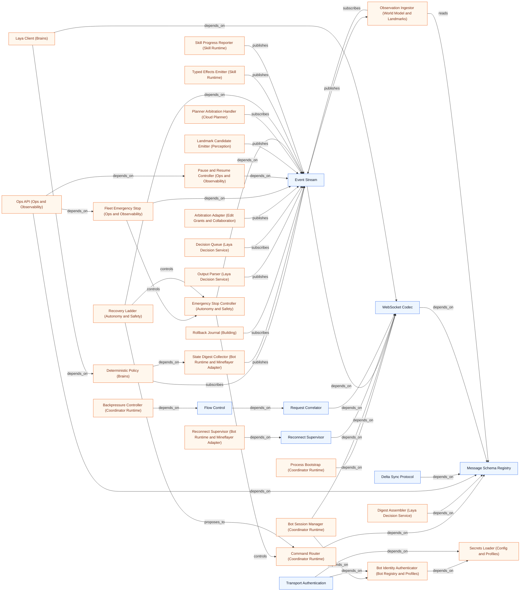
```mermaid
flowchart LR
n135["Message Schema Registry"]
n143["WebSocket Codec"]
n149["Request Correlator"]
n150["Event Stream"]
n151["Delta Sync Protocol"]
n152["Reconnect Supervisor"]
n153["Transport Authentication"]
n130["Flow Control"]
n66["Deterministic Policy (Brains)"]
n58["Reconnect Supervisor (Bot Runtime and Mineflayer Adapter)"]
n108["State Digest Collector (Bot Runtime and Mineflayer Adapter)"]
n105["Rollback Journal (Building)"]
n70["Backpressure Controller (Coordinator Runtime)"]
n27["Command Router (Coordinator Runtime)"]
n67["Process Bootstrap (Coordinator Runtime)"]
n69["Bot Session Manager (Coordinator Runtime)"]
n74["Digest Assembler (Laya Decision Service)"]
n36["Output Parser (Laya Decision Service)"]
n71["Decision Queue (Laya Decision Service)"]
n154["Arbitration Adapter (Edit Grants and Collaboration)"]
n64["Fleet Emergency Stop (Ops and Observability)"]
n62["Ops API (Ops and Observability)"]
n63["Pause and Resume Controller (Ops and Observability)"]
n155["Landmark Candidate Emitter (Perception)"]
n48["Planner Arbitration Handler (Cloud Planner)"]
n61["Emergency Stop Controller (Autonomy and Safety)"]
n60["Recovery Ladder (Autonomy and Safety)"]
n84["Typed Effects Emitter (Skill Runtime)"]
n81["Skill Progress Reporter (Skill Runtime)"]
n147["Bot Identity Authenticator (Bot Registry and Profiles)"]
n156["Secrets Loader (Config and Profiles)"]
n157["Observation Ingestor (World Model and Landmarks)"]
n128["Laya Client (Brains)"]
n66 -->|depends_on| n108
n66 -->|subscribes| n150
n58 -->|depends_on| n152
n108 -->|publishes| n150
n147 -->|depends_on| n156
n105 -->|subscribes| n150
n70 -->|depends_on| n130
n27 -->|depends_on| n135
n67 -->|depends_on| n143
n69 -->|depends_on| n147
n69 -->|depends_on| n143
n74 -->|depends_on| n135
n36 -->|publishes| n150
n71 -->|subscribes| n150
n154 -->|publishes| n150
n64 -->|controls| n61
n64 -->|depends_on| n150
n62 -->|depends_on| n64
n62 -->|depends_on| n63
n62 -->|depends_on| n135
n63 -->|depends_on| n150
n155 -->|publishes| n150
n48 -->|subscribes| n150
n61 -->|controls| n27
n61 -->|depends_on| n150
n60 -->|proposes_to| n27
n60 -->|controls| n61
n60 -->|depends_on| n150
n84 -->|publishes| n150
n81 -->|publishes| n150
n153 -->|depends_on| n147
n153 -->|depends_on| n156
n151 -->|depends_on| n135
n150 -->|depends_on| n143
n150 -->|publishes| n157
n130 -->|depends_on| n149
n152 -->|depends_on| n143
n149 -->|depends_on| n143
n143 -->|depends_on| n135
n157 -->|subscribes| n150
n157 -->|reads| n135
n128 -->|depends_on| n143
n128 -->|depends_on| n66
classDef internal fill:#eef6ff,stroke:#2563eb,color:#0f172a;
classDef external fill:#fff7ed,stroke:#ea580c,color:#7c2d12;
class n135,n143,n149,n150,n151,n152,n153,n130 internal;
class n66,n58,n108,n105,n70,n27,n67,n69,n74,n36,n71,n154,n64,n62,n63,n155,n48,n61,n60,n84,n81,n147,n156,n157,n128 external;
```

### Shared Infrastructure Plan

Source: `docs/architecture/graphs/system-sip.mmd`

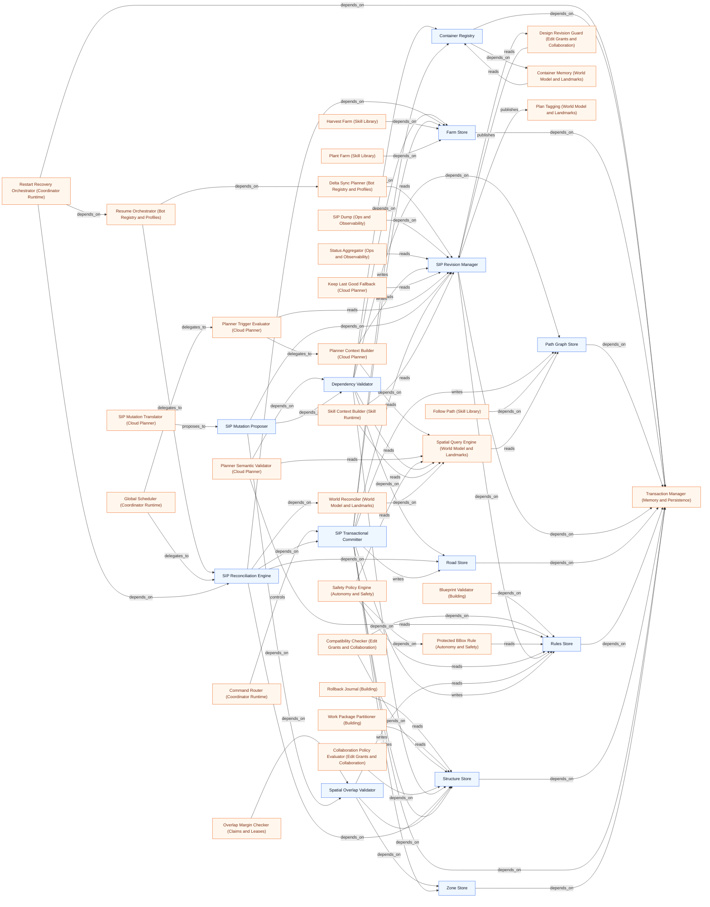
```mermaid
flowchart LR
n158["Zone Store"]
n159["Structure Store"]
n160["Road Store"]
n161["Farm Store"]
n162["Container Registry"]
n163["Path Graph Store"]
n164["Rules Store"]
n165["SIP Revision Manager"]
n166["Spatial Overlap Validator"]
n167["Dependency Validator"]
n168["SIP Mutation Proposer"]
n133["SIP Transactional Committer"]
n139["SIP Reconciliation Engine"]
n169["Delta Sync Planner (Bot Registry and Profiles)"]
n144["Resume Orchestrator (Bot Registry and Profiles)"]
n87["Blueprint Validator (Building)"]
n105["Rollback Journal (Building)"]
n99["Work Package Partitioner (Building)"]
n170["Overlap Margin Checker (Claims and Leases)"]
n27["Command Router (Coordinator Runtime)"]
n29["Global Scheduler (Coordinator Runtime)"]
n30["Restart Recovery Orchestrator (Coordinator Runtime)"]
n171["Compatibility Checker (Edit Grants and Collaboration)"]
n172["Design Revision Guard (Edit Grants and Collaboration)"]
n173["Collaboration Policy Evaluator (Edit Grants and Collaboration)"]
n122["SIP Dump (Ops and Observability)"]
n121["Status Aggregator (Ops and Observability)"]
n40["Planner Context Builder (Cloud Planner)"]
n49["Keep Last Good Fallback (Cloud Planner)"]
n43["Planner Semantic Validator (Cloud Planner)"]
n45["SIP Mutation Translator (Cloud Planner)"]
n41["Planner Trigger Evaluator (Cloud Planner)"]
n116["Protected BBox Rule (Autonomy and Safety)"]
n119["Safety Policy Engine (Autonomy and Safety)"]
n136["Transaction Manager (Memory and Persistence)"]
n174["Container Memory (World Model and Landmarks)"]
n175["Spatial Query Engine (World Model and Landmarks)"]
n176["World Reconciler (World Model and Landmarks)"]
n177["Plan Tagging (World Model and Landmarks)"]
n50["Skill Context Builder (Skill Runtime)"]
n178["Follow Path (Skill Library)"]
n179["Harvest Farm (Skill Library)"]
n180["Plant Farm (Skill Library)"]
n169 -->|reads| n165
n144 -->|depends_on| n169
n144 -->|delegates_to| n139
n87 -->|depends_on| n164
n105 -->|reads| n159
n99 -->|reads| n159
n170 -->|depends_on| n166
n27 -->|controls| n133
n29 -->|delegates_to| n41
n29 -->|delegates_to| n139
n30 -->|depends_on| n144
n30 -->|depends_on| n136
n30 -->|depends_on| n139
n171 -->|depends_on| n164
n171 -->|depends_on| n159
n172 -->|reads| n165
n173 -->|depends_on| n159
n122 -->|depends_on| n165
n121 -->|reads| n165
n40 -->|reads| n165
n40 -->|reads| n175
n49 -->|reads| n165
n43 -->|depends_on| n167
n43 -->|reads| n164
n43 -->|reads| n175
n45 -->|proposes_to| n168
n41 -->|delegates_to| n40
n41 -->|reads| n165
n116 -->|reads| n164
n119 -->|depends_on| n116
n119 -->|reads| n164
n119 -->|reads| n175
n162 -->|depends_on| n136
n162 -->|depends_on| n174
n167 -->|depends_on| n162
n167 -->|depends_on| n161
n167 -->|depends_on| n163
n167 -->|depends_on| n160
n167 -->|depends_on| n159
n167 -->|reads| n175
n161 -->|depends_on| n136
n168 -->|depends_on| n167
n168 -->|depends_on| n165
n168 -->|depends_on| n166
n163 -->|depends_on| n136
n139 -->|depends_on| n161
n139 -->|depends_on| n160
n139 -->|depends_on| n159
n139 -->|depends_on| n133
n139 -->|depends_on| n176
n165 -->|publishes| n172
n165 -->|depends_on| n136
n165 -->|depends_on| n164
n165 -->|publishes| n177
n160 -->|depends_on| n136
n164 -->|depends_on| n136
n166 -->|reads| n164
n166 -->|depends_on| n159
n166 -->|depends_on| n158
n159 -->|depends_on| n136
n133 -->|depends_on| n136
n133 -->|writes| n162
n133 -->|writes| n161
n133 -->|writes| n163
n133 -->|depends_on| n165
n133 -->|writes| n160
n133 -->|writes| n164
n133 -->|writes| n159
n133 -->|writes| n158
n158 -->|depends_on| n136
n50 -->|reads| n165
n50 -->|reads| n175
n178 -->|depends_on| n163
n179 -->|depends_on| n161
n180 -->|depends_on| n161
n174 -->|reads| n162
n175 -->|reads| n163
n176 -->|depends_on| n175
classDef internal fill:#eef6ff,stroke:#2563eb,color:#0f172a;
classDef external fill:#fff7ed,stroke:#ea580c,color:#7c2d12;
class n158,n159,n160,n161,n162,n163,n164,n165,n166,n167,n168,n133,n139 internal;
class n169,n144,n87,n105,n99,n170,n27,n29,n30,n171,n172,n173,n122,n121,n40,n49,n43,n45,n41,n116,n119,n136,n174,n175,n176,n177,n50,n178,n179,n180 external;
```

### Task Board

Source: `docs/architecture/graphs/system-tasks.mmd`

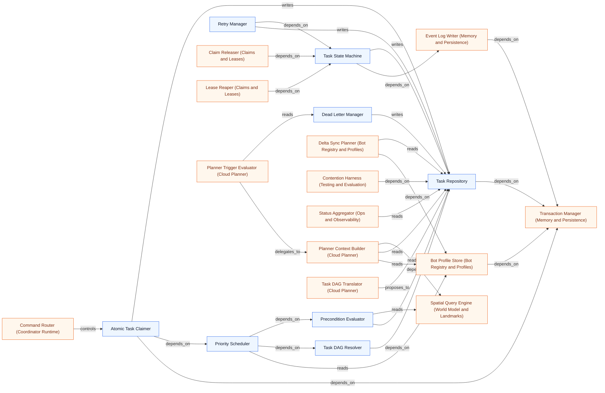
```mermaid
flowchart LR
n181["Task Repository"]
n182["Task DAG Resolver"]
n183["Precondition Evaluator"]
n184["Priority Scheduler"]
n134["Atomic Task Claimer"]
n185["Retry Manager"]
n186["Dead Letter Manager"]
n187["Task State Machine"]
n169["Delta Sync Planner (Bot Registry and Profiles)"]
n188["Claim Releaser (Claims and Leases)"]
n137["Lease Reaper (Claims and Leases)"]
n27["Command Router (Coordinator Runtime)"]
n189["Contention Harness (Testing and Evaluation)"]
n121["Status Aggregator (Ops and Observability)"]
n40["Planner Context Builder (Cloud Planner)"]
n46["Task DAG Translator (Cloud Planner)"]
n41["Planner Trigger Evaluator (Cloud Planner)"]
n136["Transaction Manager (Memory and Persistence)"]
n175["Spatial Query Engine (World Model and Landmarks)"]
n190["Bot Profile Store (Bot Registry and Profiles)"]
n191["Event Log Writer (Memory and Persistence)"]
n169 -->|depends_on| n190
n169 -->|reads| n181
n190 -->|depends_on| n136
n188 -->|depends_on| n187
n137 -->|depends_on| n187
n27 -->|controls| n134
n189 -->|depends_on| n181
n191 -->|depends_on| n136
n121 -->|reads| n181
n40 -->|reads| n190
n40 -->|reads| n181
n40 -->|reads| n175
n46 -->|proposes_to| n181
n41 -->|delegates_to| n40
n41 -->|reads| n186
n134 -->|depends_on| n136
n134 -->|depends_on| n184
n134 -->|writes| n181
n182 -->|depends_on| n181
n186 -->|writes| n181
n183 -->|depends_on| n181
n183 -->|reads| n175
n184 -->|reads| n190
n184 -->|depends_on| n182
n184 -->|depends_on| n183
n185 -->|writes| n181
n185 -->|depends_on| n187
n181 -->|depends_on| n136
n187 -->|depends_on| n191
n187 -->|writes| n181
classDef internal fill:#eef6ff,stroke:#2563eb,color:#0f172a;
classDef external fill:#fff7ed,stroke:#ea580c,color:#7c2d12;
class n181,n182,n183,n184,n134,n185,n186,n187 internal;
class n169,n188,n137,n27,n189,n121,n40,n46,n41,n136,n175,n190,n191 external;
```

### Claims and Leases

Source: `docs/architecture/graphs/system-claims.mmd`

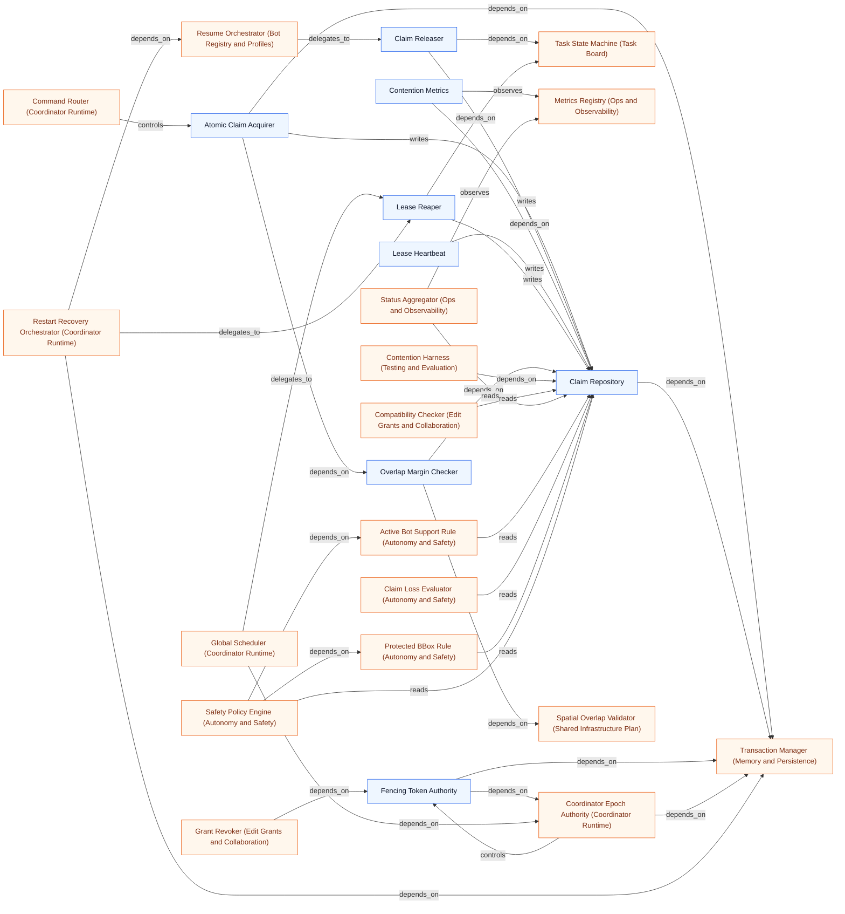
```mermaid
flowchart LR
n192["Claim Repository"]
n170["Overlap Margin Checker"]
n131["Atomic Claim Acquirer"]
n193["Lease Heartbeat"]
n137["Lease Reaper"]
n129["Fencing Token Authority"]
n188["Claim Releaser"]
n194["Contention Metrics"]
n144["Resume Orchestrator (Bot Registry and Profiles)"]
n136["Transaction Manager (Memory and Persistence)"]
n187["Task State Machine (Task Board)"]
n123["Metrics Registry (Ops and Observability)"]
n28["Coordinator Epoch Authority (Coordinator Runtime)"]
n166["Spatial Overlap Validator (Shared Infrastructure Plan)"]
n27["Command Router (Coordinator Runtime)"]
n29["Global Scheduler (Coordinator Runtime)"]
n30["Restart Recovery Orchestrator (Coordinator Runtime)"]
n189["Contention Harness (Testing and Evaluation)"]
n171["Compatibility Checker (Edit Grants and Collaboration)"]
n195["Grant Revoker (Edit Grants and Collaboration)"]
n121["Status Aggregator (Ops and Observability)"]
n117["Active Bot Support Rule (Autonomy and Safety)"]
n115["Claim Loss Evaluator (Autonomy and Safety)"]
n116["Protected BBox Rule (Autonomy and Safety)"]
n119["Safety Policy Engine (Autonomy and Safety)"]
n144 -->|delegates_to| n188
n131 -->|writes| n192
n131 -->|depends_on| n170
n131 -->|depends_on| n136
n188 -->|writes| n192
n188 -->|depends_on| n187
n192 -->|depends_on| n136
n194 -->|depends_on| n192
n194 -->|observes| n123
n129 -->|depends_on| n28
n129 -->|depends_on| n136
n193 -->|writes| n192
n137 -->|writes| n192
n137 -->|depends_on| n187
n170 -->|depends_on| n192
n170 -->|depends_on| n166
n27 -->|controls| n131
n28 -->|controls| n129
n28 -->|depends_on| n136
n29 -->|delegates_to| n137
n29 -->|depends_on| n28
n30 -->|depends_on| n144
n30 -->|delegates_to| n137
n30 -->|depends_on| n136
n189 -->|depends_on| n192
n171 -->|reads| n192
n195 -->|depends_on| n129
n121 -->|reads| n192
n121 -->|observes| n123
n117 -->|reads| n192
n115 -->|reads| n192
n116 -->|reads| n192
n119 -->|reads| n192
n119 -->|depends_on| n117
n119 -->|depends_on| n116
classDef internal fill:#eef6ff,stroke:#2563eb,color:#0f172a;
classDef external fill:#fff7ed,stroke:#ea580c,color:#7c2d12;
class n192,n170,n131,n193,n137,n129,n188,n194 internal;
class n144,n136,n187,n123,n28,n166,n27,n29,n30,n189,n171,n195,n121,n117,n115,n116,n119 external;
```

### Edit Grants and Collaboration

Source: `docs/architecture/graphs/system-grants.mmd`

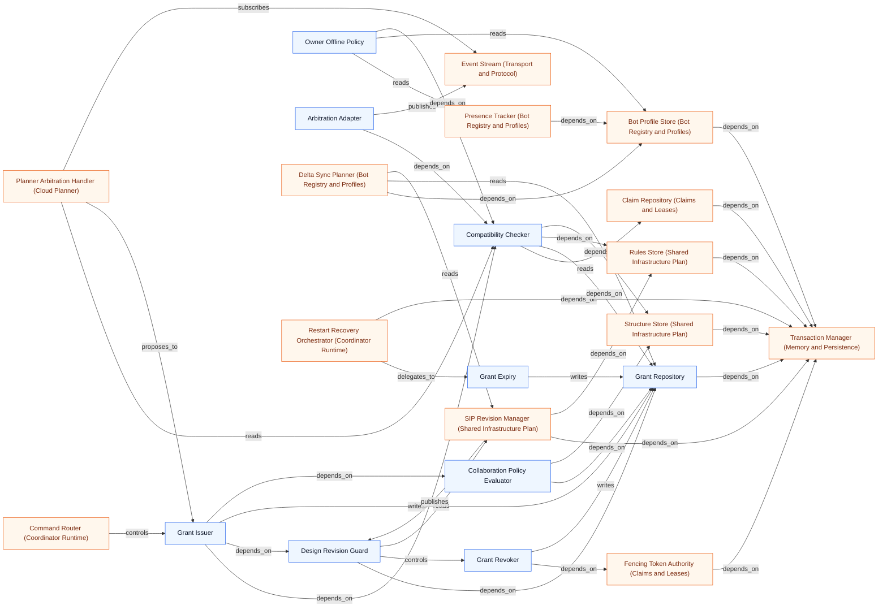
```mermaid
flowchart LR
n196["Grant Repository"]
n173["Collaboration Policy Evaluator"]
n171["Compatibility Checker"]
n172["Design Revision Guard"]
n132["Grant Issuer"]
n195["Grant Revoker"]
n197["Owner Offline Policy"]
n145["Grant Expiry"]
n154["Arbitration Adapter"]
n169["Delta Sync Planner (Bot Registry and Profiles)"]
n27["Command Router (Coordinator Runtime)"]
n30["Restart Recovery Orchestrator (Coordinator Runtime)"]
n150["Event Stream (Transport and Protocol)"]
n192["Claim Repository (Claims and Leases)"]
n164["Rules Store (Shared Infrastructure Plan)"]
n159["Structure Store (Shared Infrastructure Plan)"]
n165["SIP Revision Manager (Shared Infrastructure Plan)"]
n136["Transaction Manager (Memory and Persistence)"]
n129["Fencing Token Authority (Claims and Leases)"]
n148["Presence Tracker (Bot Registry and Profiles)"]
n190["Bot Profile Store (Bot Registry and Profiles)"]
n48["Planner Arbitration Handler (Cloud Planner)"]
n169 -->|depends_on| n190
n169 -->|reads| n196
n169 -->|reads| n165
n148 -->|depends_on| n190
n190 -->|depends_on| n136
n192 -->|depends_on| n136
n129 -->|depends_on| n136
n27 -->|controls| n132
n30 -->|delegates_to| n145
n30 -->|depends_on| n136
n154 -->|depends_on| n171
n154 -->|publishes| n150
n171 -->|reads| n192
n171 -->|depends_on| n196
n171 -->|depends_on| n164
n171 -->|depends_on| n159
n172 -->|depends_on| n196
n172 -->|controls| n195
n172 -->|reads| n165
n145 -->|writes| n196
n132 -->|depends_on| n171
n132 -->|depends_on| n172
n132 -->|writes| n196
n132 -->|depends_on| n173
n196 -->|depends_on| n136
n195 -->|depends_on| n129
n195 -->|writes| n196
n197 -->|reads| n148
n197 -->|reads| n190
n197 -->|depends_on| n171
n173 -->|depends_on| n196
n173 -->|depends_on| n159
n48 -->|reads| n171
n48 -->|proposes_to| n132
n48 -->|subscribes| n150
n165 -->|publishes| n172
n165 -->|depends_on| n136
n165 -->|depends_on| n164
n164 -->|depends_on| n136
n159 -->|depends_on| n136
classDef internal fill:#eef6ff,stroke:#2563eb,color:#0f172a;
classDef external fill:#fff7ed,stroke:#ea580c,color:#7c2d12;
class n196,n173,n171,n172,n132,n195,n197,n145,n154 internal;
class n169,n27,n30,n150,n192,n164,n159,n165,n136,n129,n148,n190,n48 external;
```

### Bot Registry and Profiles

Source: `docs/architecture/graphs/system-bots.mmd`

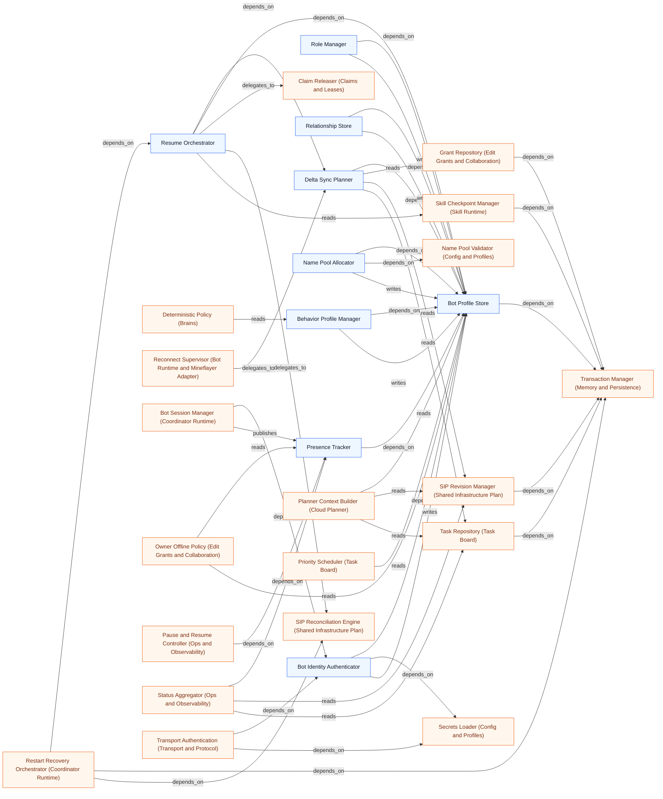
```mermaid
flowchart LR
n147["Bot Identity Authenticator"]
n190["Bot Profile Store"]
n198["Role Manager"]
n199["Behavior Profile Manager"]
n200["Relationship Store"]
n148["Presence Tracker"]
n169["Delta Sync Planner"]
n144["Resume Orchestrator"]
n201["Name Pool Allocator"]
n66["Deterministic Policy (Brains)"]
n58["Reconnect Supervisor (Bot Runtime and Mineflayer Adapter)"]
n196["Grant Repository (Edit Grants and Collaboration)"]
n165["SIP Revision Manager (Shared Infrastructure Plan)"]
n181["Task Repository (Task Board)"]
n156["Secrets Loader (Config and Profiles)"]
n202["Name Pool Validator (Config and Profiles)"]
n136["Transaction Manager (Memory and Persistence)"]
n188["Claim Releaser (Claims and Leases)"]
n139["SIP Reconciliation Engine (Shared Infrastructure Plan)"]
n82["Skill Checkpoint Manager (Skill Runtime)"]
n30["Restart Recovery Orchestrator (Coordinator Runtime)"]
n69["Bot Session Manager (Coordinator Runtime)"]
n197["Owner Offline Policy (Edit Grants and Collaboration)"]
n63["Pause and Resume Controller (Ops and Observability)"]
n121["Status Aggregator (Ops and Observability)"]
n40["Planner Context Builder (Cloud Planner)"]
n184["Priority Scheduler (Task Board)"]
n153["Transport Authentication (Transport and Protocol)"]
n66 -->|reads| n199
n58 -->|delegates_to| n169
n199 -->|depends_on| n190
n169 -->|depends_on| n190
n169 -->|reads| n196
n169 -->|reads| n165
n169 -->|reads| n181
n147 -->|depends_on| n190
n147 -->|depends_on| n156
n201 -->|depends_on| n190
n201 -->|depends_on| n202
n148 -->|depends_on| n190
n190 -->|depends_on| n136
n200 -->|depends_on| n190
n144 -->|depends_on| n169
n144 -->|depends_on| n190
n144 -->|delegates_to| n188
n144 -->|delegates_to| n139
n144 -->|reads| n82
n198 -->|depends_on| n190
n30 -->|depends_on| n144
n30 -->|depends_on| n136
n30 -->|depends_on| n139
n69 -->|depends_on| n147
n69 -->|publishes| n148
n196 -->|depends_on| n136
n197 -->|reads| n148
n197 -->|reads| n190
n63 -->|depends_on| n148
n121 -->|depends_on| n148
n121 -->|reads| n165
n121 -->|reads| n181
n40 -->|reads| n190
n40 -->|reads| n165
n40 -->|reads| n181
n165 -->|depends_on| n136
n82 -->|depends_on| n136
n184 -->|reads| n190
n181 -->|depends_on| n136
n153 -->|depends_on| n147
n153 -->|depends_on| n156
n147 -->|writes| n190
n198 -->|writes| n190
n199 -->|writes| n190
n200 -->|writes| n190
n201 -->|writes| n190
classDef internal fill:#eef6ff,stroke:#2563eb,color:#0f172a;
classDef external fill:#fff7ed,stroke:#ea580c,color:#7c2d12;
class n147,n190,n198,n199,n200,n148,n169,n144,n201 internal;
class n66,n58,n196,n165,n181,n156,n202,n136,n188,n139,n82,n30,n69,n197,n63,n121,n40,n184,n153 external;
```

### World Model and Landmarks

Source: `docs/architecture/graphs/system-world.mmd`

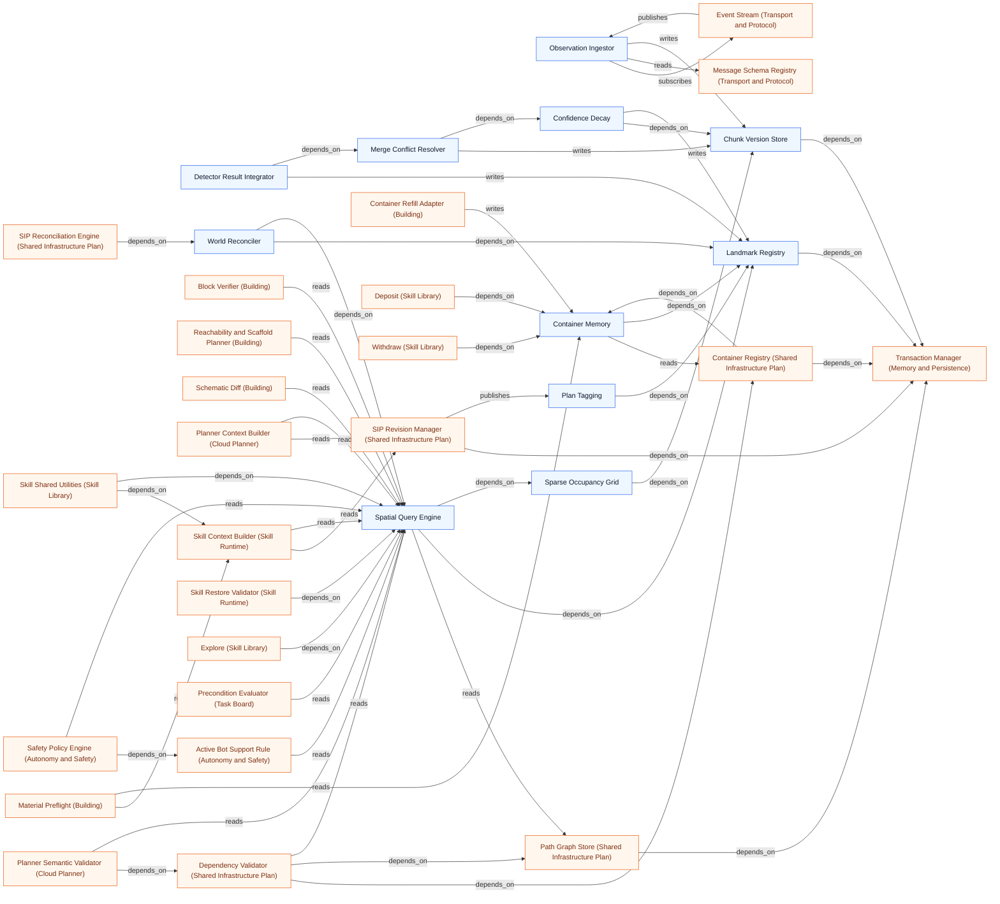
```mermaid
flowchart LR
n157["Observation Ingestor"]
n203["Chunk Version Store"]
n204["Sparse Occupancy Grid"]
n205["Merge Conflict Resolver"]
n206["Confidence Decay"]
n207["Landmark Registry"]
n208["Detector Result Integrator"]
n177["Plan Tagging"]
n175["Spatial Query Engine"]
n174["Container Memory"]
n176["World Reconciler"]
n102["Block Verifier (Building)"]
n104["Container Refill Adapter (Building)"]
n103["Material Preflight (Building)"]
n101["Reachability and Scaffold Planner (Building)"]
n98["Schematic Diff (Building)"]
n40["Planner Context Builder (Cloud Planner)"]
n43["Planner Semantic Validator (Cloud Planner)"]
n117["Active Bot Support Rule (Autonomy and Safety)"]
n119["Safety Policy Engine (Autonomy and Safety)"]
n162["Container Registry (Shared Infrastructure Plan)"]
n167["Dependency Validator (Shared Infrastructure Plan)"]
n139["SIP Reconciliation Engine (Shared Infrastructure Plan)"]
n165["SIP Revision Manager (Shared Infrastructure Plan)"]
n50["Skill Context Builder (Skill Runtime)"]
n83["Skill Restore Validator (Skill Runtime)"]
n209["Deposit (Skill Library)"]
n210["Explore (Skill Library)"]
n211["Skill Shared Utilities (Skill Library)"]
n212["Withdraw (Skill Library)"]
n183["Precondition Evaluator (Task Board)"]
n150["Event Stream (Transport and Protocol)"]
n136["Transaction Manager (Memory and Persistence)"]
n135["Message Schema Registry (Transport and Protocol)"]
n163["Path Graph Store (Shared Infrastructure Plan)"]
n102 -->|reads| n175
n104 -->|writes| n174
n103 -->|reads| n50
n103 -->|reads| n174
n101 -->|reads| n175
n98 -->|reads| n175
n40 -->|reads| n165
n40 -->|reads| n175
n43 -->|depends_on| n167
n43 -->|reads| n175
n117 -->|reads| n175
n119 -->|depends_on| n117
n119 -->|reads| n175
n162 -->|depends_on| n136
n162 -->|depends_on| n174
n167 -->|depends_on| n162
n167 -->|depends_on| n163
n167 -->|reads| n175
n163 -->|depends_on| n136
n139 -->|depends_on| n176
n165 -->|depends_on| n136
n165 -->|publishes| n177
n50 -->|reads| n165
n50 -->|reads| n175
n83 -->|depends_on| n175
n209 -->|depends_on| n174
n210 -->|depends_on| n175
n211 -->|depends_on| n50
n211 -->|depends_on| n175
n212 -->|depends_on| n174
n183 -->|reads| n175
n150 -->|publishes| n157
n203 -->|depends_on| n136
n206 -->|depends_on| n203
n206 -->|writes| n207
n174 -->|reads| n162
n174 -->|depends_on| n207
n208 -->|writes| n207
n208 -->|depends_on| n205
n207 -->|depends_on| n136
n205 -->|writes| n203
n205 -->|depends_on| n206
n157 -->|subscribes| n150
n157 -->|reads| n135
n157 -->|writes| n203
n204 -->|depends_on| n203
n177 -->|depends_on| n207
n175 -->|reads| n163
n175 -->|depends_on| n207
n175 -->|depends_on| n204
n176 -->|depends_on| n207
n176 -->|depends_on| n175
classDef internal fill:#eef6ff,stroke:#2563eb,color:#0f172a;
classDef external fill:#fff7ed,stroke:#ea580c,color:#7c2d12;
class n157,n203,n204,n205,n206,n207,n208,n177,n175,n174,n176 internal;
class n102,n104,n103,n101,n98,n40,n43,n117,n119,n162,n167,n139,n165,n50,n83,n209,n210,n211,n212,n183,n150,n136,n135,n163 external;
```

### Perception

Source: `docs/architecture/graphs/system-perception.mmd`

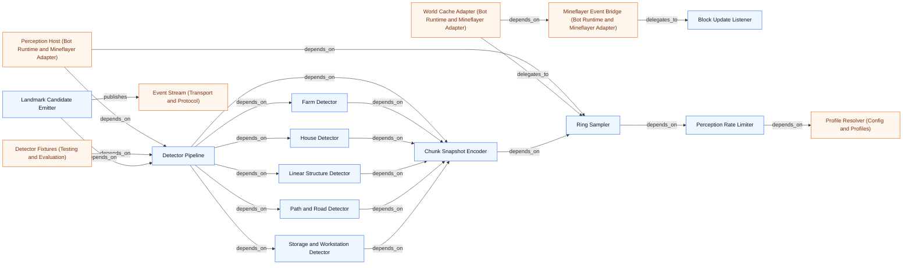
```mermaid
flowchart LR
n213["Ring Sampler"]
n214["Chunk Snapshot Encoder"]
n215["Block Update Listener"]
n216["Path and Road Detector"]
n217["House Detector"]
n218["Farm Detector"]
n219["Storage and Workstation Detector"]
n220["Linear Structure Detector"]
n221["Detector Pipeline"]
n155["Landmark Candidate Emitter"]
n222["Perception Rate Limiter"]
n53["Mineflayer Event Bridge (Bot Runtime and Mineflayer Adapter)"]
n109["Perception Host (Bot Runtime and Mineflayer Adapter)"]
n54["World Cache Adapter (Bot Runtime and Mineflayer Adapter)"]
n223["Detector Fixtures (Testing and Evaluation)"]
n150["Event Stream (Transport and Protocol)"]
n146["Profile Resolver (Config and Profiles)"]
n53 -->|delegates_to| n215
n109 -->|depends_on| n221
n109 -->|depends_on| n213
n54 -->|depends_on| n53
n54 -->|delegates_to| n213
n223 -->|depends_on| n221
n214 -->|depends_on| n213
n221 -->|depends_on| n214
n221 -->|depends_on| n218
n221 -->|depends_on| n217
n221 -->|depends_on| n220
n221 -->|depends_on| n216
n221 -->|depends_on| n219
n218 -->|depends_on| n214
n217 -->|depends_on| n214
n155 -->|depends_on| n221
n155 -->|publishes| n150
n220 -->|depends_on| n214
n216 -->|depends_on| n214
n222 -->|depends_on| n146
n213 -->|depends_on| n222
n219 -->|depends_on| n214
classDef internal fill:#eef6ff,stroke:#2563eb,color:#0f172a;
classDef external fill:#fff7ed,stroke:#ea580c,color:#7c2d12;
class n213,n214,n215,n216,n217,n218,n219,n220,n221,n155,n222 internal;
class n53,n109,n54,n223,n150,n146 external;
```

### Laya Decision Service

Source: `docs/architecture/graphs/system-decision.mmd`

```mermaid
flowchart LR
n32["Model Loader"]
n33["Execution Provider Selector"]
n71["Decision Queue"]
n72["Decision Rate Limiter"]
n73["Digest Cache"]
n74["Digest Assembler"]
n34["Batch Runner"]
n35["Single In-flight Guard"]
n36["Output Parser"]
n37["Confidence Calibrator"]
n38["Timeout and Fallback Handler"]
n75["Latency Metrics"]
n66["Deterministic Policy (Brains)"]
n140["Config Schema Validator (Config and Profiles)"]
n135["Message Schema Registry (Transport and Protocol)"]
n224["Hardware Probe (Config and Profiles)"]
n124["Structured Logger (Ops and Observability)"]
n123["Metrics Registry (Ops and Observability)"]
n225["Laya Runtime Resolver (Config and Profiles)"]
n24(["ONNX Runtime / WebGPU Driver"])
n150["Event Stream (Transport and Protocol)"]
n146["Profile Resolver (Config and Profiles)"]
n226["Laya Benchmark Harness (Testing and Evaluation)"]
n125["Health and Readiness (Ops and Observability)"]
n227["Calibration Fitter (Laya Training)"]
n66 -->|subscribes| n150
n224 -->|depends_on| n146
n225 -->|depends_on| n224
n225 -->|depends_on| n146
n146 -->|depends_on| n140
n34 -->|depends_on| n73
n34 -->|depends_on| n32
n34 -->|depends_on| n71
n37 -->|proposes_to| n66
n37 -->|depends_on| n140
n37 -->|depends_on| n36
n74 -->|depends_on| n135
n73 -->|depends_on| n71
n33 -->|depends_on| n224
n33 -->|controls| n32
n33 -->|observes| n124
n75 -->|observes| n123
n75 -->|writes| n123
n32 -->|depends_on| n225
n32 -->|depends_on| n24
n36 -->|depends_on| n34
n36 -->|publishes| n150
n71 -->|subscribes| n150
n72 -->|depends_on| n146
n72 -->|depends_on| n71
n35 -->|controls| n34
n38 -->|controls| n36
n38 -->|depends_on| n71
n226 -->|depends_on| n75
n226 -->|depends_on| n32
n125 -->|depends_on| n32
n227 -->|reads| n37
classDef internal fill:#eef6ff,stroke:#2563eb,color:#0f172a;
classDef external fill:#fff7ed,stroke:#ea580c,color:#7c2d12;
class n32,n33,n71,n72,n73,n74,n34,n35,n36,n37,n38,n75 internal;
class n66,n140,n135,n224,n124,n123,n225,n150,n146,n226,n125,n227,n24 external;
```

### Cloud Planner

Source: `docs/architecture/graphs/system-planner.mmd`

```mermaid
flowchart LR
n39["OpenAI-Compatible Client"]
n40["Planner Context Builder"]
n41["Planner Trigger Evaluator"]
n42["Planner Schema Validator"]
n43["Planner Semantic Validator"]
n44["Planner Repair Loop"]
n45["SIP Mutation Translator"]
n46["Task DAG Translator"]
n47["Planner Budget Limiter"]
n76["Plan Cache"]
n48["Planner Arbitration Handler"]
n49["Keep Last Good Fallback"]
n29["Global Scheduler (Coordinator Runtime)"]
n171["Compatibility Checker (Edit Grants and Collaboration)"]
n132["Grant Issuer (Edit Grants and Collaboration)"]
n150["Event Stream (Transport and Protocol)"]
n123["Metrics Registry (Ops and Observability)"]
n190["Bot Profile Store (Bot Registry and Profiles)"]
n165["SIP Revision Manager (Shared Infrastructure Plan)"]
n181["Task Repository (Task Board)"]
n175["Spatial Query Engine (World Model and Landmarks)"]
n140["Config Schema Validator (Config and Profiles)"]
n156["Secrets Loader (Config and Profiles)"]
n23(["Muse Spark Planner Endpoint"])
n136["Transaction Manager (Memory and Persistence)"]
n167["Dependency Validator (Shared Infrastructure Plan)"]
n164["Rules Store (Shared Infrastructure Plan)"]
n78["Skill Registry (Skill Runtime)"]
n168["SIP Mutation Proposer (Shared Infrastructure Plan)"]
n186["Dead Letter Manager (Task Board)"]
n60["Recovery Ladder (Autonomy and Safety)"]
n190 -->|depends_on| n136
n29 -->|delegates_to| n41
n171 -->|depends_on| n164
n132 -->|depends_on| n171
n48 -->|reads| n171
n48 -->|proposes_to| n132
n48 -->|subscribes| n150
n47 -->|observes| n123
n47 -->|controls| n39
n40 -->|reads| n190
n40 -->|reads| n165
n40 -->|reads| n181
n40 -->|reads| n175
n49 -->|depends_on| n76
n49 -->|reads| n165
n39 -->|depends_on| n140
n39 -->|depends_on| n156
n39 -->|depends_on| n23
n39 -->|delegates_to| n48
n76 -->|depends_on| n136
n44 -->|controls| n49
n44 -->|depends_on| n39
n44 -->|depends_on| n42
n44 -->|depends_on| n43
n42 -->|controls| n44
n43 -->|controls| n44
n43 -->|depends_on| n42
n43 -->|depends_on| n167
n43 -->|reads| n164
n43 -->|reads| n78
n43 -->|reads| n175
n45 -->|depends_on| n44
n45 -->|proposes_to| n168
n46 -->|depends_on| n44
n46 -->|proposes_to| n181
n41 -->|observes| n123
n41 -->|delegates_to| n40
n41 -->|reads| n165
n41 -->|reads| n186
n60 -->|proposes_to| n41
n60 -->|depends_on| n150
n167 -->|reads| n175
n168 -->|depends_on| n167
n168 -->|depends_on| n165
n165 -->|depends_on| n136
n165 -->|depends_on| n164
n164 -->|depends_on| n136
n186 -->|writes| n181
n181 -->|depends_on| n136
classDef internal fill:#eef6ff,stroke:#2563eb,color:#0f172a;
classDef external fill:#fff7ed,stroke:#ea580c,color:#7c2d12;
class n39,n40,n41,n42,n43,n44,n45,n46,n47,n76,n48,n49 internal;
class n29,n171,n132,n150,n123,n190,n165,n181,n175,n140,n156,n136,n167,n164,n78,n168,n186,n60,n23 external;
```

### Skill Runtime

Source: `docs/architecture/graphs/system-skill-runtime.mmd`

```mermaid
flowchart LR
n77["Skill Contract"]
n78["Skill Registry"]
n79["Skill Lifecycle Executor"]
n80["Skill Tick Scheduler"]
n50["Skill Context Builder"]
n81["Skill Progress Reporter"]
n82["Skill Checkpoint Manager"]
n83["Skill Restore Validator"]
n84["Typed Effects Emitter"]
n85["Skill Preemption Handler"]
n127["Affordance Enumerator (Brains)"]
n57["Skill Host (Bot Runtime and Mineflayer Adapter)"]
n54["World Cache Adapter (Bot Runtime and Mineflayer Adapter)"]
n144["Resume Orchestrator (Bot Registry and Profiles)"]
n103["Material Preflight (Building)"]
n43["Planner Semantic Validator (Cloud Planner)"]
n136["Transaction Manager (Memory and Persistence)"]
n165["SIP Revision Manager (Shared Infrastructure Plan)"]
n175["Spatial Query Engine (World Model and Landmarks)"]
n150["Event Stream (Transport and Protocol)"]
n59["Action Veto Gate (Autonomy and Safety)"]
n123["Metrics Registry (Ops and Observability)"]
n65["Reflex Guardian Loop (Brains)"]
n228["Craft (Skill Library)"]
n229["Navigate (Skill Library)"]
n230["Place Build (Skill Library)"]
n211["Skill Shared Utilities (Skill Library)"]
n127 -->|depends_on| n54
n127 -->|depends_on| n65
n127 -->|depends_on| n78
n57 -->|depends_on| n79
n57 -->|depends_on| n80
n54 -->|delegates_to| n50
n144 -->|reads| n82
n103 -->|reads| n50
n43 -->|reads| n78
n43 -->|reads| n175
n59 -->|reads| n65
n65 -->|controls| n59
n165 -->|depends_on| n136
n82 -->|depends_on| n136
n50 -->|reads| n54
n50 -->|reads| n165
n50 -->|depends_on| n82
n50 -->|reads| n175
n84 -->|publishes| n150
n79 -->|depends_on| n50
n79 -->|depends_on| n84
n79 -->|depends_on| n77
n79 -->|depends_on| n78
n85 -->|reads| n59
n85 -->|depends_on| n79
n81 -->|observes| n123
n81 -->|publishes| n150
n83 -->|depends_on| n82
n83 -->|depends_on| n175
n78 -->|depends_on| n77
n80 -->|reads| n65
n80 -->|depends_on| n79
n228 -->|depends_on| n50
n229 -->|depends_on| n77
n230 -->|depends_on| n50
n211 -->|depends_on| n50
n211 -->|depends_on| n175
classDef internal fill:#eef6ff,stroke:#2563eb,color:#0f172a;
classDef external fill:#fff7ed,stroke:#ea580c,color:#7c2d12;
class n77,n78,n79,n80,n50,n81,n82,n83,n84,n85 internal;
class n127,n57,n54,n144,n103,n43,n136,n165,n175,n150,n59,n123,n65,n228,n229,n230,n211 external;
```

### Skill Library

Source: `docs/architecture/graphs/system-skills.mmd`

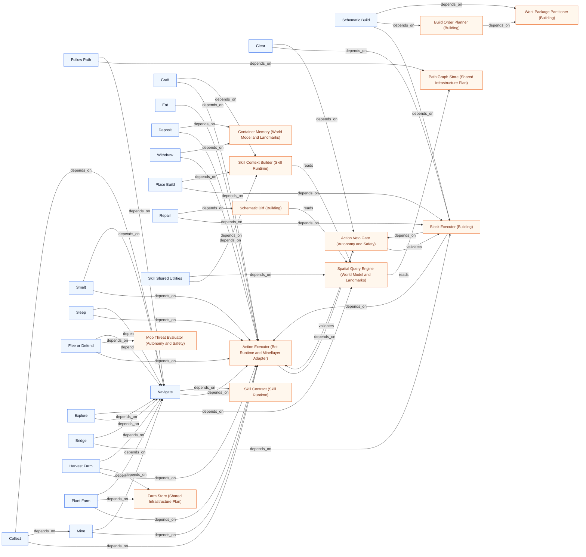
```mermaid
flowchart LR
n229["Navigate"]
n178["Follow Path"]
n231["Mine"]
n232["Collect"]
n228["Craft"]
n233["Smelt"]
n234["Eat"]
n209["Deposit"]
n212["Withdraw"]
n235["Sleep"]
n236["Flee or Defend"]
n210["Explore"]
n237["Bridge"]
n238["Clear"]
n230["Place Build"]
n239["Schematic Build"]
n240["Repair"]
n179["Harvest Farm"]
n180["Plant Farm"]
n211["Skill Shared Utilities"]
n51["Block Executor (Building)"]
n59["Action Veto Gate (Autonomy and Safety)"]
n55["Action Executor (Bot Runtime and Mineflayer Adapter)"]
n50["Skill Context Builder (Skill Runtime)"]
n174["Container Memory (World Model and Landmarks)"]
n175["Spatial Query Engine (World Model and Landmarks)"]
n111["Mob Threat Evaluator (Autonomy and Safety)"]
n163["Path Graph Store (Shared Infrastructure Plan)"]
n161["Farm Store (Shared Infrastructure Plan)"]
n77["Skill Contract (Skill Runtime)"]
n98["Schematic Diff (Building)"]
n100["Build Order Planner (Building)"]
n99["Work Package Partitioner (Building)"]
n55 -->|depends_on| n59
n51 -->|depends_on| n55
n51 -->|depends_on| n59
n100 -->|depends_on| n99
n98 -->|reads| n175
n59 -->|validates| n55
n59 -->|validates| n51
n50 -->|reads| n175
n237 -->|depends_on| n51
n237 -->|depends_on| n229
n238 -->|depends_on| n51
n238 -->|depends_on| n59
n232 -->|depends_on| n55
n232 -->|depends_on| n231
n232 -->|depends_on| n229
n228 -->|depends_on| n55
n228 -->|depends_on| n50
n209 -->|depends_on| n55
n209 -->|depends_on| n174
n234 -->|depends_on| n55
n210 -->|depends_on| n229
n210 -->|depends_on| n175
n236 -->|depends_on| n55
n236 -->|depends_on| n111
n236 -->|depends_on| n229
n178 -->|depends_on| n163
n178 -->|depends_on| n229
n179 -->|depends_on| n55
n179 -->|depends_on| n161
n179 -->|depends_on| n229
n231 -->|depends_on| n55
n231 -->|depends_on| n229
n229 -->|depends_on| n55
n229 -->|depends_on| n77
n230 -->|depends_on| n51
n230 -->|depends_on| n50
n180 -->|depends_on| n55
n180 -->|depends_on| n161
n180 -->|depends_on| n229
n240 -->|depends_on| n51
n240 -->|depends_on| n98
n239 -->|depends_on| n51
n239 -->|depends_on| n100
n239 -->|depends_on| n99
n211 -->|depends_on| n50
n211 -->|depends_on| n175
n235 -->|depends_on| n55
n235 -->|depends_on| n229
n233 -->|depends_on| n55
n233 -->|depends_on| n229
n212 -->|depends_on| n55
n212 -->|depends_on| n174
n175 -->|reads| n163
classDef internal fill:#eef6ff,stroke:#2563eb,color:#0f172a;
classDef external fill:#fff7ed,stroke:#ea580c,color:#7c2d12;
class n229,n178,n231,n232,n228,n233,n234,n209,n212,n235,n236,n210,n237,n238,n230,n239,n240,n179,n180,n211 internal;
class n51,n59,n55,n50,n174,n175,n111,n163,n161,n77,n98,n100,n99 external;
```

### Building

Source: `docs/architecture/graphs/system-building.mmd`

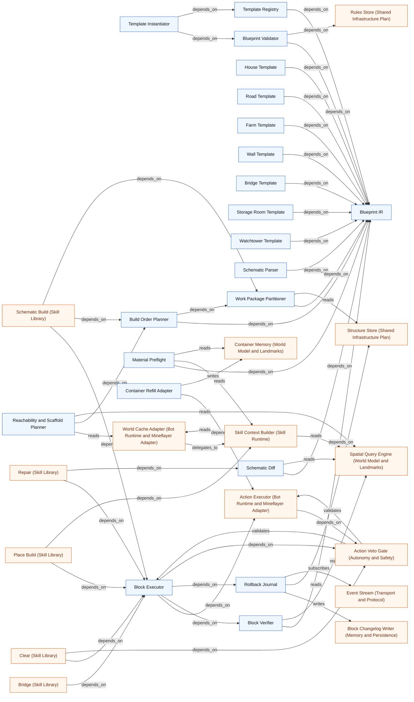
```mermaid
flowchart LR
n86["Blueprint IR"]
n87["Blueprint Validator"]
n88["Template Registry"]
n89["House Template"]
n90["Road Template"]
n91["Farm Template"]
n92["Wall Template"]
n93["Bridge Template"]
n94["Storage Room Template"]
n95["Watchtower Template"]
n96["Template Instantiator"]
n97["Schematic Parser"]
n98["Schematic Diff"]
n99["Work Package Partitioner"]
n100["Build Order Planner"]
n101["Reachability and Scaffold Planner"]
n102["Block Verifier"]
n51["Block Executor"]
n103["Material Preflight"]
n104["Container Refill Adapter"]
n105["Rollback Journal"]
n55["Action Executor (Bot Runtime and Mineflayer Adapter)"]
n59["Action Veto Gate (Autonomy and Safety)"]
n175["Spatial Query Engine (World Model and Landmarks)"]
n164["Rules Store (Shared Infrastructure Plan)"]
n174["Container Memory (World Model and Landmarks)"]
n50["Skill Context Builder (Skill Runtime)"]
n54["World Cache Adapter (Bot Runtime and Mineflayer Adapter)"]
n241["Block Changelog Writer (Memory and Persistence)"]
n159["Structure Store (Shared Infrastructure Plan)"]
n150["Event Stream (Transport and Protocol)"]
n237["Bridge (Skill Library)"]
n238["Clear (Skill Library)"]
n230["Place Build (Skill Library)"]
n240["Repair (Skill Library)"]
n239["Schematic Build (Skill Library)"]
n55 -->|depends_on| n59
n54 -->|delegates_to| n50
n51 -->|depends_on| n55
n51 -->|depends_on| n102
n51 -->|depends_on| n105
n51 -->|depends_on| n59
n102 -->|depends_on| n86
n102 -->|reads| n175
n87 -->|depends_on| n86
n87 -->|depends_on| n164
n100 -->|depends_on| n86
n100 -->|depends_on| n99
n104 -->|depends_on| n55
n104 -->|writes| n174
n103 -->|depends_on| n86
n103 -->|reads| n50
n103 -->|reads| n174
n101 -->|reads| n54
n101 -->|depends_on| n100
n101 -->|reads| n175
n105 -->|writes| n241
n105 -->|reads| n159
n105 -->|subscribes| n150
n98 -->|depends_on| n86
n98 -->|reads| n175
n97 -->|depends_on| n86
n93 -->|depends_on| n86
n91 -->|depends_on| n86
n89 -->|depends_on| n86
n96 -->|depends_on| n87
n96 -->|depends_on| n88
n88 -->|depends_on| n86
n90 -->|depends_on| n86
n94 -->|depends_on| n86
n92 -->|depends_on| n86
n95 -->|depends_on| n86
n99 -->|depends_on| n86
n99 -->|reads| n159
n59 -->|validates| n55
n59 -->|validates| n51
n50 -->|reads| n54
n50 -->|reads| n175
n237 -->|depends_on| n51
n238 -->|depends_on| n51
n238 -->|depends_on| n59
n230 -->|depends_on| n51
n230 -->|depends_on| n50
n240 -->|depends_on| n51
n240 -->|depends_on| n98
n239 -->|depends_on| n51
n239 -->|depends_on| n100
n239 -->|depends_on| n99
classDef internal fill:#eef6ff,stroke:#2563eb,color:#0f172a;
classDef external fill:#fff7ed,stroke:#ea580c,color:#7c2d12;
class n86,n87,n88,n89,n90,n91,n92,n93,n94,n95,n96,n97,n98,n99,n100,n101,n102,n51,n103,n104,n105 internal;
class n55,n59,n175,n164,n174,n50,n54,n241,n159,n150,n237,n238,n230,n240,n239 external;
```

### Bot Runtime and Mineflayer Adapter

Source: `docs/architecture/graphs/system-bot-runtime.mmd`

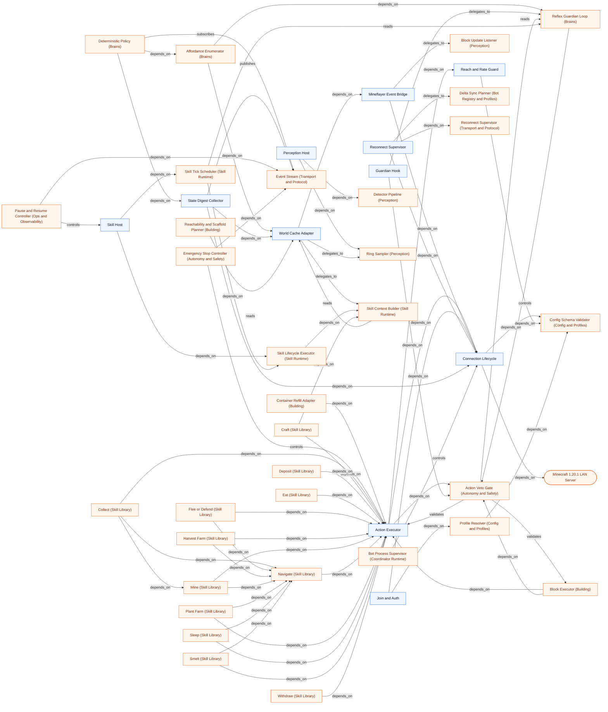
```mermaid
flowchart LR
n52["Connection Lifecycle"]
n106["Join and Auth"]
n53["Mineflayer Event Bridge"]
n54["World Cache Adapter"]
n107["Reach and Rate Guard"]
n55["Action Executor"]
n108["State Digest Collector"]
n56["Guardian Hook"]
n57["Skill Host"]
n109["Perception Host"]
n58["Reconnect Supervisor"]
n59["Action Veto Gate (Autonomy and Safety)"]
n127["Affordance Enumerator (Brains)"]
n140["Config Schema Validator (Config and Profiles)"]
n22(["Minecraft 1.20.1 LAN Server"])
n66["Deterministic Policy (Brains)"]
n215["Block Update Listener (Perception)"]
n65["Reflex Guardian Loop (Brains)"]
n146["Profile Resolver (Config and Profiles)"]
n221["Detector Pipeline (Perception)"]
n213["Ring Sampler (Perception)"]
n169["Delta Sync Planner (Bot Registry and Profiles)"]
n152["Reconnect Supervisor (Transport and Protocol)"]
n79["Skill Lifecycle Executor (Skill Runtime)"]
n80["Skill Tick Scheduler (Skill Runtime)"]
n150["Event Stream (Transport and Protocol)"]
n50["Skill Context Builder (Skill Runtime)"]
n51["Block Executor (Building)"]
n104["Container Refill Adapter (Building)"]
n101["Reachability and Scaffold Planner (Building)"]
n63["Pause and Resume Controller (Ops and Observability)"]
n61["Emergency Stop Controller (Autonomy and Safety)"]
n232["Collect (Skill Library)"]
n228["Craft (Skill Library)"]
n209["Deposit (Skill Library)"]
n234["Eat (Skill Library)"]
n236["Flee or Defend (Skill Library)"]
n179["Harvest Farm (Skill Library)"]
n231["Mine (Skill Library)"]
n229["Navigate (Skill Library)"]
n180["Plant Farm (Skill Library)"]
n235["Sleep (Skill Library)"]
n233["Smelt (Skill Library)"]
n212["Withdraw (Skill Library)"]
n31["Bot Process Supervisor (Coordinator Runtime)"]
n55 -->|depends_on| n52
n55 -->|depends_on| n107
n55 -->|depends_on| n59
n127 -->|depends_on| n54
n127 -->|depends_on| n65
n52 -->|depends_on| n140
n52 -->|depends_on| n22
n66 -->|depends_on| n127
n66 -->|depends_on| n108
n66 -->|subscribes| n150
n53 -->|depends_on| n52
n53 -->|delegates_to| n215
n56 -->|depends_on| n59
n56 -->|delegates_to| n65
n106 -->|depends_on| n52
n106 -->|depends_on| n146
n109 -->|depends_on| n221
n109 -->|depends_on| n213
n107 -->|depends_on| n140
n58 -->|depends_on| n52
n58 -->|delegates_to| n169
n58 -->|depends_on| n152
n57 -->|depends_on| n79
n57 -->|depends_on| n80
n108 -->|depends_on| n52
n108 -->|depends_on| n54
n108 -->|publishes| n150
n54 -->|depends_on| n53
n54 -->|delegates_to| n213
n54 -->|delegates_to| n50
n51 -->|depends_on| n55
n51 -->|depends_on| n59
n104 -->|depends_on| n55
n101 -->|reads| n54
n146 -->|depends_on| n140
n63 -->|controls| n57
n63 -->|depends_on| n150
n59 -->|validates| n55
n59 -->|validates| n51
n59 -->|reads| n65
n61 -->|controls| n55
n61 -->|depends_on| n150
n65 -->|controls| n59
n50 -->|reads| n54
n79 -->|depends_on| n50
n80 -->|reads| n65
n80 -->|depends_on| n79
n232 -->|depends_on| n55
n232 -->|depends_on| n231
n232 -->|depends_on| n229
n228 -->|depends_on| n55
n228 -->|depends_on| n50
n209 -->|depends_on| n55
n234 -->|depends_on| n55
n236 -->|depends_on| n55
n236 -->|depends_on| n229
n179 -->|depends_on| n55
n179 -->|depends_on| n229
n231 -->|depends_on| n55
n231 -->|depends_on| n229
n229 -->|depends_on| n55
n180 -->|depends_on| n55
n180 -->|depends_on| n229
n235 -->|depends_on| n55
n235 -->|depends_on| n229
n233 -->|depends_on| n55
n233 -->|depends_on| n229
n212 -->|depends_on| n55
n31 -->|controls| n52
classDef internal fill:#eef6ff,stroke:#2563eb,color:#0f172a;
classDef external fill:#fff7ed,stroke:#ea580c,color:#7c2d12;
class n52,n106,n53,n54,n107,n55,n108,n56,n57,n109,n58 internal;
class n59,n127,n140,n66,n215,n65,n146,n221,n213,n169,n152,n79,n80,n150,n50,n51,n104,n101,n63,n61,n232,n228,n209,n234,n236,n179,n231,n229,n180,n235,n233,n212,n31,n22 external;
```

### Autonomy and Safety

Source: `docs/architecture/graphs/system-safety.mmd`

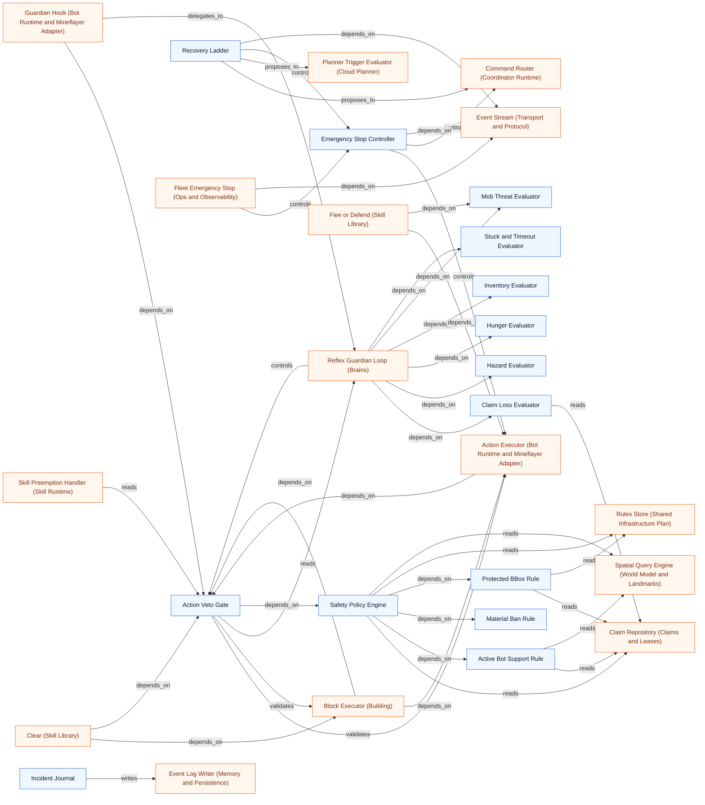
```mermaid
flowchart LR
n110["Hazard Evaluator"]
n111["Mob Threat Evaluator"]
n112["Hunger Evaluator"]
n113["Stuck and Timeout Evaluator"]
n114["Inventory Evaluator"]
n115["Claim Loss Evaluator"]
n116["Protected BBox Rule"]
n117["Active Bot Support Rule"]
n118["Material Ban Rule"]
n119["Safety Policy Engine"]
n59["Action Veto Gate"]
n60["Recovery Ladder"]
n61["Emergency Stop Controller"]
n120["Incident Journal"]
n55["Action Executor (Bot Runtime and Mineflayer Adapter)"]
n56["Guardian Hook (Bot Runtime and Mineflayer Adapter)"]
n51["Block Executor (Building)"]
n64["Fleet Emergency Stop (Ops and Observability)"]
n65["Reflex Guardian Loop (Brains)"]
n192["Claim Repository (Claims and Leases)"]
n175["Spatial Query Engine (World Model and Landmarks)"]
n27["Command Router (Coordinator Runtime)"]
n150["Event Stream (Transport and Protocol)"]
n191["Event Log Writer (Memory and Persistence)"]
n164["Rules Store (Shared Infrastructure Plan)"]
n41["Planner Trigger Evaluator (Cloud Planner)"]
n85["Skill Preemption Handler (Skill Runtime)"]
n238["Clear (Skill Library)"]
n236["Flee or Defend (Skill Library)"]
n55 -->|depends_on| n59
n56 -->|depends_on| n59
n56 -->|delegates_to| n65
n51 -->|depends_on| n55
n51 -->|depends_on| n59
n64 -->|controls| n61
n64 -->|depends_on| n150
n59 -->|validates| n55
n59 -->|validates| n51
n59 -->|reads| n65
n59 -->|depends_on| n119
n117 -->|reads| n192
n117 -->|reads| n175
n115 -->|reads| n192
n61 -->|controls| n55
n61 -->|controls| n27
n61 -->|depends_on| n150
n65 -->|controls| n59
n65 -->|depends_on| n115
n65 -->|depends_on| n110
n65 -->|depends_on| n112
n65 -->|depends_on| n114
n65 -->|depends_on| n111
n65 -->|depends_on| n113
n120 -->|writes| n191
n116 -->|reads| n192
n116 -->|reads| n164
n60 -->|proposes_to| n27
n60 -->|proposes_to| n41
n60 -->|controls| n61
n60 -->|depends_on| n150
n119 -->|reads| n192
n119 -->|depends_on| n117
n119 -->|depends_on| n118
n119 -->|depends_on| n116
n119 -->|reads| n164
n119 -->|reads| n175
n85 -->|reads| n59
n238 -->|depends_on| n51
n238 -->|depends_on| n59
n236 -->|depends_on| n55
n236 -->|depends_on| n111
classDef internal fill:#eef6ff,stroke:#2563eb,color:#0f172a;
classDef external fill:#fff7ed,stroke:#ea580c,color:#7c2d12;
class n110,n111,n112,n113,n114,n115,n116,n117,n118,n119,n59,n60,n61,n120 internal;
class n55,n56,n51,n64,n65,n192,n175,n27,n150,n191,n164,n41,n85,n238,n236 external;
```

### Memory and Persistence

Source: `docs/architecture/graphs/system-memory.mmd`

```mermaid
flowchart LR
n242["SQLite Runtime"]
n142["Migration Runner"]
n136["Transaction Manager"]
n191["Event Log Writer"]
n241["Block Changelog Writer"]
n138["Retention Pruner"]
n243["Snapshot Export"]
n244["Schema Version Registry"]
n245["Episode Store"]
n190["Bot Profile Store (Bot Registry and Profiles)"]
n105["Rollback Journal (Building)"]
n131["Atomic Claim Acquirer (Claims and Leases)"]
n192["Claim Repository (Claims and Leases)"]
n129["Fencing Token Authority (Claims and Leases)"]
n28["Coordinator Epoch Authority (Coordinator Runtime)"]
n29["Global Scheduler (Coordinator Runtime)"]
n67["Process Bootstrap (Coordinator Runtime)"]
n30["Restart Recovery Orchestrator (Coordinator Runtime)"]
n246["Replay Engine (Testing and Evaluation)"]
n196["Grant Repository (Edit Grants and Collaboration)"]
n126["Audit Viewer (Ops and Observability)"]
n125["Health and Readiness (Ops and Observability)"]
n76["Plan Cache (Cloud Planner)"]
n120["Incident Journal (Autonomy and Safety)"]
n162["Container Registry (Shared Infrastructure Plan)"]
n161["Farm Store (Shared Infrastructure Plan)"]
n163["Path Graph Store (Shared Infrastructure Plan)"]
n165["SIP Revision Manager (Shared Infrastructure Plan)"]
n160["Road Store (Shared Infrastructure Plan)"]
n164["Rules Store (Shared Infrastructure Plan)"]
n159["Structure Store (Shared Infrastructure Plan)"]
n133["SIP Transactional Committer (Shared Infrastructure Plan)"]
n158["Zone Store (Shared Infrastructure Plan)"]
n82["Skill Checkpoint Manager (Skill Runtime)"]
n134["Atomic Task Claimer (Task Board)"]
n181["Task Repository (Task Board)"]
n187["Task State Machine (Task Board)"]
n247["Trace Exporter (Laya Training)"]
n203["Chunk Version Store (World Model and Landmarks)"]
n207["Landmark Registry (World Model and Landmarks)"]
n190 -->|depends_on| n136
n105 -->|writes| n241
n105 -->|reads| n159
n131 -->|writes| n192
n131 -->|depends_on| n136
n192 -->|depends_on| n136
n129 -->|depends_on| n28
n129 -->|depends_on| n136
n28 -->|controls| n129
n28 -->|depends_on| n136
n29 -->|depends_on| n28
n29 -->|delegates_to| n138
n67 -->|depends_on| n30
n67 -->|depends_on| n142
n30 -->|depends_on| n136
n246 -->|depends_on| n191
n196 -->|depends_on| n136
n241 -->|depends_on| n136
n191 -->|depends_on| n136
n142 -->|depends_on| n242
n138 -->|depends_on| n241
n138 -->|depends_on| n191
n138 -->|depends_on| n136
n244 -->|depends_on| n142
n243 -->|depends_on| n136
n136 -->|depends_on| n242
n126 -->|reads| n241
n126 -->|reads| n191
n125 -->|depends_on| n242
n76 -->|depends_on| n136
n120 -->|writes| n191
n162 -->|depends_on| n136
n161 -->|depends_on| n136
n163 -->|depends_on| n136
n165 -->|depends_on| n136
n165 -->|depends_on| n164
n160 -->|depends_on| n136
n164 -->|depends_on| n136
n159 -->|depends_on| n136
n133 -->|depends_on| n136
n133 -->|writes| n162
n133 -->|writes| n161
n133 -->|writes| n163
n133 -->|depends_on| n165
n133 -->|writes| n160
n133 -->|writes| n164
n133 -->|writes| n159
n133 -->|writes| n158
n158 -->|depends_on| n136
n82 -->|depends_on| n136
n134 -->|depends_on| n136
n134 -->|writes| n181
n181 -->|depends_on| n136
n187 -->|depends_on| n191
n187 -->|writes| n181
n247 -->|reads| n191
n203 -->|depends_on| n136
n207 -->|depends_on| n136
n246 -->|reads| n245
n247 -->|reads| n245
n126 -->|reads| n245
n138 -->|depends_on| n245
classDef internal fill:#eef6ff,stroke:#2563eb,color:#0f172a;
classDef external fill:#fff7ed,stroke:#ea580c,color:#7c2d12;
class n242,n142,n136,n191,n241,n138,n243,n244,n245 internal;
class n190,n105,n131,n192,n129,n28,n29,n67,n30,n246,n196,n126,n125,n76,n120,n162,n161,n163,n165,n160,n164,n159,n133,n158,n82,n134,n181,n187,n247,n203,n207 external;
```

### Ops and Observability

Source: `docs/architecture/graphs/system-ops.mmd`

```mermaid
flowchart LR
n62["Ops API"]
n121["Status Aggregator"]
n63["Pause and Resume Controller"]
n64["Fleet Emergency Stop"]
n122["SIP Dump"]
n123["Metrics Registry"]
n124["Structured Logger"]
n125["Health and Readiness"]
n126["Audit Viewer"]
n194["Contention Metrics (Claims and Leases)"]
n33["Execution Provider Selector (Laya Decision Service)"]
n75["Latency Metrics (Laya Decision Service)"]
n248["Metrics Reporter (Testing and Evaluation)"]
n26(["Fleet Operator"])
n241["Block Changelog Writer (Memory and Persistence)"]
n191["Event Log Writer (Memory and Persistence)"]
n61["Emergency Stop Controller (Autonomy and Safety)"]
n150["Event Stream (Transport and Protocol)"]
n32["Model Loader (Laya Decision Service)"]
n242["SQLite Runtime (Memory and Persistence)"]
n135["Message Schema Registry (Transport and Protocol)"]
n57["Skill Host (Bot Runtime and Mineflayer Adapter)"]
n148["Presence Tracker (Bot Registry and Profiles)"]
n165["SIP Revision Manager (Shared Infrastructure Plan)"]
n192["Claim Repository (Claims and Leases)"]
n181["Task Repository (Task Board)"]
n47["Planner Budget Limiter (Cloud Planner)"]
n41["Planner Trigger Evaluator (Cloud Planner)"]
n81["Skill Progress Reporter (Skill Runtime)"]
n245["Episode Store (Memory and Persistence)"]
n194 -->|depends_on| n192
n194 -->|observes| n123
n33 -->|controls| n32
n33 -->|observes| n124
n75 -->|observes| n123
n75 -->|writes| n123
n248 -->|observes| n123
n26 -->|controls| n62
n126 -->|reads| n241
n126 -->|reads| n191
n64 -->|controls| n61
n64 -->|depends_on| n150
n125 -->|depends_on| n32
n125 -->|depends_on| n242
n125 -->|depends_on| n121
n62 -->|depends_on| n64
n62 -->|depends_on| n63
n62 -->|depends_on| n121
n62 -->|depends_on| n135
n63 -->|controls| n57
n63 -->|depends_on| n148
n63 -->|depends_on| n150
n122 -->|depends_on| n165
n121 -->|depends_on| n148
n121 -->|reads| n192
n121 -->|observes| n123
n121 -->|reads| n165
n121 -->|reads| n181
n47 -->|observes| n123
n41 -->|observes| n123
n41 -->|reads| n165
n61 -->|depends_on| n150
n81 -->|observes| n123
n81 -->|publishes| n150
n126 -->|reads| n245
classDef internal fill:#eef6ff,stroke:#2563eb,color:#0f172a;
classDef external fill:#fff7ed,stroke:#ea580c,color:#7c2d12;
class n62,n121,n63,n64,n122,n123,n124,n125,n126 internal;
class n194,n33,n75,n248,n241,n191,n61,n150,n32,n242,n135,n57,n148,n165,n192,n181,n47,n41,n81,n245,n26 external;
```

### Config and Profiles

Source: `docs/architecture/graphs/system-config.mmd`

```mermaid
flowchart LR
n141["Environment Parser"]
n140["Config Schema Validator"]
n146["Profile Resolver"]
n224["Hardware Probe"]
n156["Secrets Loader"]
n202["Name Pool Validator"]
n225["Laya Runtime Resolver"]
n249["Fail Fast Handler"]
n52["Connection Lifecycle (Bot Runtime and Mineflayer Adapter)"]
n106["Join and Auth (Bot Runtime and Mineflayer Adapter)"]
n107["Reach and Rate Guard (Bot Runtime and Mineflayer Adapter)"]
n147["Bot Identity Authenticator (Bot Registry and Profiles)"]
n201["Name Pool Allocator (Bot Registry and Profiles)"]
n25(["Host Hardware"])
n67["Process Bootstrap (Coordinator Runtime)"]
n68["Service Composition (Coordinator Runtime)"]
n37["Confidence Calibrator (Laya Decision Service)"]
n33["Execution Provider Selector (Laya Decision Service)"]
n32["Model Loader (Laya Decision Service)"]
n72["Decision Rate Limiter (Laya Decision Service)"]
n222["Perception Rate Limiter (Perception)"]
n39["OpenAI-Compatible Client (Cloud Planner)"]
n153["Transport Authentication (Transport and Protocol)"]
n52 -->|depends_on| n140
n106 -->|depends_on| n52
n106 -->|depends_on| n146
n107 -->|depends_on| n140
n147 -->|depends_on| n156
n201 -->|depends_on| n202
n140 -->|depends_on| n141
n249 -->|depends_on| n140
n224 -->|depends_on| n146
n224 -->|depends_on| n25
n225 -->|depends_on| n224
n225 -->|depends_on| n146
n202 -->|depends_on| n140
n146 -->|depends_on| n140
n156 -->|depends_on| n141
n67 -->|depends_on| n140
n67 -->|depends_on| n141
n67 -->|depends_on| n68
n68 -->|depends_on| n146
n37 -->|depends_on| n140
n33 -->|depends_on| n224
n33 -->|controls| n32
n32 -->|depends_on| n225
n72 -->|depends_on| n146
n222 -->|depends_on| n146
n39 -->|depends_on| n140
n39 -->|depends_on| n156
n153 -->|depends_on| n147
n153 -->|depends_on| n156
classDef internal fill:#eef6ff,stroke:#2563eb,color:#0f172a;
classDef external fill:#fff7ed,stroke:#ea580c,color:#7c2d12;
class n141,n140,n146,n224,n156,n202,n225,n249 internal;
class n52,n106,n107,n147,n201,n67,n68,n37,n33,n32,n72,n222,n39,n153,n25 external;
```

### Testing and Evaluation

Source: `docs/architecture/graphs/system-eval.mmd`

```mermaid
flowchart LR
n250["Unit Fixtures"]
n223["Detector Fixtures"]
n251["Docker Server Harness"]
n252["Scenario Runner"]
n246["Replay Engine"]
n189["Contention Harness"]
n248["Metrics Reporter"]
n253["Soak Runner"]
n254["Architecture Guard Tests"]
n226["Laya Benchmark Harness"]
n192["Claim Repository (Claims and Leases)"]
n181["Task Repository (Task Board)"]
n221["Detector Pipeline (Perception)"]
n22(["Minecraft 1.20.1 LAN Server"])
n75["Latency Metrics (Laya Decision Service)"]
n32["Model Loader (Laya Decision Service)"]
n123["Metrics Registry (Ops and Observability)"]
n191["Event Log Writer (Memory and Persistence)"]
n255["Promotion Gate (Laya Training)"]
n245["Episode Store (Memory and Persistence)"]
n75 -->|observes| n123
n75 -->|writes| n123
n254 -->|depends_on| n250
n189 -->|depends_on| n192
n189 -->|delegates_to| n252
n189 -->|depends_on| n181
n223 -->|depends_on| n250
n223 -->|depends_on| n221
n251 -->|depends_on| n250
n251 -->|depends_on| n22
n226 -->|depends_on| n75
n226 -->|depends_on| n32
n226 -->|delegates_to| n252
n248 -->|observes| n123
n246 -->|depends_on| n252
n246 -->|depends_on| n191
n252 -->|controls| n251
n252 -->|publishes| n248
n253 -->|depends_on| n248
n253 -->|delegates_to| n252
n255 -->|depends_on| n226
n246 -->|reads| n245
classDef internal fill:#eef6ff,stroke:#2563eb,color:#0f172a;
classDef external fill:#fff7ed,stroke:#ea580c,color:#7c2d12;
class n250,n223,n251,n252,n246,n189,n248,n253,n254,n226 internal;
class n192,n181,n221,n75,n32,n123,n191,n255,n245,n22 external;
```

### Laya Training

Source: `docs/architecture/graphs/system-training.mmd`

```mermaid
flowchart LR
n247["Trace Exporter"]
n256["Labeling Pipeline"]
n257["Reward Computer"]
n258["Fine-tune Runner"]
n259["ONNX Exporter"]
n227["Calibration Fitter"]
n255["Promotion Gate"]
n37["Confidence Calibrator (Laya Decision Service)"]
n226["Laya Benchmark Harness (Testing and Evaluation)"]
n191["Event Log Writer (Memory and Persistence)"]
n245["Episode Store (Memory and Persistence)"]
n227 -->|reads| n37
n227 -->|depends_on| n247
n258 -->|depends_on| n256
n258 -->|depends_on| n257
n256 -->|depends_on| n247
n259 -->|depends_on| n258
n255 -->|depends_on| n226
n255 -->|depends_on| n227
n255 -->|depends_on| n259
n257 -->|depends_on| n247
n247 -->|reads| n191
n247 -->|reads| n245
classDef internal fill:#eef6ff,stroke:#2563eb,color:#0f172a;
classDef external fill:#fff7ed,stroke:#ea580c,color:#7c2d12;
class n247,n256,n257,n258,n259,n227,n255 internal;
class n37,n226,n191,n245 external;
```

### Brains

Source: `docs/architecture/graphs/system-brains.mmd`

```mermaid
flowchart LR
n65["Reflex Guardian Loop"]
n127["Affordance Enumerator"]
n66["Deterministic Policy"]
n128["Laya Client"]
n54["World Cache Adapter (Bot Runtime and Mineflayer Adapter)"]
n78["Skill Registry (Skill Runtime)"]
n108["State Digest Collector (Bot Runtime and Mineflayer Adapter)"]
n199["Behavior Profile Manager (Bot Registry and Profiles)"]
n150["Event Stream (Transport and Protocol)"]
n56["Guardian Hook (Bot Runtime and Mineflayer Adapter)"]
n37["Confidence Calibrator (Laya Decision Service)"]
n59["Action Veto Gate (Autonomy and Safety)"]
n115["Claim Loss Evaluator (Autonomy and Safety)"]
n110["Hazard Evaluator (Autonomy and Safety)"]
n112["Hunger Evaluator (Autonomy and Safety)"]
n114["Inventory Evaluator (Autonomy and Safety)"]
n111["Mob Threat Evaluator (Autonomy and Safety)"]
n113["Stuck and Timeout Evaluator (Autonomy and Safety)"]
n80["Skill Tick Scheduler (Skill Runtime)"]
n143["WebSocket Codec (Transport and Protocol)"]
n127 -->|depends_on| n54
n127 -->|depends_on| n65
n127 -->|depends_on| n78
n66 -->|depends_on| n127
n66 -->|depends_on| n108
n66 -->|reads| n199
n66 -->|subscribes| n150
n56 -->|depends_on| n59
n56 -->|delegates_to| n65
n108 -->|depends_on| n54
n108 -->|publishes| n150
n37 -->|proposes_to| n66
n59 -->|reads| n65
n65 -->|controls| n59
n65 -->|depends_on| n115
n65 -->|depends_on| n110
n65 -->|depends_on| n112
n65 -->|depends_on| n114
n65 -->|depends_on| n111
n65 -->|depends_on| n113
n80 -->|reads| n65
n150 -->|depends_on| n143
n128 -->|depends_on| n127
n128 -->|depends_on| n143
n128 -->|depends_on| n66
classDef internal fill:#eef6ff,stroke:#2563eb,color:#0f172a;
classDef external fill:#fff7ed,stroke:#ea580c,color:#7c2d12;
class n65,n127,n66,n128 internal;
class n54,n78,n108,n199,n150,n56,n37,n59,n115,n110,n112,n114,n111,n113,n80,n143 external;
```
