# TiCrafter Architecture Graphs

> Generated from `docs/architecture/graph.json`. Edit the graph, then run `bun tools/architecture/render-graphs.mjs`.

Mermaid source lives in `docs/architecture/graphs/`. GitHub renders these fenced blocks directly. For local SVG rendering, run `bun run render:svg -- <input.mmd> <output.svg>`; it uses the installed Firefox browser and never downloads Chromium.

## Fleet overview

Systems and externals with aggregated relation counts.

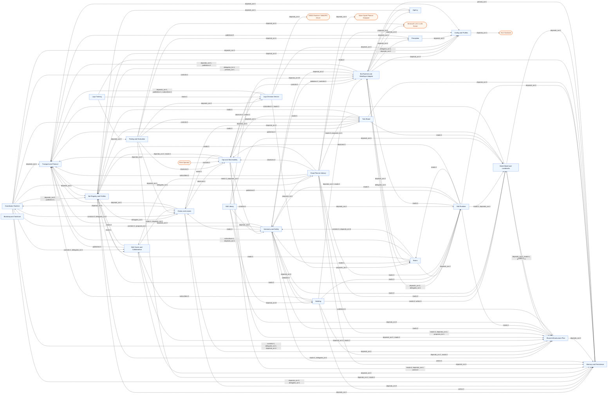
```mermaid
flowchart LR
n0["Coordinator Runtime"]
n1["Transport and Protocol"]
n2["Shared Infrastructure Plan"]
n3["Task Board"]
n4["Claims and Leases"]
n5["Edit Grants and Collaboration"]
n6["Bot Registry and Profiles"]
n7["World Model and Landmarks"]
n8["Perception"]
n9["Laya Decision Service"]
n10["Cloud Planner Advisor"]
n11["Skill Runtime"]
n12["Skill Library"]
n13["Building"]
n14["Bot Runtime and Mineflayer Adapter"]
n15["Autonomy and Safety"]
n16["Memory and Persistence"]
n17["Ops and Observability"]
n18["Config and Profiles"]
n19["Testing and Evaluation"]
n20["Laya Training"]
n21["Brains"]
n22["Agency"]
n23["Bootstrap and Toolchain"]
n24(["Minecraft 1.20.1 LAN Server"])
n25(["Muse Spark Planner Endpoint"])
n26(["ONNX Runtime / WebGPU Driver"])
n27(["Host Hardware"])
n28(["Fleet Operator"])
n14 -->|depends_on×2| n15
n21 -->|depends_on×2| n14
n21 -->|depends_on×1| n11
n14 -->|depends_on×3| n18
n14 -->|depends_on×1| n24
n21 -->|reads×1| n6
n21 -->|subscribes×1, depends_on×1| n1
n14 -->|delegates_to×2, depends_on×2| n8
n14 -->|delegates_to×3| n21
n14 -->|delegates_to×1, persists_to×1| n6
n14 -->|depends_on×1, publishes×2| n1
n14 -->|depends_on×2, delegates_to×1| n11
n6 -->|reads×1| n5
n6 -->|reads×1, delegates_to×1| n2
n6 -->|reads×1| n3
n6 -->|depends_on×2| n18
n6 -->|depends_on×2| n16
n6 -->|delegates_to×1| n4
n6 -->|reads×1| n11
n13 -->|depends_on×2, reads×1| n14
n13 -->|depends_on×1| n15
n13 -->|reads×4, writes×1| n7
n13 -->|depends_on×1, reads×2| n2
n13 -->|reads×1| n11
n13 -->|writes×1| n16
n13 -->|subscribes×1| n1
n4 -->|depends_on×3| n16
n4 -->|depends_on×2| n3
n4 -->|observes×1| n17
n4 -->|depends_on×1| n0
n4 -->|depends_on×1| n2
n18 -->|depends_on×1| n27
n0 -->|depends_on×4| n1
n0 -->|controls×2, delegates_to×2| n4
n0 -->|controls×1, delegates_to×1| n5
n0 -->|controls×1, delegates_to×1, depends_on×1| n2
n0 -->|controls×1| n3
n0 -->|depends_on×3, delegates_to×1| n16
n0 -->|delegates_to×1| n10
n0 -->|depends_on×3| n18
n0 -->|depends_on×2, publishes×1| n6
n9 -->|proposes_to×1| n21
n9 -->|depends_on×4| n18
n9 -->|depends_on×1, publishes×1, subscribes×1| n1
n9 -->|observes×2, writes×1| n17
n9 -->|depends_on×1| n26
n19 -->|depends_on×1| n4
n19 -->|depends_on×1| n3
n19 -->|depends_on×1| n8
n19 -->|depends_on×1| n24
n19 -->|depends_on×2| n9
n19 -->|observes×1| n17
n19 -->|depends_on×1, reads×1| n16
n28 -->|controls×1| n17
n5 -->|publishes×1| n1
n5 -->|reads×1, depends_on×1| n4
n5 -->|depends_on×3, reads×1| n2
n5 -->|depends_on×1| n16
n5 -->|reads×2| n6
n17 -->|reads×4, depends_on×1, writes×2| n16
n17 -->|controls×1| n15
n17 -->|depends_on×3| n1
n17 -->|depends_on×1| n9
n17 -->|controls×1| n14
n17 -->|depends_on×2, reads×1| n6
n17 -->|depends_on×1, reads×1| n2
n17 -->|reads×1| n4
n17 -->|reads×1| n3
n8 -->|publishes×2| n1
n8 -->|depends_on×1| n18
n10 -->|reads×1, proposes_to×1| n5
n10 -->|subscribes×1| n1
n10 -->|observes×2| n17
n10 -->|reads×1| n6
n10 -->|reads×4, depends_on×1, proposes_to×1| n2
n10 -->|reads×2, proposes_to×1| n3
n10 -->|reads×2| n7
n10 -->|depends_on×2| n18
n10 -->|depends_on×1| n25
n10 -->|depends_on×1| n16
n10 -->|reads×1| n11
n15 -->|validates×1, controls×1| n14
n15 -->|validates×1| n13
n15 -->|reads×1| n21
n15 -->|reads×4| n4
n15 -->|reads×2| n7
n15 -->|controls×1, proposes_to×1| n0
n15 -->|depends_on×2| n1
n21 -->|controls×1, depends_on×6| n15
n15 -->|writes×1| n16
n15 -->|reads×2| n2
n15 -->|proposes_to×1| n10
n2 -->|depends_on×9| n16
n2 -->|depends_on×2, reads×1, publishes×1| n7
n2 -->|publishes×1| n5
n11 -->|depends_on×1| n16
n11 -->|reads×1| n14
n11 -->|reads×1| n2
n11 -->|reads×1, depends_on×1| n7
n11 -->|publishes×2| n1
n11 -->|reads×1| n15
n11 -->|observes×1| n17
n11 -->|reads×1| n21
n12 -->|depends_on×8| n13
n12 -->|depends_on×2| n15
n12 -->|depends_on×20| n14
n12 -->|depends_on×4| n11
n12 -->|depends_on×4| n7
n12 -->|depends_on×3| n2
n3 -->|depends_on×3| n16
n3 -->|reads×1| n7
n3 -->|reads×1| n6
n20 -->|reads×1| n9
n20 -->|depends_on×1| n19
n20 -->|reads×2| n16
n1 -->|depends_on×1| n6
n1 -->|depends_on×1| n18
n1 -->|publishes×1| n7
n7 -->|depends_on×2| n16
n7 -->|reads×2| n2
n7 -->|subscribes×1, reads×1| n1
n0 -->|controls×1| n14
n14 -->|depends_on×4| n22
n14 -->|persists_to×1| n16
n4 -->|depends_on×1| n1
n22 -->|proposes_to×1| n14
n6 -->|depends_on×1| n22
classDef system fill:#eef6ff,stroke:#2563eb,color:#0f172a;
classDef external fill:#fff7ed,stroke:#ea580c,color:#7c2d12;
class n0,n1,n2,n3,n4,n5,n6,n7,n8,n9,n10,n11,n12,n13,n14,n15,n16,n17,n18,n19,n20,n21,n22,n23 system;
class n24,n25,n26,n27,n28 external;
```

## Cross-system dependencies

System-to-system view with relation types.

```mermaid
flowchart LR
n0["Coordinator Runtime"]
n1["Transport and Protocol"]
n2["Shared Infrastructure Plan"]
n3["Task Board"]
n4["Claims and Leases"]
n5["Edit Grants and Collaboration"]
n6["Bot Registry and Profiles"]
n7["World Model and Landmarks"]
n8["Perception"]
n9["Laya Decision Service"]
n10["Cloud Planner Advisor"]
n11["Skill Runtime"]
n12["Skill Library"]
n13["Building"]
n14["Bot Runtime and Mineflayer Adapter"]
n15["Autonomy and Safety"]
n16["Memory and Persistence"]
n17["Ops and Observability"]
n18["Config and Profiles"]
n19["Testing and Evaluation"]
n20["Laya Training"]
n21["Brains"]
n22["Agency"]
n23["Bootstrap and Toolchain"]
n14 -->|depends_on×2| n15
n21 -->|depends_on×2| n14
n21 -->|depends_on×1| n11
n14 -->|depends_on×3| n18
n21 -->|reads×1| n6
n21 -->|subscribes×1, depends_on×1| n1
n14 -->|delegates_to×2, depends_on×2| n8
n14 -->|delegates_to×3| n21
n14 -->|delegates_to×1, persists_to×1| n6
n14 -->|depends_on×1, publishes×2| n1
n14 -->|depends_on×2, delegates_to×1| n11
n6 -->|reads×1| n5
n6 -->|reads×1, delegates_to×1| n2
n6 -->|reads×1| n3
n6 -->|depends_on×2| n18
n6 -->|depends_on×2| n16
n6 -->|delegates_to×1| n4
n6 -->|reads×1| n11
n13 -->|depends_on×2, reads×1| n14
n13 -->|depends_on×1| n15
n13 -->|reads×4, writes×1| n7
n13 -->|depends_on×1, reads×2| n2
n13 -->|reads×1| n11
n13 -->|writes×1| n16
n13 -->|subscribes×1| n1
n4 -->|depends_on×3| n16
n4 -->|depends_on×2| n3
n4 -->|observes×1| n17
n4 -->|depends_on×1| n0
n4 -->|depends_on×1| n2
n0 -->|depends_on×4| n1
n0 -->|controls×2, delegates_to×2| n4
n0 -->|controls×1, delegates_to×1| n5
n0 -->|controls×1, delegates_to×1, depends_on×1| n2
n0 -->|controls×1| n3
n0 -->|depends_on×3, delegates_to×1| n16
n0 -->|delegates_to×1| n10
n0 -->|depends_on×3| n18
n0 -->|depends_on×2, publishes×1| n6
n9 -->|proposes_to×1| n21
n9 -->|depends_on×4| n18
n9 -->|depends_on×1, publishes×1, subscribes×1| n1
n9 -->|observes×2, writes×1| n17
n19 -->|depends_on×1| n4
n19 -->|depends_on×1| n3
n19 -->|depends_on×1| n8
n19 -->|depends_on×2| n9
n19 -->|observes×1| n17
n19 -->|depends_on×1, reads×1| n16
n5 -->|publishes×1| n1
n5 -->|reads×1, depends_on×1| n4
n5 -->|depends_on×3, reads×1| n2
n5 -->|depends_on×1| n16
n5 -->|reads×2| n6
n17 -->|reads×4, depends_on×1, writes×2| n16
n17 -->|controls×1| n15
n17 -->|depends_on×3| n1
n17 -->|depends_on×1| n9
n17 -->|controls×1| n14
n17 -->|depends_on×2, reads×1| n6
n17 -->|depends_on×1, reads×1| n2
n17 -->|reads×1| n4
n17 -->|reads×1| n3
n8 -->|publishes×2| n1
n8 -->|depends_on×1| n18
n10 -->|reads×1, proposes_to×1| n5
n10 -->|subscribes×1| n1
n10 -->|observes×2| n17
n10 -->|reads×1| n6
n10 -->|reads×4, depends_on×1, proposes_to×1| n2
n10 -->|reads×2, proposes_to×1| n3
n10 -->|reads×2| n7
n10 -->|depends_on×2| n18
n10 -->|depends_on×1| n16
n10 -->|reads×1| n11
n15 -->|validates×1, controls×1| n14
n15 -->|validates×1| n13
n15 -->|reads×1| n21
n15 -->|reads×4| n4
n15 -->|reads×2| n7
n15 -->|controls×1, proposes_to×1| n0
n15 -->|depends_on×2| n1
n21 -->|controls×1, depends_on×6| n15
n15 -->|writes×1| n16
n15 -->|reads×2| n2
n15 -->|proposes_to×1| n10
n2 -->|depends_on×9| n16
n2 -->|depends_on×2, reads×1, publishes×1| n7
n2 -->|publishes×1| n5
n11 -->|depends_on×1| n16
n11 -->|reads×1| n14
n11 -->|reads×1| n2
n11 -->|reads×1, depends_on×1| n7
n11 -->|publishes×2| n1
n11 -->|reads×1| n15
n11 -->|observes×1| n17
n11 -->|reads×1| n21
n12 -->|depends_on×8| n13
n12 -->|depends_on×2| n15
n12 -->|depends_on×20| n14
n12 -->|depends_on×4| n11
n12 -->|depends_on×4| n7
n12 -->|depends_on×3| n2
n3 -->|depends_on×3| n16
n3 -->|reads×1| n7
n3 -->|reads×1| n6
n20 -->|reads×1| n9
n20 -->|depends_on×1| n19
n20 -->|reads×2| n16
n1 -->|depends_on×1| n6
n1 -->|depends_on×1| n18
n1 -->|publishes×1| n7
n7 -->|depends_on×2| n16
n7 -->|reads×2| n2
n7 -->|subscribes×1, reads×1| n1
n0 -->|controls×1| n14
n14 -->|depends_on×4| n22
n14 -->|persists_to×1| n16
n4 -->|depends_on×1| n1
n22 -->|proposes_to×1| n14
n6 -->|depends_on×1| n22
classDef system fill:#eef6ff,stroke:#2563eb,color:#0f172a;
class n0,n1,n2,n3,n4,n5,n6,n7,n8,n9,n10,n11,n12,n13,n14,n15,n16,n17,n18,n19,n20,n21,n22,n23 system;
```

## Safety and control authority

Guardian veto, grant/claim control, ops stop path, and planner proposal path.

```mermaid
flowchart TD
n0["Coordinator Runtime"]
n9["Laya Decision Service"]
n10["Cloud Planner Advisor"]
n11["Skill Runtime"]
n13["Building"]
n14["Bot Runtime and Mineflayer Adapter"]
n15["Autonomy and Safety"]
n17["Ops and Observability"]
n21["Brains"]
n28(["Fleet Operator"])
n14 -->|delegates_to| n21
n14 -->|delegates_to| n11
n0 -->|delegates_to| n10
n9 -->|proposes_to| n21
n17 -->|controls| n15
n17 -->|controls| n14
n15 -->|validates| n14
n15 -->|validates| n13
n15 -->|controls| n14
n15 -->|controls| n0
n21 -->|controls| n15
n15 -->|proposes_to| n0
n15 -->|proposes_to| n10
n0 -->|controls| n14
n29["Command Router"]
n30["Coordinator Epoch Authority"]
n31["Global Scheduler"]
n32["Restart Recovery Orchestrator"]
n33["Bot Process Supervisor"]
n34["Model Loader"]
n35["Execution Provider Selector"]
n36["Batch Runner"]
n37["Single In-flight Guard"]
n38["Output Parser"]
n39["Confidence Calibrator"]
n40["Timeout and Fallback Handler"]
n41["OpenAI-Compatible Client"]
n42["Planner Context Builder"]
n43["Planner Trigger Evaluator"]
n44["Planner Schema Validator"]
n45["Planner Semantic Validator"]
n46["Planner Repair Loop"]
n47["SIP Mutation Translator"]
n48["Task DAG Translator"]
n49["Planner Budget Limiter"]
n50["Planner Arbitration Handler"]
n51["Keep Last Good Fallback"]
n52["Skill Context Builder"]
n53["Block Executor"]
n54["Connection Lifecycle"]
n55["Mineflayer Event Bridge"]
n56["World Cache Adapter"]
n57["Action Executor"]
n58["Guardian Hook"]
n59["Skill Host"]
n60["Agent Loop"]
n61["Chat Adapter"]
n62["Reconnect Supervisor"]
n63["Action Veto Gate"]
n64["Recovery Ladder"]
n65["Emergency Stop Controller"]
n66["Ops API"]
n67["Pause and Resume Controller"]
n68["Fleet Emergency Stop"]
n69["Reflex Guardian Loop"]
n70["Deterministic Policy"]
n71["Laya Client"]
n58 -->|delegates_to| n69
n56 -->|delegates_to| n52
n31 -->|delegates_to| n43
n39 -->|proposes_to| n70
n35 -->|controls| n34
n37 -->|controls| n36
n40 -->|controls| n38
n68 -->|controls| n65
n67 -->|controls| n59
n49 -->|controls| n41
n41 -->|delegates_to| n50
n46 -->|controls| n51
n44 -->|controls| n46
n45 -->|controls| n46
n43 -->|delegates_to| n42
n63 -->|validates| n57
n63 -->|validates| n53
n65 -->|controls| n57
n65 -->|controls| n29
n69 -->|controls| n63
n64 -->|proposes_to| n29
n64 -->|proposes_to| n43
n64 -->|controls| n65
n33 -->|controls| n54
n60 -->|delegates_to| n71
n60 -->|delegates_to| n70
n60 -->|delegates_to| n59
classDef system fill:#eef6ff,stroke:#2563eb,color:#0f172a;
classDef component fill:#f8fafc,stroke:#64748b,color:#0f172a;
classDef external fill:#fff7ed,stroke:#ea580c,color:#7c2d12;
class n0,n9,n10,n11,n13,n14,n15,n17,n21 system;
class n29,n30,n31,n32,n33,n34,n35,n36,n37,n38,n39,n40,n41,n42,n43,n44,n45,n46,n47,n48,n49,n50,n51,n52,n53,n54,n55,n56,n57,n58,n59,n60,n61,n62,n63,n64,n65,n66,n67,n68,n69,n70,n71 component;
class n28 external;
```

## Data flow

Perception, world model, SIP, decisions, skills, building, and persistence.

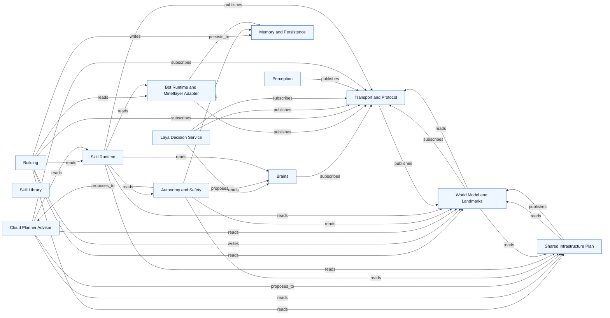
```mermaid
flowchart LR
n1["Transport and Protocol"]
n2["Shared Infrastructure Plan"]
n7["World Model and Landmarks"]
n8["Perception"]
n9["Laya Decision Service"]
n10["Cloud Planner Advisor"]
n11["Skill Runtime"]
n12["Skill Library"]
n13["Building"]
n14["Bot Runtime and Mineflayer Adapter"]
n15["Autonomy and Safety"]
n16["Memory and Persistence"]
n21["Brains"]
n21 -->|subscribes| n1
n14 -->|publishes| n1
n13 -->|reads| n7
n13 -->|writes| n7
n13 -->|reads| n11
n13 -->|reads| n14
n13 -->|writes| n16
n13 -->|reads| n2
n13 -->|subscribes| n1
n9 -->|proposes_to| n21
n9 -->|publishes| n1
n9 -->|subscribes| n1
n8 -->|publishes| n1
n10 -->|subscribes| n1
n10 -->|reads| n2
n10 -->|reads| n7
n10 -->|reads| n11
n10 -->|proposes_to| n2
n15 -->|reads| n21
n15 -->|reads| n7
n15 -->|writes| n16
n15 -->|reads| n2
n15 -->|proposes_to| n10
n2 -->|reads| n7
n2 -->|publishes| n7
n11 -->|reads| n14
n11 -->|reads| n2
n11 -->|reads| n7
n11 -->|publishes| n1
n11 -->|reads| n15
n11 -->|reads| n21
n1 -->|publishes| n7
n7 -->|reads| n2
n7 -->|subscribes| n1
n7 -->|reads| n1
n14 -->|persists_to| n16
classDef system fill:#eef6ff,stroke:#2563eb,color:#0f172a;
class n1,n2,n7,n8,n9,n10,n11,n12,n13,n14,n15,n16,n21 system;
```

## Per-system graphs

### Coordinator Runtime

Source: `docs/architecture/graphs/system-core.mmd`

```mermaid
flowchart LR
n72["Process Bootstrap"]
n73["Service Composition"]
n74["Bot Session Manager"]
n29["Command Router"]
n30["Coordinator Epoch Authority"]
n31["Global Scheduler"]
n32["Restart Recovery Orchestrator"]
n75["Backpressure Controller"]
n33["Bot Process Supervisor"]
n150["Fencing Token Authority (Claims and Leases)"]
n151["Flow Control (Transport and Protocol)"]
n152["Atomic Claim Acquirer (Claims and Leases)"]
n153["Grant Issuer (Edit Grants and Collaboration)"]
n154["SIP Transactional Committer (Shared Infrastructure Plan)"]
n155["Atomic Task Claimer (Task Board)"]
n156["Message Schema Registry (Transport and Protocol)"]
n157["Transaction Manager (Memory and Persistence)"]
n158["Lease Reaper (Claims and Leases)"]
n159["Retention Pruner (Memory and Persistence)"]
n43["Planner Trigger Evaluator (Cloud Planner Advisor)"]
n160["SIP Reconciliation Engine (Shared Infrastructure Plan)"]
n161["Config Schema Validator (Config and Profiles)"]
n162["Environment Parser (Config and Profiles)"]
n163["Migration Runner (Memory and Persistence)"]
n164["WebSocket Codec (Transport and Protocol)"]
n165["Resume Orchestrator (Bot Registry and Profiles)"]
n166["Grant Expiry (Edit Grants and Collaboration)"]
n167["Profile Resolver (Config and Profiles)"]
n168["Bot Identity Authenticator (Bot Registry and Profiles)"]
n169["Presence Tracker (Bot Registry and Profiles)"]
n65["Emergency Stop Controller (Autonomy and Safety)"]
n64["Recovery Ladder (Autonomy and Safety)"]
n54["Connection Lifecycle (Bot Runtime and Mineflayer Adapter)"]
n54 -->|depends_on| n161
n165 -->|delegates_to| n160
n152 -->|depends_on| n157
n150 -->|depends_on| n30
n150 -->|depends_on| n157
n161 -->|depends_on| n162
n167 -->|depends_on| n161
n75 -->|depends_on| n151
n29 -->|controls| n152
n29 -->|controls| n153
n29 -->|controls| n154
n29 -->|controls| n155
n29 -->|depends_on| n156
n30 -->|controls| n150
n30 -->|depends_on| n157
n31 -->|delegates_to| n158
n31 -->|depends_on| n30
n31 -->|delegates_to| n159
n31 -->|delegates_to| n43
n31 -->|delegates_to| n160
n72 -->|depends_on| n161
n72 -->|depends_on| n162
n72 -->|depends_on| n32
n72 -->|depends_on| n73
n72 -->|depends_on| n163
n72 -->|depends_on| n164
n32 -->|depends_on| n165
n32 -->|delegates_to| n158
n32 -->|delegates_to| n166
n32 -->|depends_on| n157
n32 -->|depends_on| n160
n73 -->|depends_on| n167
n73 -->|depends_on| n31
n74 -->|depends_on| n168
n74 -->|publishes| n169
n74 -->|depends_on| n164
n159 -->|depends_on| n157
n65 -->|controls| n29
n64 -->|proposes_to| n29
n64 -->|proposes_to| n43
n64 -->|controls| n65
n160 -->|depends_on| n154
n154 -->|depends_on| n157
n155 -->|depends_on| n157
n164 -->|depends_on| n156
n33 -->|controls| n54
n33 -->|depends_on| n30
n32 -->|depends_on| n33
classDef internal fill:#eef6ff,stroke:#2563eb,color:#0f172a;
classDef external fill:#fff7ed,stroke:#ea580c,color:#7c2d12;
class n72,n73,n74,n29,n30,n31,n32,n75,n33 internal;
class n150,n151,n152,n153,n154,n155,n156,n157,n158,n159,n43,n160,n161,n162,n163,n164,n165,n166,n167,n168,n169,n65,n64,n54 external;
```

### Transport and Protocol

Source: `docs/architecture/graphs/system-transport.mmd`

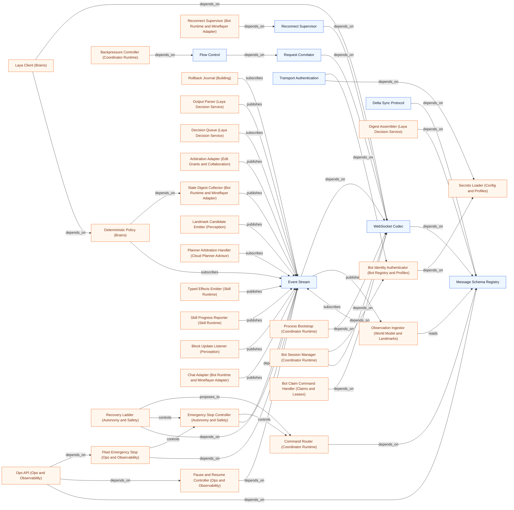
```mermaid
flowchart LR
n156["Message Schema Registry"]
n164["WebSocket Codec"]
n170["Request Correlator"]
n171["Event Stream"]
n172["Delta Sync Protocol"]
n173["Reconnect Supervisor"]
n174["Transport Authentication"]
n151["Flow Control"]
n70["Deterministic Policy (Brains)"]
n62["Reconnect Supervisor (Bot Runtime and Mineflayer Adapter)"]
n128["State Digest Collector (Bot Runtime and Mineflayer Adapter)"]
n110["Rollback Journal (Building)"]
n75["Backpressure Controller (Coordinator Runtime)"]
n29["Command Router (Coordinator Runtime)"]
n72["Process Bootstrap (Coordinator Runtime)"]
n74["Bot Session Manager (Coordinator Runtime)"]
n79["Digest Assembler (Laya Decision Service)"]
n38["Output Parser (Laya Decision Service)"]
n76["Decision Queue (Laya Decision Service)"]
n175["Arbitration Adapter (Edit Grants and Collaboration)"]
n68["Fleet Emergency Stop (Ops and Observability)"]
n66["Ops API (Ops and Observability)"]
n67["Pause and Resume Controller (Ops and Observability)"]
n176["Landmark Candidate Emitter (Perception)"]
n50["Planner Arbitration Handler (Cloud Planner Advisor)"]
n65["Emergency Stop Controller (Autonomy and Safety)"]
n64["Recovery Ladder (Autonomy and Safety)"]
n89["Typed Effects Emitter (Skill Runtime)"]
n86["Skill Progress Reporter (Skill Runtime)"]
n168["Bot Identity Authenticator (Bot Registry and Profiles)"]
n177["Secrets Loader (Config and Profiles)"]
n178["Observation Ingestor (World Model and Landmarks)"]
n71["Laya Client (Brains)"]
n179["Block Update Listener (Perception)"]
n61["Chat Adapter (Bot Runtime and Mineflayer Adapter)"]
n180["Bot Claim Command Handler (Claims and Leases)"]
n70 -->|depends_on| n128
n70 -->|subscribes| n171
n62 -->|depends_on| n173
n128 -->|publishes| n171
n168 -->|depends_on| n177
n110 -->|subscribes| n171
n75 -->|depends_on| n151
n29 -->|depends_on| n156
n72 -->|depends_on| n164
n74 -->|depends_on| n168
n74 -->|depends_on| n164
n79 -->|depends_on| n156
n38 -->|publishes| n171
n76 -->|subscribes| n171
n175 -->|publishes| n171
n68 -->|controls| n65
n68 -->|depends_on| n171
n66 -->|depends_on| n68
n66 -->|depends_on| n67
n66 -->|depends_on| n156
n67 -->|depends_on| n171
n176 -->|publishes| n171
n50 -->|subscribes| n171
n65 -->|controls| n29
n65 -->|depends_on| n171
n64 -->|proposes_to| n29
n64 -->|controls| n65
n64 -->|depends_on| n171
n89 -->|publishes| n171
n86 -->|publishes| n171
n174 -->|depends_on| n168
n174 -->|depends_on| n177
n172 -->|depends_on| n156
n171 -->|depends_on| n164
n171 -->|publishes| n178
n151 -->|depends_on| n170
n173 -->|depends_on| n164
n170 -->|depends_on| n164
n164 -->|depends_on| n156
n178 -->|subscribes| n171
n178 -->|reads| n156
n71 -->|depends_on| n164
n71 -->|depends_on| n70
n179 -->|publishes| n171
n61 -->|publishes| n171
n180 -->|depends_on| n164
classDef internal fill:#eef6ff,stroke:#2563eb,color:#0f172a;
classDef external fill:#fff7ed,stroke:#ea580c,color:#7c2d12;
class n156,n164,n170,n171,n172,n173,n174,n151 internal;
class n70,n62,n128,n110,n75,n29,n72,n74,n79,n38,n76,n175,n68,n66,n67,n176,n50,n65,n64,n89,n86,n168,n177,n178,n71,n179,n61,n180 external;
```

### Shared Infrastructure Plan

Source: `docs/architecture/graphs/system-sip.mmd`

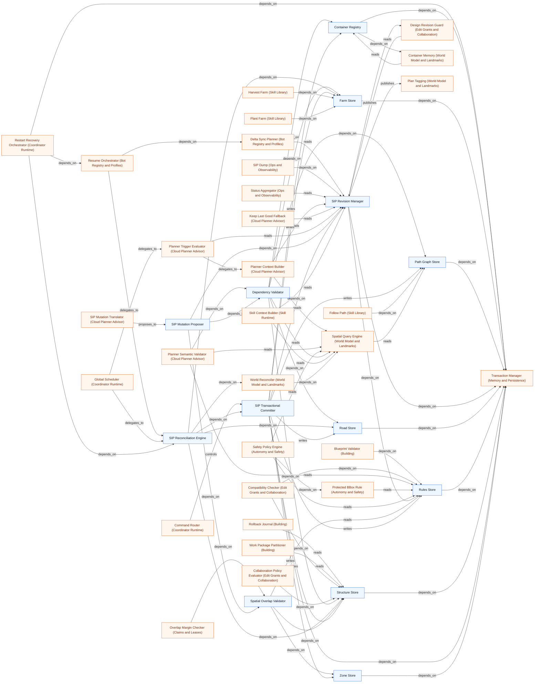
```mermaid
flowchart LR
n181["Zone Store"]
n182["Structure Store"]
n183["Road Store"]
n184["Farm Store"]
n185["Container Registry"]
n186["Path Graph Store"]
n187["Rules Store"]
n188["SIP Revision Manager"]
n189["Spatial Overlap Validator"]
n190["Dependency Validator"]
n191["SIP Mutation Proposer"]
n154["SIP Transactional Committer"]
n160["SIP Reconciliation Engine"]
n192["Delta Sync Planner (Bot Registry and Profiles)"]
n165["Resume Orchestrator (Bot Registry and Profiles)"]
n92["Blueprint Validator (Building)"]
n110["Rollback Journal (Building)"]
n104["Work Package Partitioner (Building)"]
n193["Overlap Margin Checker (Claims and Leases)"]
n29["Command Router (Coordinator Runtime)"]
n31["Global Scheduler (Coordinator Runtime)"]
n32["Restart Recovery Orchestrator (Coordinator Runtime)"]
n194["Compatibility Checker (Edit Grants and Collaboration)"]
n195["Design Revision Guard (Edit Grants and Collaboration)"]
n196["Collaboration Policy Evaluator (Edit Grants and Collaboration)"]
n144["SIP Dump (Ops and Observability)"]
n142["Status Aggregator (Ops and Observability)"]
n42["Planner Context Builder (Cloud Planner Advisor)"]
n51["Keep Last Good Fallback (Cloud Planner Advisor)"]
n45["Planner Semantic Validator (Cloud Planner Advisor)"]
n47["SIP Mutation Translator (Cloud Planner Advisor)"]
n43["Planner Trigger Evaluator (Cloud Planner Advisor)"]
n137["Protected BBox Rule (Autonomy and Safety)"]
n140["Safety Policy Engine (Autonomy and Safety)"]
n157["Transaction Manager (Memory and Persistence)"]
n197["Container Memory (World Model and Landmarks)"]
n198["Spatial Query Engine (World Model and Landmarks)"]
n199["World Reconciler (World Model and Landmarks)"]
n200["Plan Tagging (World Model and Landmarks)"]
n52["Skill Context Builder (Skill Runtime)"]
n201["Follow Path (Skill Library)"]
n202["Harvest Farm (Skill Library)"]
n203["Plant Farm (Skill Library)"]
n192 -->|reads| n188
n165 -->|depends_on| n192
n165 -->|delegates_to| n160
n92 -->|depends_on| n187
n110 -->|reads| n182
n104 -->|reads| n182
n193 -->|depends_on| n189
n29 -->|controls| n154
n31 -->|delegates_to| n43
n31 -->|delegates_to| n160
n32 -->|depends_on| n165
n32 -->|depends_on| n157
n32 -->|depends_on| n160
n194 -->|depends_on| n187
n194 -->|depends_on| n182
n195 -->|reads| n188
n196 -->|depends_on| n182
n144 -->|depends_on| n188
n142 -->|reads| n188
n42 -->|reads| n188
n42 -->|reads| n198
n51 -->|reads| n188
n45 -->|depends_on| n190
n45 -->|reads| n187
n45 -->|reads| n198
n47 -->|proposes_to| n191
n43 -->|delegates_to| n42
n43 -->|reads| n188
n137 -->|reads| n187
n140 -->|depends_on| n137
n140 -->|reads| n187
n140 -->|reads| n198
n185 -->|depends_on| n157
n185 -->|depends_on| n197
n190 -->|depends_on| n185
n190 -->|depends_on| n184
n190 -->|depends_on| n186
n190 -->|depends_on| n183
n190 -->|depends_on| n182
n190 -->|reads| n198
n184 -->|depends_on| n157
n191 -->|depends_on| n190
n191 -->|depends_on| n188
n191 -->|depends_on| n189
n186 -->|depends_on| n157
n160 -->|depends_on| n184
n160 -->|depends_on| n183
n160 -->|depends_on| n182
n160 -->|depends_on| n154
n160 -->|depends_on| n199
n188 -->|publishes| n195
n188 -->|depends_on| n157
n188 -->|depends_on| n187
n188 -->|publishes| n200
n183 -->|depends_on| n157
n187 -->|depends_on| n157
n189 -->|reads| n187
n189 -->|depends_on| n182
n189 -->|depends_on| n181
n182 -->|depends_on| n157
n154 -->|depends_on| n157
n154 -->|writes| n185
n154 -->|writes| n184
n154 -->|writes| n186
n154 -->|depends_on| n188
n154 -->|writes| n183
n154 -->|writes| n187
n154 -->|writes| n182
n154 -->|writes| n181
n181 -->|depends_on| n157
n52 -->|reads| n188
n52 -->|reads| n198
n201 -->|depends_on| n186
n202 -->|depends_on| n184
n203 -->|depends_on| n184
n197 -->|reads| n185
n198 -->|reads| n186
n199 -->|depends_on| n198
classDef internal fill:#eef6ff,stroke:#2563eb,color:#0f172a;
classDef external fill:#fff7ed,stroke:#ea580c,color:#7c2d12;
class n181,n182,n183,n184,n185,n186,n187,n188,n189,n190,n191,n154,n160 internal;
class n192,n165,n92,n110,n104,n193,n29,n31,n32,n194,n195,n196,n144,n142,n42,n51,n45,n47,n43,n137,n140,n157,n197,n198,n199,n200,n52,n201,n202,n203 external;
```

### Task Board

Source: `docs/architecture/graphs/system-tasks.mmd`

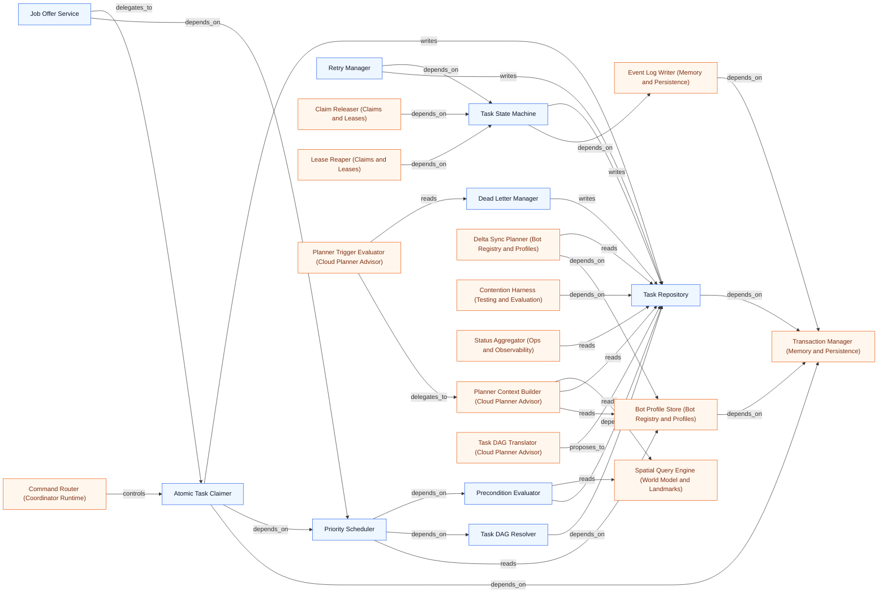
```mermaid
flowchart LR
n204["Task Repository"]
n205["Task DAG Resolver"]
n206["Precondition Evaluator"]
n207["Priority Scheduler"]
n155["Atomic Task Claimer"]
n208["Job Offer Service"]
n209["Retry Manager"]
n210["Dead Letter Manager"]
n211["Task State Machine"]
n192["Delta Sync Planner (Bot Registry and Profiles)"]
n212["Claim Releaser (Claims and Leases)"]
n158["Lease Reaper (Claims and Leases)"]
n29["Command Router (Coordinator Runtime)"]
n213["Contention Harness (Testing and Evaluation)"]
n142["Status Aggregator (Ops and Observability)"]
n42["Planner Context Builder (Cloud Planner Advisor)"]
n48["Task DAG Translator (Cloud Planner Advisor)"]
n43["Planner Trigger Evaluator (Cloud Planner Advisor)"]
n157["Transaction Manager (Memory and Persistence)"]
n198["Spatial Query Engine (World Model and Landmarks)"]
n214["Bot Profile Store (Bot Registry and Profiles)"]
n215["Event Log Writer (Memory and Persistence)"]
n192 -->|depends_on| n214
n192 -->|reads| n204
n214 -->|depends_on| n157
n212 -->|depends_on| n211
n158 -->|depends_on| n211
n29 -->|controls| n155
n213 -->|depends_on| n204
n215 -->|depends_on| n157
n142 -->|reads| n204
n42 -->|reads| n214
n42 -->|reads| n204
n42 -->|reads| n198
n48 -->|proposes_to| n204
n43 -->|delegates_to| n42
n43 -->|reads| n210
n155 -->|depends_on| n157
n155 -->|depends_on| n207
n155 -->|writes| n204
n205 -->|depends_on| n204
n210 -->|writes| n204
n206 -->|depends_on| n204
n206 -->|reads| n198
n207 -->|reads| n214
n207 -->|depends_on| n205
n207 -->|depends_on| n206
n209 -->|writes| n204
n209 -->|depends_on| n211
n204 -->|depends_on| n157
n211 -->|depends_on| n215
n211 -->|writes| n204
n208 -->|depends_on| n207
n208 -->|delegates_to| n155
classDef internal fill:#eef6ff,stroke:#2563eb,color:#0f172a;
classDef external fill:#fff7ed,stroke:#ea580c,color:#7c2d12;
class n204,n205,n206,n207,n155,n208,n209,n210,n211 internal;
class n192,n212,n158,n29,n213,n142,n42,n48,n43,n157,n198,n214,n215 external;
```

### Claims and Leases

Source: `docs/architecture/graphs/system-claims.mmd`

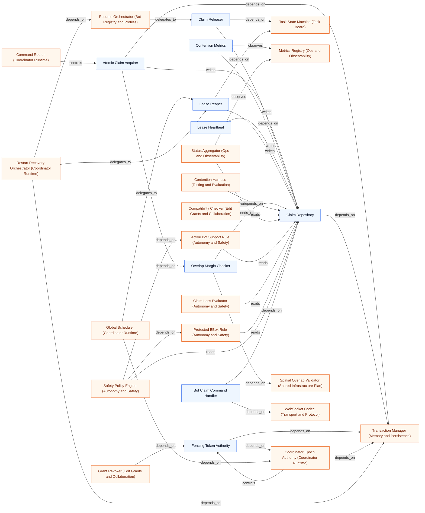
```mermaid
flowchart LR
n216["Claim Repository"]
n193["Overlap Margin Checker"]
n152["Atomic Claim Acquirer"]
n217["Lease Heartbeat"]
n158["Lease Reaper"]
n150["Fencing Token Authority"]
n212["Claim Releaser"]
n180["Bot Claim Command Handler"]
n218["Contention Metrics"]
n165["Resume Orchestrator (Bot Registry and Profiles)"]
n157["Transaction Manager (Memory and Persistence)"]
n211["Task State Machine (Task Board)"]
n145["Metrics Registry (Ops and Observability)"]
n30["Coordinator Epoch Authority (Coordinator Runtime)"]
n189["Spatial Overlap Validator (Shared Infrastructure Plan)"]
n29["Command Router (Coordinator Runtime)"]
n31["Global Scheduler (Coordinator Runtime)"]
n32["Restart Recovery Orchestrator (Coordinator Runtime)"]
n213["Contention Harness (Testing and Evaluation)"]
n194["Compatibility Checker (Edit Grants and Collaboration)"]
n219["Grant Revoker (Edit Grants and Collaboration)"]
n142["Status Aggregator (Ops and Observability)"]
n138["Active Bot Support Rule (Autonomy and Safety)"]
n136["Claim Loss Evaluator (Autonomy and Safety)"]
n137["Protected BBox Rule (Autonomy and Safety)"]
n140["Safety Policy Engine (Autonomy and Safety)"]
n164["WebSocket Codec (Transport and Protocol)"]
n165 -->|delegates_to| n212
n152 -->|writes| n216
n152 -->|depends_on| n193
n152 -->|depends_on| n157
n212 -->|writes| n216
n212 -->|depends_on| n211
n216 -->|depends_on| n157
n218 -->|depends_on| n216
n218 -->|observes| n145
n150 -->|depends_on| n30
n150 -->|depends_on| n157
n217 -->|writes| n216
n158 -->|writes| n216
n158 -->|depends_on| n211
n193 -->|depends_on| n216
n193 -->|depends_on| n189
n29 -->|controls| n152
n30 -->|controls| n150
n30 -->|depends_on| n157
n31 -->|delegates_to| n158
n31 -->|depends_on| n30
n32 -->|depends_on| n165
n32 -->|delegates_to| n158
n32 -->|depends_on| n157
n213 -->|depends_on| n216
n194 -->|reads| n216
n219 -->|depends_on| n150
n142 -->|reads| n216
n142 -->|observes| n145
n138 -->|reads| n216
n136 -->|reads| n216
n137 -->|reads| n216
n140 -->|reads| n216
n140 -->|depends_on| n138
n140 -->|depends_on| n137
n180 -->|depends_on| n216
n180 -->|depends_on| n164
classDef internal fill:#eef6ff,stroke:#2563eb,color:#0f172a;
classDef external fill:#fff7ed,stroke:#ea580c,color:#7c2d12;
class n216,n193,n152,n217,n158,n150,n212,n180,n218 internal;
class n165,n157,n211,n145,n30,n189,n29,n31,n32,n213,n194,n219,n142,n138,n136,n137,n140,n164 external;
```

### Edit Grants and Collaboration

Source: `docs/architecture/graphs/system-grants.mmd`

```mermaid
flowchart LR
n220["Grant Repository"]
n196["Collaboration Policy Evaluator"]
n194["Compatibility Checker"]
n195["Design Revision Guard"]
n153["Grant Issuer"]
n219["Grant Revoker"]
n221["Owner Offline Policy"]
n166["Grant Expiry"]
n175["Arbitration Adapter"]
n192["Delta Sync Planner (Bot Registry and Profiles)"]
n29["Command Router (Coordinator Runtime)"]
n32["Restart Recovery Orchestrator (Coordinator Runtime)"]
n171["Event Stream (Transport and Protocol)"]
n216["Claim Repository (Claims and Leases)"]
n187["Rules Store (Shared Infrastructure Plan)"]
n182["Structure Store (Shared Infrastructure Plan)"]
n188["SIP Revision Manager (Shared Infrastructure Plan)"]
n157["Transaction Manager (Memory and Persistence)"]
n150["Fencing Token Authority (Claims and Leases)"]
n169["Presence Tracker (Bot Registry and Profiles)"]
n214["Bot Profile Store (Bot Registry and Profiles)"]
n50["Planner Arbitration Handler (Cloud Planner Advisor)"]
n192 -->|depends_on| n214
n192 -->|reads| n220
n192 -->|reads| n188
n169 -->|depends_on| n214
n214 -->|depends_on| n157
n216 -->|depends_on| n157
n150 -->|depends_on| n157
n29 -->|controls| n153
n32 -->|delegates_to| n166
n32 -->|depends_on| n157
n175 -->|depends_on| n194
n175 -->|publishes| n171
n194 -->|reads| n216
n194 -->|depends_on| n220
n194 -->|depends_on| n187
n194 -->|depends_on| n182
n195 -->|depends_on| n220
n195 -->|controls| n219
n195 -->|reads| n188
n166 -->|writes| n220
n153 -->|depends_on| n194
n153 -->|depends_on| n195
n153 -->|writes| n220
n153 -->|depends_on| n196
n220 -->|depends_on| n157
n219 -->|depends_on| n150
n219 -->|writes| n220
n221 -->|reads| n169
n221 -->|reads| n214
n221 -->|depends_on| n194
n196 -->|depends_on| n220
n196 -->|depends_on| n182
n50 -->|reads| n194
n50 -->|proposes_to| n153
n50 -->|subscribes| n171
n188 -->|publishes| n195
n188 -->|depends_on| n157
n188 -->|depends_on| n187
n187 -->|depends_on| n157
n182 -->|depends_on| n157
classDef internal fill:#eef6ff,stroke:#2563eb,color:#0f172a;
classDef external fill:#fff7ed,stroke:#ea580c,color:#7c2d12;
class n220,n196,n194,n195,n153,n219,n221,n166,n175 internal;
class n192,n29,n32,n171,n216,n187,n182,n188,n157,n150,n169,n214,n50 external;
```

### Bot Registry and Profiles

Source: `docs/architecture/graphs/system-bots.mmd`

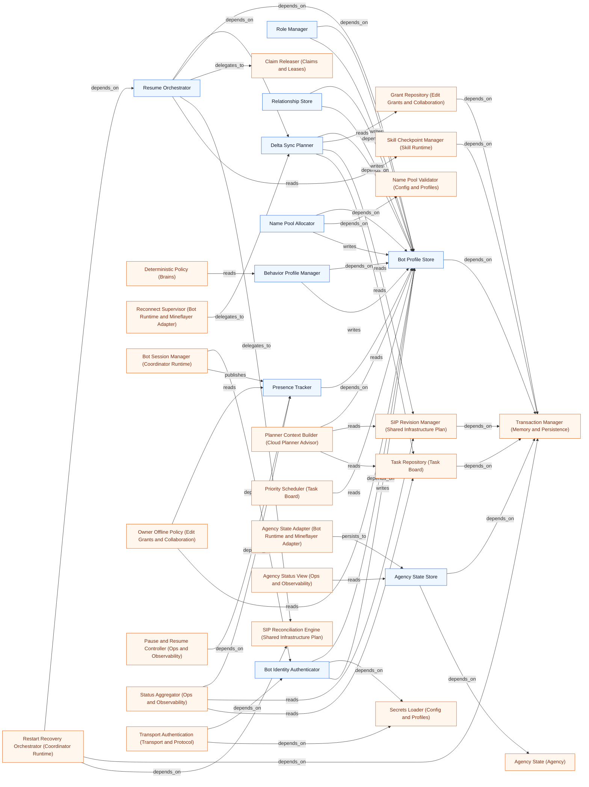
```mermaid
flowchart LR
n168["Bot Identity Authenticator"]
n214["Bot Profile Store"]
n222["Role Manager"]
n223["Behavior Profile Manager"]
n224["Relationship Store"]
n169["Presence Tracker"]
n192["Delta Sync Planner"]
n165["Resume Orchestrator"]
n225["Agency State Store"]
n226["Name Pool Allocator"]
n70["Deterministic Policy (Brains)"]
n62["Reconnect Supervisor (Bot Runtime and Mineflayer Adapter)"]
n220["Grant Repository (Edit Grants and Collaboration)"]
n188["SIP Revision Manager (Shared Infrastructure Plan)"]
n204["Task Repository (Task Board)"]
n177["Secrets Loader (Config and Profiles)"]
n227["Name Pool Validator (Config and Profiles)"]
n157["Transaction Manager (Memory and Persistence)"]
n212["Claim Releaser (Claims and Leases)"]
n160["SIP Reconciliation Engine (Shared Infrastructure Plan)"]
n87["Skill Checkpoint Manager (Skill Runtime)"]
n32["Restart Recovery Orchestrator (Coordinator Runtime)"]
n74["Bot Session Manager (Coordinator Runtime)"]
n221["Owner Offline Policy (Edit Grants and Collaboration)"]
n67["Pause and Resume Controller (Ops and Observability)"]
n142["Status Aggregator (Ops and Observability)"]
n42["Planner Context Builder (Cloud Planner Advisor)"]
n207["Priority Scheduler (Task Board)"]
n174["Transport Authentication (Transport and Protocol)"]
n130["Agency State Adapter (Bot Runtime and Mineflayer Adapter)"]
n143["Agency Status View (Ops and Observability)"]
n228["Agency State (Agency)"]
n70 -->|reads| n223
n62 -->|delegates_to| n192
n223 -->|depends_on| n214
n192 -->|depends_on| n214
n192 -->|reads| n220
n192 -->|reads| n188
n192 -->|reads| n204
n168 -->|depends_on| n214
n168 -->|depends_on| n177
n226 -->|depends_on| n214
n226 -->|depends_on| n227
n169 -->|depends_on| n214
n214 -->|depends_on| n157
n224 -->|depends_on| n214
n165 -->|depends_on| n192
n165 -->|depends_on| n214
n165 -->|delegates_to| n212
n165 -->|delegates_to| n160
n165 -->|reads| n87
n222 -->|depends_on| n214
n32 -->|depends_on| n165
n32 -->|depends_on| n157
n32 -->|depends_on| n160
n74 -->|depends_on| n168
n74 -->|publishes| n169
n220 -->|depends_on| n157
n221 -->|reads| n169
n221 -->|reads| n214
n67 -->|depends_on| n169
n142 -->|depends_on| n169
n142 -->|reads| n188
n142 -->|reads| n204
n42 -->|reads| n214
n42 -->|reads| n188
n42 -->|reads| n204
n188 -->|depends_on| n157
n87 -->|depends_on| n157
n207 -->|reads| n214
n204 -->|depends_on| n157
n174 -->|depends_on| n168
n174 -->|depends_on| n177
n168 -->|writes| n214
n222 -->|writes| n214
n223 -->|writes| n214
n224 -->|writes| n214
n226 -->|writes| n214
n130 -->|persists_to| n225
n225 -->|depends_on| n157
n143 -->|reads| n225
n225 -->|depends_on| n228
classDef internal fill:#eef6ff,stroke:#2563eb,color:#0f172a;
classDef external fill:#fff7ed,stroke:#ea580c,color:#7c2d12;
class n168,n214,n222,n223,n224,n169,n192,n165,n225,n226 internal;
class n70,n62,n220,n188,n204,n177,n227,n157,n212,n160,n87,n32,n74,n221,n67,n142,n42,n207,n174,n130,n143,n228 external;
```

### World Model and Landmarks

Source: `docs/architecture/graphs/system-world.mmd`

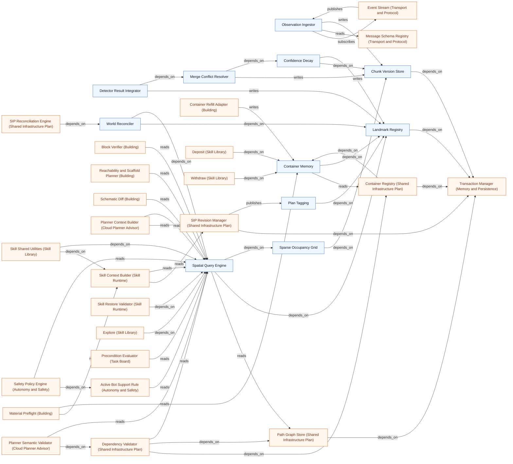
```mermaid
flowchart LR
n178["Observation Ingestor"]
n229["Chunk Version Store"]
n230["Sparse Occupancy Grid"]
n231["Merge Conflict Resolver"]
n232["Confidence Decay"]
n233["Landmark Registry"]
n234["Detector Result Integrator"]
n200["Plan Tagging"]
n198["Spatial Query Engine"]
n197["Container Memory"]
n199["World Reconciler"]
n107["Block Verifier (Building)"]
n109["Container Refill Adapter (Building)"]
n108["Material Preflight (Building)"]
n106["Reachability and Scaffold Planner (Building)"]
n103["Schematic Diff (Building)"]
n42["Planner Context Builder (Cloud Planner Advisor)"]
n45["Planner Semantic Validator (Cloud Planner Advisor)"]
n138["Active Bot Support Rule (Autonomy and Safety)"]
n140["Safety Policy Engine (Autonomy and Safety)"]
n185["Container Registry (Shared Infrastructure Plan)"]
n190["Dependency Validator (Shared Infrastructure Plan)"]
n160["SIP Reconciliation Engine (Shared Infrastructure Plan)"]
n188["SIP Revision Manager (Shared Infrastructure Plan)"]
n52["Skill Context Builder (Skill Runtime)"]
n88["Skill Restore Validator (Skill Runtime)"]
n235["Deposit (Skill Library)"]
n236["Explore (Skill Library)"]
n237["Skill Shared Utilities (Skill Library)"]
n238["Withdraw (Skill Library)"]
n206["Precondition Evaluator (Task Board)"]
n171["Event Stream (Transport and Protocol)"]
n157["Transaction Manager (Memory and Persistence)"]
n156["Message Schema Registry (Transport and Protocol)"]
n186["Path Graph Store (Shared Infrastructure Plan)"]
n107 -->|reads| n198
n109 -->|writes| n197
n108 -->|reads| n52
n108 -->|reads| n197
n106 -->|reads| n198
n103 -->|reads| n198
n42 -->|reads| n188
n42 -->|reads| n198
n45 -->|depends_on| n190
n45 -->|reads| n198
n138 -->|reads| n198
n140 -->|depends_on| n138
n140 -->|reads| n198
n185 -->|depends_on| n157
n185 -->|depends_on| n197
n190 -->|depends_on| n185
n190 -->|depends_on| n186
n190 -->|reads| n198
n186 -->|depends_on| n157
n160 -->|depends_on| n199
n188 -->|depends_on| n157
n188 -->|publishes| n200
n52 -->|reads| n188
n52 -->|reads| n198
n88 -->|depends_on| n198
n235 -->|depends_on| n197
n236 -->|depends_on| n198
n237 -->|depends_on| n52
n237 -->|depends_on| n198
n238 -->|depends_on| n197
n206 -->|reads| n198
n171 -->|publishes| n178
n229 -->|depends_on| n157
n232 -->|depends_on| n229
n232 -->|writes| n233
n197 -->|reads| n185
n197 -->|depends_on| n233
n234 -->|writes| n233
n234 -->|depends_on| n231
n233 -->|depends_on| n157
n231 -->|writes| n229
n231 -->|depends_on| n232
n178 -->|subscribes| n171
n178 -->|reads| n156
n178 -->|writes| n229
n230 -->|depends_on| n229
n200 -->|depends_on| n233
n198 -->|reads| n186
n198 -->|depends_on| n233
n198 -->|depends_on| n230
n199 -->|depends_on| n233
n199 -->|depends_on| n198
classDef internal fill:#eef6ff,stroke:#2563eb,color:#0f172a;
classDef external fill:#fff7ed,stroke:#ea580c,color:#7c2d12;
class n178,n229,n230,n231,n232,n233,n234,n200,n198,n197,n199 internal;
class n107,n109,n108,n106,n103,n42,n45,n138,n140,n185,n190,n160,n188,n52,n88,n235,n236,n237,n238,n206,n171,n157,n156,n186 external;
```

### Perception

Source: `docs/architecture/graphs/system-perception.mmd`

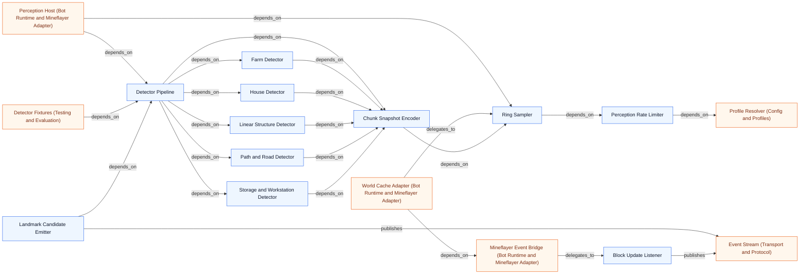
```mermaid
flowchart LR
n239["Ring Sampler"]
n240["Chunk Snapshot Encoder"]
n179["Block Update Listener"]
n241["Path and Road Detector"]
n242["House Detector"]
n243["Farm Detector"]
n244["Storage and Workstation Detector"]
n245["Linear Structure Detector"]
n246["Detector Pipeline"]
n176["Landmark Candidate Emitter"]
n247["Perception Rate Limiter"]
n55["Mineflayer Event Bridge (Bot Runtime and Mineflayer Adapter)"]
n129["Perception Host (Bot Runtime and Mineflayer Adapter)"]
n56["World Cache Adapter (Bot Runtime and Mineflayer Adapter)"]
n248["Detector Fixtures (Testing and Evaluation)"]
n171["Event Stream (Transport and Protocol)"]
n167["Profile Resolver (Config and Profiles)"]
n55 -->|delegates_to| n179
n129 -->|depends_on| n246
n129 -->|depends_on| n239
n56 -->|depends_on| n55
n56 -->|delegates_to| n239
n248 -->|depends_on| n246
n240 -->|depends_on| n239
n246 -->|depends_on| n240
n246 -->|depends_on| n243
n246 -->|depends_on| n242
n246 -->|depends_on| n245
n246 -->|depends_on| n241
n246 -->|depends_on| n244
n243 -->|depends_on| n240
n242 -->|depends_on| n240
n176 -->|depends_on| n246
n176 -->|publishes| n171
n245 -->|depends_on| n240
n241 -->|depends_on| n240
n247 -->|depends_on| n167
n239 -->|depends_on| n247
n244 -->|depends_on| n240
n179 -->|publishes| n171
classDef internal fill:#eef6ff,stroke:#2563eb,color:#0f172a;
classDef external fill:#fff7ed,stroke:#ea580c,color:#7c2d12;
class n239,n240,n179,n241,n242,n243,n244,n245,n246,n176,n247 internal;
class n55,n129,n56,n248,n171,n167 external;
```

### Laya Decision Service

Source: `docs/architecture/graphs/system-decision.mmd`

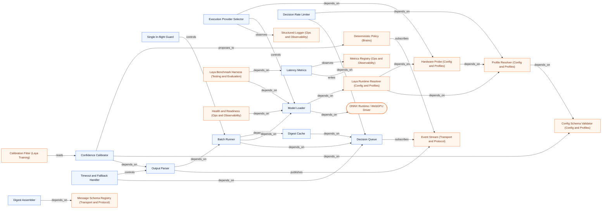
```mermaid
flowchart LR
n34["Model Loader"]
n35["Execution Provider Selector"]
n76["Decision Queue"]
n77["Decision Rate Limiter"]
n78["Digest Cache"]
n79["Digest Assembler"]
n36["Batch Runner"]
n37["Single In-flight Guard"]
n38["Output Parser"]
n39["Confidence Calibrator"]
n40["Timeout and Fallback Handler"]
n80["Latency Metrics"]
n70["Deterministic Policy (Brains)"]
n161["Config Schema Validator (Config and Profiles)"]
n156["Message Schema Registry (Transport and Protocol)"]
n249["Hardware Probe (Config and Profiles)"]
n146["Structured Logger (Ops and Observability)"]
n145["Metrics Registry (Ops and Observability)"]
n250["Laya Runtime Resolver (Config and Profiles)"]
n26(["ONNX Runtime / WebGPU Driver"])
n171["Event Stream (Transport and Protocol)"]
n167["Profile Resolver (Config and Profiles)"]
n251["Laya Benchmark Harness (Testing and Evaluation)"]
n147["Health and Readiness (Ops and Observability)"]
n252["Calibration Fitter (Laya Training)"]
n70 -->|subscribes| n171
n249 -->|depends_on| n167
n250 -->|depends_on| n249
n250 -->|depends_on| n167
n167 -->|depends_on| n161
n36 -->|depends_on| n78
n36 -->|depends_on| n34
n36 -->|depends_on| n76
n39 -->|proposes_to| n70
n39 -->|depends_on| n161
n39 -->|depends_on| n38
n79 -->|depends_on| n156
n78 -->|depends_on| n76
n35 -->|depends_on| n249
n35 -->|controls| n34
n35 -->|observes| n146
n80 -->|observes| n145
n80 -->|writes| n145
n34 -->|depends_on| n250
n34 -->|depends_on| n26
n38 -->|depends_on| n36
n38 -->|publishes| n171
n76 -->|subscribes| n171
n77 -->|depends_on| n167
n77 -->|depends_on| n76
n37 -->|controls| n36
n40 -->|controls| n38
n40 -->|depends_on| n76
n251 -->|depends_on| n80
n251 -->|depends_on| n34
n147 -->|depends_on| n34
n252 -->|reads| n39
classDef internal fill:#eef6ff,stroke:#2563eb,color:#0f172a;
classDef external fill:#fff7ed,stroke:#ea580c,color:#7c2d12;
class n34,n35,n76,n77,n78,n79,n36,n37,n38,n39,n40,n80 internal;
class n70,n161,n156,n249,n146,n145,n250,n171,n167,n251,n147,n252,n26 external;
```

### Cloud Planner Advisor

Source: `docs/architecture/graphs/system-planner.mmd`

```mermaid
flowchart LR
n41["OpenAI-Compatible Client"]
n42["Planner Context Builder"]
n43["Planner Trigger Evaluator"]
n44["Planner Schema Validator"]
n45["Planner Semantic Validator"]
n46["Planner Repair Loop"]
n47["SIP Mutation Translator"]
n48["Task DAG Translator"]
n49["Planner Budget Limiter"]
n81["Plan Cache"]
n50["Planner Arbitration Handler"]
n51["Keep Last Good Fallback"]
n31["Global Scheduler (Coordinator Runtime)"]
n194["Compatibility Checker (Edit Grants and Collaboration)"]
n153["Grant Issuer (Edit Grants and Collaboration)"]
n171["Event Stream (Transport and Protocol)"]
n145["Metrics Registry (Ops and Observability)"]
n214["Bot Profile Store (Bot Registry and Profiles)"]
n188["SIP Revision Manager (Shared Infrastructure Plan)"]
n204["Task Repository (Task Board)"]
n198["Spatial Query Engine (World Model and Landmarks)"]
n161["Config Schema Validator (Config and Profiles)"]
n177["Secrets Loader (Config and Profiles)"]
n25(["Muse Spark Planner Endpoint"])
n157["Transaction Manager (Memory and Persistence)"]
n190["Dependency Validator (Shared Infrastructure Plan)"]
n187["Rules Store (Shared Infrastructure Plan)"]
n83["Skill Registry (Skill Runtime)"]
n191["SIP Mutation Proposer (Shared Infrastructure Plan)"]
n210["Dead Letter Manager (Task Board)"]
n64["Recovery Ladder (Autonomy and Safety)"]
n214 -->|depends_on| n157
n31 -->|delegates_to| n43
n194 -->|depends_on| n187
n153 -->|depends_on| n194
n50 -->|reads| n194
n50 -->|proposes_to| n153
n50 -->|subscribes| n171
n49 -->|observes| n145
n49 -->|controls| n41
n42 -->|reads| n214
n42 -->|reads| n188
n42 -->|reads| n204
n42 -->|reads| n198
n51 -->|depends_on| n81
n51 -->|reads| n188
n41 -->|depends_on| n161
n41 -->|depends_on| n177
n41 -->|depends_on| n25
n41 -->|delegates_to| n50
n81 -->|depends_on| n157
n46 -->|controls| n51
n46 -->|depends_on| n41
n46 -->|depends_on| n44
n46 -->|depends_on| n45
n44 -->|controls| n46
n45 -->|controls| n46
n45 -->|depends_on| n44
n45 -->|depends_on| n190
n45 -->|reads| n187
n45 -->|reads| n83
n45 -->|reads| n198
n47 -->|depends_on| n46
n47 -->|proposes_to| n191
n48 -->|depends_on| n46
n48 -->|proposes_to| n204
n43 -->|observes| n145
n43 -->|delegates_to| n42
n43 -->|reads| n188
n43 -->|reads| n210
n64 -->|proposes_to| n43
n64 -->|depends_on| n171
n190 -->|reads| n198
n191 -->|depends_on| n190
n191 -->|depends_on| n188
n188 -->|depends_on| n157
n188 -->|depends_on| n187
n187 -->|depends_on| n157
n210 -->|writes| n204
n204 -->|depends_on| n157
classDef internal fill:#eef6ff,stroke:#2563eb,color:#0f172a;
classDef external fill:#fff7ed,stroke:#ea580c,color:#7c2d12;
class n41,n42,n43,n44,n45,n46,n47,n48,n49,n81,n50,n51 internal;
class n31,n194,n153,n171,n145,n214,n188,n204,n198,n161,n177,n157,n190,n187,n83,n191,n210,n64,n25 external;
```

### Skill Runtime

Source: `docs/architecture/graphs/system-skill-runtime.mmd`

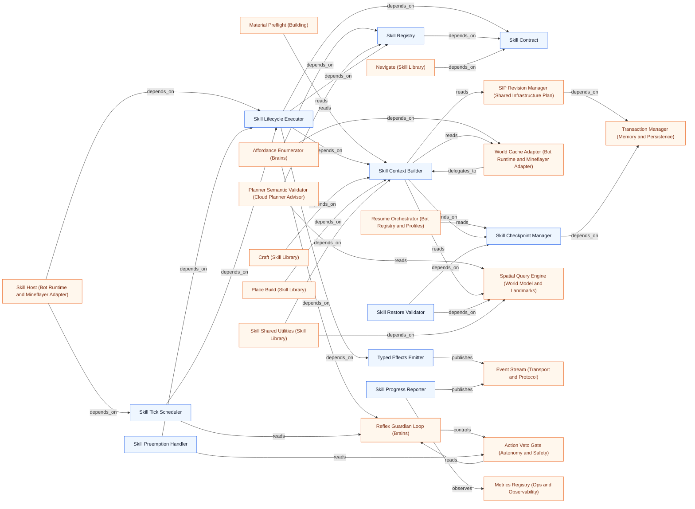
```mermaid
flowchart LR
n82["Skill Contract"]
n83["Skill Registry"]
n84["Skill Lifecycle Executor"]
n85["Skill Tick Scheduler"]
n52["Skill Context Builder"]
n86["Skill Progress Reporter"]
n87["Skill Checkpoint Manager"]
n88["Skill Restore Validator"]
n89["Typed Effects Emitter"]
n90["Skill Preemption Handler"]
n149["Affordance Enumerator (Brains)"]
n59["Skill Host (Bot Runtime and Mineflayer Adapter)"]
n56["World Cache Adapter (Bot Runtime and Mineflayer Adapter)"]
n165["Resume Orchestrator (Bot Registry and Profiles)"]
n108["Material Preflight (Building)"]
n45["Planner Semantic Validator (Cloud Planner Advisor)"]
n157["Transaction Manager (Memory and Persistence)"]
n188["SIP Revision Manager (Shared Infrastructure Plan)"]
n198["Spatial Query Engine (World Model and Landmarks)"]
n171["Event Stream (Transport and Protocol)"]
n63["Action Veto Gate (Autonomy and Safety)"]
n145["Metrics Registry (Ops and Observability)"]
n69["Reflex Guardian Loop (Brains)"]
n253["Craft (Skill Library)"]
n254["Navigate (Skill Library)"]
n255["Place Build (Skill Library)"]
n237["Skill Shared Utilities (Skill Library)"]
n149 -->|depends_on| n56
n149 -->|depends_on| n69
n149 -->|depends_on| n83
n59 -->|depends_on| n84
n59 -->|depends_on| n85
n56 -->|delegates_to| n52
n165 -->|reads| n87
n108 -->|reads| n52
n45 -->|reads| n83
n45 -->|reads| n198
n63 -->|reads| n69
n69 -->|controls| n63
n188 -->|depends_on| n157
n87 -->|depends_on| n157
n52 -->|reads| n56
n52 -->|reads| n188
n52 -->|depends_on| n87
n52 -->|reads| n198
n89 -->|publishes| n171
n84 -->|depends_on| n52
n84 -->|depends_on| n89
n84 -->|depends_on| n82
n84 -->|depends_on| n83
n90 -->|reads| n63
n90 -->|depends_on| n84
n86 -->|observes| n145
n86 -->|publishes| n171
n88 -->|depends_on| n87
n88 -->|depends_on| n198
n83 -->|depends_on| n82
n85 -->|reads| n69
n85 -->|depends_on| n84
n253 -->|depends_on| n52
n254 -->|depends_on| n82
n255 -->|depends_on| n52
n237 -->|depends_on| n52
n237 -->|depends_on| n198
classDef internal fill:#eef6ff,stroke:#2563eb,color:#0f172a;
classDef external fill:#fff7ed,stroke:#ea580c,color:#7c2d12;
class n82,n83,n84,n85,n52,n86,n87,n88,n89,n90 internal;
class n149,n59,n56,n165,n108,n45,n157,n188,n198,n171,n63,n145,n69,n253,n254,n255,n237 external;
```

### Skill Library

Source: `docs/architecture/graphs/system-skills.mmd`

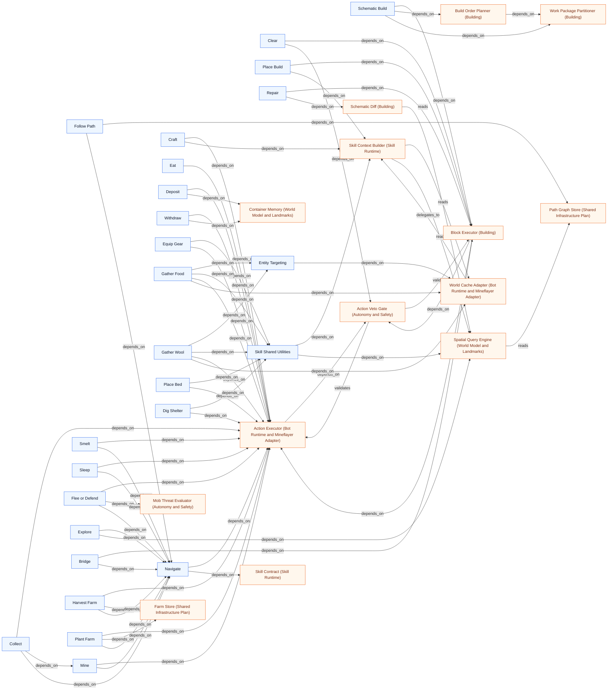
```mermaid
flowchart LR
n254["Navigate"]
n201["Follow Path"]
n256["Mine"]
n257["Collect"]
n253["Craft"]
n258["Smelt"]
n259["Eat"]
n235["Deposit"]
n238["Withdraw"]
n260["Sleep"]
n261["Flee or Defend"]
n236["Explore"]
n262["Bridge"]
n263["Clear"]
n255["Place Build"]
n264["Schematic Build"]
n265["Repair"]
n202["Harvest Farm"]
n203["Plant Farm"]
n266["Entity Targeting"]
n267["Equip Gear"]
n268["Gather Food"]
n269["Gather Wool"]
n270["Place Bed"]
n271["Dig Shelter"]
n237["Skill Shared Utilities"]
n53["Block Executor (Building)"]
n63["Action Veto Gate (Autonomy and Safety)"]
n57["Action Executor (Bot Runtime and Mineflayer Adapter)"]
n52["Skill Context Builder (Skill Runtime)"]
n197["Container Memory (World Model and Landmarks)"]
n198["Spatial Query Engine (World Model and Landmarks)"]
n132["Mob Threat Evaluator (Autonomy and Safety)"]
n186["Path Graph Store (Shared Infrastructure Plan)"]
n184["Farm Store (Shared Infrastructure Plan)"]
n82["Skill Contract (Skill Runtime)"]
n103["Schematic Diff (Building)"]
n105["Build Order Planner (Building)"]
n104["Work Package Partitioner (Building)"]
n56["World Cache Adapter (Bot Runtime and Mineflayer Adapter)"]
n57 -->|depends_on| n63
n56 -->|delegates_to| n52
n53 -->|depends_on| n57
n53 -->|depends_on| n63
n105 -->|depends_on| n104
n103 -->|reads| n198
n63 -->|validates| n57
n63 -->|validates| n53
n52 -->|reads| n56
n52 -->|reads| n198
n262 -->|depends_on| n53
n262 -->|depends_on| n254
n263 -->|depends_on| n53
n263 -->|depends_on| n63
n257 -->|depends_on| n57
n257 -->|depends_on| n256
n257 -->|depends_on| n254
n253 -->|depends_on| n57
n253 -->|depends_on| n52
n235 -->|depends_on| n57
n235 -->|depends_on| n197
n259 -->|depends_on| n57
n236 -->|depends_on| n254
n236 -->|depends_on| n198
n261 -->|depends_on| n57
n261 -->|depends_on| n132
n261 -->|depends_on| n254
n201 -->|depends_on| n186
n201 -->|depends_on| n254
n202 -->|depends_on| n57
n202 -->|depends_on| n184
n202 -->|depends_on| n254
n256 -->|depends_on| n57
n256 -->|depends_on| n254
n254 -->|depends_on| n57
n254 -->|depends_on| n82
n255 -->|depends_on| n53
n255 -->|depends_on| n52
n203 -->|depends_on| n57
n203 -->|depends_on| n184
n203 -->|depends_on| n254
n265 -->|depends_on| n53
n265 -->|depends_on| n103
n264 -->|depends_on| n53
n264 -->|depends_on| n105
n264 -->|depends_on| n104
n237 -->|depends_on| n52
n237 -->|depends_on| n198
n260 -->|depends_on| n57
n260 -->|depends_on| n254
n258 -->|depends_on| n57
n258 -->|depends_on| n254
n238 -->|depends_on| n57
n238 -->|depends_on| n197
n198 -->|reads| n186
n266 -->|depends_on| n56
n267 -->|depends_on| n237
n267 -->|depends_on| n57
n268 -->|depends_on| n266
n268 -->|depends_on| n237
n268 -->|depends_on| n57
n268 -->|depends_on| n56
n269 -->|depends_on| n266
n269 -->|depends_on| n237
n269 -->|depends_on| n57
n269 -->|depends_on| n56
n270 -->|depends_on| n237
n270 -->|depends_on| n57
n271 -->|depends_on| n237
n271 -->|depends_on| n57
classDef internal fill:#eef6ff,stroke:#2563eb,color:#0f172a;
classDef external fill:#fff7ed,stroke:#ea580c,color:#7c2d12;
class n254,n201,n256,n257,n253,n258,n259,n235,n238,n260,n261,n236,n262,n263,n255,n264,n265,n202,n203,n266,n267,n268,n269,n270,n271,n237 internal;
class n53,n63,n57,n52,n197,n198,n132,n186,n184,n82,n103,n105,n104,n56 external;
```

### Building

Source: `docs/architecture/graphs/system-building.mmd`

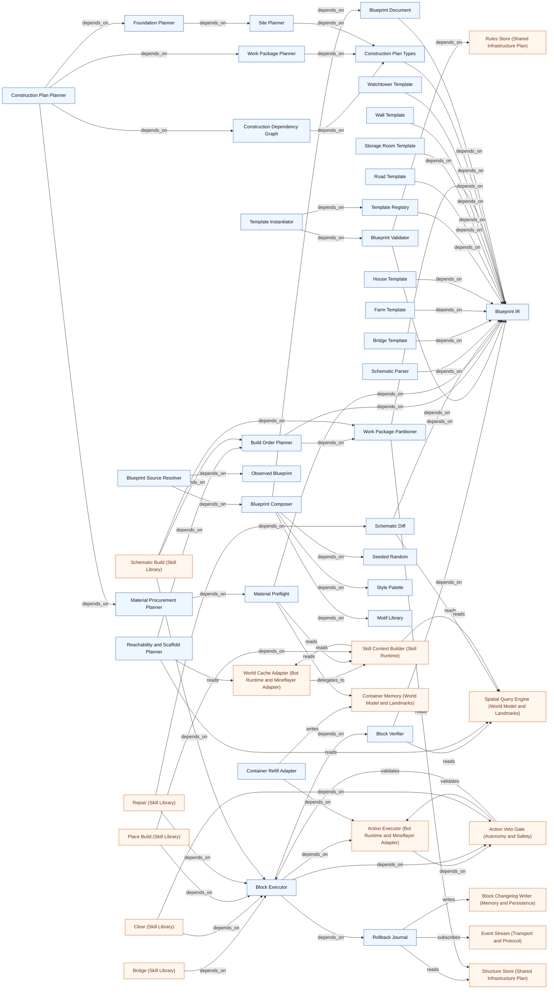
```mermaid
flowchart LR
n91["Blueprint IR"]
n92["Blueprint Validator"]
n93["Template Registry"]
n94["House Template"]
n95["Road Template"]
n96["Farm Template"]
n97["Wall Template"]
n98["Bridge Template"]
n99["Storage Room Template"]
n100["Watchtower Template"]
n101["Template Instantiator"]
n102["Schematic Parser"]
n103["Schematic Diff"]
n104["Work Package Partitioner"]
n105["Build Order Planner"]
n106["Reachability and Scaffold Planner"]
n107["Block Verifier"]
n53["Block Executor"]
n108["Material Preflight"]
n109["Container Refill Adapter"]
n110["Rollback Journal"]
n111["Construction Plan Types"]
n112["Blueprint Document"]
n113["Seeded Random"]
n114["Style Palette"]
n115["Motif Library"]
n116["Blueprint Composer"]
n117["Observed Blueprint"]
n118["Blueprint Source Resolver"]
n119["Site Planner"]
n120["Foundation Planner"]
n121["Construction Dependency Graph"]
n122["Work Package Planner"]
n123["Construction Plan Planner"]
n124["Material Procurement Planner"]
n57["Action Executor (Bot Runtime and Mineflayer Adapter)"]
n63["Action Veto Gate (Autonomy and Safety)"]
n198["Spatial Query Engine (World Model and Landmarks)"]
n187["Rules Store (Shared Infrastructure Plan)"]
n197["Container Memory (World Model and Landmarks)"]
n52["Skill Context Builder (Skill Runtime)"]
n56["World Cache Adapter (Bot Runtime and Mineflayer Adapter)"]
n272["Block Changelog Writer (Memory and Persistence)"]
n182["Structure Store (Shared Infrastructure Plan)"]
n171["Event Stream (Transport and Protocol)"]
n262["Bridge (Skill Library)"]
n263["Clear (Skill Library)"]
n255["Place Build (Skill Library)"]
n265["Repair (Skill Library)"]
n264["Schematic Build (Skill Library)"]
n57 -->|depends_on| n63
n56 -->|delegates_to| n52
n53 -->|depends_on| n57
n53 -->|depends_on| n107
n53 -->|depends_on| n110
n53 -->|depends_on| n63
n107 -->|depends_on| n91
n107 -->|reads| n198
n92 -->|depends_on| n91
n92 -->|depends_on| n187
n105 -->|depends_on| n91
n105 -->|depends_on| n104
n109 -->|depends_on| n57
n109 -->|writes| n197
n108 -->|depends_on| n91
n108 -->|reads| n52
n108 -->|reads| n197
n106 -->|reads| n56
n106 -->|depends_on| n105
n106 -->|reads| n198
n110 -->|writes| n272
n110 -->|reads| n182
n110 -->|subscribes| n171
n103 -->|depends_on| n91
n103 -->|reads| n198
n102 -->|depends_on| n91
n98 -->|depends_on| n91
n96 -->|depends_on| n91
n94 -->|depends_on| n91
n101 -->|depends_on| n92
n101 -->|depends_on| n93
n93 -->|depends_on| n91
n95 -->|depends_on| n91
n99 -->|depends_on| n91
n97 -->|depends_on| n91
n100 -->|depends_on| n91
n104 -->|depends_on| n91
n104 -->|reads| n182
n63 -->|validates| n57
n63 -->|validates| n53
n52 -->|reads| n56
n52 -->|reads| n198
n262 -->|depends_on| n53
n263 -->|depends_on| n53
n263 -->|depends_on| n63
n255 -->|depends_on| n53
n255 -->|depends_on| n52
n265 -->|depends_on| n53
n265 -->|depends_on| n103
n264 -->|depends_on| n53
n264 -->|depends_on| n105
n264 -->|depends_on| n104
n111 -->|depends_on| n91
n112 -->|depends_on| n91
n116 -->|depends_on| n112
n116 -->|depends_on| n113
n116 -->|depends_on| n114
n116 -->|depends_on| n115
n118 -->|depends_on| n116
n118 -->|depends_on| n117
n120 -->|depends_on| n119
n121 -->|depends_on| n111
n122 -->|depends_on| n111
n123 -->|depends_on| n120
n123 -->|depends_on| n121
n123 -->|depends_on| n122
n123 -->|depends_on| n124
n124 -->|depends_on| n108
n119 -->|depends_on| n111
classDef internal fill:#eef6ff,stroke:#2563eb,color:#0f172a;
classDef external fill:#fff7ed,stroke:#ea580c,color:#7c2d12;
class n91,n92,n93,n94,n95,n96,n97,n98,n99,n100,n101,n102,n103,n104,n105,n106,n107,n53,n108,n109,n110,n111,n112,n113,n114,n115,n116,n117,n118,n119,n120,n121,n122,n123,n124 internal;
class n57,n63,n198,n187,n197,n52,n56,n272,n182,n171,n262,n263,n255,n265,n264 external;
```

### Bot Runtime and Mineflayer Adapter

Source: `docs/architecture/graphs/system-bot-runtime.mmd`

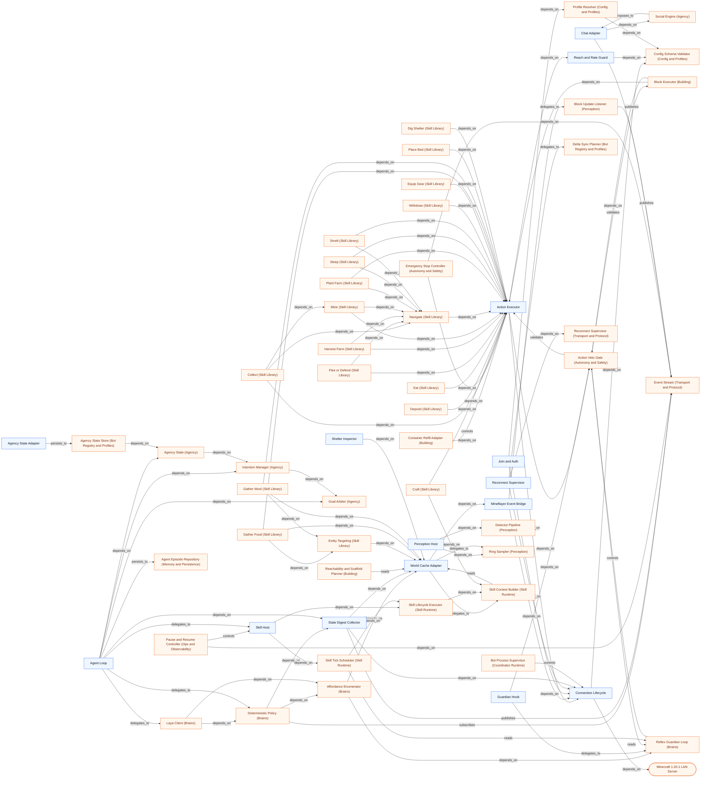
```mermaid
flowchart LR
n54["Connection Lifecycle"]
n125["Join and Auth"]
n55["Mineflayer Event Bridge"]
n56["World Cache Adapter"]
n126["Shelter Inspector"]
n127["Reach and Rate Guard"]
n57["Action Executor"]
n128["State Digest Collector"]
n58["Guardian Hook"]
n59["Skill Host"]
n129["Perception Host"]
n60["Agent Loop"]
n61["Chat Adapter"]
n130["Agency State Adapter"]
n62["Reconnect Supervisor"]
n63["Action Veto Gate (Autonomy and Safety)"]
n149["Affordance Enumerator (Brains)"]
n161["Config Schema Validator (Config and Profiles)"]
n24(["Minecraft 1.20.1 LAN Server"])
n70["Deterministic Policy (Brains)"]
n179["Block Update Listener (Perception)"]
n69["Reflex Guardian Loop (Brains)"]
n167["Profile Resolver (Config and Profiles)"]
n246["Detector Pipeline (Perception)"]
n239["Ring Sampler (Perception)"]
n192["Delta Sync Planner (Bot Registry and Profiles)"]
n173["Reconnect Supervisor (Transport and Protocol)"]
n84["Skill Lifecycle Executor (Skill Runtime)"]
n85["Skill Tick Scheduler (Skill Runtime)"]
n171["Event Stream (Transport and Protocol)"]
n52["Skill Context Builder (Skill Runtime)"]
n53["Block Executor (Building)"]
n109["Container Refill Adapter (Building)"]
n106["Reachability and Scaffold Planner (Building)"]
n67["Pause and Resume Controller (Ops and Observability)"]
n65["Emergency Stop Controller (Autonomy and Safety)"]
n257["Collect (Skill Library)"]
n253["Craft (Skill Library)"]
n235["Deposit (Skill Library)"]
n259["Eat (Skill Library)"]
n261["Flee or Defend (Skill Library)"]
n202["Harvest Farm (Skill Library)"]
n256["Mine (Skill Library)"]
n254["Navigate (Skill Library)"]
n203["Plant Farm (Skill Library)"]
n260["Sleep (Skill Library)"]
n258["Smelt (Skill Library)"]
n238["Withdraw (Skill Library)"]
n33["Bot Process Supervisor (Coordinator Runtime)"]
n273["Goal Arbiter (Agency)"]
n274["Intention Manager (Agency)"]
n228["Agency State (Agency)"]
n71["Laya Client (Brains)"]
n275["Social Engine (Agency)"]
n225["Agency State Store (Bot Registry and Profiles)"]
n276["Agent Episode Repository (Memory and Persistence)"]
n266["Entity Targeting (Skill Library)"]
n267["Equip Gear (Skill Library)"]
n268["Gather Food (Skill Library)"]
n269["Gather Wool (Skill Library)"]
n270["Place Bed (Skill Library)"]
n271["Dig Shelter (Skill Library)"]
n57 -->|depends_on| n54
n57 -->|depends_on| n127
n57 -->|depends_on| n63
n149 -->|depends_on| n56
n149 -->|depends_on| n69
n54 -->|depends_on| n161
n54 -->|depends_on| n24
n70 -->|depends_on| n149
n70 -->|depends_on| n128
n70 -->|subscribes| n171
n55 -->|depends_on| n54
n55 -->|delegates_to| n179
n58 -->|depends_on| n63
n58 -->|delegates_to| n69
n125 -->|depends_on| n54
n125 -->|depends_on| n167
n129 -->|depends_on| n246
n129 -->|depends_on| n239
n127 -->|depends_on| n161
n62 -->|depends_on| n54
n62 -->|delegates_to| n192
n62 -->|depends_on| n173
n59 -->|depends_on| n84
n59 -->|depends_on| n85
n128 -->|depends_on| n54
n128 -->|depends_on| n56
n128 -->|publishes| n171
n56 -->|depends_on| n55
n56 -->|delegates_to| n239
n56 -->|delegates_to| n52
n53 -->|depends_on| n57
n53 -->|depends_on| n63
n109 -->|depends_on| n57
n106 -->|reads| n56
n167 -->|depends_on| n161
n67 -->|controls| n59
n67 -->|depends_on| n171
n63 -->|validates| n57
n63 -->|validates| n53
n63 -->|reads| n69
n65 -->|controls| n57
n65 -->|depends_on| n171
n69 -->|controls| n63
n52 -->|reads| n56
n84 -->|depends_on| n52
n85 -->|reads| n69
n85 -->|depends_on| n84
n257 -->|depends_on| n57
n257 -->|depends_on| n256
n257 -->|depends_on| n254
n253 -->|depends_on| n57
n253 -->|depends_on| n52
n235 -->|depends_on| n57
n259 -->|depends_on| n57
n261 -->|depends_on| n57
n261 -->|depends_on| n254
n202 -->|depends_on| n57
n202 -->|depends_on| n254
n256 -->|depends_on| n57
n256 -->|depends_on| n254
n254 -->|depends_on| n57
n203 -->|depends_on| n57
n203 -->|depends_on| n254
n260 -->|depends_on| n57
n260 -->|depends_on| n254
n258 -->|depends_on| n57
n258 -->|depends_on| n254
n238 -->|depends_on| n57
n33 -->|controls| n54
n71 -->|depends_on| n149
n71 -->|depends_on| n70
n179 -->|publishes| n171
n60 -->|depends_on| n273
n60 -->|depends_on| n274
n60 -->|depends_on| n228
n60 -->|delegates_to| n71
n60 -->|delegates_to| n70
n60 -->|depends_on| n128
n60 -->|delegates_to| n59
n61 -->|depends_on| n275
n61 -->|publishes| n171
n130 -->|persists_to| n225
n60 -->|persists_to| n276
n274 -->|depends_on| n273
n228 -->|depends_on| n274
n275 -->|proposes_to| n61
n225 -->|depends_on| n228
n266 -->|depends_on| n56
n267 -->|depends_on| n57
n268 -->|depends_on| n266
n268 -->|depends_on| n57
n268 -->|depends_on| n56
n269 -->|depends_on| n266
n269 -->|depends_on| n57
n269 -->|depends_on| n56
n270 -->|depends_on| n57
n271 -->|depends_on| n57
n126 -->|depends_on| n56
classDef internal fill:#eef6ff,stroke:#2563eb,color:#0f172a;
classDef external fill:#fff7ed,stroke:#ea580c,color:#7c2d12;
class n54,n125,n55,n56,n126,n127,n57,n128,n58,n59,n129,n60,n61,n130,n62 internal;
class n63,n149,n161,n70,n179,n69,n167,n246,n239,n192,n173,n84,n85,n171,n52,n53,n109,n106,n67,n65,n257,n253,n235,n259,n261,n202,n256,n254,n203,n260,n258,n238,n33,n273,n274,n228,n71,n275,n225,n276,n266,n267,n268,n269,n270,n271,n24 external;
```

### Autonomy and Safety

Source: `docs/architecture/graphs/system-safety.mmd`

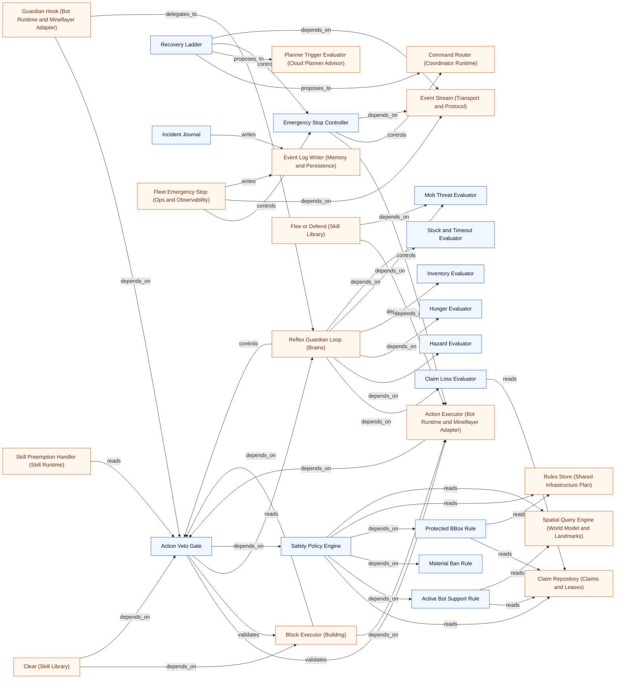
```mermaid
flowchart LR
n131["Hazard Evaluator"]
n132["Mob Threat Evaluator"]
n133["Hunger Evaluator"]
n134["Stuck and Timeout Evaluator"]
n135["Inventory Evaluator"]
n136["Claim Loss Evaluator"]
n137["Protected BBox Rule"]
n138["Active Bot Support Rule"]
n139["Material Ban Rule"]
n140["Safety Policy Engine"]
n63["Action Veto Gate"]
n64["Recovery Ladder"]
n65["Emergency Stop Controller"]
n141["Incident Journal"]
n57["Action Executor (Bot Runtime and Mineflayer Adapter)"]
n58["Guardian Hook (Bot Runtime and Mineflayer Adapter)"]
n53["Block Executor (Building)"]
n68["Fleet Emergency Stop (Ops and Observability)"]
n69["Reflex Guardian Loop (Brains)"]
n216["Claim Repository (Claims and Leases)"]
n198["Spatial Query Engine (World Model and Landmarks)"]
n29["Command Router (Coordinator Runtime)"]
n171["Event Stream (Transport and Protocol)"]
n215["Event Log Writer (Memory and Persistence)"]
n187["Rules Store (Shared Infrastructure Plan)"]
n43["Planner Trigger Evaluator (Cloud Planner Advisor)"]
n90["Skill Preemption Handler (Skill Runtime)"]
n263["Clear (Skill Library)"]
n261["Flee or Defend (Skill Library)"]
n57 -->|depends_on| n63
n58 -->|depends_on| n63
n58 -->|delegates_to| n69
n53 -->|depends_on| n57
n53 -->|depends_on| n63
n68 -->|controls| n65
n68 -->|depends_on| n171
n63 -->|validates| n57
n63 -->|validates| n53
n63 -->|reads| n69
n63 -->|depends_on| n140
n138 -->|reads| n216
n138 -->|reads| n198
n136 -->|reads| n216
n65 -->|controls| n57
n65 -->|controls| n29
n65 -->|depends_on| n171
n69 -->|controls| n63
n69 -->|depends_on| n136
n69 -->|depends_on| n131
n69 -->|depends_on| n133
n69 -->|depends_on| n135
n69 -->|depends_on| n132
n69 -->|depends_on| n134
n141 -->|writes| n215
n137 -->|reads| n216
n137 -->|reads| n187
n64 -->|proposes_to| n29
n64 -->|proposes_to| n43
n64 -->|controls| n65
n64 -->|depends_on| n171
n140 -->|reads| n216
n140 -->|depends_on| n138
n140 -->|depends_on| n139
n140 -->|depends_on| n137
n140 -->|reads| n187
n140 -->|reads| n198
n90 -->|reads| n63
n263 -->|depends_on| n53
n263 -->|depends_on| n63
n261 -->|depends_on| n57
n261 -->|depends_on| n132
n68 -->|writes| n215
classDef internal fill:#eef6ff,stroke:#2563eb,color:#0f172a;
classDef external fill:#fff7ed,stroke:#ea580c,color:#7c2d12;
class n131,n132,n133,n134,n135,n136,n137,n138,n139,n140,n63,n64,n65,n141 internal;
class n57,n58,n53,n68,n69,n216,n198,n29,n171,n215,n187,n43,n90,n263,n261 external;
```

### Memory and Persistence

Source: `docs/architecture/graphs/system-memory.mmd`

```mermaid
flowchart LR
n277["SQLite Runtime"]
n163["Migration Runner"]
n157["Transaction Manager"]
n215["Event Log Writer"]
n272["Block Changelog Writer"]
n159["Retention Pruner"]
n278["Snapshot Export"]
n279["Schema Version Registry"]
n280["Episode Store"]
n276["Agent Episode Repository"]
n214["Bot Profile Store (Bot Registry and Profiles)"]
n110["Rollback Journal (Building)"]
n152["Atomic Claim Acquirer (Claims and Leases)"]
n216["Claim Repository (Claims and Leases)"]
n150["Fencing Token Authority (Claims and Leases)"]
n30["Coordinator Epoch Authority (Coordinator Runtime)"]
n31["Global Scheduler (Coordinator Runtime)"]
n72["Process Bootstrap (Coordinator Runtime)"]
n32["Restart Recovery Orchestrator (Coordinator Runtime)"]
n281["Replay Engine (Testing and Evaluation)"]
n220["Grant Repository (Edit Grants and Collaboration)"]
n148["Audit Viewer (Ops and Observability)"]
n147["Health and Readiness (Ops and Observability)"]
n81["Plan Cache (Cloud Planner Advisor)"]
n141["Incident Journal (Autonomy and Safety)"]
n185["Container Registry (Shared Infrastructure Plan)"]
n184["Farm Store (Shared Infrastructure Plan)"]
n186["Path Graph Store (Shared Infrastructure Plan)"]
n188["SIP Revision Manager (Shared Infrastructure Plan)"]
n183["Road Store (Shared Infrastructure Plan)"]
n187["Rules Store (Shared Infrastructure Plan)"]
n182["Structure Store (Shared Infrastructure Plan)"]
n154["SIP Transactional Committer (Shared Infrastructure Plan)"]
n181["Zone Store (Shared Infrastructure Plan)"]
n87["Skill Checkpoint Manager (Skill Runtime)"]
n155["Atomic Task Claimer (Task Board)"]
n204["Task Repository (Task Board)"]
n211["Task State Machine (Task Board)"]
n282["Trace Exporter (Laya Training)"]
n229["Chunk Version Store (World Model and Landmarks)"]
n233["Landmark Registry (World Model and Landmarks)"]
n67["Pause and Resume Controller (Ops and Observability)"]
n68["Fleet Emergency Stop (Ops and Observability)"]
n60["Agent Loop (Bot Runtime and Mineflayer Adapter)"]
n225["Agency State Store (Bot Registry and Profiles)"]
n143["Agency Status View (Ops and Observability)"]
n214 -->|depends_on| n157
n110 -->|writes| n272
n110 -->|reads| n182
n152 -->|writes| n216
n152 -->|depends_on| n157
n216 -->|depends_on| n157
n150 -->|depends_on| n30
n150 -->|depends_on| n157
n30 -->|controls| n150
n30 -->|depends_on| n157
n31 -->|depends_on| n30
n31 -->|delegates_to| n159
n72 -->|depends_on| n32
n72 -->|depends_on| n163
n32 -->|depends_on| n157
n281 -->|depends_on| n215
n220 -->|depends_on| n157
n272 -->|depends_on| n157
n215 -->|depends_on| n157
n163 -->|depends_on| n277
n159 -->|depends_on| n272
n159 -->|depends_on| n215
n159 -->|depends_on| n157
n279 -->|depends_on| n163
n278 -->|depends_on| n157
n157 -->|depends_on| n277
n148 -->|reads| n272
n148 -->|reads| n215
n147 -->|depends_on| n277
n81 -->|depends_on| n157
n141 -->|writes| n215
n185 -->|depends_on| n157
n184 -->|depends_on| n157
n186 -->|depends_on| n157
n188 -->|depends_on| n157
n188 -->|depends_on| n187
n183 -->|depends_on| n157
n187 -->|depends_on| n157
n182 -->|depends_on| n157
n154 -->|depends_on| n157
n154 -->|writes| n185
n154 -->|writes| n184
n154 -->|writes| n186
n154 -->|depends_on| n188
n154 -->|writes| n183
n154 -->|writes| n187
n154 -->|writes| n182
n154 -->|writes| n181
n181 -->|depends_on| n157
n87 -->|depends_on| n157
n155 -->|depends_on| n157
n155 -->|writes| n204
n204 -->|depends_on| n157
n211 -->|depends_on| n215
n211 -->|writes| n204
n282 -->|reads| n215
n229 -->|depends_on| n157
n233 -->|depends_on| n157
n281 -->|reads| n280
n282 -->|reads| n280
n148 -->|reads| n280
n159 -->|depends_on| n280
n67 -->|writes| n215
n68 -->|writes| n215
n60 -->|persists_to| n276
n225 -->|depends_on| n157
n276 -->|depends_on| n157
n143 -->|reads| n225
n143 -->|reads| n276
classDef internal fill:#eef6ff,stroke:#2563eb,color:#0f172a;
classDef external fill:#fff7ed,stroke:#ea580c,color:#7c2d12;
class n277,n163,n157,n215,n272,n159,n278,n279,n280,n276 internal;
class n214,n110,n152,n216,n150,n30,n31,n72,n32,n281,n220,n148,n147,n81,n141,n185,n184,n186,n188,n183,n187,n182,n154,n181,n87,n155,n204,n211,n282,n229,n233,n67,n68,n60,n225,n143 external;
```

### Ops and Observability

Source: `docs/architecture/graphs/system-ops.mmd`

```mermaid
flowchart LR
n66["Ops API"]
n142["Status Aggregator"]
n143["Agency Status View"]
n67["Pause and Resume Controller"]
n68["Fleet Emergency Stop"]
n144["SIP Dump"]
n145["Metrics Registry"]
n146["Structured Logger"]
n147["Health and Readiness"]
n148["Audit Viewer"]
n218["Contention Metrics (Claims and Leases)"]
n35["Execution Provider Selector (Laya Decision Service)"]
n80["Latency Metrics (Laya Decision Service)"]
n283["Metrics Reporter (Testing and Evaluation)"]
n28(["Fleet Operator"])
n272["Block Changelog Writer (Memory and Persistence)"]
n215["Event Log Writer (Memory and Persistence)"]
n65["Emergency Stop Controller (Autonomy and Safety)"]
n171["Event Stream (Transport and Protocol)"]
n34["Model Loader (Laya Decision Service)"]
n277["SQLite Runtime (Memory and Persistence)"]
n156["Message Schema Registry (Transport and Protocol)"]
n59["Skill Host (Bot Runtime and Mineflayer Adapter)"]
n169["Presence Tracker (Bot Registry and Profiles)"]
n188["SIP Revision Manager (Shared Infrastructure Plan)"]
n216["Claim Repository (Claims and Leases)"]
n204["Task Repository (Task Board)"]
n49["Planner Budget Limiter (Cloud Planner Advisor)"]
n43["Planner Trigger Evaluator (Cloud Planner Advisor)"]
n86["Skill Progress Reporter (Skill Runtime)"]
n280["Episode Store (Memory and Persistence)"]
n225["Agency State Store (Bot Registry and Profiles)"]
n276["Agent Episode Repository (Memory and Persistence)"]
n218 -->|depends_on| n216
n218 -->|observes| n145
n35 -->|controls| n34
n35 -->|observes| n146
n80 -->|observes| n145
n80 -->|writes| n145
n283 -->|observes| n145
n28 -->|controls| n66
n148 -->|reads| n272
n148 -->|reads| n215
n68 -->|controls| n65
n68 -->|depends_on| n171
n147 -->|depends_on| n34
n147 -->|depends_on| n277
n147 -->|depends_on| n142
n66 -->|depends_on| n68
n66 -->|depends_on| n67
n66 -->|depends_on| n142
n66 -->|depends_on| n156
n67 -->|controls| n59
n67 -->|depends_on| n169
n67 -->|depends_on| n171
n144 -->|depends_on| n188
n142 -->|depends_on| n169
n142 -->|reads| n216
n142 -->|observes| n145
n142 -->|reads| n188
n142 -->|reads| n204
n49 -->|observes| n145
n43 -->|observes| n145
n43 -->|reads| n188
n65 -->|depends_on| n171
n86 -->|observes| n145
n86 -->|publishes| n171
n148 -->|reads| n280
n67 -->|writes| n215
n68 -->|writes| n215
n143 -->|reads| n225
n143 -->|reads| n276
n66 -->|depends_on| n143
classDef internal fill:#eef6ff,stroke:#2563eb,color:#0f172a;
classDef external fill:#fff7ed,stroke:#ea580c,color:#7c2d12;
class n66,n142,n143,n67,n68,n144,n145,n146,n147,n148 internal;
class n218,n35,n80,n283,n272,n215,n65,n171,n34,n277,n156,n59,n169,n188,n216,n204,n49,n43,n86,n280,n225,n276,n28 external;
```

### Config and Profiles

Source: `docs/architecture/graphs/system-config.mmd`

```mermaid
flowchart LR
n162["Environment Parser"]
n161["Config Schema Validator"]
n167["Profile Resolver"]
n249["Hardware Probe"]
n177["Secrets Loader"]
n227["Name Pool Validator"]
n250["Laya Runtime Resolver"]
n284["Fail Fast Handler"]
n54["Connection Lifecycle (Bot Runtime and Mineflayer Adapter)"]
n125["Join and Auth (Bot Runtime and Mineflayer Adapter)"]
n127["Reach and Rate Guard (Bot Runtime and Mineflayer Adapter)"]
n168["Bot Identity Authenticator (Bot Registry and Profiles)"]
n226["Name Pool Allocator (Bot Registry and Profiles)"]
n27(["Host Hardware"])
n72["Process Bootstrap (Coordinator Runtime)"]
n73["Service Composition (Coordinator Runtime)"]
n39["Confidence Calibrator (Laya Decision Service)"]
n35["Execution Provider Selector (Laya Decision Service)"]
n34["Model Loader (Laya Decision Service)"]
n77["Decision Rate Limiter (Laya Decision Service)"]
n247["Perception Rate Limiter (Perception)"]
n41["OpenAI-Compatible Client (Cloud Planner Advisor)"]
n174["Transport Authentication (Transport and Protocol)"]
n54 -->|depends_on| n161
n125 -->|depends_on| n54
n125 -->|depends_on| n167
n127 -->|depends_on| n161
n168 -->|depends_on| n177
n226 -->|depends_on| n227
n161 -->|depends_on| n162
n284 -->|depends_on| n161
n249 -->|depends_on| n167
n249 -->|depends_on| n27
n250 -->|depends_on| n249
n250 -->|depends_on| n167
n227 -->|depends_on| n161
n167 -->|depends_on| n161
n177 -->|depends_on| n162
n72 -->|depends_on| n161
n72 -->|depends_on| n162
n72 -->|depends_on| n73
n73 -->|depends_on| n167
n39 -->|depends_on| n161
n35 -->|depends_on| n249
n35 -->|controls| n34
n34 -->|depends_on| n250
n77 -->|depends_on| n167
n247 -->|depends_on| n167
n41 -->|depends_on| n161
n41 -->|depends_on| n177
n174 -->|depends_on| n168
n174 -->|depends_on| n177
classDef internal fill:#eef6ff,stroke:#2563eb,color:#0f172a;
classDef external fill:#fff7ed,stroke:#ea580c,color:#7c2d12;
class n162,n161,n167,n249,n177,n227,n250,n284 internal;
class n54,n125,n127,n168,n226,n72,n73,n39,n35,n34,n77,n247,n41,n174,n27 external;
```

### Testing and Evaluation

Source: `docs/architecture/graphs/system-eval.mmd`

```mermaid
flowchart LR
n285["Unit Fixtures"]
n248["Detector Fixtures"]
n286["Docker Server Harness"]
n287["Scenario Runner"]
n281["Replay Engine"]
n213["Contention Harness"]
n283["Metrics Reporter"]
n288["Soak Runner"]
n289["Architecture Guard Tests"]
n251["Laya Benchmark Harness"]
n216["Claim Repository (Claims and Leases)"]
n204["Task Repository (Task Board)"]
n246["Detector Pipeline (Perception)"]
n24(["Minecraft 1.20.1 LAN Server"])
n80["Latency Metrics (Laya Decision Service)"]
n34["Model Loader (Laya Decision Service)"]
n145["Metrics Registry (Ops and Observability)"]
n215["Event Log Writer (Memory and Persistence)"]
n290["Promotion Gate (Laya Training)"]
n280["Episode Store (Memory and Persistence)"]
n80 -->|observes| n145
n80 -->|writes| n145
n289 -->|depends_on| n285
n213 -->|depends_on| n216
n213 -->|delegates_to| n287
n213 -->|depends_on| n204
n248 -->|depends_on| n285
n248 -->|depends_on| n246
n286 -->|depends_on| n285
n286 -->|depends_on| n24
n251 -->|depends_on| n80
n251 -->|depends_on| n34
n251 -->|delegates_to| n287
n283 -->|observes| n145
n281 -->|depends_on| n287
n281 -->|depends_on| n215
n287 -->|controls| n286
n287 -->|publishes| n283
n288 -->|depends_on| n283
n288 -->|delegates_to| n287
n290 -->|depends_on| n251
n281 -->|reads| n280
classDef internal fill:#eef6ff,stroke:#2563eb,color:#0f172a;
classDef external fill:#fff7ed,stroke:#ea580c,color:#7c2d12;
class n285,n248,n286,n287,n281,n213,n283,n288,n289,n251 internal;
class n216,n204,n246,n80,n34,n145,n215,n290,n280,n24 external;
```

### Laya Training

Source: `docs/architecture/graphs/system-training.mmd`

```mermaid
flowchart LR
n282["Trace Exporter"]
n291["Labeling Pipeline"]
n292["Reward Computer"]
n293["Fine-tune Runner"]
n294["ONNX Exporter"]
n252["Calibration Fitter"]
n290["Promotion Gate"]
n39["Confidence Calibrator (Laya Decision Service)"]
n251["Laya Benchmark Harness (Testing and Evaluation)"]
n215["Event Log Writer (Memory and Persistence)"]
n280["Episode Store (Memory and Persistence)"]
n252 -->|reads| n39
n252 -->|depends_on| n282
n293 -->|depends_on| n291
n293 -->|depends_on| n292
n291 -->|depends_on| n282
n294 -->|depends_on| n293
n290 -->|depends_on| n251
n290 -->|depends_on| n252
n290 -->|depends_on| n294
n292 -->|depends_on| n282
n282 -->|reads| n215
n282 -->|reads| n280
classDef internal fill:#eef6ff,stroke:#2563eb,color:#0f172a;
classDef external fill:#fff7ed,stroke:#ea580c,color:#7c2d12;
class n282,n291,n292,n293,n294,n252,n290 internal;
class n39,n251,n215,n280 external;
```

### Brains

Source: `docs/architecture/graphs/system-brains.mmd`

```mermaid
flowchart LR
n69["Reflex Guardian Loop"]
n149["Affordance Enumerator"]
n70["Deterministic Policy"]
n71["Laya Client"]
n56["World Cache Adapter (Bot Runtime and Mineflayer Adapter)"]
n83["Skill Registry (Skill Runtime)"]
n128["State Digest Collector (Bot Runtime and Mineflayer Adapter)"]
n223["Behavior Profile Manager (Bot Registry and Profiles)"]
n171["Event Stream (Transport and Protocol)"]
n58["Guardian Hook (Bot Runtime and Mineflayer Adapter)"]
n39["Confidence Calibrator (Laya Decision Service)"]
n63["Action Veto Gate (Autonomy and Safety)"]
n136["Claim Loss Evaluator (Autonomy and Safety)"]
n131["Hazard Evaluator (Autonomy and Safety)"]
n133["Hunger Evaluator (Autonomy and Safety)"]
n135["Inventory Evaluator (Autonomy and Safety)"]
n132["Mob Threat Evaluator (Autonomy and Safety)"]
n134["Stuck and Timeout Evaluator (Autonomy and Safety)"]
n85["Skill Tick Scheduler (Skill Runtime)"]
n164["WebSocket Codec (Transport and Protocol)"]
n60["Agent Loop (Bot Runtime and Mineflayer Adapter)"]
n149 -->|depends_on| n56
n149 -->|depends_on| n69
n149 -->|depends_on| n83
n70 -->|depends_on| n149
n70 -->|depends_on| n128
n70 -->|reads| n223
n70 -->|subscribes| n171
n58 -->|depends_on| n63
n58 -->|delegates_to| n69
n128 -->|depends_on| n56
n128 -->|publishes| n171
n39 -->|proposes_to| n70
n63 -->|reads| n69
n69 -->|controls| n63
n69 -->|depends_on| n136
n69 -->|depends_on| n131
n69 -->|depends_on| n133
n69 -->|depends_on| n135
n69 -->|depends_on| n132
n69 -->|depends_on| n134
n85 -->|reads| n69
n171 -->|depends_on| n164
n71 -->|depends_on| n149
n71 -->|depends_on| n164
n71 -->|depends_on| n70
n60 -->|delegates_to| n71
n60 -->|delegates_to| n70
n60 -->|depends_on| n128
classDef internal fill:#eef6ff,stroke:#2563eb,color:#0f172a;
classDef external fill:#fff7ed,stroke:#ea580c,color:#7c2d12;
class n69,n149,n70,n71 internal;
class n56,n83,n128,n223,n171,n58,n39,n63,n136,n131,n133,n135,n132,n134,n85,n164,n60 external;
```

### Agency

Source: `docs/architecture/graphs/system-agency.mmd`

```mermaid
flowchart LR
n295["Personality Model"]
n296["Needs Model"]
n297["Goal Catalog"]
n298["Goal Generator"]
n273["Goal Arbiter"]
n274["Intention Manager"]
n299["Routine Model"]
n300["Item Knowledge"]
n301["Night Preparation Config"]
n302["Shelter Strategy"]
n303["Shelter Plan"]
n304["Night Readiness"]
n275["Social Engine"]
n228["Agency State"]
n60["Agent Loop (Bot Runtime and Mineflayer Adapter)"]
n61["Chat Adapter (Bot Runtime and Mineflayer Adapter)"]
n225["Agency State Store (Bot Registry and Profiles)"]
n60 -->|depends_on| n273
n60 -->|depends_on| n274
n60 -->|depends_on| n228
n61 -->|depends_on| n275
n298 -->|depends_on| n297
n298 -->|depends_on| n296
n298 -->|depends_on| n295
n273 -->|depends_on| n298
n273 -->|depends_on| n296
n273 -->|depends_on| n295
n274 -->|depends_on| n273
n275 -->|depends_on| n295
n228 -->|depends_on| n296
n228 -->|depends_on| n295
n228 -->|depends_on| n274
n228 -->|depends_on| n299
n275 -->|proposes_to| n61
n225 -->|depends_on| n228
n304 -->|depends_on| n300
n304 -->|depends_on| n301
n304 -->|depends_on| n299
n304 -->|depends_on| n303
n304 -->|depends_on| n302
n302 -->|depends_on| n301
n298 -->|depends_on| n301
n298 -->|depends_on| n304
n298 -->|depends_on| n299
classDef internal fill:#eef6ff,stroke:#2563eb,color:#0f172a;
classDef external fill:#fff7ed,stroke:#ea580c,color:#7c2d12;
class n295,n296,n297,n298,n273,n274,n299,n300,n301,n302,n303,n304,n275,n228 internal;
class n60,n61,n225 external;
```

### Bootstrap and Toolchain

Source: `docs/architecture/graphs/system-toolchain.mmd`

```mermaid
flowchart LR
n305["Bootstrap Orchestrator"]
n306["Capability Check"]
n307["Python Environment"]
n308["Minecraft Server Controller"]
n309["Firefox SVG Renderer"]
n305 -->|depends_on| n306
n305 -->|depends_on| n307
n305 -->|depends_on| n308
n305 -->|depends_on| n309
classDef internal fill:#eef6ff,stroke:#2563eb,color:#0f172a;
classDef external fill:#fff7ed,stroke:#ea580c,color:#7c2d12;
class n305,n306,n307,n308,n309 internal;
```
