# TiCrafter Architecture Graphs

> Generated from `docs/architecture/graph.json`. Edit the graph, then run `node tools/architecture/render-graphs.mjs`.

Mermaid source lives in `docs/architecture/graphs/`. GitHub renders these fenced blocks directly. For local SVG rendering, use a Mermaid CLI such as `npx @mermaid-js/mermaid-cli`.

## Fleet overview

Systems and externals with aggregated relation counts.

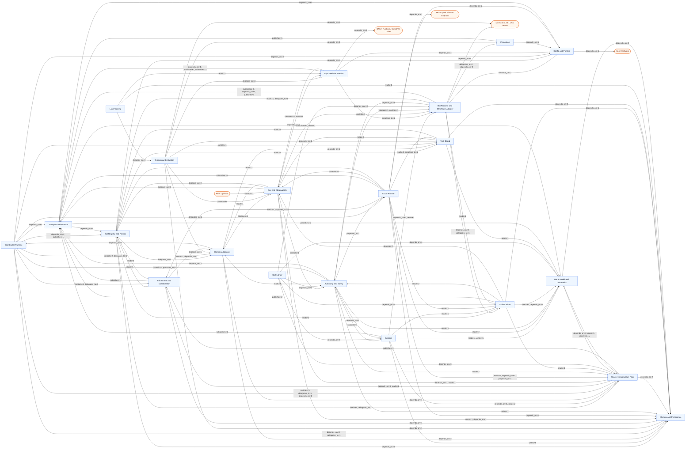
```mermaid
flowchart LR
n0["Coordinator Runtime"]
n1["Transport and Protocol"]
n2["Shared Infrastructure Plan"]
n3["Task Board"]
n4["Claims and Leases"]
n5["Edit Grants and Collaboration"]
n6["Bot Registry and Profiles"]
n7["World Model and Landmarks"]
n8["Perception"]
n9["Laya Decision Service"]
n10["Cloud Planner"]
n11["Skill Runtime"]
n12["Skill Library"]
n13["Building"]
n14["Bot Runtime and Mineflayer Adapter"]
n15["Autonomy and Safety"]
n16["Memory and Persistence"]
n17["Ops and Observability"]
n18["Config and Profiles"]
n19["Testing and Evaluation"]
n20["Laya Training"]
n21(["Minecraft 1.20.1 LAN Server"])
n22(["Muse Spark Planner Endpoint"])
n23(["ONNX Runtime / WebGPU Driver"])
n24(["Host Hardware"])
n25(["Fleet Operator"])
n14 -->|depends_on×4| n15
n14 -->|depends_on×3, delegates_to×1| n11
n14 -->|depends_on×3| n18
n14 -->|depends_on×1| n21
n14 -->|reads×1, delegates_to×1| n6
n14 -->|subscribes×1, depends_on×1, publishes×1| n1
n14 -->|delegates_to×2, depends_on×2| n8
n6 -->|reads×1| n5
n6 -->|reads×1, delegates_to×1| n2
n6 -->|reads×1| n3
n6 -->|depends_on×2| n18
n6 -->|depends_on×1| n16
n6 -->|delegates_to×1| n4
n6 -->|reads×1| n11
n13 -->|depends_on×2, reads×1| n14
n13 -->|depends_on×1| n15
n13 -->|reads×4, writes×1| n7
n13 -->|depends_on×1, reads×2| n2
n13 -->|reads×1| n11
n13 -->|writes×1| n16
n13 -->|subscribes×1| n1
n4 -->|depends_on×3| n16
n4 -->|depends_on×2| n3
n4 -->|observes×1| n17
n4 -->|depends_on×1| n0
n4 -->|depends_on×1| n2
n18 -->|depends_on×1| n24
n0 -->|depends_on×4| n1
n0 -->|controls×2, delegates_to×2| n4
n0 -->|controls×1, delegates_to×1| n5
n0 -->|controls×1, delegates_to×1, depends_on×1| n2
n0 -->|controls×1| n3
n0 -->|depends_on×3, delegates_to×1| n16
n0 -->|delegates_to×1| n10
n0 -->|depends_on×3| n18
n0 -->|depends_on×2, publishes×1| n6
n9 -->|proposes_to×1| n14
n9 -->|depends_on×4| n18
n9 -->|depends_on×1, publishes×1, subscribes×1| n1
n9 -->|observes×2, writes×1| n17
n9 -->|depends_on×1| n23
n19 -->|depends_on×1| n4
n19 -->|depends_on×1| n3
n19 -->|depends_on×1| n8
n19 -->|depends_on×1| n21
n19 -->|depends_on×2| n9
n19 -->|observes×1| n17
n19 -->|depends_on×1| n16
n25 -->|controls×1| n17
n5 -->|publishes×1| n1
n5 -->|reads×1, depends_on×1| n4
n5 -->|depends_on×3, reads×1| n2
n5 -->|depends_on×1| n16
n5 -->|reads×2| n6
n17 -->|reads×2, depends_on×1| n16
n17 -->|controls×1| n15
n17 -->|depends_on×3| n1
n17 -->|depends_on×1| n9
n17 -->|controls×1| n14
n17 -->|depends_on×2| n6
n17 -->|depends_on×1, reads×1| n2
n17 -->|reads×1| n4
n17 -->|reads×1| n3
n8 -->|publishes×1| n1
n8 -->|depends_on×1| n18
n10 -->|reads×1, proposes_to×1| n5
n10 -->|subscribes×1| n1
n10 -->|observes×2| n17
n10 -->|reads×1| n6
n10 -->|reads×4, depends_on×1, proposes_to×1| n2
n10 -->|reads×2, proposes_to×1| n3
n10 -->|reads×2| n7
n10 -->|depends_on×2| n18
n10 -->|depends_on×1| n22
n10 -->|depends_on×1| n16
n10 -->|reads×1| n11
n15 -->|validates×1, controls×1| n14
n15 -->|validates×1| n13
n15 -->|reads×4| n4
n15 -->|reads×2| n7
n15 -->|controls×1, proposes_to×1| n0
n15 -->|depends_on×2| n1
n15 -->|writes×1| n16
n15 -->|reads×2| n2
n15 -->|proposes_to×1| n10
n2 -->|depends_on×9| n16
n2 -->|depends_on×2, reads×1, publishes×1| n7
n2 -->|publishes×1| n5
n11 -->|depends_on×1| n16
n11 -->|reads×1| n14
n11 -->|reads×1| n2
n11 -->|reads×1, depends_on×1| n7
n11 -->|publishes×2| n1
n11 -->|reads×2| n15
n11 -->|observes×1| n17
n12 -->|depends_on×8| n13
n12 -->|depends_on×2| n15
n12 -->|depends_on×12| n14
n12 -->|depends_on×4| n11
n12 -->|depends_on×4| n7
n12 -->|depends_on×3| n2
n3 -->|depends_on×3| n16
n3 -->|reads×1| n7
n3 -->|reads×1| n6
n20 -->|reads×1| n9
n20 -->|depends_on×1| n19
n20 -->|reads×1| n16
n1 -->|depends_on×1| n6
n1 -->|depends_on×1| n18
n1 -->|publishes×1| n7
n7 -->|depends_on×2| n16
n7 -->|reads×2| n2
n7 -->|subscribes×1, reads×1| n1
classDef system fill:#eef6ff,stroke:#2563eb,color:#0f172a;
classDef external fill:#fff7ed,stroke:#ea580c,color:#7c2d12;
class n0,n1,n2,n3,n4,n5,n6,n7,n8,n9,n10,n11,n12,n13,n14,n15,n16,n17,n18,n19,n20 system;
class n21,n22,n23,n24,n25 external;
```

## Cross-system dependencies

System-to-system view with relation types.

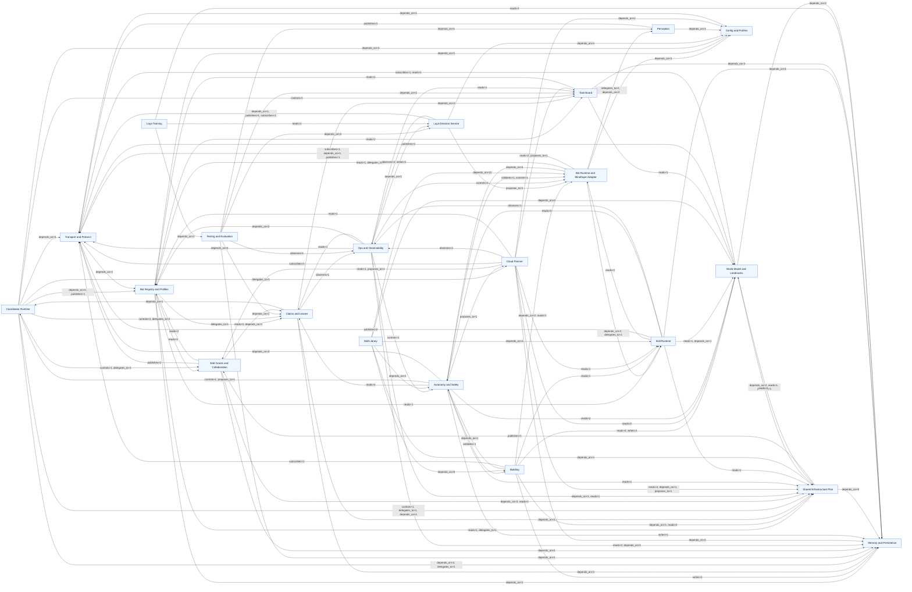
```mermaid
flowchart LR
n0["Coordinator Runtime"]
n1["Transport and Protocol"]
n2["Shared Infrastructure Plan"]
n3["Task Board"]
n4["Claims and Leases"]
n5["Edit Grants and Collaboration"]
n6["Bot Registry and Profiles"]
n7["World Model and Landmarks"]
n8["Perception"]
n9["Laya Decision Service"]
n10["Cloud Planner"]
n11["Skill Runtime"]
n12["Skill Library"]
n13["Building"]
n14["Bot Runtime and Mineflayer Adapter"]
n15["Autonomy and Safety"]
n16["Memory and Persistence"]
n17["Ops and Observability"]
n18["Config and Profiles"]
n19["Testing and Evaluation"]
n20["Laya Training"]
n14 -->|depends_on×4| n15
n14 -->|depends_on×3, delegates_to×1| n11
n14 -->|depends_on×3| n18
n14 -->|reads×1, delegates_to×1| n6
n14 -->|subscribes×1, depends_on×1, publishes×1| n1
n14 -->|delegates_to×2, depends_on×2| n8
n6 -->|reads×1| n5
n6 -->|reads×1, delegates_to×1| n2
n6 -->|reads×1| n3
n6 -->|depends_on×2| n18
n6 -->|depends_on×1| n16
n6 -->|delegates_to×1| n4
n6 -->|reads×1| n11
n13 -->|depends_on×2, reads×1| n14
n13 -->|depends_on×1| n15
n13 -->|reads×4, writes×1| n7
n13 -->|depends_on×1, reads×2| n2
n13 -->|reads×1| n11
n13 -->|writes×1| n16
n13 -->|subscribes×1| n1
n4 -->|depends_on×3| n16
n4 -->|depends_on×2| n3
n4 -->|observes×1| n17
n4 -->|depends_on×1| n0
n4 -->|depends_on×1| n2
n0 -->|depends_on×4| n1
n0 -->|controls×2, delegates_to×2| n4
n0 -->|controls×1, delegates_to×1| n5
n0 -->|controls×1, delegates_to×1, depends_on×1| n2
n0 -->|controls×1| n3
n0 -->|depends_on×3, delegates_to×1| n16
n0 -->|delegates_to×1| n10
n0 -->|depends_on×3| n18
n0 -->|depends_on×2, publishes×1| n6
n9 -->|proposes_to×1| n14
n9 -->|depends_on×4| n18
n9 -->|depends_on×1, publishes×1, subscribes×1| n1
n9 -->|observes×2, writes×1| n17
n19 -->|depends_on×1| n4
n19 -->|depends_on×1| n3
n19 -->|depends_on×1| n8
n19 -->|depends_on×2| n9
n19 -->|observes×1| n17
n19 -->|depends_on×1| n16
n5 -->|publishes×1| n1
n5 -->|reads×1, depends_on×1| n4
n5 -->|depends_on×3, reads×1| n2
n5 -->|depends_on×1| n16
n5 -->|reads×2| n6
n17 -->|reads×2, depends_on×1| n16
n17 -->|controls×1| n15
n17 -->|depends_on×3| n1
n17 -->|depends_on×1| n9
n17 -->|controls×1| n14
n17 -->|depends_on×2| n6
n17 -->|depends_on×1, reads×1| n2
n17 -->|reads×1| n4
n17 -->|reads×1| n3
n8 -->|publishes×1| n1
n8 -->|depends_on×1| n18
n10 -->|reads×1, proposes_to×1| n5
n10 -->|subscribes×1| n1
n10 -->|observes×2| n17
n10 -->|reads×1| n6
n10 -->|reads×4, depends_on×1, proposes_to×1| n2
n10 -->|reads×2, proposes_to×1| n3
n10 -->|reads×2| n7
n10 -->|depends_on×2| n18
n10 -->|depends_on×1| n16
n10 -->|reads×1| n11
n15 -->|validates×1, controls×1| n14
n15 -->|validates×1| n13
n15 -->|reads×4| n4
n15 -->|reads×2| n7
n15 -->|controls×1, proposes_to×1| n0
n15 -->|depends_on×2| n1
n15 -->|writes×1| n16
n15 -->|reads×2| n2
n15 -->|proposes_to×1| n10
n2 -->|depends_on×9| n16
n2 -->|depends_on×2, reads×1, publishes×1| n7
n2 -->|publishes×1| n5
n11 -->|depends_on×1| n16
n11 -->|reads×1| n14
n11 -->|reads×1| n2
n11 -->|reads×1, depends_on×1| n7
n11 -->|publishes×2| n1
n11 -->|reads×2| n15
n11 -->|observes×1| n17
n12 -->|depends_on×8| n13
n12 -->|depends_on×2| n15
n12 -->|depends_on×12| n14
n12 -->|depends_on×4| n11
n12 -->|depends_on×4| n7
n12 -->|depends_on×3| n2
n3 -->|depends_on×3| n16
n3 -->|reads×1| n7
n3 -->|reads×1| n6
n20 -->|reads×1| n9
n20 -->|depends_on×1| n19
n20 -->|reads×1| n16
n1 -->|depends_on×1| n6
n1 -->|depends_on×1| n18
n1 -->|publishes×1| n7
n7 -->|depends_on×2| n16
n7 -->|reads×2| n2
n7 -->|subscribes×1, reads×1| n1
classDef system fill:#eef6ff,stroke:#2563eb,color:#0f172a;
class n0,n1,n2,n3,n4,n5,n6,n7,n8,n9,n10,n11,n12,n13,n14,n15,n16,n17,n18,n19,n20 system;
```

## Safety and control authority

Guardian veto, grant/claim control, ops stop path, and planner proposal path.

```mermaid
flowchart TD
n0["Coordinator Runtime"]
n9["Laya Decision Service"]
n10["Cloud Planner"]
n11["Skill Runtime"]
n13["Building"]
n14["Bot Runtime and Mineflayer Adapter"]
n15["Autonomy and Safety"]
n17["Ops and Observability"]
n25(["Fleet Operator"])
n14 -->|delegates_to| n11
n0 -->|delegates_to| n10
n9 -->|proposes_to| n14
n17 -->|controls| n15
n17 -->|controls| n14
n15 -->|validates| n14
n15 -->|validates| n13
n15 -->|controls| n14
n15 -->|controls| n0
n15 -->|proposes_to| n0
n15 -->|proposes_to| n10
n26["Command Router"]
n27["Coordinator Epoch Authority"]
n28["Global Scheduler"]
n29["Restart Recovery Orchestrator"]
n30["Model Loader"]
n31["Execution Provider Selector"]
n32["Batch Runner"]
n33["Single In-flight Guard"]
n34["Output Parser"]
n35["Confidence Calibrator"]
n36["Timeout and Fallback Handler"]
n37["OpenAI-Compatible Client"]
n38["Planner Context Builder"]
n39["Planner Trigger Evaluator"]
n40["Planner Schema Validator"]
n41["Planner Semantic Validator"]
n42["Planner Repair Loop"]
n43["SIP Mutation Translator"]
n44["Task DAG Translator"]
n45["Planner Budget Limiter"]
n46["Planner Arbitration Handler"]
n47["Keep Last Good Fallback"]
n48["Skill Context Builder"]
n49["Block Executor"]
n50["Mineflayer Event Bridge"]
n51["World Cache Adapter"]
n52["Action Executor"]
n53["Deterministic Policy"]
n54["Skill Host"]
n55["Reconnect Supervisor"]
n56["Reflex Guardian Loop"]
n57["Action Veto Gate"]
n58["Recovery Ladder"]
n59["Emergency Stop Controller"]
n60["Ops API"]
n61["Pause and Resume Controller"]
n62["Fleet Emergency Stop"]
n51 -->|delegates_to| n48
n28 -->|delegates_to| n39
n35 -->|proposes_to| n53
n31 -->|controls| n30
n33 -->|controls| n32
n36 -->|controls| n34
n62 -->|controls| n59
n61 -->|controls| n54
n45 -->|controls| n37
n37 -->|delegates_to| n46
n42 -->|controls| n47
n40 -->|controls| n42
n41 -->|controls| n42
n39 -->|delegates_to| n38
n57 -->|validates| n52
n57 -->|validates| n49
n59 -->|controls| n52
n59 -->|controls| n26
n56 -->|controls| n57
n58 -->|proposes_to| n26
n58 -->|proposes_to| n39
n58 -->|controls| n59
classDef system fill:#eef6ff,stroke:#2563eb,color:#0f172a;
classDef component fill:#f8fafc,stroke:#64748b,color:#0f172a;
classDef external fill:#fff7ed,stroke:#ea580c,color:#7c2d12;
class n0,n9,n10,n11,n13,n14,n15,n17 system;
class n26,n27,n28,n29,n30,n31,n32,n33,n34,n35,n36,n37,n38,n39,n40,n41,n42,n43,n44,n45,n46,n47,n48,n49,n50,n51,n52,n53,n54,n55,n56,n57,n58,n59,n60,n61,n62 component;
class n25 external;
```

## Data flow

Perception, world model, SIP, decisions, skills, building, and persistence.

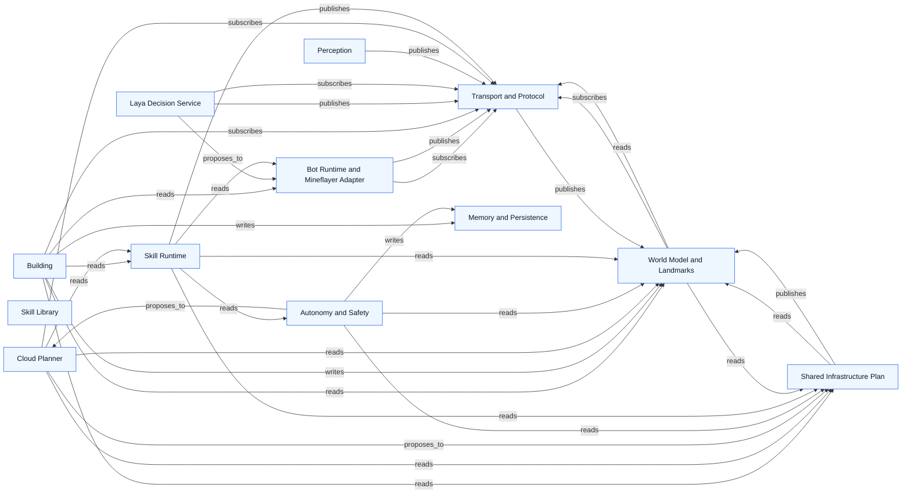
```mermaid
flowchart LR
n1["Transport and Protocol"]
n2["Shared Infrastructure Plan"]
n7["World Model and Landmarks"]
n8["Perception"]
n9["Laya Decision Service"]
n10["Cloud Planner"]
n11["Skill Runtime"]
n12["Skill Library"]
n13["Building"]
n14["Bot Runtime and Mineflayer Adapter"]
n15["Autonomy and Safety"]
n16["Memory and Persistence"]
n14 -->|subscribes| n1
n14 -->|publishes| n1
n13 -->|reads| n7
n13 -->|writes| n7
n13 -->|reads| n11
n13 -->|reads| n14
n13 -->|writes| n16
n13 -->|reads| n2
n13 -->|subscribes| n1
n9 -->|proposes_to| n14
n9 -->|publishes| n1
n9 -->|subscribes| n1
n8 -->|publishes| n1
n10 -->|subscribes| n1
n10 -->|reads| n2
n10 -->|reads| n7
n10 -->|reads| n11
n10 -->|proposes_to| n2
n15 -->|reads| n7
n15 -->|writes| n16
n15 -->|reads| n2
n15 -->|proposes_to| n10
n2 -->|reads| n7
n2 -->|publishes| n7
n11 -->|reads| n14
n11 -->|reads| n2
n11 -->|reads| n7
n11 -->|publishes| n1
n11 -->|reads| n15
n1 -->|publishes| n7
n7 -->|reads| n2
n7 -->|subscribes| n1
n7 -->|reads| n1
classDef system fill:#eef6ff,stroke:#2563eb,color:#0f172a;
class n1,n2,n7,n8,n9,n10,n11,n12,n13,n14,n15,n16 system;
```

## Per-system graphs

### Coordinator Runtime

Source: `docs/architecture/graphs/system-core.mmd`

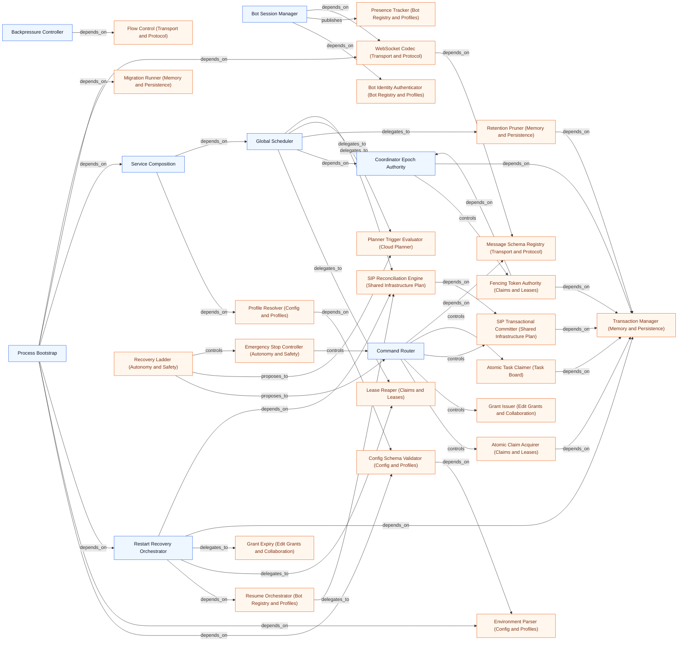
```mermaid
flowchart LR
n63["Process Bootstrap"]
n64["Service Composition"]
n65["Bot Session Manager"]
n26["Command Router"]
n27["Coordinator Epoch Authority"]
n28["Global Scheduler"]
n29["Restart Recovery Orchestrator"]
n66["Backpressure Controller"]
n126["Fencing Token Authority (Claims and Leases)"]
n127["Flow Control (Transport and Protocol)"]
n128["Atomic Claim Acquirer (Claims and Leases)"]
n129["Grant Issuer (Edit Grants and Collaboration)"]
n130["SIP Transactional Committer (Shared Infrastructure Plan)"]
n131["Atomic Task Claimer (Task Board)"]
n132["Message Schema Registry (Transport and Protocol)"]
n133["Transaction Manager (Memory and Persistence)"]
n134["Lease Reaper (Claims and Leases)"]
n135["Retention Pruner (Memory and Persistence)"]
n39["Planner Trigger Evaluator (Cloud Planner)"]
n136["SIP Reconciliation Engine (Shared Infrastructure Plan)"]
n137["Config Schema Validator (Config and Profiles)"]
n138["Environment Parser (Config and Profiles)"]
n139["Migration Runner (Memory and Persistence)"]
n140["WebSocket Codec (Transport and Protocol)"]
n141["Resume Orchestrator (Bot Registry and Profiles)"]
n142["Grant Expiry (Edit Grants and Collaboration)"]
n143["Profile Resolver (Config and Profiles)"]
n144["Bot Identity Authenticator (Bot Registry and Profiles)"]
n145["Presence Tracker (Bot Registry and Profiles)"]
n59["Emergency Stop Controller (Autonomy and Safety)"]
n58["Recovery Ladder (Autonomy and Safety)"]
n141 -->|delegates_to| n136
n128 -->|depends_on| n133
n126 -->|depends_on| n27
n126 -->|depends_on| n133
n137 -->|depends_on| n138
n143 -->|depends_on| n137
n66 -->|depends_on| n127
n26 -->|controls| n128
n26 -->|controls| n129
n26 -->|controls| n130
n26 -->|controls| n131
n26 -->|depends_on| n132
n27 -->|controls| n126
n27 -->|depends_on| n133
n28 -->|delegates_to| n134
n28 -->|depends_on| n27
n28 -->|delegates_to| n135
n28 -->|delegates_to| n39
n28 -->|delegates_to| n136
n63 -->|depends_on| n137
n63 -->|depends_on| n138
n63 -->|depends_on| n29
n63 -->|depends_on| n64
n63 -->|depends_on| n139
n63 -->|depends_on| n140
n29 -->|depends_on| n141
n29 -->|delegates_to| n134
n29 -->|delegates_to| n142
n29 -->|depends_on| n133
n29 -->|depends_on| n136
n64 -->|depends_on| n143
n64 -->|depends_on| n28
n65 -->|depends_on| n144
n65 -->|publishes| n145
n65 -->|depends_on| n140
n135 -->|depends_on| n133
n59 -->|controls| n26
n58 -->|proposes_to| n26
n58 -->|proposes_to| n39
n58 -->|controls| n59
n136 -->|depends_on| n130
n130 -->|depends_on| n133
n131 -->|depends_on| n133
n140 -->|depends_on| n132
classDef internal fill:#eef6ff,stroke:#2563eb,color:#0f172a;
classDef external fill:#fff7ed,stroke:#ea580c,color:#7c2d12;
class n63,n64,n65,n26,n27,n28,n29,n66 internal;
class n126,n127,n128,n129,n130,n131,n132,n133,n134,n135,n39,n136,n137,n138,n139,n140,n141,n142,n143,n144,n145,n59,n58 external;
```

### Transport and Protocol

Source: `docs/architecture/graphs/system-transport.mmd`

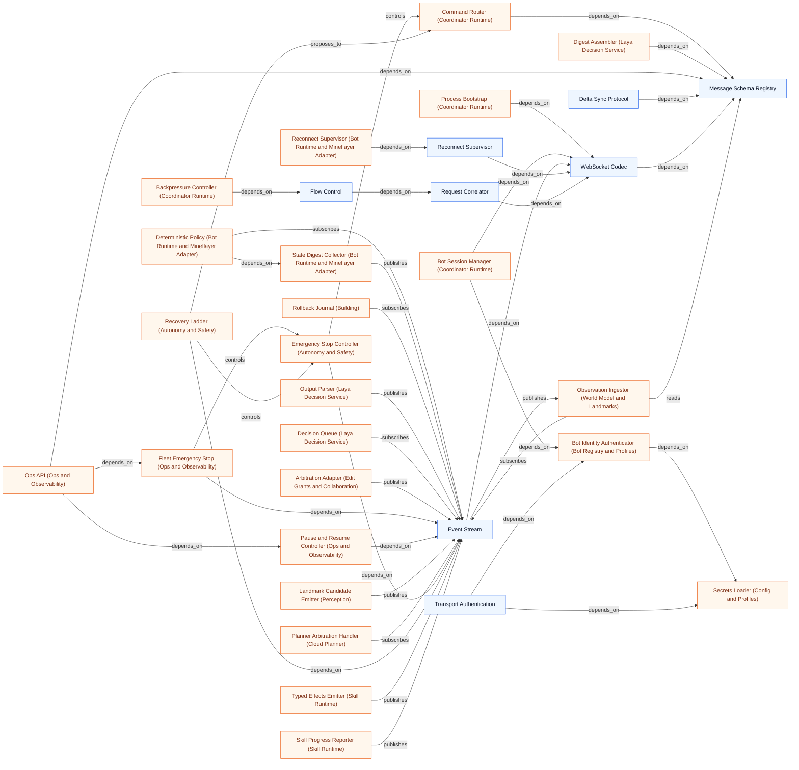
```mermaid
flowchart LR
n132["Message Schema Registry"]
n140["WebSocket Codec"]
n146["Request Correlator"]
n147["Event Stream"]
n148["Delta Sync Protocol"]
n149["Reconnect Supervisor"]
n150["Transport Authentication"]
n127["Flow Control"]
n53["Deterministic Policy (Bot Runtime and Mineflayer Adapter)"]
n55["Reconnect Supervisor (Bot Runtime and Mineflayer Adapter)"]
n105["State Digest Collector (Bot Runtime and Mineflayer Adapter)"]
n101["Rollback Journal (Building)"]
n66["Backpressure Controller (Coordinator Runtime)"]
n26["Command Router (Coordinator Runtime)"]
n63["Process Bootstrap (Coordinator Runtime)"]
n65["Bot Session Manager (Coordinator Runtime)"]
n70["Digest Assembler (Laya Decision Service)"]
n34["Output Parser (Laya Decision Service)"]
n67["Decision Queue (Laya Decision Service)"]
n151["Arbitration Adapter (Edit Grants and Collaboration)"]
n62["Fleet Emergency Stop (Ops and Observability)"]
n60["Ops API (Ops and Observability)"]
n61["Pause and Resume Controller (Ops and Observability)"]
n152["Landmark Candidate Emitter (Perception)"]
n46["Planner Arbitration Handler (Cloud Planner)"]
n59["Emergency Stop Controller (Autonomy and Safety)"]
n58["Recovery Ladder (Autonomy and Safety)"]
n80["Typed Effects Emitter (Skill Runtime)"]
n77["Skill Progress Reporter (Skill Runtime)"]
n144["Bot Identity Authenticator (Bot Registry and Profiles)"]
n153["Secrets Loader (Config and Profiles)"]
n154["Observation Ingestor (World Model and Landmarks)"]
n53 -->|depends_on| n105
n53 -->|subscribes| n147
n55 -->|depends_on| n149
n105 -->|publishes| n147
n144 -->|depends_on| n153
n101 -->|subscribes| n147
n66 -->|depends_on| n127
n26 -->|depends_on| n132
n63 -->|depends_on| n140
n65 -->|depends_on| n144
n65 -->|depends_on| n140
n70 -->|depends_on| n132
n34 -->|publishes| n147
n67 -->|subscribes| n147
n151 -->|publishes| n147
n62 -->|controls| n59
n62 -->|depends_on| n147
n60 -->|depends_on| n62
n60 -->|depends_on| n61
n60 -->|depends_on| n132
n61 -->|depends_on| n147
n152 -->|publishes| n147
n46 -->|subscribes| n147
n59 -->|controls| n26
n59 -->|depends_on| n147
n58 -->|proposes_to| n26
n58 -->|controls| n59
n58 -->|depends_on| n147
n80 -->|publishes| n147
n77 -->|publishes| n147
n150 -->|depends_on| n144
n150 -->|depends_on| n153
n148 -->|depends_on| n132
n147 -->|depends_on| n140
n147 -->|publishes| n154
n127 -->|depends_on| n146
n149 -->|depends_on| n140
n146 -->|depends_on| n140
n140 -->|depends_on| n132
n154 -->|subscribes| n147
n154 -->|reads| n132
classDef internal fill:#eef6ff,stroke:#2563eb,color:#0f172a;
classDef external fill:#fff7ed,stroke:#ea580c,color:#7c2d12;
class n132,n140,n146,n147,n148,n149,n150,n127 internal;
class n53,n55,n105,n101,n66,n26,n63,n65,n70,n34,n67,n151,n62,n60,n61,n152,n46,n59,n58,n80,n77,n144,n153,n154 external;
```

### Shared Infrastructure Plan

Source: `docs/architecture/graphs/system-sip.mmd`

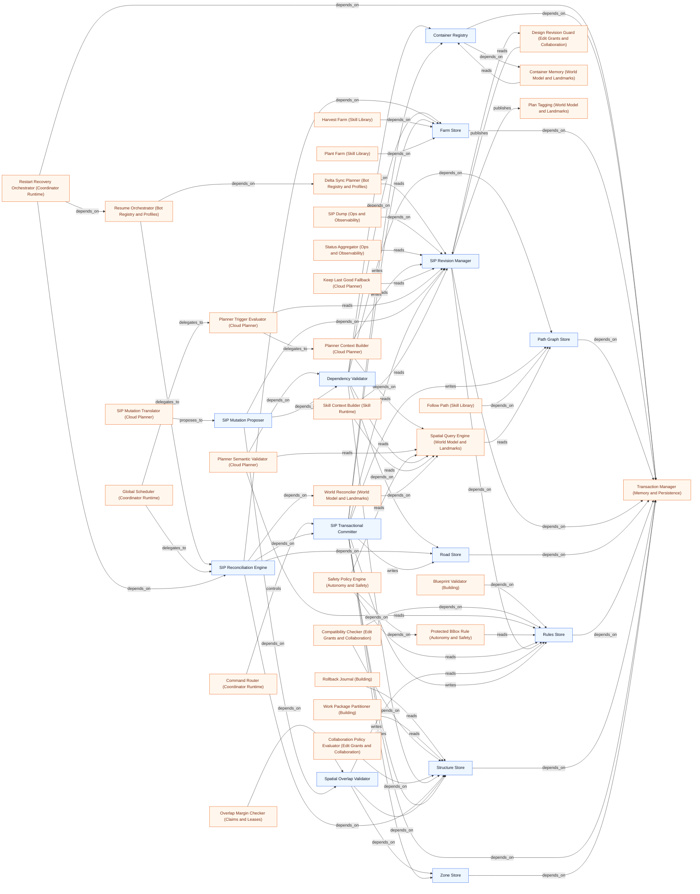
```mermaid
flowchart LR
n155["Zone Store"]
n156["Structure Store"]
n157["Road Store"]
n158["Farm Store"]
n159["Container Registry"]
n160["Path Graph Store"]
n161["Rules Store"]
n162["SIP Revision Manager"]
n163["Spatial Overlap Validator"]
n164["Dependency Validator"]
n165["SIP Mutation Proposer"]
n130["SIP Transactional Committer"]
n136["SIP Reconciliation Engine"]
n166["Delta Sync Planner (Bot Registry and Profiles)"]
n141["Resume Orchestrator (Bot Registry and Profiles)"]
n83["Blueprint Validator (Building)"]
n101["Rollback Journal (Building)"]
n95["Work Package Partitioner (Building)"]
n167["Overlap Margin Checker (Claims and Leases)"]
n26["Command Router (Coordinator Runtime)"]
n28["Global Scheduler (Coordinator Runtime)"]
n29["Restart Recovery Orchestrator (Coordinator Runtime)"]
n168["Compatibility Checker (Edit Grants and Collaboration)"]
n169["Design Revision Guard (Edit Grants and Collaboration)"]
n170["Collaboration Policy Evaluator (Edit Grants and Collaboration)"]
n121["SIP Dump (Ops and Observability)"]
n120["Status Aggregator (Ops and Observability)"]
n38["Planner Context Builder (Cloud Planner)"]
n47["Keep Last Good Fallback (Cloud Planner)"]
n41["Planner Semantic Validator (Cloud Planner)"]
n43["SIP Mutation Translator (Cloud Planner)"]
n39["Planner Trigger Evaluator (Cloud Planner)"]
n115["Protected BBox Rule (Autonomy and Safety)"]
n118["Safety Policy Engine (Autonomy and Safety)"]
n133["Transaction Manager (Memory and Persistence)"]
n171["Container Memory (World Model and Landmarks)"]
n172["Spatial Query Engine (World Model and Landmarks)"]
n173["World Reconciler (World Model and Landmarks)"]
n174["Plan Tagging (World Model and Landmarks)"]
n48["Skill Context Builder (Skill Runtime)"]
n175["Follow Path (Skill Library)"]
n176["Harvest Farm (Skill Library)"]
n177["Plant Farm (Skill Library)"]
n166 -->|reads| n162
n141 -->|depends_on| n166
n141 -->|delegates_to| n136
n83 -->|depends_on| n161
n101 -->|reads| n156
n95 -->|reads| n156
n167 -->|depends_on| n163
n26 -->|controls| n130
n28 -->|delegates_to| n39
n28 -->|delegates_to| n136
n29 -->|depends_on| n141
n29 -->|depends_on| n133
n29 -->|depends_on| n136
n168 -->|depends_on| n161
n168 -->|depends_on| n156
n169 -->|reads| n162
n170 -->|depends_on| n156
n121 -->|depends_on| n162
n120 -->|reads| n162
n38 -->|reads| n162
n38 -->|reads| n172
n47 -->|reads| n162
n41 -->|depends_on| n164
n41 -->|reads| n161
n41 -->|reads| n172
n43 -->|proposes_to| n165
n39 -->|delegates_to| n38
n39 -->|reads| n162
n115 -->|reads| n161
n118 -->|depends_on| n115
n118 -->|reads| n161
n118 -->|reads| n172
n159 -->|depends_on| n133
n159 -->|depends_on| n171
n164 -->|depends_on| n159
n164 -->|depends_on| n158
n164 -->|depends_on| n160
n164 -->|depends_on| n157
n164 -->|depends_on| n156
n164 -->|reads| n172
n158 -->|depends_on| n133
n165 -->|depends_on| n164
n165 -->|depends_on| n162
n165 -->|depends_on| n163
n160 -->|depends_on| n133
n136 -->|depends_on| n158
n136 -->|depends_on| n157
n136 -->|depends_on| n156
n136 -->|depends_on| n130
n136 -->|depends_on| n173
n162 -->|publishes| n169
n162 -->|depends_on| n133
n162 -->|depends_on| n161
n162 -->|publishes| n174
n157 -->|depends_on| n133
n161 -->|depends_on| n133
n163 -->|reads| n161
n163 -->|depends_on| n156
n163 -->|depends_on| n155
n156 -->|depends_on| n133
n130 -->|depends_on| n133
n130 -->|writes| n159
n130 -->|writes| n158
n130 -->|writes| n160
n130 -->|depends_on| n162
n130 -->|writes| n157
n130 -->|writes| n161
n130 -->|writes| n156
n130 -->|writes| n155
n155 -->|depends_on| n133
n48 -->|reads| n162
n48 -->|reads| n172
n175 -->|depends_on| n160
n176 -->|depends_on| n158
n177 -->|depends_on| n158
n171 -->|reads| n159
n172 -->|reads| n160
n173 -->|depends_on| n172
classDef internal fill:#eef6ff,stroke:#2563eb,color:#0f172a;
classDef external fill:#fff7ed,stroke:#ea580c,color:#7c2d12;
class n155,n156,n157,n158,n159,n160,n161,n162,n163,n164,n165,n130,n136 internal;
class n166,n141,n83,n101,n95,n167,n26,n28,n29,n168,n169,n170,n121,n120,n38,n47,n41,n43,n39,n115,n118,n133,n171,n172,n173,n174,n48,n175,n176,n177 external;
```

### Task Board

Source: `docs/architecture/graphs/system-tasks.mmd`

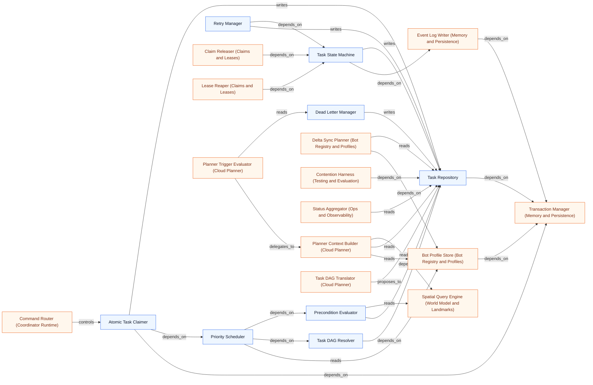
```mermaid
flowchart LR
n178["Task Repository"]
n179["Task DAG Resolver"]
n180["Precondition Evaluator"]
n181["Priority Scheduler"]
n131["Atomic Task Claimer"]
n182["Retry Manager"]
n183["Dead Letter Manager"]
n184["Task State Machine"]
n166["Delta Sync Planner (Bot Registry and Profiles)"]
n185["Claim Releaser (Claims and Leases)"]
n134["Lease Reaper (Claims and Leases)"]
n26["Command Router (Coordinator Runtime)"]
n186["Contention Harness (Testing and Evaluation)"]
n120["Status Aggregator (Ops and Observability)"]
n38["Planner Context Builder (Cloud Planner)"]
n44["Task DAG Translator (Cloud Planner)"]
n39["Planner Trigger Evaluator (Cloud Planner)"]
n133["Transaction Manager (Memory and Persistence)"]
n172["Spatial Query Engine (World Model and Landmarks)"]
n187["Bot Profile Store (Bot Registry and Profiles)"]
n188["Event Log Writer (Memory and Persistence)"]
n166 -->|depends_on| n187
n166 -->|reads| n178
n187 -->|depends_on| n133
n185 -->|depends_on| n184
n134 -->|depends_on| n184
n26 -->|controls| n131
n186 -->|depends_on| n178
n188 -->|depends_on| n133
n120 -->|reads| n178
n38 -->|reads| n187
n38 -->|reads| n178
n38 -->|reads| n172
n44 -->|proposes_to| n178
n39 -->|delegates_to| n38
n39 -->|reads| n183
n131 -->|depends_on| n133
n131 -->|depends_on| n181
n131 -->|writes| n178
n179 -->|depends_on| n178
n183 -->|writes| n178
n180 -->|depends_on| n178
n180 -->|reads| n172
n181 -->|reads| n187
n181 -->|depends_on| n179
n181 -->|depends_on| n180
n182 -->|writes| n178
n182 -->|depends_on| n184
n178 -->|depends_on| n133
n184 -->|depends_on| n188
n184 -->|writes| n178
classDef internal fill:#eef6ff,stroke:#2563eb,color:#0f172a;
classDef external fill:#fff7ed,stroke:#ea580c,color:#7c2d12;
class n178,n179,n180,n181,n131,n182,n183,n184 internal;
class n166,n185,n134,n26,n186,n120,n38,n44,n39,n133,n172,n187,n188 external;
```

### Claims and Leases

Source: `docs/architecture/graphs/system-claims.mmd`

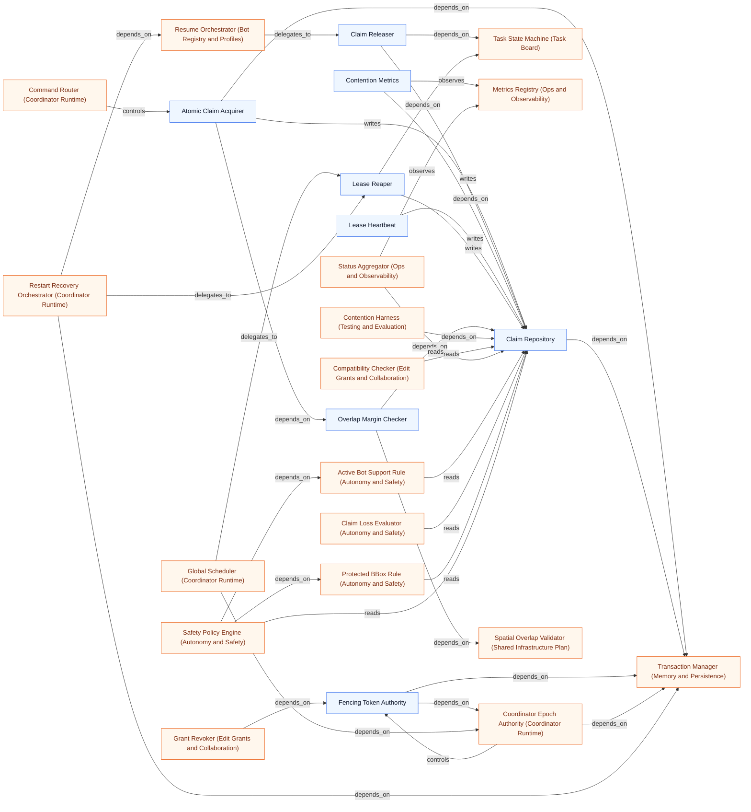
```mermaid
flowchart LR
n189["Claim Repository"]
n167["Overlap Margin Checker"]
n128["Atomic Claim Acquirer"]
n190["Lease Heartbeat"]
n134["Lease Reaper"]
n126["Fencing Token Authority"]
n185["Claim Releaser"]
n191["Contention Metrics"]
n141["Resume Orchestrator (Bot Registry and Profiles)"]
n133["Transaction Manager (Memory and Persistence)"]
n184["Task State Machine (Task Board)"]
n122["Metrics Registry (Ops and Observability)"]
n27["Coordinator Epoch Authority (Coordinator Runtime)"]
n163["Spatial Overlap Validator (Shared Infrastructure Plan)"]
n26["Command Router (Coordinator Runtime)"]
n28["Global Scheduler (Coordinator Runtime)"]
n29["Restart Recovery Orchestrator (Coordinator Runtime)"]
n186["Contention Harness (Testing and Evaluation)"]
n168["Compatibility Checker (Edit Grants and Collaboration)"]
n192["Grant Revoker (Edit Grants and Collaboration)"]
n120["Status Aggregator (Ops and Observability)"]
n116["Active Bot Support Rule (Autonomy and Safety)"]
n114["Claim Loss Evaluator (Autonomy and Safety)"]
n115["Protected BBox Rule (Autonomy and Safety)"]
n118["Safety Policy Engine (Autonomy and Safety)"]
n141 -->|delegates_to| n185
n128 -->|writes| n189
n128 -->|depends_on| n167
n128 -->|depends_on| n133
n185 -->|writes| n189
n185 -->|depends_on| n184
n189 -->|depends_on| n133
n191 -->|depends_on| n189
n191 -->|observes| n122
n126 -->|depends_on| n27
n126 -->|depends_on| n133
n190 -->|writes| n189
n134 -->|writes| n189
n134 -->|depends_on| n184
n167 -->|depends_on| n189
n167 -->|depends_on| n163
n26 -->|controls| n128
n27 -->|controls| n126
n27 -->|depends_on| n133
n28 -->|delegates_to| n134
n28 -->|depends_on| n27
n29 -->|depends_on| n141
n29 -->|delegates_to| n134
n29 -->|depends_on| n133
n186 -->|depends_on| n189
n168 -->|reads| n189
n192 -->|depends_on| n126
n120 -->|reads| n189
n120 -->|observes| n122
n116 -->|reads| n189
n114 -->|reads| n189
n115 -->|reads| n189
n118 -->|reads| n189
n118 -->|depends_on| n116
n118 -->|depends_on| n115
classDef internal fill:#eef6ff,stroke:#2563eb,color:#0f172a;
classDef external fill:#fff7ed,stroke:#ea580c,color:#7c2d12;
class n189,n167,n128,n190,n134,n126,n185,n191 internal;
class n141,n133,n184,n122,n27,n163,n26,n28,n29,n186,n168,n192,n120,n116,n114,n115,n118 external;
```

### Edit Grants and Collaboration

Source: `docs/architecture/graphs/system-grants.mmd`

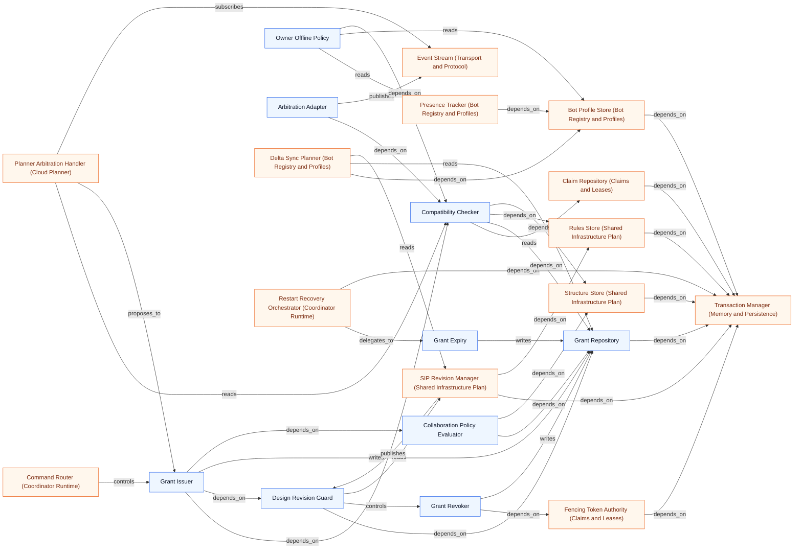
```mermaid
flowchart LR
n193["Grant Repository"]
n170["Collaboration Policy Evaluator"]
n168["Compatibility Checker"]
n169["Design Revision Guard"]
n129["Grant Issuer"]
n192["Grant Revoker"]
n194["Owner Offline Policy"]
n142["Grant Expiry"]
n151["Arbitration Adapter"]
n166["Delta Sync Planner (Bot Registry and Profiles)"]
n26["Command Router (Coordinator Runtime)"]
n29["Restart Recovery Orchestrator (Coordinator Runtime)"]
n147["Event Stream (Transport and Protocol)"]
n189["Claim Repository (Claims and Leases)"]
n161["Rules Store (Shared Infrastructure Plan)"]
n156["Structure Store (Shared Infrastructure Plan)"]
n162["SIP Revision Manager (Shared Infrastructure Plan)"]
n133["Transaction Manager (Memory and Persistence)"]
n126["Fencing Token Authority (Claims and Leases)"]
n145["Presence Tracker (Bot Registry and Profiles)"]
n187["Bot Profile Store (Bot Registry and Profiles)"]
n46["Planner Arbitration Handler (Cloud Planner)"]
n166 -->|depends_on| n187
n166 -->|reads| n193
n166 -->|reads| n162
n145 -->|depends_on| n187
n187 -->|depends_on| n133
n189 -->|depends_on| n133
n126 -->|depends_on| n133
n26 -->|controls| n129
n29 -->|delegates_to| n142
n29 -->|depends_on| n133
n151 -->|depends_on| n168
n151 -->|publishes| n147
n168 -->|reads| n189
n168 -->|depends_on| n193
n168 -->|depends_on| n161
n168 -->|depends_on| n156
n169 -->|depends_on| n193
n169 -->|controls| n192
n169 -->|reads| n162
n142 -->|writes| n193
n129 -->|depends_on| n168
n129 -->|depends_on| n169
n129 -->|writes| n193
n129 -->|depends_on| n170
n193 -->|depends_on| n133
n192 -->|depends_on| n126
n192 -->|writes| n193
n194 -->|reads| n145
n194 -->|reads| n187
n194 -->|depends_on| n168
n170 -->|depends_on| n193
n170 -->|depends_on| n156
n46 -->|reads| n168
n46 -->|proposes_to| n129
n46 -->|subscribes| n147
n162 -->|publishes| n169
n162 -->|depends_on| n133
n162 -->|depends_on| n161
n161 -->|depends_on| n133
n156 -->|depends_on| n133
classDef internal fill:#eef6ff,stroke:#2563eb,color:#0f172a;
classDef external fill:#fff7ed,stroke:#ea580c,color:#7c2d12;
class n193,n170,n168,n169,n129,n192,n194,n142,n151 internal;
class n166,n26,n29,n147,n189,n161,n156,n162,n133,n126,n145,n187,n46 external;
```

### Bot Registry and Profiles

Source: `docs/architecture/graphs/system-bots.mmd`

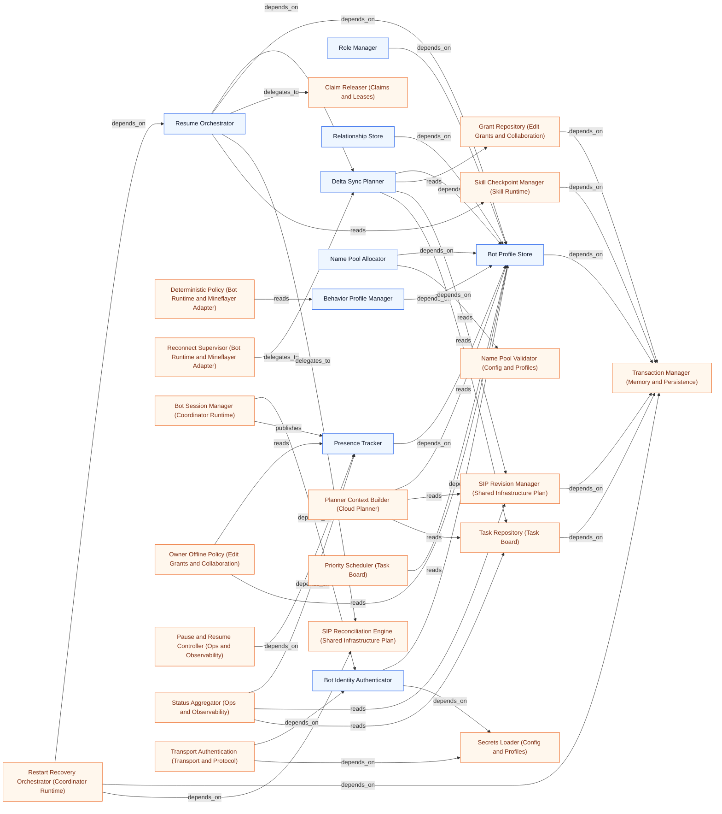
```mermaid
flowchart LR
n144["Bot Identity Authenticator"]
n187["Bot Profile Store"]
n195["Role Manager"]
n196["Behavior Profile Manager"]
n197["Relationship Store"]
n145["Presence Tracker"]
n166["Delta Sync Planner"]
n141["Resume Orchestrator"]
n198["Name Pool Allocator"]
n53["Deterministic Policy (Bot Runtime and Mineflayer Adapter)"]
n55["Reconnect Supervisor (Bot Runtime and Mineflayer Adapter)"]
n193["Grant Repository (Edit Grants and Collaboration)"]
n162["SIP Revision Manager (Shared Infrastructure Plan)"]
n178["Task Repository (Task Board)"]
n153["Secrets Loader (Config and Profiles)"]
n199["Name Pool Validator (Config and Profiles)"]
n133["Transaction Manager (Memory and Persistence)"]
n185["Claim Releaser (Claims and Leases)"]
n136["SIP Reconciliation Engine (Shared Infrastructure Plan)"]
n78["Skill Checkpoint Manager (Skill Runtime)"]
n29["Restart Recovery Orchestrator (Coordinator Runtime)"]
n65["Bot Session Manager (Coordinator Runtime)"]
n194["Owner Offline Policy (Edit Grants and Collaboration)"]
n61["Pause and Resume Controller (Ops and Observability)"]
n120["Status Aggregator (Ops and Observability)"]
n38["Planner Context Builder (Cloud Planner)"]
n181["Priority Scheduler (Task Board)"]
n150["Transport Authentication (Transport and Protocol)"]
n53 -->|reads| n196
n55 -->|delegates_to| n166
n196 -->|depends_on| n187
n166 -->|depends_on| n187
n166 -->|reads| n193
n166 -->|reads| n162
n166 -->|reads| n178
n144 -->|depends_on| n187
n144 -->|depends_on| n153
n198 -->|depends_on| n187
n198 -->|depends_on| n199
n145 -->|depends_on| n187
n187 -->|depends_on| n133
n197 -->|depends_on| n187
n141 -->|depends_on| n166
n141 -->|depends_on| n187
n141 -->|delegates_to| n185
n141 -->|delegates_to| n136
n141 -->|reads| n78
n195 -->|depends_on| n187
n29 -->|depends_on| n141
n29 -->|depends_on| n133
n29 -->|depends_on| n136
n65 -->|depends_on| n144
n65 -->|publishes| n145
n193 -->|depends_on| n133
n194 -->|reads| n145
n194 -->|reads| n187
n61 -->|depends_on| n145
n120 -->|depends_on| n145
n120 -->|reads| n162
n120 -->|reads| n178
n38 -->|reads| n187
n38 -->|reads| n162
n38 -->|reads| n178
n162 -->|depends_on| n133
n78 -->|depends_on| n133
n181 -->|reads| n187
n178 -->|depends_on| n133
n150 -->|depends_on| n144
n150 -->|depends_on| n153
classDef internal fill:#eef6ff,stroke:#2563eb,color:#0f172a;
classDef external fill:#fff7ed,stroke:#ea580c,color:#7c2d12;
class n144,n187,n195,n196,n197,n145,n166,n141,n198 internal;
class n53,n55,n193,n162,n178,n153,n199,n133,n185,n136,n78,n29,n65,n194,n61,n120,n38,n181,n150 external;
```

### World Model and Landmarks

Source: `docs/architecture/graphs/system-world.mmd`

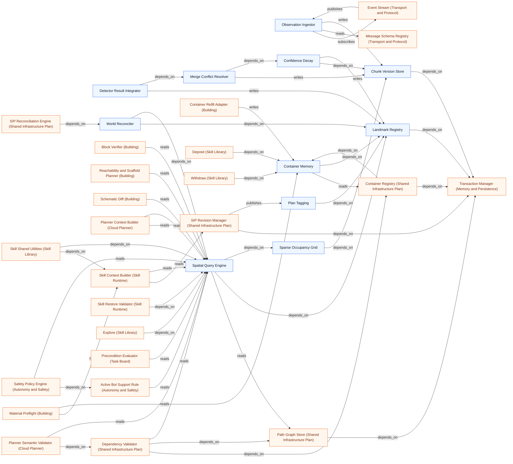
```mermaid
flowchart LR
n154["Observation Ingestor"]
n200["Chunk Version Store"]
n201["Sparse Occupancy Grid"]
n202["Merge Conflict Resolver"]
n203["Confidence Decay"]
n204["Landmark Registry"]
n205["Detector Result Integrator"]
n174["Plan Tagging"]
n172["Spatial Query Engine"]
n171["Container Memory"]
n173["World Reconciler"]
n98["Block Verifier (Building)"]
n100["Container Refill Adapter (Building)"]
n99["Material Preflight (Building)"]
n97["Reachability and Scaffold Planner (Building)"]
n94["Schematic Diff (Building)"]
n38["Planner Context Builder (Cloud Planner)"]
n41["Planner Semantic Validator (Cloud Planner)"]
n116["Active Bot Support Rule (Autonomy and Safety)"]
n118["Safety Policy Engine (Autonomy and Safety)"]
n159["Container Registry (Shared Infrastructure Plan)"]
n164["Dependency Validator (Shared Infrastructure Plan)"]
n136["SIP Reconciliation Engine (Shared Infrastructure Plan)"]
n162["SIP Revision Manager (Shared Infrastructure Plan)"]
n48["Skill Context Builder (Skill Runtime)"]
n79["Skill Restore Validator (Skill Runtime)"]
n206["Deposit (Skill Library)"]
n207["Explore (Skill Library)"]
n208["Skill Shared Utilities (Skill Library)"]
n209["Withdraw (Skill Library)"]
n180["Precondition Evaluator (Task Board)"]
n147["Event Stream (Transport and Protocol)"]
n133["Transaction Manager (Memory and Persistence)"]
n132["Message Schema Registry (Transport and Protocol)"]
n160["Path Graph Store (Shared Infrastructure Plan)"]
n98 -->|reads| n172
n100 -->|writes| n171
n99 -->|reads| n48
n99 -->|reads| n171
n97 -->|reads| n172
n94 -->|reads| n172
n38 -->|reads| n162
n38 -->|reads| n172
n41 -->|depends_on| n164
n41 -->|reads| n172
n116 -->|reads| n172
n118 -->|depends_on| n116
n118 -->|reads| n172
n159 -->|depends_on| n133
n159 -->|depends_on| n171
n164 -->|depends_on| n159
n164 -->|depends_on| n160
n164 -->|reads| n172
n160 -->|depends_on| n133
n136 -->|depends_on| n173
n162 -->|depends_on| n133
n162 -->|publishes| n174
n48 -->|reads| n162
n48 -->|reads| n172
n79 -->|depends_on| n172
n206 -->|depends_on| n171
n207 -->|depends_on| n172
n208 -->|depends_on| n48
n208 -->|depends_on| n172
n209 -->|depends_on| n171
n180 -->|reads| n172
n147 -->|publishes| n154
n200 -->|depends_on| n133
n203 -->|depends_on| n200
n203 -->|writes| n204
n171 -->|reads| n159
n171 -->|depends_on| n204
n205 -->|writes| n204
n205 -->|depends_on| n202
n204 -->|depends_on| n133
n202 -->|writes| n200
n202 -->|depends_on| n203
n154 -->|subscribes| n147
n154 -->|reads| n132
n154 -->|writes| n200
n201 -->|depends_on| n200
n174 -->|depends_on| n204
n172 -->|reads| n160
n172 -->|depends_on| n204
n172 -->|depends_on| n201
n173 -->|depends_on| n204
n173 -->|depends_on| n172
classDef internal fill:#eef6ff,stroke:#2563eb,color:#0f172a;
classDef external fill:#fff7ed,stroke:#ea580c,color:#7c2d12;
class n154,n200,n201,n202,n203,n204,n205,n174,n172,n171,n173 internal;
class n98,n100,n99,n97,n94,n38,n41,n116,n118,n159,n164,n136,n162,n48,n79,n206,n207,n208,n209,n180,n147,n133,n132,n160 external;
```

### Perception

Source: `docs/architecture/graphs/system-perception.mmd`

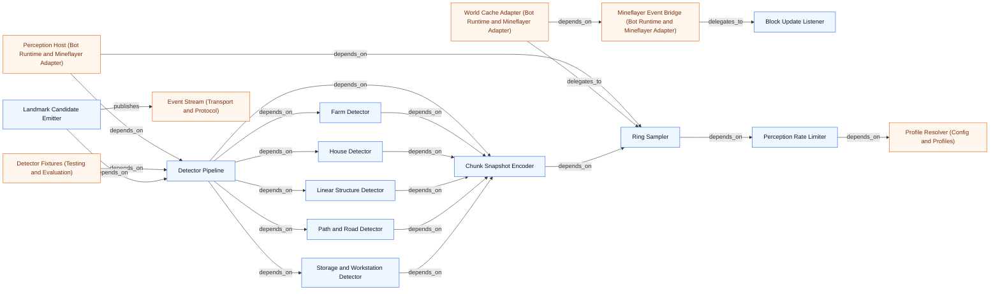
```mermaid
flowchart LR
n210["Ring Sampler"]
n211["Chunk Snapshot Encoder"]
n212["Block Update Listener"]
n213["Path and Road Detector"]
n214["House Detector"]
n215["Farm Detector"]
n216["Storage and Workstation Detector"]
n217["Linear Structure Detector"]
n218["Detector Pipeline"]
n152["Landmark Candidate Emitter"]
n219["Perception Rate Limiter"]
n50["Mineflayer Event Bridge (Bot Runtime and Mineflayer Adapter)"]
n108["Perception Host (Bot Runtime and Mineflayer Adapter)"]
n51["World Cache Adapter (Bot Runtime and Mineflayer Adapter)"]
n220["Detector Fixtures (Testing and Evaluation)"]
n147["Event Stream (Transport and Protocol)"]
n143["Profile Resolver (Config and Profiles)"]
n50 -->|delegates_to| n212
n108 -->|depends_on| n218
n108 -->|depends_on| n210
n51 -->|depends_on| n50
n51 -->|delegates_to| n210
n220 -->|depends_on| n218
n211 -->|depends_on| n210
n218 -->|depends_on| n211
n218 -->|depends_on| n215
n218 -->|depends_on| n214
n218 -->|depends_on| n217
n218 -->|depends_on| n213
n218 -->|depends_on| n216
n215 -->|depends_on| n211
n214 -->|depends_on| n211
n152 -->|depends_on| n218
n152 -->|publishes| n147
n217 -->|depends_on| n211
n213 -->|depends_on| n211
n219 -->|depends_on| n143
n210 -->|depends_on| n219
n216 -->|depends_on| n211
classDef internal fill:#eef6ff,stroke:#2563eb,color:#0f172a;
classDef external fill:#fff7ed,stroke:#ea580c,color:#7c2d12;
class n210,n211,n212,n213,n214,n215,n216,n217,n218,n152,n219 internal;
class n50,n108,n51,n220,n147,n143 external;
```

### Laya Decision Service

Source: `docs/architecture/graphs/system-decision.mmd`

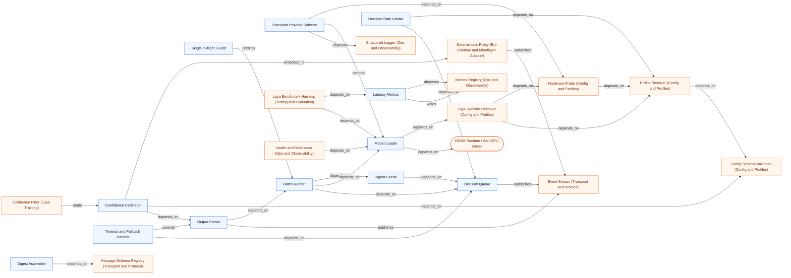
```mermaid
flowchart LR
n30["Model Loader"]
n31["Execution Provider Selector"]
n67["Decision Queue"]
n68["Decision Rate Limiter"]
n69["Digest Cache"]
n70["Digest Assembler"]
n32["Batch Runner"]
n33["Single In-flight Guard"]
n34["Output Parser"]
n35["Confidence Calibrator"]
n36["Timeout and Fallback Handler"]
n71["Latency Metrics"]
n53["Deterministic Policy (Bot Runtime and Mineflayer Adapter)"]
n137["Config Schema Validator (Config and Profiles)"]
n132["Message Schema Registry (Transport and Protocol)"]
n221["Hardware Probe (Config and Profiles)"]
n123["Structured Logger (Ops and Observability)"]
n122["Metrics Registry (Ops and Observability)"]
n222["Laya Runtime Resolver (Config and Profiles)"]
n23(["ONNX Runtime / WebGPU Driver"])
n147["Event Stream (Transport and Protocol)"]
n143["Profile Resolver (Config and Profiles)"]
n223["Laya Benchmark Harness (Testing and Evaluation)"]
n124["Health and Readiness (Ops and Observability)"]
n224["Calibration Fitter (Laya Training)"]
n53 -->|subscribes| n147
n221 -->|depends_on| n143
n222 -->|depends_on| n221
n222 -->|depends_on| n143
n143 -->|depends_on| n137
n32 -->|depends_on| n69
n32 -->|depends_on| n30
n32 -->|depends_on| n67
n35 -->|proposes_to| n53
n35 -->|depends_on| n137
n35 -->|depends_on| n34
n70 -->|depends_on| n132
n69 -->|depends_on| n67
n31 -->|depends_on| n221
n31 -->|controls| n30
n31 -->|observes| n123
n71 -->|observes| n122
n71 -->|writes| n122
n30 -->|depends_on| n222
n30 -->|depends_on| n23
n34 -->|depends_on| n32
n34 -->|publishes| n147
n67 -->|subscribes| n147
n68 -->|depends_on| n143
n68 -->|depends_on| n67
n33 -->|controls| n32
n36 -->|controls| n34
n36 -->|depends_on| n67
n223 -->|depends_on| n71
n223 -->|depends_on| n30
n124 -->|depends_on| n30
n224 -->|reads| n35
classDef internal fill:#eef6ff,stroke:#2563eb,color:#0f172a;
classDef external fill:#fff7ed,stroke:#ea580c,color:#7c2d12;
class n30,n31,n67,n68,n69,n70,n32,n33,n34,n35,n36,n71 internal;
class n53,n137,n132,n221,n123,n122,n222,n147,n143,n223,n124,n224,n23 external;
```

### Cloud Planner

Source: `docs/architecture/graphs/system-planner.mmd`

```mermaid
flowchart LR
n37["OpenAI-Compatible Client"]
n38["Planner Context Builder"]
n39["Planner Trigger Evaluator"]
n40["Planner Schema Validator"]
n41["Planner Semantic Validator"]
n42["Planner Repair Loop"]
n43["SIP Mutation Translator"]
n44["Task DAG Translator"]
n45["Planner Budget Limiter"]
n72["Plan Cache"]
n46["Planner Arbitration Handler"]
n47["Keep Last Good Fallback"]
n28["Global Scheduler (Coordinator Runtime)"]
n168["Compatibility Checker (Edit Grants and Collaboration)"]
n129["Grant Issuer (Edit Grants and Collaboration)"]
n147["Event Stream (Transport and Protocol)"]
n122["Metrics Registry (Ops and Observability)"]
n187["Bot Profile Store (Bot Registry and Profiles)"]
n162["SIP Revision Manager (Shared Infrastructure Plan)"]
n178["Task Repository (Task Board)"]
n172["Spatial Query Engine (World Model and Landmarks)"]
n137["Config Schema Validator (Config and Profiles)"]
n153["Secrets Loader (Config and Profiles)"]
n22(["Muse Spark Planner Endpoint"])
n133["Transaction Manager (Memory and Persistence)"]
n164["Dependency Validator (Shared Infrastructure Plan)"]
n161["Rules Store (Shared Infrastructure Plan)"]
n74["Skill Registry (Skill Runtime)"]
n165["SIP Mutation Proposer (Shared Infrastructure Plan)"]
n183["Dead Letter Manager (Task Board)"]
n58["Recovery Ladder (Autonomy and Safety)"]
n187 -->|depends_on| n133
n28 -->|delegates_to| n39
n168 -->|depends_on| n161
n129 -->|depends_on| n168
n46 -->|reads| n168
n46 -->|proposes_to| n129
n46 -->|subscribes| n147
n45 -->|observes| n122
n45 -->|controls| n37
n38 -->|reads| n187
n38 -->|reads| n162
n38 -->|reads| n178
n38 -->|reads| n172
n47 -->|depends_on| n72
n47 -->|reads| n162
n37 -->|depends_on| n137
n37 -->|depends_on| n153
n37 -->|depends_on| n22
n37 -->|delegates_to| n46
n72 -->|depends_on| n133
n42 -->|controls| n47
n42 -->|depends_on| n37
n42 -->|depends_on| n40
n42 -->|depends_on| n41
n40 -->|controls| n42
n41 -->|controls| n42
n41 -->|depends_on| n40
n41 -->|depends_on| n164
n41 -->|reads| n161
n41 -->|reads| n74
n41 -->|reads| n172
n43 -->|depends_on| n42
n43 -->|proposes_to| n165
n44 -->|depends_on| n42
n44 -->|proposes_to| n178
n39 -->|observes| n122
n39 -->|delegates_to| n38
n39 -->|reads| n162
n39 -->|reads| n183
n58 -->|proposes_to| n39
n58 -->|depends_on| n147
n164 -->|reads| n172
n165 -->|depends_on| n164
n165 -->|depends_on| n162
n162 -->|depends_on| n133
n162 -->|depends_on| n161
n161 -->|depends_on| n133
n183 -->|writes| n178
n178 -->|depends_on| n133
classDef internal fill:#eef6ff,stroke:#2563eb,color:#0f172a;
classDef external fill:#fff7ed,stroke:#ea580c,color:#7c2d12;
class n37,n38,n39,n40,n41,n42,n43,n44,n45,n72,n46,n47 internal;
class n28,n168,n129,n147,n122,n187,n162,n178,n172,n137,n153,n133,n164,n161,n74,n165,n183,n58,n22 external;
```

### Skill Runtime

Source: `docs/architecture/graphs/system-skill-runtime.mmd`

```mermaid
flowchart LR
n73["Skill Contract"]
n74["Skill Registry"]
n75["Skill Lifecycle Executor"]
n76["Skill Tick Scheduler"]
n48["Skill Context Builder"]
n77["Skill Progress Reporter"]
n78["Skill Checkpoint Manager"]
n79["Skill Restore Validator"]
n80["Typed Effects Emitter"]
n81["Skill Preemption Handler"]
n106["Affordance Enumerator (Bot Runtime and Mineflayer Adapter)"]
n54["Skill Host (Bot Runtime and Mineflayer Adapter)"]
n51["World Cache Adapter (Bot Runtime and Mineflayer Adapter)"]
n141["Resume Orchestrator (Bot Registry and Profiles)"]
n99["Material Preflight (Building)"]
n41["Planner Semantic Validator (Cloud Planner)"]
n133["Transaction Manager (Memory and Persistence)"]
n162["SIP Revision Manager (Shared Infrastructure Plan)"]
n172["Spatial Query Engine (World Model and Landmarks)"]
n147["Event Stream (Transport and Protocol)"]
n57["Action Veto Gate (Autonomy and Safety)"]
n122["Metrics Registry (Ops and Observability)"]
n56["Reflex Guardian Loop (Autonomy and Safety)"]
n225["Craft (Skill Library)"]
n226["Navigate (Skill Library)"]
n227["Place Build (Skill Library)"]
n208["Skill Shared Utilities (Skill Library)"]
n106 -->|depends_on| n51
n106 -->|depends_on| n56
n106 -->|depends_on| n74
n54 -->|depends_on| n75
n54 -->|depends_on| n76
n51 -->|delegates_to| n48
n141 -->|reads| n78
n99 -->|reads| n48
n41 -->|reads| n74
n41 -->|reads| n172
n57 -->|depends_on| n56
n56 -->|controls| n57
n162 -->|depends_on| n133
n78 -->|depends_on| n133
n48 -->|reads| n51
n48 -->|reads| n162
n48 -->|depends_on| n78
n48 -->|reads| n172
n80 -->|publishes| n147
n75 -->|depends_on| n48
n75 -->|depends_on| n80
n75 -->|depends_on| n73
n75 -->|depends_on| n74
n81 -->|reads| n57
n81 -->|depends_on| n75
n77 -->|observes| n122
n77 -->|publishes| n147
n79 -->|depends_on| n78
n79 -->|depends_on| n172
n74 -->|depends_on| n73
n76 -->|reads| n56
n76 -->|depends_on| n75
n225 -->|depends_on| n48
n226 -->|depends_on| n73
n227 -->|depends_on| n48
n208 -->|depends_on| n48
n208 -->|depends_on| n172
classDef internal fill:#eef6ff,stroke:#2563eb,color:#0f172a;
classDef external fill:#fff7ed,stroke:#ea580c,color:#7c2d12;
class n73,n74,n75,n76,n48,n77,n78,n79,n80,n81 internal;
class n106,n54,n51,n141,n99,n41,n133,n162,n172,n147,n57,n122,n56,n225,n226,n227,n208 external;
```

### Skill Library

Source: `docs/architecture/graphs/system-skills.mmd`

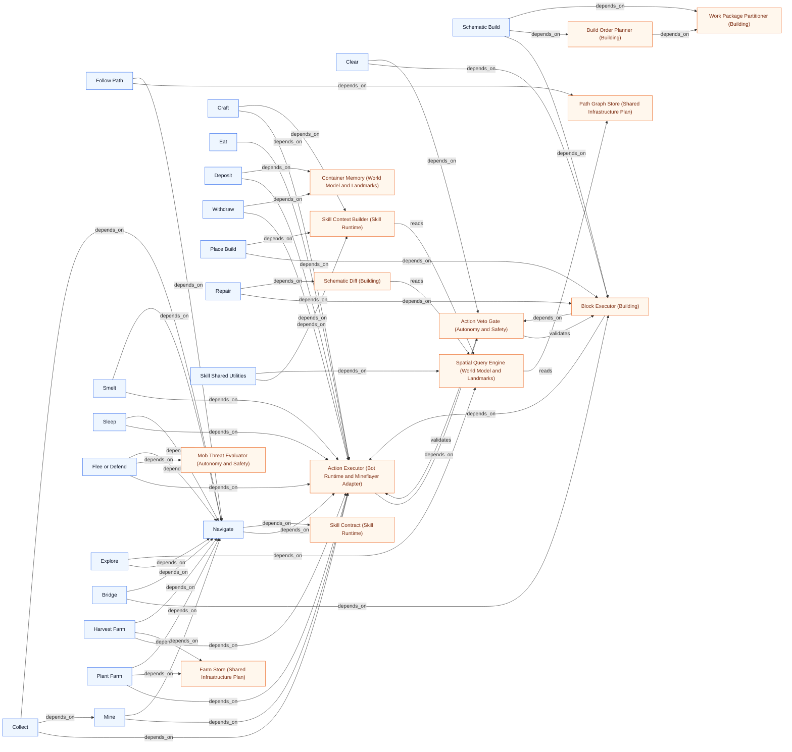
```mermaid
flowchart LR
n226["Navigate"]
n175["Follow Path"]
n228["Mine"]
n229["Collect"]
n225["Craft"]
n230["Smelt"]
n231["Eat"]
n206["Deposit"]
n209["Withdraw"]
n232["Sleep"]
n233["Flee or Defend"]
n207["Explore"]
n234["Bridge"]
n235["Clear"]
n227["Place Build"]
n236["Schematic Build"]
n237["Repair"]
n176["Harvest Farm"]
n177["Plant Farm"]
n208["Skill Shared Utilities"]
n49["Block Executor (Building)"]
n57["Action Veto Gate (Autonomy and Safety)"]
n52["Action Executor (Bot Runtime and Mineflayer Adapter)"]
n48["Skill Context Builder (Skill Runtime)"]
n171["Container Memory (World Model and Landmarks)"]
n172["Spatial Query Engine (World Model and Landmarks)"]
n110["Mob Threat Evaluator (Autonomy and Safety)"]
n160["Path Graph Store (Shared Infrastructure Plan)"]
n158["Farm Store (Shared Infrastructure Plan)"]
n73["Skill Contract (Skill Runtime)"]
n94["Schematic Diff (Building)"]
n96["Build Order Planner (Building)"]
n95["Work Package Partitioner (Building)"]
n52 -->|depends_on| n57
n49 -->|depends_on| n52
n49 -->|depends_on| n57
n96 -->|depends_on| n95
n94 -->|reads| n172
n57 -->|validates| n52
n57 -->|validates| n49
n48 -->|reads| n172
n234 -->|depends_on| n49
n234 -->|depends_on| n226
n235 -->|depends_on| n49
n235 -->|depends_on| n57
n229 -->|depends_on| n52
n229 -->|depends_on| n228
n229 -->|depends_on| n226
n225 -->|depends_on| n52
n225 -->|depends_on| n48
n206 -->|depends_on| n52
n206 -->|depends_on| n171
n231 -->|depends_on| n52
n207 -->|depends_on| n226
n207 -->|depends_on| n172
n233 -->|depends_on| n52
n233 -->|depends_on| n110
n233 -->|depends_on| n226
n175 -->|depends_on| n160
n175 -->|depends_on| n226
n176 -->|depends_on| n52
n176 -->|depends_on| n158
n176 -->|depends_on| n226
n228 -->|depends_on| n52
n228 -->|depends_on| n226
n226 -->|depends_on| n52
n226 -->|depends_on| n73
n227 -->|depends_on| n49
n227 -->|depends_on| n48
n177 -->|depends_on| n52
n177 -->|depends_on| n158
n177 -->|depends_on| n226
n237 -->|depends_on| n49
n237 -->|depends_on| n94
n236 -->|depends_on| n49
n236 -->|depends_on| n96
n236 -->|depends_on| n95
n208 -->|depends_on| n48
n208 -->|depends_on| n172
n232 -->|depends_on| n52
n232 -->|depends_on| n226
n230 -->|depends_on| n52
n230 -->|depends_on| n226
n209 -->|depends_on| n52
n209 -->|depends_on| n171
n172 -->|reads| n160
classDef internal fill:#eef6ff,stroke:#2563eb,color:#0f172a;
classDef external fill:#fff7ed,stroke:#ea580c,color:#7c2d12;
class n226,n175,n228,n229,n225,n230,n231,n206,n209,n232,n233,n207,n234,n235,n227,n236,n237,n176,n177,n208 internal;
class n49,n57,n52,n48,n171,n172,n110,n160,n158,n73,n94,n96,n95 external;
```

### Building

Source: `docs/architecture/graphs/system-building.mmd`

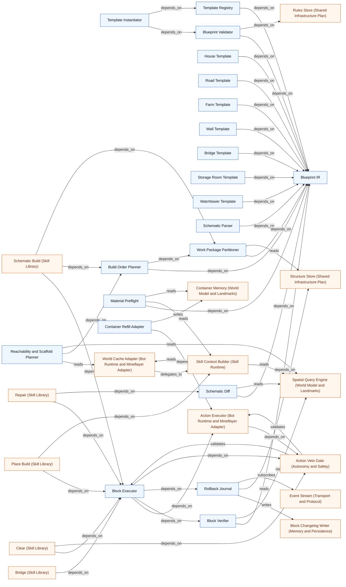
```mermaid
flowchart LR
n82["Blueprint IR"]
n83["Blueprint Validator"]
n84["Template Registry"]
n85["House Template"]
n86["Road Template"]
n87["Farm Template"]
n88["Wall Template"]
n89["Bridge Template"]
n90["Storage Room Template"]
n91["Watchtower Template"]
n92["Template Instantiator"]
n93["Schematic Parser"]
n94["Schematic Diff"]
n95["Work Package Partitioner"]
n96["Build Order Planner"]
n97["Reachability and Scaffold Planner"]
n98["Block Verifier"]
n49["Block Executor"]
n99["Material Preflight"]
n100["Container Refill Adapter"]
n101["Rollback Journal"]
n52["Action Executor (Bot Runtime and Mineflayer Adapter)"]
n57["Action Veto Gate (Autonomy and Safety)"]
n172["Spatial Query Engine (World Model and Landmarks)"]
n161["Rules Store (Shared Infrastructure Plan)"]
n171["Container Memory (World Model and Landmarks)"]
n48["Skill Context Builder (Skill Runtime)"]
n51["World Cache Adapter (Bot Runtime and Mineflayer Adapter)"]
n238["Block Changelog Writer (Memory and Persistence)"]
n156["Structure Store (Shared Infrastructure Plan)"]
n147["Event Stream (Transport and Protocol)"]
n234["Bridge (Skill Library)"]
n235["Clear (Skill Library)"]
n227["Place Build (Skill Library)"]
n237["Repair (Skill Library)"]
n236["Schematic Build (Skill Library)"]
n52 -->|depends_on| n57
n51 -->|delegates_to| n48
n49 -->|depends_on| n52
n49 -->|depends_on| n98
n49 -->|depends_on| n101
n49 -->|depends_on| n57
n98 -->|depends_on| n82
n98 -->|reads| n172
n83 -->|depends_on| n82
n83 -->|depends_on| n161
n96 -->|depends_on| n82
n96 -->|depends_on| n95
n100 -->|depends_on| n52
n100 -->|writes| n171
n99 -->|depends_on| n82
n99 -->|reads| n48
n99 -->|reads| n171
n97 -->|reads| n51
n97 -->|depends_on| n96
n97 -->|reads| n172
n101 -->|writes| n238
n101 -->|reads| n156
n101 -->|subscribes| n147
n94 -->|depends_on| n82
n94 -->|reads| n172
n93 -->|depends_on| n82
n89 -->|depends_on| n82
n87 -->|depends_on| n82
n85 -->|depends_on| n82
n92 -->|depends_on| n83
n92 -->|depends_on| n84
n84 -->|depends_on| n82
n86 -->|depends_on| n82
n90 -->|depends_on| n82
n88 -->|depends_on| n82
n91 -->|depends_on| n82
n95 -->|depends_on| n82
n95 -->|reads| n156
n57 -->|validates| n52
n57 -->|validates| n49
n48 -->|reads| n51
n48 -->|reads| n172
n234 -->|depends_on| n49
n235 -->|depends_on| n49
n235 -->|depends_on| n57
n227 -->|depends_on| n49
n227 -->|depends_on| n48
n237 -->|depends_on| n49
n237 -->|depends_on| n94
n236 -->|depends_on| n49
n236 -->|depends_on| n96
n236 -->|depends_on| n95
classDef internal fill:#eef6ff,stroke:#2563eb,color:#0f172a;
classDef external fill:#fff7ed,stroke:#ea580c,color:#7c2d12;
class n82,n83,n84,n85,n86,n87,n88,n89,n90,n91,n92,n93,n94,n95,n96,n97,n98,n49,n99,n100,n101 internal;
class n52,n57,n172,n161,n171,n48,n51,n238,n156,n147,n234,n235,n227,n237,n236 external;
```

### Bot Runtime and Mineflayer Adapter

Source: `docs/architecture/graphs/system-bot-runtime.mmd`

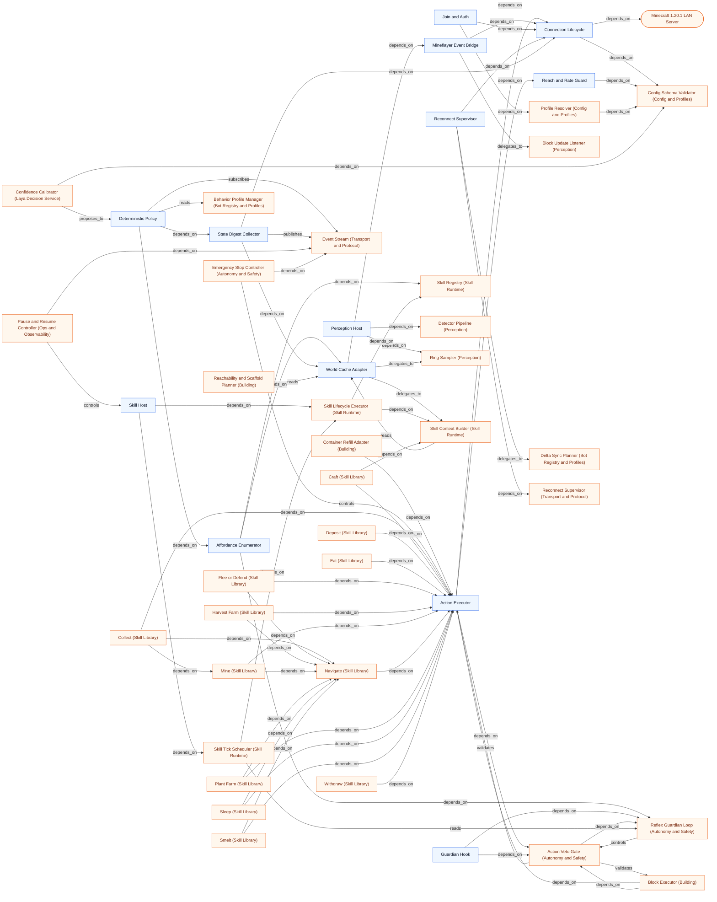
```mermaid
flowchart LR
n102["Connection Lifecycle"]
n103["Join and Auth"]
n50["Mineflayer Event Bridge"]
n51["World Cache Adapter"]
n104["Reach and Rate Guard"]
n52["Action Executor"]
n105["State Digest Collector"]
n106["Affordance Enumerator"]
n53["Deterministic Policy"]
n107["Guardian Hook"]
n54["Skill Host"]
n108["Perception Host"]
n55["Reconnect Supervisor"]
n57["Action Veto Gate (Autonomy and Safety)"]
n56["Reflex Guardian Loop (Autonomy and Safety)"]
n74["Skill Registry (Skill Runtime)"]
n137["Config Schema Validator (Config and Profiles)"]
n21(["Minecraft 1.20.1 LAN Server"])
n196["Behavior Profile Manager (Bot Registry and Profiles)"]
n147["Event Stream (Transport and Protocol)"]
n212["Block Update Listener (Perception)"]
n143["Profile Resolver (Config and Profiles)"]
n218["Detector Pipeline (Perception)"]
n210["Ring Sampler (Perception)"]
n166["Delta Sync Planner (Bot Registry and Profiles)"]
n149["Reconnect Supervisor (Transport and Protocol)"]
n75["Skill Lifecycle Executor (Skill Runtime)"]
n76["Skill Tick Scheduler (Skill Runtime)"]
n48["Skill Context Builder (Skill Runtime)"]
n49["Block Executor (Building)"]
n100["Container Refill Adapter (Building)"]
n97["Reachability and Scaffold Planner (Building)"]
n35["Confidence Calibrator (Laya Decision Service)"]
n61["Pause and Resume Controller (Ops and Observability)"]
n59["Emergency Stop Controller (Autonomy and Safety)"]
n229["Collect (Skill Library)"]
n225["Craft (Skill Library)"]
n206["Deposit (Skill Library)"]
n231["Eat (Skill Library)"]
n233["Flee or Defend (Skill Library)"]
n176["Harvest Farm (Skill Library)"]
n228["Mine (Skill Library)"]
n226["Navigate (Skill Library)"]
n177["Plant Farm (Skill Library)"]
n232["Sleep (Skill Library)"]
n230["Smelt (Skill Library)"]
n209["Withdraw (Skill Library)"]
n52 -->|depends_on| n102
n52 -->|depends_on| n104
n52 -->|depends_on| n57
n106 -->|depends_on| n51
n106 -->|depends_on| n56
n106 -->|depends_on| n74
n102 -->|depends_on| n137
n102 -->|depends_on| n21
n53 -->|depends_on| n106
n53 -->|depends_on| n105
n53 -->|reads| n196
n53 -->|subscribes| n147
n50 -->|depends_on| n102
n50 -->|delegates_to| n212
n107 -->|depends_on| n57
n107 -->|depends_on| n56
n103 -->|depends_on| n102
n103 -->|depends_on| n143
n108 -->|depends_on| n218
n108 -->|depends_on| n210
n104 -->|depends_on| n137
n55 -->|depends_on| n102
n55 -->|delegates_to| n166
n55 -->|depends_on| n149
n54 -->|depends_on| n75
n54 -->|depends_on| n76
n105 -->|depends_on| n102
n105 -->|depends_on| n51
n105 -->|publishes| n147
n51 -->|depends_on| n50
n51 -->|delegates_to| n210
n51 -->|delegates_to| n48
n49 -->|depends_on| n52
n49 -->|depends_on| n57
n100 -->|depends_on| n52
n97 -->|reads| n51
n143 -->|depends_on| n137
n35 -->|proposes_to| n53
n35 -->|depends_on| n137
n61 -->|controls| n54
n61 -->|depends_on| n147
n57 -->|validates| n52
n57 -->|validates| n49
n57 -->|depends_on| n56
n59 -->|controls| n52
n59 -->|depends_on| n147
n56 -->|controls| n57
n48 -->|reads| n51
n75 -->|depends_on| n48
n75 -->|depends_on| n74
n76 -->|reads| n56
n76 -->|depends_on| n75
n229 -->|depends_on| n52
n229 -->|depends_on| n228
n229 -->|depends_on| n226
n225 -->|depends_on| n52
n225 -->|depends_on| n48
n206 -->|depends_on| n52
n231 -->|depends_on| n52
n233 -->|depends_on| n52
n233 -->|depends_on| n226
n176 -->|depends_on| n52
n176 -->|depends_on| n226
n228 -->|depends_on| n52
n228 -->|depends_on| n226
n226 -->|depends_on| n52
n177 -->|depends_on| n52
n177 -->|depends_on| n226
n232 -->|depends_on| n52
n232 -->|depends_on| n226
n230 -->|depends_on| n52
n230 -->|depends_on| n226
n209 -->|depends_on| n52
classDef internal fill:#eef6ff,stroke:#2563eb,color:#0f172a;
classDef external fill:#fff7ed,stroke:#ea580c,color:#7c2d12;
class n102,n103,n50,n51,n104,n52,n105,n106,n53,n107,n54,n108,n55 internal;
class n57,n56,n74,n137,n196,n147,n212,n143,n218,n210,n166,n149,n75,n76,n48,n49,n100,n97,n35,n61,n59,n229,n225,n206,n231,n233,n176,n228,n226,n177,n232,n230,n209,n21 external;
```

### Autonomy and Safety

Source: `docs/architecture/graphs/system-safety.mmd`

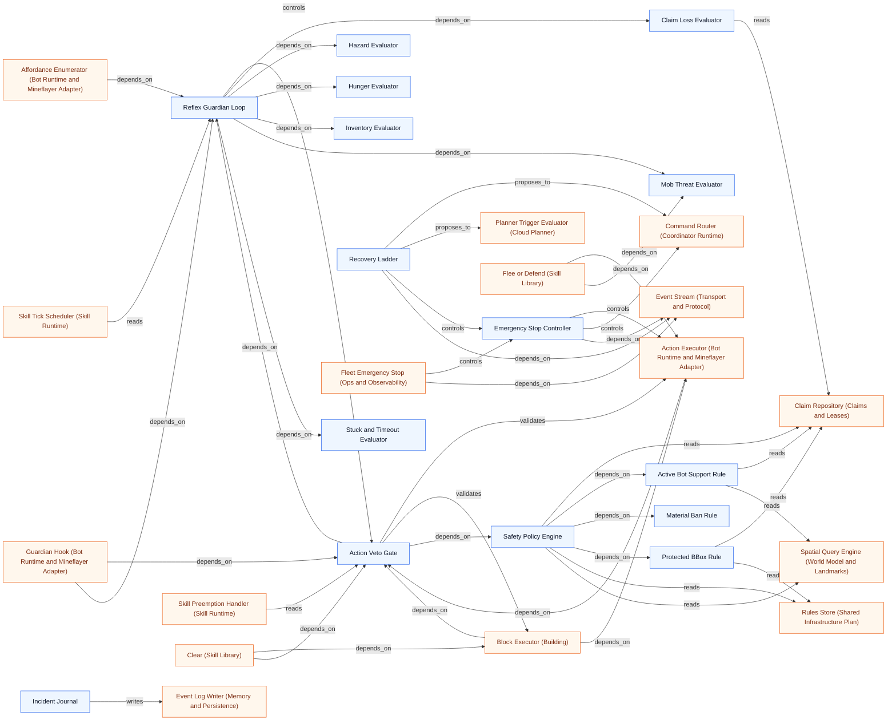
```mermaid
flowchart LR
n56["Reflex Guardian Loop"]
n109["Hazard Evaluator"]
n110["Mob Threat Evaluator"]
n111["Hunger Evaluator"]
n112["Stuck and Timeout Evaluator"]
n113["Inventory Evaluator"]
n114["Claim Loss Evaluator"]
n115["Protected BBox Rule"]
n116["Active Bot Support Rule"]
n117["Material Ban Rule"]
n118["Safety Policy Engine"]
n57["Action Veto Gate"]
n58["Recovery Ladder"]
n59["Emergency Stop Controller"]
n119["Incident Journal"]
n52["Action Executor (Bot Runtime and Mineflayer Adapter)"]
n106["Affordance Enumerator (Bot Runtime and Mineflayer Adapter)"]
n107["Guardian Hook (Bot Runtime and Mineflayer Adapter)"]
n49["Block Executor (Building)"]
n62["Fleet Emergency Stop (Ops and Observability)"]
n189["Claim Repository (Claims and Leases)"]
n172["Spatial Query Engine (World Model and Landmarks)"]
n26["Command Router (Coordinator Runtime)"]
n147["Event Stream (Transport and Protocol)"]
n188["Event Log Writer (Memory and Persistence)"]
n161["Rules Store (Shared Infrastructure Plan)"]
n39["Planner Trigger Evaluator (Cloud Planner)"]
n81["Skill Preemption Handler (Skill Runtime)"]
n76["Skill Tick Scheduler (Skill Runtime)"]
n235["Clear (Skill Library)"]
n233["Flee or Defend (Skill Library)"]
n52 -->|depends_on| n57
n106 -->|depends_on| n56
n107 -->|depends_on| n57
n107 -->|depends_on| n56
n49 -->|depends_on| n52
n49 -->|depends_on| n57
n62 -->|controls| n59
n62 -->|depends_on| n147
n57 -->|validates| n52
n57 -->|validates| n49
n57 -->|depends_on| n56
n57 -->|depends_on| n118
n116 -->|reads| n189
n116 -->|reads| n172
n114 -->|reads| n189
n59 -->|controls| n52
n59 -->|controls| n26
n59 -->|depends_on| n147
n56 -->|controls| n57
n56 -->|depends_on| n114
n56 -->|depends_on| n109
n56 -->|depends_on| n111
n56 -->|depends_on| n113
n56 -->|depends_on| n110
n56 -->|depends_on| n112
n119 -->|writes| n188
n115 -->|reads| n189
n115 -->|reads| n161
n58 -->|proposes_to| n26
n58 -->|proposes_to| n39
n58 -->|controls| n59
n58 -->|depends_on| n147
n118 -->|reads| n189
n118 -->|depends_on| n116
n118 -->|depends_on| n117
n118 -->|depends_on| n115
n118 -->|reads| n161
n118 -->|reads| n172
n81 -->|reads| n57
n76 -->|reads| n56
n235 -->|depends_on| n49
n235 -->|depends_on| n57
n233 -->|depends_on| n52
n233 -->|depends_on| n110
classDef internal fill:#eef6ff,stroke:#2563eb,color:#0f172a;
classDef external fill:#fff7ed,stroke:#ea580c,color:#7c2d12;
class n56,n109,n110,n111,n112,n113,n114,n115,n116,n117,n118,n57,n58,n59,n119 internal;
class n52,n106,n107,n49,n62,n189,n172,n26,n147,n188,n161,n39,n81,n76,n235,n233 external;
```

### Memory and Persistence

Source: `docs/architecture/graphs/system-memory.mmd`

```mermaid
flowchart LR
n239["SQLite Runtime"]
n139["Migration Runner"]
n133["Transaction Manager"]
n188["Event Log Writer"]
n238["Block Changelog Writer"]
n135["Retention Pruner"]
n240["Snapshot Export"]
n241["Schema Version Registry"]
n187["Bot Profile Store (Bot Registry and Profiles)"]
n101["Rollback Journal (Building)"]
n128["Atomic Claim Acquirer (Claims and Leases)"]
n189["Claim Repository (Claims and Leases)"]
n126["Fencing Token Authority (Claims and Leases)"]
n27["Coordinator Epoch Authority (Coordinator Runtime)"]
n28["Global Scheduler (Coordinator Runtime)"]
n63["Process Bootstrap (Coordinator Runtime)"]
n29["Restart Recovery Orchestrator (Coordinator Runtime)"]
n242["Replay Engine (Testing and Evaluation)"]
n193["Grant Repository (Edit Grants and Collaboration)"]
n125["Audit Viewer (Ops and Observability)"]
n124["Health and Readiness (Ops and Observability)"]
n72["Plan Cache (Cloud Planner)"]
n119["Incident Journal (Autonomy and Safety)"]
n159["Container Registry (Shared Infrastructure Plan)"]
n158["Farm Store (Shared Infrastructure Plan)"]
n160["Path Graph Store (Shared Infrastructure Plan)"]
n162["SIP Revision Manager (Shared Infrastructure Plan)"]
n157["Road Store (Shared Infrastructure Plan)"]
n161["Rules Store (Shared Infrastructure Plan)"]
n156["Structure Store (Shared Infrastructure Plan)"]
n130["SIP Transactional Committer (Shared Infrastructure Plan)"]
n155["Zone Store (Shared Infrastructure Plan)"]
n78["Skill Checkpoint Manager (Skill Runtime)"]
n131["Atomic Task Claimer (Task Board)"]
n178["Task Repository (Task Board)"]
n184["Task State Machine (Task Board)"]
n243["Trace Exporter (Laya Training)"]
n200["Chunk Version Store (World Model and Landmarks)"]
n204["Landmark Registry (World Model and Landmarks)"]
n187 -->|depends_on| n133
n101 -->|writes| n238
n101 -->|reads| n156
n128 -->|writes| n189
n128 -->|depends_on| n133
n189 -->|depends_on| n133
n126 -->|depends_on| n27
n126 -->|depends_on| n133
n27 -->|controls| n126
n27 -->|depends_on| n133
n28 -->|depends_on| n27
n28 -->|delegates_to| n135
n63 -->|depends_on| n29
n63 -->|depends_on| n139
n29 -->|depends_on| n133
n242 -->|depends_on| n188
n193 -->|depends_on| n133
n238 -->|depends_on| n133
n188 -->|depends_on| n133
n139 -->|depends_on| n239
n135 -->|depends_on| n238
n135 -->|depends_on| n188
n135 -->|depends_on| n133
n241 -->|depends_on| n139
n240 -->|depends_on| n133
n133 -->|depends_on| n239
n125 -->|reads| n238
n125 -->|reads| n188
n124 -->|depends_on| n239
n72 -->|depends_on| n133
n119 -->|writes| n188
n159 -->|depends_on| n133
n158 -->|depends_on| n133
n160 -->|depends_on| n133
n162 -->|depends_on| n133
n162 -->|depends_on| n161
n157 -->|depends_on| n133
n161 -->|depends_on| n133
n156 -->|depends_on| n133
n130 -->|depends_on| n133
n130 -->|writes| n159
n130 -->|writes| n158
n130 -->|writes| n160
n130 -->|depends_on| n162
n130 -->|writes| n157
n130 -->|writes| n161
n130 -->|writes| n156
n130 -->|writes| n155
n155 -->|depends_on| n133
n78 -->|depends_on| n133
n131 -->|depends_on| n133
n131 -->|writes| n178
n178 -->|depends_on| n133
n184 -->|depends_on| n188
n184 -->|writes| n178
n243 -->|reads| n188
n200 -->|depends_on| n133
n204 -->|depends_on| n133
classDef internal fill:#eef6ff,stroke:#2563eb,color:#0f172a;
classDef external fill:#fff7ed,stroke:#ea580c,color:#7c2d12;
class n239,n139,n133,n188,n238,n135,n240,n241 internal;
class n187,n101,n128,n189,n126,n27,n28,n63,n29,n242,n193,n125,n124,n72,n119,n159,n158,n160,n162,n157,n161,n156,n130,n155,n78,n131,n178,n184,n243,n200,n204 external;
```

### Ops and Observability

Source: `docs/architecture/graphs/system-ops.mmd`

```mermaid
flowchart LR
n60["Ops API"]
n120["Status Aggregator"]
n61["Pause and Resume Controller"]
n62["Fleet Emergency Stop"]
n121["SIP Dump"]
n122["Metrics Registry"]
n123["Structured Logger"]
n124["Health and Readiness"]
n125["Audit Viewer"]
n191["Contention Metrics (Claims and Leases)"]
n31["Execution Provider Selector (Laya Decision Service)"]
n71["Latency Metrics (Laya Decision Service)"]
n244["Metrics Reporter (Testing and Evaluation)"]
n25(["Fleet Operator"])
n238["Block Changelog Writer (Memory and Persistence)"]
n188["Event Log Writer (Memory and Persistence)"]
n59["Emergency Stop Controller (Autonomy and Safety)"]
n147["Event Stream (Transport and Protocol)"]
n30["Model Loader (Laya Decision Service)"]
n239["SQLite Runtime (Memory and Persistence)"]
n132["Message Schema Registry (Transport and Protocol)"]
n54["Skill Host (Bot Runtime and Mineflayer Adapter)"]
n145["Presence Tracker (Bot Registry and Profiles)"]
n162["SIP Revision Manager (Shared Infrastructure Plan)"]
n189["Claim Repository (Claims and Leases)"]
n178["Task Repository (Task Board)"]
n45["Planner Budget Limiter (Cloud Planner)"]
n39["Planner Trigger Evaluator (Cloud Planner)"]
n77["Skill Progress Reporter (Skill Runtime)"]
n191 -->|depends_on| n189
n191 -->|observes| n122
n31 -->|controls| n30
n31 -->|observes| n123
n71 -->|observes| n122
n71 -->|writes| n122
n244 -->|observes| n122
n25 -->|controls| n60
n125 -->|reads| n238
n125 -->|reads| n188
n62 -->|controls| n59
n62 -->|depends_on| n147
n124 -->|depends_on| n30
n124 -->|depends_on| n239
n124 -->|depends_on| n120
n60 -->|depends_on| n62
n60 -->|depends_on| n61
n60 -->|depends_on| n120
n60 -->|depends_on| n132
n61 -->|controls| n54
n61 -->|depends_on| n145
n61 -->|depends_on| n147
n121 -->|depends_on| n162
n120 -->|depends_on| n145
n120 -->|reads| n189
n120 -->|observes| n122
n120 -->|reads| n162
n120 -->|reads| n178
n45 -->|observes| n122
n39 -->|observes| n122
n39 -->|reads| n162
n59 -->|depends_on| n147
n77 -->|observes| n122
n77 -->|publishes| n147
classDef internal fill:#eef6ff,stroke:#2563eb,color:#0f172a;
classDef external fill:#fff7ed,stroke:#ea580c,color:#7c2d12;
class n60,n120,n61,n62,n121,n122,n123,n124,n125 internal;
class n191,n31,n71,n244,n238,n188,n59,n147,n30,n239,n132,n54,n145,n162,n189,n178,n45,n39,n77,n25 external;
```

### Config and Profiles

Source: `docs/architecture/graphs/system-config.mmd`

```mermaid
flowchart LR
n138["Environment Parser"]
n137["Config Schema Validator"]
n143["Profile Resolver"]
n221["Hardware Probe"]
n153["Secrets Loader"]
n199["Name Pool Validator"]
n222["Laya Runtime Resolver"]
n245["Fail Fast Handler"]
n102["Connection Lifecycle (Bot Runtime and Mineflayer Adapter)"]
n103["Join and Auth (Bot Runtime and Mineflayer Adapter)"]
n104["Reach and Rate Guard (Bot Runtime and Mineflayer Adapter)"]
n144["Bot Identity Authenticator (Bot Registry and Profiles)"]
n198["Name Pool Allocator (Bot Registry and Profiles)"]
n24(["Host Hardware"])
n63["Process Bootstrap (Coordinator Runtime)"]
n64["Service Composition (Coordinator Runtime)"]
n35["Confidence Calibrator (Laya Decision Service)"]
n31["Execution Provider Selector (Laya Decision Service)"]
n30["Model Loader (Laya Decision Service)"]
n68["Decision Rate Limiter (Laya Decision Service)"]
n219["Perception Rate Limiter (Perception)"]
n37["OpenAI-Compatible Client (Cloud Planner)"]
n150["Transport Authentication (Transport and Protocol)"]
n102 -->|depends_on| n137
n103 -->|depends_on| n102
n103 -->|depends_on| n143
n104 -->|depends_on| n137
n144 -->|depends_on| n153
n198 -->|depends_on| n199
n137 -->|depends_on| n138
n245 -->|depends_on| n137
n221 -->|depends_on| n143
n221 -->|depends_on| n24
n222 -->|depends_on| n221
n222 -->|depends_on| n143
n199 -->|depends_on| n137
n143 -->|depends_on| n137
n153 -->|depends_on| n138
n63 -->|depends_on| n137
n63 -->|depends_on| n138
n63 -->|depends_on| n64
n64 -->|depends_on| n143
n35 -->|depends_on| n137
n31 -->|depends_on| n221
n31 -->|controls| n30
n30 -->|depends_on| n222
n68 -->|depends_on| n143
n219 -->|depends_on| n143
n37 -->|depends_on| n137
n37 -->|depends_on| n153
n150 -->|depends_on| n144
n150 -->|depends_on| n153
classDef internal fill:#eef6ff,stroke:#2563eb,color:#0f172a;
classDef external fill:#fff7ed,stroke:#ea580c,color:#7c2d12;
class n138,n137,n143,n221,n153,n199,n222,n245 internal;
class n102,n103,n104,n144,n198,n63,n64,n35,n31,n30,n68,n219,n37,n150,n24 external;
```

### Testing and Evaluation

Source: `docs/architecture/graphs/system-eval.mmd`

```mermaid
flowchart LR
n246["Unit Fixtures"]
n220["Detector Fixtures"]
n247["Docker Server Harness"]
n248["Scenario Runner"]
n242["Replay Engine"]
n186["Contention Harness"]
n244["Metrics Reporter"]
n249["Soak Runner"]
n250["Architecture Guard Tests"]
n223["Laya Benchmark Harness"]
n189["Claim Repository (Claims and Leases)"]
n178["Task Repository (Task Board)"]
n218["Detector Pipeline (Perception)"]
n21(["Minecraft 1.20.1 LAN Server"])
n71["Latency Metrics (Laya Decision Service)"]
n30["Model Loader (Laya Decision Service)"]
n122["Metrics Registry (Ops and Observability)"]
n188["Event Log Writer (Memory and Persistence)"]
n251["Promotion Gate (Laya Training)"]
n71 -->|observes| n122
n71 -->|writes| n122
n250 -->|depends_on| n246
n186 -->|depends_on| n189
n186 -->|delegates_to| n248
n186 -->|depends_on| n178
n220 -->|depends_on| n246
n220 -->|depends_on| n218
n247 -->|depends_on| n246
n247 -->|depends_on| n21
n223 -->|depends_on| n71
n223 -->|depends_on| n30
n223 -->|delegates_to| n248
n244 -->|observes| n122
n242 -->|depends_on| n248
n242 -->|depends_on| n188
n248 -->|controls| n247
n248 -->|publishes| n244
n249 -->|depends_on| n244
n249 -->|delegates_to| n248
n251 -->|depends_on| n223
classDef internal fill:#eef6ff,stroke:#2563eb,color:#0f172a;
classDef external fill:#fff7ed,stroke:#ea580c,color:#7c2d12;
class n246,n220,n247,n248,n242,n186,n244,n249,n250,n223 internal;
class n189,n178,n218,n71,n30,n122,n188,n251,n21 external;
```

### Laya Training

Source: `docs/architecture/graphs/system-training.mmd`

```mermaid
flowchart LR
n243["Trace Exporter"]
n252["Labeling Pipeline"]
n253["Reward Computer"]
n254["Fine-tune Runner"]
n255["ONNX Exporter"]
n224["Calibration Fitter"]
n251["Promotion Gate"]
n35["Confidence Calibrator (Laya Decision Service)"]
n223["Laya Benchmark Harness (Testing and Evaluation)"]
n188["Event Log Writer (Memory and Persistence)"]
n224 -->|reads| n35
n224 -->|depends_on| n243
n254 -->|depends_on| n252
n254 -->|depends_on| n253
n252 -->|depends_on| n243
n255 -->|depends_on| n254
n251 -->|depends_on| n223
n251 -->|depends_on| n224
n251 -->|depends_on| n255
n253 -->|depends_on| n243
n243 -->|reads| n188
classDef internal fill:#eef6ff,stroke:#2563eb,color:#0f172a;
classDef external fill:#fff7ed,stroke:#ea580c,color:#7c2d12;
class n243,n252,n253,n254,n255,n224,n251 internal;
class n35,n223,n188 external;
```
