# TiCrafter Architecture Graphs

> Generated from `docs/architecture/graph.json`. Edit the graph, then run `bun tools/architecture/render-graphs.mjs`.

Mermaid source lives in `docs/architecture/graphs/`. GitHub renders these fenced blocks directly. For local SVG rendering, run `bun run render:svg -- <input.mmd> <output.svg>`; it uses the installed Firefox browser and never downloads Chromium.

## Fleet overview

Systems and externals with aggregated relation counts.

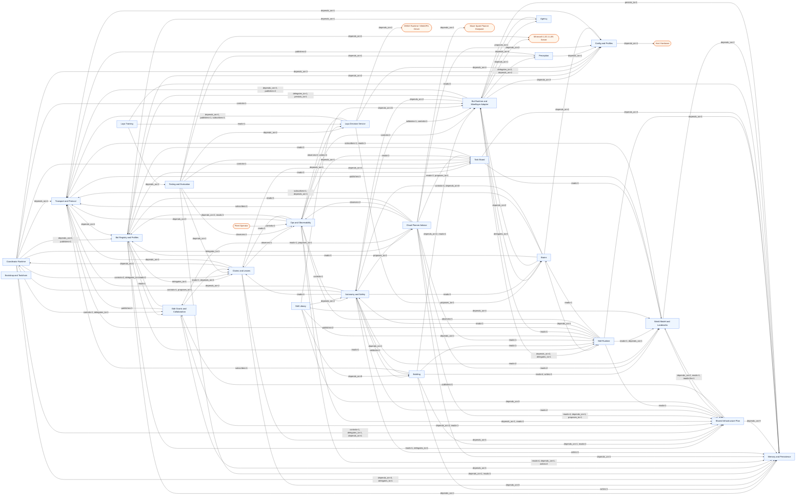
```mermaid
flowchart LR
n0["Coordinator Runtime"]
n1["Transport and Protocol"]
n2["Shared Infrastructure Plan"]
n3["Task Board"]
n4["Claims and Leases"]
n5["Edit Grants and Collaboration"]
n6["Bot Registry and Profiles"]
n7["World Model and Landmarks"]
n8["Perception"]
n9["Laya Decision Service"]
n10["Cloud Planner Advisor"]
n11["Skill Runtime"]
n12["Skill Library"]
n13["Building"]
n14["Bot Runtime and Mineflayer Adapter"]
n15["Autonomy and Safety"]
n16["Memory and Persistence"]
n17["Ops and Observability"]
n18["Config and Profiles"]
n19["Testing and Evaluation"]
n20["Laya Training"]
n21["Brains"]
n22["Agency"]
n23["Bootstrap and Toolchain"]
n24(["Minecraft 1.20.1 LAN Server"])
n25(["Muse Spark Planner Endpoint"])
n26(["ONNX Runtime / WebGPU Driver"])
n27(["Host Hardware"])
n28(["Fleet Operator"])
n14 -->|depends_on×2| n15
n21 -->|depends_on×2| n14
n21 -->|depends_on×1| n11
n14 -->|depends_on×3| n18
n14 -->|depends_on×1| n24
n21 -->|reads×1| n6
n21 -->|subscribes×1, depends_on×1| n1
n14 -->|delegates_to×2, depends_on×2| n8
n14 -->|delegates_to×3| n21
n14 -->|delegates_to×1, persists_to×1| n6
n14 -->|depends_on×3, publishes×2| n1
n14 -->|depends_on×2, delegates_to×1| n11
n6 -->|reads×1| n5
n6 -->|reads×1, delegates_to×1| n2
n6 -->|reads×1| n3
n6 -->|depends_on×2| n18
n6 -->|depends_on×2| n16
n6 -->|delegates_to×1| n4
n6 -->|reads×1| n11
n13 -->|depends_on×2, reads×1| n14
n13 -->|depends_on×1| n15
n13 -->|reads×4, writes×1| n7
n13 -->|depends_on×1, reads×2| n2
n13 -->|reads×1| n11
n13 -->|writes×1| n16
n13 -->|subscribes×1| n1
n4 -->|depends_on×3| n16
n4 -->|depends_on×2| n3
n4 -->|observes×1| n17
n4 -->|depends_on×1| n0
n4 -->|depends_on×1| n2
n18 -->|depends_on×1| n27
n0 -->|depends_on×4| n1
n0 -->|controls×2, delegates_to×2| n4
n0 -->|controls×1, delegates_to×1| n5
n0 -->|controls×1, delegates_to×1, depends_on×1| n2
n0 -->|controls×1| n3
n0 -->|depends_on×3, delegates_to×1| n16
n0 -->|delegates_to×1| n10
n0 -->|depends_on×3| n18
n0 -->|depends_on×2, publishes×1| n6
n9 -->|proposes_to×1| n21
n9 -->|depends_on×4| n18
n9 -->|depends_on×1, publishes×1, subscribes×1| n1
n9 -->|observes×2, writes×1| n17
n9 -->|depends_on×1| n26
n19 -->|depends_on×1| n4
n19 -->|depends_on×1| n3
n19 -->|depends_on×1| n8
n19 -->|depends_on×1| n24
n19 -->|depends_on×2| n9
n19 -->|observes×1| n17
n19 -->|depends_on×1, reads×1| n16
n28 -->|controls×1| n17
n5 -->|publishes×1| n1
n5 -->|reads×1, depends_on×1| n4
n5 -->|depends_on×3, reads×1| n2
n5 -->|depends_on×1| n16
n5 -->|reads×2| n6
n17 -->|reads×4, depends_on×1, writes×2| n16
n17 -->|controls×1| n15
n17 -->|depends_on×3| n1
n17 -->|depends_on×1| n9
n17 -->|controls×1| n14
n17 -->|depends_on×2, reads×1| n6
n17 -->|depends_on×1, reads×1| n2
n17 -->|reads×1| n4
n17 -->|reads×1| n3
n8 -->|publishes×2| n1
n8 -->|depends_on×1| n18
n10 -->|reads×1, proposes_to×1| n5
n10 -->|subscribes×1| n1
n10 -->|observes×2| n17
n10 -->|reads×1| n6
n10 -->|reads×4, depends_on×1, proposes_to×1| n2
n10 -->|reads×2, proposes_to×1| n3
n10 -->|reads×2| n7
n10 -->|depends_on×2| n18
n10 -->|depends_on×1| n25
n10 -->|depends_on×1| n16
n10 -->|reads×1| n11
n15 -->|validates×1, controls×1| n14
n15 -->|validates×1| n13
n15 -->|reads×1| n21
n15 -->|reads×4| n4
n15 -->|reads×2| n7
n15 -->|controls×1, proposes_to×1| n0
n15 -->|depends_on×2| n1
n21 -->|controls×1, depends_on×6| n15
n15 -->|writes×1| n16
n15 -->|reads×2| n2
n15 -->|proposes_to×1| n10
n2 -->|depends_on×9| n16
n2 -->|depends_on×2, reads×1, publishes×1| n7
n2 -->|publishes×1| n5
n11 -->|depends_on×1| n16
n11 -->|reads×1| n14
n11 -->|reads×1| n2
n11 -->|reads×1, depends_on×1| n7
n11 -->|publishes×2| n1
n11 -->|reads×1| n15
n11 -->|observes×1| n17
n11 -->|reads×1| n21
n12 -->|depends_on×9| n13
n12 -->|depends_on×2| n15
n12 -->|depends_on×21| n14
n12 -->|depends_on×4| n11
n12 -->|depends_on×4| n7
n12 -->|depends_on×3| n2
n3 -->|depends_on×3| n16
n3 -->|reads×1| n7
n3 -->|reads×1| n6
n20 -->|reads×1| n9
n20 -->|depends_on×1| n19
n20 -->|reads×2| n16
n1 -->|depends_on×1| n6
n1 -->|depends_on×1| n18
n1 -->|publishes×1| n7
n7 -->|depends_on×2| n16
n7 -->|reads×2| n2
n7 -->|subscribes×1, reads×1| n1
n0 -->|controls×1| n14
n14 -->|depends_on×6| n22
n14 -->|persists_to×1| n16
n4 -->|depends_on×1| n1
n22 -->|proposes_to×1| n14
n6 -->|depends_on×1| n22
n21 -->|depends_on×1| n18
classDef system fill:#eef6ff,stroke:#2563eb,color:#0f172a;
classDef external fill:#fff7ed,stroke:#ea580c,color:#7c2d12;
class n0,n1,n2,n3,n4,n5,n6,n7,n8,n9,n10,n11,n12,n13,n14,n15,n16,n17,n18,n19,n20,n21,n22,n23 system;
class n24,n25,n26,n27,n28 external;
```

## Cross-system dependencies

System-to-system view with relation types.

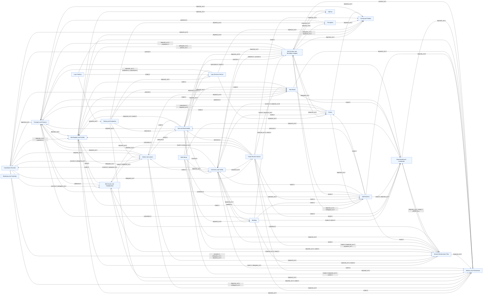
```mermaid
flowchart LR
n0["Coordinator Runtime"]
n1["Transport and Protocol"]
n2["Shared Infrastructure Plan"]
n3["Task Board"]
n4["Claims and Leases"]
n5["Edit Grants and Collaboration"]
n6["Bot Registry and Profiles"]
n7["World Model and Landmarks"]
n8["Perception"]
n9["Laya Decision Service"]
n10["Cloud Planner Advisor"]
n11["Skill Runtime"]
n12["Skill Library"]
n13["Building"]
n14["Bot Runtime and Mineflayer Adapter"]
n15["Autonomy and Safety"]
n16["Memory and Persistence"]
n17["Ops and Observability"]
n18["Config and Profiles"]
n19["Testing and Evaluation"]
n20["Laya Training"]
n21["Brains"]
n22["Agency"]
n23["Bootstrap and Toolchain"]
n14 -->|depends_on×2| n15
n21 -->|depends_on×2| n14
n21 -->|depends_on×1| n11
n14 -->|depends_on×3| n18
n21 -->|reads×1| n6
n21 -->|subscribes×1, depends_on×1| n1
n14 -->|delegates_to×2, depends_on×2| n8
n14 -->|delegates_to×3| n21
n14 -->|delegates_to×1, persists_to×1| n6
n14 -->|depends_on×3, publishes×2| n1
n14 -->|depends_on×2, delegates_to×1| n11
n6 -->|reads×1| n5
n6 -->|reads×1, delegates_to×1| n2
n6 -->|reads×1| n3
n6 -->|depends_on×2| n18
n6 -->|depends_on×2| n16
n6 -->|delegates_to×1| n4
n6 -->|reads×1| n11
n13 -->|depends_on×2, reads×1| n14
n13 -->|depends_on×1| n15
n13 -->|reads×4, writes×1| n7
n13 -->|depends_on×1, reads×2| n2
n13 -->|reads×1| n11
n13 -->|writes×1| n16
n13 -->|subscribes×1| n1
n4 -->|depends_on×3| n16
n4 -->|depends_on×2| n3
n4 -->|observes×1| n17
n4 -->|depends_on×1| n0
n4 -->|depends_on×1| n2
n0 -->|depends_on×4| n1
n0 -->|controls×2, delegates_to×2| n4
n0 -->|controls×1, delegates_to×1| n5
n0 -->|controls×1, delegates_to×1, depends_on×1| n2
n0 -->|controls×1| n3
n0 -->|depends_on×3, delegates_to×1| n16
n0 -->|delegates_to×1| n10
n0 -->|depends_on×3| n18
n0 -->|depends_on×2, publishes×1| n6
n9 -->|proposes_to×1| n21
n9 -->|depends_on×4| n18
n9 -->|depends_on×1, publishes×1, subscribes×1| n1
n9 -->|observes×2, writes×1| n17
n19 -->|depends_on×1| n4
n19 -->|depends_on×1| n3
n19 -->|depends_on×1| n8
n19 -->|depends_on×2| n9
n19 -->|observes×1| n17
n19 -->|depends_on×1, reads×1| n16
n5 -->|publishes×1| n1
n5 -->|reads×1, depends_on×1| n4
n5 -->|depends_on×3, reads×1| n2
n5 -->|depends_on×1| n16
n5 -->|reads×2| n6
n17 -->|reads×4, depends_on×1, writes×2| n16
n17 -->|controls×1| n15
n17 -->|depends_on×3| n1
n17 -->|depends_on×1| n9
n17 -->|controls×1| n14
n17 -->|depends_on×2, reads×1| n6
n17 -->|depends_on×1, reads×1| n2
n17 -->|reads×1| n4
n17 -->|reads×1| n3
n8 -->|publishes×2| n1
n8 -->|depends_on×1| n18
n10 -->|reads×1, proposes_to×1| n5
n10 -->|subscribes×1| n1
n10 -->|observes×2| n17
n10 -->|reads×1| n6
n10 -->|reads×4, depends_on×1, proposes_to×1| n2
n10 -->|reads×2, proposes_to×1| n3
n10 -->|reads×2| n7
n10 -->|depends_on×2| n18
n10 -->|depends_on×1| n16
n10 -->|reads×1| n11
n15 -->|validates×1, controls×1| n14
n15 -->|validates×1| n13
n15 -->|reads×1| n21
n15 -->|reads×4| n4
n15 -->|reads×2| n7
n15 -->|controls×1, proposes_to×1| n0
n15 -->|depends_on×2| n1
n21 -->|controls×1, depends_on×6| n15
n15 -->|writes×1| n16
n15 -->|reads×2| n2
n15 -->|proposes_to×1| n10
n2 -->|depends_on×9| n16
n2 -->|depends_on×2, reads×1, publishes×1| n7
n2 -->|publishes×1| n5
n11 -->|depends_on×1| n16
n11 -->|reads×1| n14
n11 -->|reads×1| n2
n11 -->|reads×1, depends_on×1| n7
n11 -->|publishes×2| n1
n11 -->|reads×1| n15
n11 -->|observes×1| n17
n11 -->|reads×1| n21
n12 -->|depends_on×9| n13
n12 -->|depends_on×2| n15
n12 -->|depends_on×21| n14
n12 -->|depends_on×4| n11
n12 -->|depends_on×4| n7
n12 -->|depends_on×3| n2
n3 -->|depends_on×3| n16
n3 -->|reads×1| n7
n3 -->|reads×1| n6
n20 -->|reads×1| n9
n20 -->|depends_on×1| n19
n20 -->|reads×2| n16
n1 -->|depends_on×1| n6
n1 -->|depends_on×1| n18
n1 -->|publishes×1| n7
n7 -->|depends_on×2| n16
n7 -->|reads×2| n2
n7 -->|subscribes×1, reads×1| n1
n0 -->|controls×1| n14
n14 -->|depends_on×6| n22
n14 -->|persists_to×1| n16
n4 -->|depends_on×1| n1
n22 -->|proposes_to×1| n14
n6 -->|depends_on×1| n22
n21 -->|depends_on×1| n18
classDef system fill:#eef6ff,stroke:#2563eb,color:#0f172a;
class n0,n1,n2,n3,n4,n5,n6,n7,n8,n9,n10,n11,n12,n13,n14,n15,n16,n17,n18,n19,n20,n21,n22,n23 system;
```

## Safety and control authority

Guardian veto, grant/claim control, ops stop path, and planner proposal path.

```mermaid
flowchart TD
n0["Coordinator Runtime"]
n9["Laya Decision Service"]
n10["Cloud Planner Advisor"]
n11["Skill Runtime"]
n13["Building"]
n14["Bot Runtime and Mineflayer Adapter"]
n15["Autonomy and Safety"]
n17["Ops and Observability"]
n21["Brains"]
n28(["Fleet Operator"])
n14 -->|delegates_to| n21
n14 -->|delegates_to| n11
n0 -->|delegates_to| n10
n9 -->|proposes_to| n21
n17 -->|controls| n15
n17 -->|controls| n14
n15 -->|validates| n14
n15 -->|validates| n13
n15 -->|controls| n14
n15 -->|controls| n0
n21 -->|controls| n15
n15 -->|proposes_to| n0
n15 -->|proposes_to| n10
n0 -->|controls| n14
n29["Command Router"]
n30["Coordinator Epoch Authority"]
n31["Global Scheduler"]
n32["Restart Recovery Orchestrator"]
n33["Bot Process Supervisor"]
n34["Model Loader"]
n35["Execution Provider Selector"]
n36["Batch Runner"]
n37["Single In-flight Guard"]
n38["Output Parser"]
n39["Confidence Calibrator"]
n40["Timeout and Fallback Handler"]
n41["OpenAI-Compatible Client"]
n42["Planner Context Builder"]
n43["Planner Trigger Evaluator"]
n44["Planner Schema Validator"]
n45["Planner Semantic Validator"]
n46["Planner Repair Loop"]
n47["SIP Mutation Translator"]
n48["Task DAG Translator"]
n49["Planner Budget Limiter"]
n50["Planner Arbitration Handler"]
n51["Keep Last Good Fallback"]
n52["Skill Context Builder"]
n53["Block Executor"]
n54["Connection Lifecycle"]
n55["Mineflayer Event Bridge"]
n56["World Cache Adapter"]
n57["Action Executor"]
n58["Guardian Hook"]
n59["Skill Host"]
n60["Agent Loop"]
n61["Chat Adapter"]
n62["Reconnect Supervisor"]
n63["Action Veto Gate"]
n64["Recovery Ladder"]
n65["Emergency Stop Controller"]
n66["Ops API"]
n67["Pause and Resume Controller"]
n68["Fleet Emergency Stop"]
n69["Reflex Guardian Loop"]
n70["Deterministic Policy"]
n71["Laya Client"]
n58 -->|delegates_to| n69
n56 -->|delegates_to| n52
n31 -->|delegates_to| n43
n39 -->|proposes_to| n70
n35 -->|controls| n34
n37 -->|controls| n36
n40 -->|controls| n38
n68 -->|controls| n65
n67 -->|controls| n59
n49 -->|controls| n41
n41 -->|delegates_to| n50
n46 -->|controls| n51
n44 -->|controls| n46
n45 -->|controls| n46
n43 -->|delegates_to| n42
n63 -->|validates| n57
n63 -->|validates| n53
n65 -->|controls| n57
n65 -->|controls| n29
n69 -->|controls| n63
n64 -->|proposes_to| n29
n64 -->|proposes_to| n43
n64 -->|controls| n65
n33 -->|controls| n54
n60 -->|delegates_to| n71
n60 -->|delegates_to| n70
n60 -->|delegates_to| n59
classDef system fill:#eef6ff,stroke:#2563eb,color:#0f172a;
classDef component fill:#f8fafc,stroke:#64748b,color:#0f172a;
classDef external fill:#fff7ed,stroke:#ea580c,color:#7c2d12;
class n0,n9,n10,n11,n13,n14,n15,n17,n21 system;
class n29,n30,n31,n32,n33,n34,n35,n36,n37,n38,n39,n40,n41,n42,n43,n44,n45,n46,n47,n48,n49,n50,n51,n52,n53,n54,n55,n56,n57,n58,n59,n60,n61,n62,n63,n64,n65,n66,n67,n68,n69,n70,n71 component;
class n28 external;
```

## Data flow

Perception, world model, SIP, decisions, skills, building, and persistence.

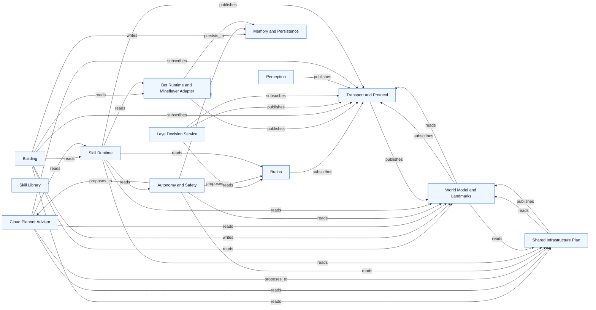
```mermaid
flowchart LR
n1["Transport and Protocol"]
n2["Shared Infrastructure Plan"]
n7["World Model and Landmarks"]
n8["Perception"]
n9["Laya Decision Service"]
n10["Cloud Planner Advisor"]
n11["Skill Runtime"]
n12["Skill Library"]
n13["Building"]
n14["Bot Runtime and Mineflayer Adapter"]
n15["Autonomy and Safety"]
n16["Memory and Persistence"]
n21["Brains"]
n21 -->|subscribes| n1
n14 -->|publishes| n1
n13 -->|reads| n7
n13 -->|writes| n7
n13 -->|reads| n11
n13 -->|reads| n14
n13 -->|writes| n16
n13 -->|reads| n2
n13 -->|subscribes| n1
n9 -->|proposes_to| n21
n9 -->|publishes| n1
n9 -->|subscribes| n1
n8 -->|publishes| n1
n10 -->|subscribes| n1
n10 -->|reads| n2
n10 -->|reads| n7
n10 -->|reads| n11
n10 -->|proposes_to| n2
n15 -->|reads| n21
n15 -->|reads| n7
n15 -->|writes| n16
n15 -->|reads| n2
n15 -->|proposes_to| n10
n2 -->|reads| n7
n2 -->|publishes| n7
n11 -->|reads| n14
n11 -->|reads| n2
n11 -->|reads| n7
n11 -->|publishes| n1
n11 -->|reads| n15
n11 -->|reads| n21
n1 -->|publishes| n7
n7 -->|reads| n2
n7 -->|subscribes| n1
n7 -->|reads| n1
n14 -->|persists_to| n16
classDef system fill:#eef6ff,stroke:#2563eb,color:#0f172a;
class n1,n2,n7,n8,n9,n10,n11,n12,n13,n14,n15,n16,n21 system;
```

## Per-system graphs

### Coordinator Runtime

Source: `docs/architecture/graphs/system-core.mmd`

```mermaid
flowchart LR
n72["Process Bootstrap"]
n73["Service Composition"]
n74["Bot Session Manager"]
n29["Command Router"]
n30["Coordinator Epoch Authority"]
n31["Global Scheduler"]
n32["Restart Recovery Orchestrator"]
n75["Backpressure Controller"]
n33["Bot Process Supervisor"]
n158["Fencing Token Authority (Claims and Leases)"]
n159["Flow Control (Transport and Protocol)"]
n160["Atomic Claim Acquirer (Claims and Leases)"]
n161["Grant Issuer (Edit Grants and Collaboration)"]
n162["SIP Transactional Committer (Shared Infrastructure Plan)"]
n163["Atomic Task Claimer (Task Board)"]
n164["Message Schema Registry (Transport and Protocol)"]
n165["Transaction Manager (Memory and Persistence)"]
n166["Lease Reaper (Claims and Leases)"]
n167["Retention Pruner (Memory and Persistence)"]
n43["Planner Trigger Evaluator (Cloud Planner Advisor)"]
n168["SIP Reconciliation Engine (Shared Infrastructure Plan)"]
n169["Config Schema Validator (Config and Profiles)"]
n170["Environment Parser (Config and Profiles)"]
n171["Migration Runner (Memory and Persistence)"]
n172["WebSocket Codec (Transport and Protocol)"]
n173["Resume Orchestrator (Bot Registry and Profiles)"]
n174["Grant Expiry (Edit Grants and Collaboration)"]
n175["Profile Resolver (Config and Profiles)"]
n176["Bot Identity Authenticator (Bot Registry and Profiles)"]
n177["Presence Tracker (Bot Registry and Profiles)"]
n65["Emergency Stop Controller (Autonomy and Safety)"]
n64["Recovery Ladder (Autonomy and Safety)"]
n54["Connection Lifecycle (Bot Runtime and Mineflayer Adapter)"]
n54 -->|depends_on| n169
n173 -->|delegates_to| n168
n160 -->|depends_on| n165
n158 -->|depends_on| n30
n158 -->|depends_on| n165
n169 -->|depends_on| n170
n175 -->|depends_on| n169
n75 -->|depends_on| n159
n29 -->|controls| n160
n29 -->|controls| n161
n29 -->|controls| n162
n29 -->|controls| n163
n29 -->|depends_on| n164
n30 -->|controls| n158
n30 -->|depends_on| n165
n31 -->|delegates_to| n166
n31 -->|depends_on| n30
n31 -->|delegates_to| n167
n31 -->|delegates_to| n43
n31 -->|delegates_to| n168
n72 -->|depends_on| n169
n72 -->|depends_on| n170
n72 -->|depends_on| n32
n72 -->|depends_on| n73
n72 -->|depends_on| n171
n72 -->|depends_on| n172
n32 -->|depends_on| n173
n32 -->|delegates_to| n166
n32 -->|delegates_to| n174
n32 -->|depends_on| n165
n32 -->|depends_on| n168
n73 -->|depends_on| n175
n73 -->|depends_on| n31
n74 -->|depends_on| n176
n74 -->|publishes| n177
n74 -->|depends_on| n172
n167 -->|depends_on| n165
n65 -->|controls| n29
n64 -->|proposes_to| n29
n64 -->|proposes_to| n43
n64 -->|controls| n65
n168 -->|depends_on| n162
n162 -->|depends_on| n165
n163 -->|depends_on| n165
n172 -->|depends_on| n164
n33 -->|controls| n54
n33 -->|depends_on| n30
n32 -->|depends_on| n33
classDef internal fill:#eef6ff,stroke:#2563eb,color:#0f172a;
classDef external fill:#fff7ed,stroke:#ea580c,color:#7c2d12;
class n72,n73,n74,n29,n30,n31,n32,n75,n33 internal;
class n158,n159,n160,n161,n162,n163,n164,n165,n166,n167,n43,n168,n169,n170,n171,n172,n173,n174,n175,n176,n177,n65,n64,n54 external;
```

### Transport and Protocol

Source: `docs/architecture/graphs/system-transport.mmd`

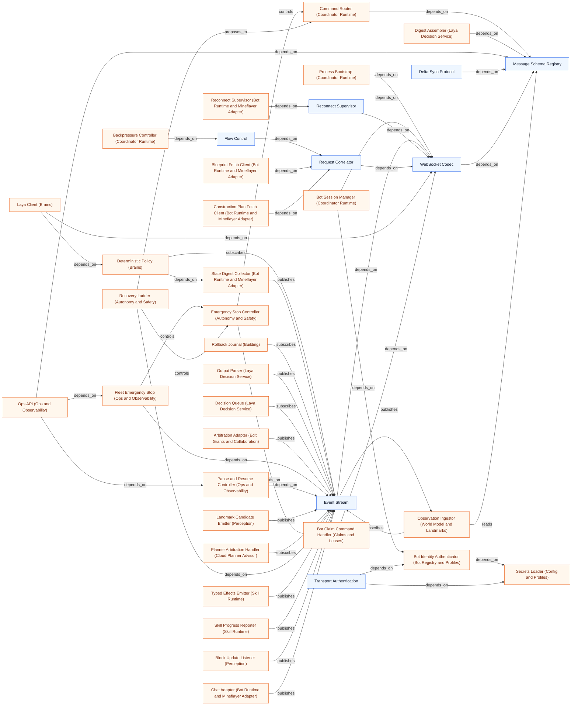
```mermaid
flowchart LR
n164["Message Schema Registry"]
n172["WebSocket Codec"]
n178["Request Correlator"]
n179["Event Stream"]
n180["Delta Sync Protocol"]
n181["Reconnect Supervisor"]
n182["Transport Authentication"]
n159["Flow Control"]
n70["Deterministic Policy (Brains)"]
n62["Reconnect Supervisor (Bot Runtime and Mineflayer Adapter)"]
n134["State Digest Collector (Bot Runtime and Mineflayer Adapter)"]
n111["Rollback Journal (Building)"]
n75["Backpressure Controller (Coordinator Runtime)"]
n29["Command Router (Coordinator Runtime)"]
n72["Process Bootstrap (Coordinator Runtime)"]
n74["Bot Session Manager (Coordinator Runtime)"]
n79["Digest Assembler (Laya Decision Service)"]
n38["Output Parser (Laya Decision Service)"]
n76["Decision Queue (Laya Decision Service)"]
n183["Arbitration Adapter (Edit Grants and Collaboration)"]
n68["Fleet Emergency Stop (Ops and Observability)"]
n66["Ops API (Ops and Observability)"]
n67["Pause and Resume Controller (Ops and Observability)"]
n184["Landmark Candidate Emitter (Perception)"]
n50["Planner Arbitration Handler (Cloud Planner Advisor)"]
n65["Emergency Stop Controller (Autonomy and Safety)"]
n64["Recovery Ladder (Autonomy and Safety)"]
n90["Typed Effects Emitter (Skill Runtime)"]
n87["Skill Progress Reporter (Skill Runtime)"]
n176["Bot Identity Authenticator (Bot Registry and Profiles)"]
n185["Secrets Loader (Config and Profiles)"]
n186["Observation Ingestor (World Model and Landmarks)"]
n71["Laya Client (Brains)"]
n187["Block Update Listener (Perception)"]
n61["Chat Adapter (Bot Runtime and Mineflayer Adapter)"]
n188["Bot Claim Command Handler (Claims and Leases)"]
n131["Blueprint Fetch Client (Bot Runtime and Mineflayer Adapter)"]
n132["Construction Plan Fetch Client (Bot Runtime and Mineflayer Adapter)"]
n70 -->|depends_on| n134
n70 -->|subscribes| n179
n62 -->|depends_on| n181
n134 -->|publishes| n179
n176 -->|depends_on| n185
n111 -->|subscribes| n179
n75 -->|depends_on| n159
n29 -->|depends_on| n164
n72 -->|depends_on| n172
n74 -->|depends_on| n176
n74 -->|depends_on| n172
n79 -->|depends_on| n164
n38 -->|publishes| n179
n76 -->|subscribes| n179
n183 -->|publishes| n179
n68 -->|controls| n65
n68 -->|depends_on| n179
n66 -->|depends_on| n68
n66 -->|depends_on| n67
n66 -->|depends_on| n164
n67 -->|depends_on| n179
n184 -->|publishes| n179
n50 -->|subscribes| n179
n65 -->|controls| n29
n65 -->|depends_on| n179
n64 -->|proposes_to| n29
n64 -->|controls| n65
n64 -->|depends_on| n179
n90 -->|publishes| n179
n87 -->|publishes| n179
n182 -->|depends_on| n176
n182 -->|depends_on| n185
n180 -->|depends_on| n164
n179 -->|depends_on| n172
n179 -->|publishes| n186
n159 -->|depends_on| n178
n181 -->|depends_on| n172
n178 -->|depends_on| n172
n172 -->|depends_on| n164
n186 -->|subscribes| n179
n186 -->|reads| n164
n71 -->|depends_on| n172
n71 -->|depends_on| n70
n187 -->|publishes| n179
n61 -->|publishes| n179
n188 -->|depends_on| n172
n131 -->|depends_on| n178
n132 -->|depends_on| n178
classDef internal fill:#eef6ff,stroke:#2563eb,color:#0f172a;
classDef external fill:#fff7ed,stroke:#ea580c,color:#7c2d12;
class n164,n172,n178,n179,n180,n181,n182,n159 internal;
class n70,n62,n134,n111,n75,n29,n72,n74,n79,n38,n76,n183,n68,n66,n67,n184,n50,n65,n64,n90,n87,n176,n185,n186,n71,n187,n61,n188,n131,n132 external;
```

### Shared Infrastructure Plan

Source: `docs/architecture/graphs/system-sip.mmd`

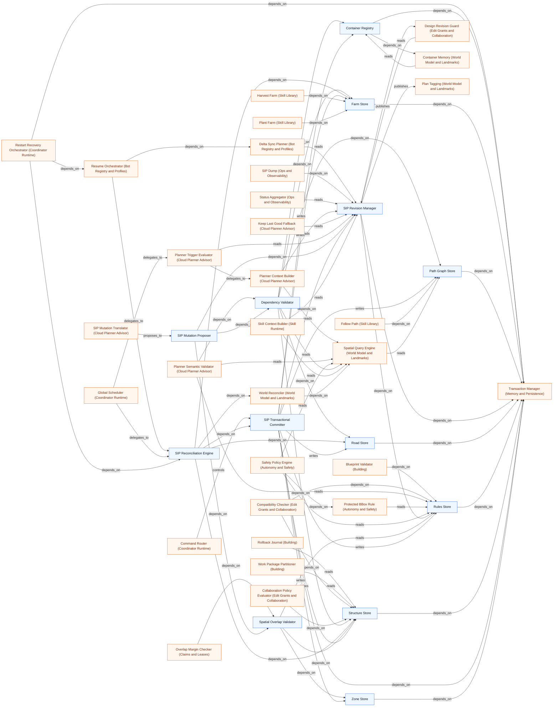
```mermaid
flowchart LR
n189["Zone Store"]
n190["Structure Store"]
n191["Road Store"]
n192["Farm Store"]
n193["Container Registry"]
n194["Path Graph Store"]
n195["Rules Store"]
n196["SIP Revision Manager"]
n197["Spatial Overlap Validator"]
n198["Dependency Validator"]
n199["SIP Mutation Proposer"]
n162["SIP Transactional Committer"]
n168["SIP Reconciliation Engine"]
n200["Delta Sync Planner (Bot Registry and Profiles)"]
n173["Resume Orchestrator (Bot Registry and Profiles)"]
n93["Blueprint Validator (Building)"]
n111["Rollback Journal (Building)"]
n105["Work Package Partitioner (Building)"]
n201["Overlap Margin Checker (Claims and Leases)"]
n29["Command Router (Coordinator Runtime)"]
n31["Global Scheduler (Coordinator Runtime)"]
n32["Restart Recovery Orchestrator (Coordinator Runtime)"]
n202["Compatibility Checker (Edit Grants and Collaboration)"]
n203["Design Revision Guard (Edit Grants and Collaboration)"]
n204["Collaboration Policy Evaluator (Edit Grants and Collaboration)"]
n151["SIP Dump (Ops and Observability)"]
n149["Status Aggregator (Ops and Observability)"]
n42["Planner Context Builder (Cloud Planner Advisor)"]
n51["Keep Last Good Fallback (Cloud Planner Advisor)"]
n45["Planner Semantic Validator (Cloud Planner Advisor)"]
n47["SIP Mutation Translator (Cloud Planner Advisor)"]
n43["Planner Trigger Evaluator (Cloud Planner Advisor)"]
n144["Protected BBox Rule (Autonomy and Safety)"]
n147["Safety Policy Engine (Autonomy and Safety)"]
n165["Transaction Manager (Memory and Persistence)"]
n205["Container Memory (World Model and Landmarks)"]
n206["Spatial Query Engine (World Model and Landmarks)"]
n207["World Reconciler (World Model and Landmarks)"]
n208["Plan Tagging (World Model and Landmarks)"]
n52["Skill Context Builder (Skill Runtime)"]
n209["Follow Path (Skill Library)"]
n210["Harvest Farm (Skill Library)"]
n211["Plant Farm (Skill Library)"]
n200 -->|reads| n196
n173 -->|depends_on| n200
n173 -->|delegates_to| n168
n93 -->|depends_on| n195
n111 -->|reads| n190
n105 -->|reads| n190
n201 -->|depends_on| n197
n29 -->|controls| n162
n31 -->|delegates_to| n43
n31 -->|delegates_to| n168
n32 -->|depends_on| n173
n32 -->|depends_on| n165
n32 -->|depends_on| n168
n202 -->|depends_on| n195
n202 -->|depends_on| n190
n203 -->|reads| n196
n204 -->|depends_on| n190
n151 -->|depends_on| n196
n149 -->|reads| n196
n42 -->|reads| n196
n42 -->|reads| n206
n51 -->|reads| n196
n45 -->|depends_on| n198
n45 -->|reads| n195
n45 -->|reads| n206
n47 -->|proposes_to| n199
n43 -->|delegates_to| n42
n43 -->|reads| n196
n144 -->|reads| n195
n147 -->|depends_on| n144
n147 -->|reads| n195
n147 -->|reads| n206
n193 -->|depends_on| n165
n193 -->|depends_on| n205
n198 -->|depends_on| n193
n198 -->|depends_on| n192
n198 -->|depends_on| n194
n198 -->|depends_on| n191
n198 -->|depends_on| n190
n198 -->|reads| n206
n192 -->|depends_on| n165
n199 -->|depends_on| n198
n199 -->|depends_on| n196
n199 -->|depends_on| n197
n194 -->|depends_on| n165
n168 -->|depends_on| n192
n168 -->|depends_on| n191
n168 -->|depends_on| n190
n168 -->|depends_on| n162
n168 -->|depends_on| n207
n196 -->|publishes| n203
n196 -->|depends_on| n165
n196 -->|depends_on| n195
n196 -->|publishes| n208
n191 -->|depends_on| n165
n195 -->|depends_on| n165
n197 -->|reads| n195
n197 -->|depends_on| n190
n197 -->|depends_on| n189
n190 -->|depends_on| n165
n162 -->|depends_on| n165
n162 -->|writes| n193
n162 -->|writes| n192
n162 -->|writes| n194
n162 -->|depends_on| n196
n162 -->|writes| n191
n162 -->|writes| n195
n162 -->|writes| n190
n162 -->|writes| n189
n189 -->|depends_on| n165
n52 -->|reads| n196
n52 -->|reads| n206
n209 -->|depends_on| n194
n210 -->|depends_on| n192
n211 -->|depends_on| n192
n205 -->|reads| n193
n206 -->|reads| n194
n207 -->|depends_on| n206
classDef internal fill:#eef6ff,stroke:#2563eb,color:#0f172a;
classDef external fill:#fff7ed,stroke:#ea580c,color:#7c2d12;
class n189,n190,n191,n192,n193,n194,n195,n196,n197,n198,n199,n162,n168 internal;
class n200,n173,n93,n111,n105,n201,n29,n31,n32,n202,n203,n204,n151,n149,n42,n51,n45,n47,n43,n144,n147,n165,n205,n206,n207,n208,n52,n209,n210,n211 external;
```

### Task Board

Source: `docs/architecture/graphs/system-tasks.mmd`

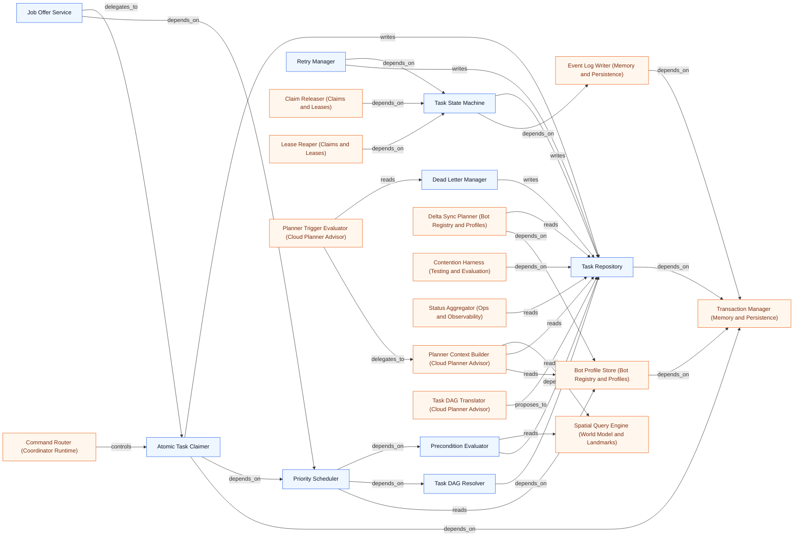
```mermaid
flowchart LR
n212["Task Repository"]
n213["Task DAG Resolver"]
n214["Precondition Evaluator"]
n215["Priority Scheduler"]
n163["Atomic Task Claimer"]
n216["Job Offer Service"]
n217["Retry Manager"]
n218["Dead Letter Manager"]
n219["Task State Machine"]
n200["Delta Sync Planner (Bot Registry and Profiles)"]
n220["Claim Releaser (Claims and Leases)"]
n166["Lease Reaper (Claims and Leases)"]
n29["Command Router (Coordinator Runtime)"]
n221["Contention Harness (Testing and Evaluation)"]
n149["Status Aggregator (Ops and Observability)"]
n42["Planner Context Builder (Cloud Planner Advisor)"]
n48["Task DAG Translator (Cloud Planner Advisor)"]
n43["Planner Trigger Evaluator (Cloud Planner Advisor)"]
n165["Transaction Manager (Memory and Persistence)"]
n206["Spatial Query Engine (World Model and Landmarks)"]
n222["Bot Profile Store (Bot Registry and Profiles)"]
n223["Event Log Writer (Memory and Persistence)"]
n200 -->|depends_on| n222
n200 -->|reads| n212
n222 -->|depends_on| n165
n220 -->|depends_on| n219
n166 -->|depends_on| n219
n29 -->|controls| n163
n221 -->|depends_on| n212
n223 -->|depends_on| n165
n149 -->|reads| n212
n42 -->|reads| n222
n42 -->|reads| n212
n42 -->|reads| n206
n48 -->|proposes_to| n212
n43 -->|delegates_to| n42
n43 -->|reads| n218
n163 -->|depends_on| n165
n163 -->|depends_on| n215
n163 -->|writes| n212
n213 -->|depends_on| n212
n218 -->|writes| n212
n214 -->|depends_on| n212
n214 -->|reads| n206
n215 -->|reads| n222
n215 -->|depends_on| n213
n215 -->|depends_on| n214
n217 -->|writes| n212
n217 -->|depends_on| n219
n212 -->|depends_on| n165
n219 -->|depends_on| n223
n219 -->|writes| n212
n216 -->|depends_on| n215
n216 -->|delegates_to| n163
classDef internal fill:#eef6ff,stroke:#2563eb,color:#0f172a;
classDef external fill:#fff7ed,stroke:#ea580c,color:#7c2d12;
class n212,n213,n214,n215,n163,n216,n217,n218,n219 internal;
class n200,n220,n166,n29,n221,n149,n42,n48,n43,n165,n206,n222,n223 external;
```

### Claims and Leases

Source: `docs/architecture/graphs/system-claims.mmd`

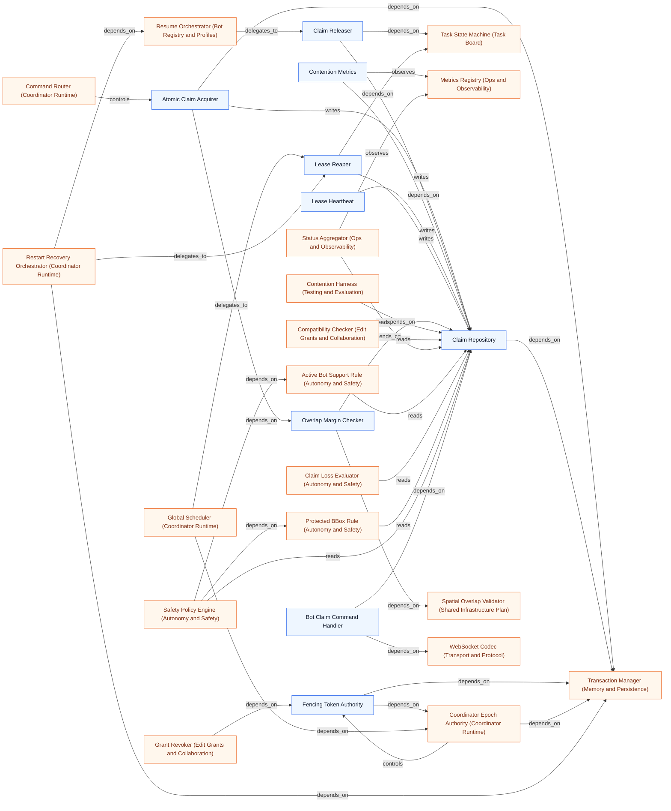
```mermaid
flowchart LR
n224["Claim Repository"]
n201["Overlap Margin Checker"]
n160["Atomic Claim Acquirer"]
n225["Lease Heartbeat"]
n166["Lease Reaper"]
n158["Fencing Token Authority"]
n220["Claim Releaser"]
n188["Bot Claim Command Handler"]
n226["Contention Metrics"]
n173["Resume Orchestrator (Bot Registry and Profiles)"]
n165["Transaction Manager (Memory and Persistence)"]
n219["Task State Machine (Task Board)"]
n152["Metrics Registry (Ops and Observability)"]
n30["Coordinator Epoch Authority (Coordinator Runtime)"]
n197["Spatial Overlap Validator (Shared Infrastructure Plan)"]
n29["Command Router (Coordinator Runtime)"]
n31["Global Scheduler (Coordinator Runtime)"]
n32["Restart Recovery Orchestrator (Coordinator Runtime)"]
n221["Contention Harness (Testing and Evaluation)"]
n202["Compatibility Checker (Edit Grants and Collaboration)"]
n227["Grant Revoker (Edit Grants and Collaboration)"]
n149["Status Aggregator (Ops and Observability)"]
n145["Active Bot Support Rule (Autonomy and Safety)"]
n143["Claim Loss Evaluator (Autonomy and Safety)"]
n144["Protected BBox Rule (Autonomy and Safety)"]
n147["Safety Policy Engine (Autonomy and Safety)"]
n172["WebSocket Codec (Transport and Protocol)"]
n173 -->|delegates_to| n220
n160 -->|writes| n224
n160 -->|depends_on| n201
n160 -->|depends_on| n165
n220 -->|writes| n224
n220 -->|depends_on| n219
n224 -->|depends_on| n165
n226 -->|depends_on| n224
n226 -->|observes| n152
n158 -->|depends_on| n30
n158 -->|depends_on| n165
n225 -->|writes| n224
n166 -->|writes| n224
n166 -->|depends_on| n219
n201 -->|depends_on| n224
n201 -->|depends_on| n197
n29 -->|controls| n160
n30 -->|controls| n158
n30 -->|depends_on| n165
n31 -->|delegates_to| n166
n31 -->|depends_on| n30
n32 -->|depends_on| n173
n32 -->|delegates_to| n166
n32 -->|depends_on| n165
n221 -->|depends_on| n224
n202 -->|reads| n224
n227 -->|depends_on| n158
n149 -->|reads| n224
n149 -->|observes| n152
n145 -->|reads| n224
n143 -->|reads| n224
n144 -->|reads| n224
n147 -->|reads| n224
n147 -->|depends_on| n145
n147 -->|depends_on| n144
n188 -->|depends_on| n224
n188 -->|depends_on| n172
classDef internal fill:#eef6ff,stroke:#2563eb,color:#0f172a;
classDef external fill:#fff7ed,stroke:#ea580c,color:#7c2d12;
class n224,n201,n160,n225,n166,n158,n220,n188,n226 internal;
class n173,n165,n219,n152,n30,n197,n29,n31,n32,n221,n202,n227,n149,n145,n143,n144,n147,n172 external;
```

### Edit Grants and Collaboration

Source: `docs/architecture/graphs/system-grants.mmd`

```mermaid
flowchart LR
n228["Grant Repository"]
n204["Collaboration Policy Evaluator"]
n202["Compatibility Checker"]
n203["Design Revision Guard"]
n161["Grant Issuer"]
n227["Grant Revoker"]
n229["Owner Offline Policy"]
n174["Grant Expiry"]
n183["Arbitration Adapter"]
n200["Delta Sync Planner (Bot Registry and Profiles)"]
n29["Command Router (Coordinator Runtime)"]
n32["Restart Recovery Orchestrator (Coordinator Runtime)"]
n179["Event Stream (Transport and Protocol)"]
n224["Claim Repository (Claims and Leases)"]
n195["Rules Store (Shared Infrastructure Plan)"]
n190["Structure Store (Shared Infrastructure Plan)"]
n196["SIP Revision Manager (Shared Infrastructure Plan)"]
n165["Transaction Manager (Memory and Persistence)"]
n158["Fencing Token Authority (Claims and Leases)"]
n177["Presence Tracker (Bot Registry and Profiles)"]
n222["Bot Profile Store (Bot Registry and Profiles)"]
n50["Planner Arbitration Handler (Cloud Planner Advisor)"]
n200 -->|depends_on| n222
n200 -->|reads| n228
n200 -->|reads| n196
n177 -->|depends_on| n222
n222 -->|depends_on| n165
n224 -->|depends_on| n165
n158 -->|depends_on| n165
n29 -->|controls| n161
n32 -->|delegates_to| n174
n32 -->|depends_on| n165
n183 -->|depends_on| n202
n183 -->|publishes| n179
n202 -->|reads| n224
n202 -->|depends_on| n228
n202 -->|depends_on| n195
n202 -->|depends_on| n190
n203 -->|depends_on| n228
n203 -->|controls| n227
n203 -->|reads| n196
n174 -->|writes| n228
n161 -->|depends_on| n202
n161 -->|depends_on| n203
n161 -->|writes| n228
n161 -->|depends_on| n204
n228 -->|depends_on| n165
n227 -->|depends_on| n158
n227 -->|writes| n228
n229 -->|reads| n177
n229 -->|reads| n222
n229 -->|depends_on| n202
n204 -->|depends_on| n228
n204 -->|depends_on| n190
n50 -->|reads| n202
n50 -->|proposes_to| n161
n50 -->|subscribes| n179
n196 -->|publishes| n203
n196 -->|depends_on| n165
n196 -->|depends_on| n195
n195 -->|depends_on| n165
n190 -->|depends_on| n165
classDef internal fill:#eef6ff,stroke:#2563eb,color:#0f172a;
classDef external fill:#fff7ed,stroke:#ea580c,color:#7c2d12;
class n228,n204,n202,n203,n161,n227,n229,n174,n183 internal;
class n200,n29,n32,n179,n224,n195,n190,n196,n165,n158,n177,n222,n50 external;
```

### Bot Registry and Profiles

Source: `docs/architecture/graphs/system-bots.mmd`

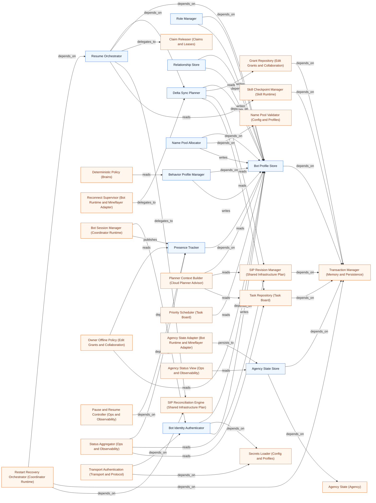
```mermaid
flowchart LR
n176["Bot Identity Authenticator"]
n222["Bot Profile Store"]
n230["Role Manager"]
n231["Behavior Profile Manager"]
n232["Relationship Store"]
n177["Presence Tracker"]
n200["Delta Sync Planner"]
n173["Resume Orchestrator"]
n233["Agency State Store"]
n234["Name Pool Allocator"]
n70["Deterministic Policy (Brains)"]
n62["Reconnect Supervisor (Bot Runtime and Mineflayer Adapter)"]
n228["Grant Repository (Edit Grants and Collaboration)"]
n196["SIP Revision Manager (Shared Infrastructure Plan)"]
n212["Task Repository (Task Board)"]
n185["Secrets Loader (Config and Profiles)"]
n235["Name Pool Validator (Config and Profiles)"]
n165["Transaction Manager (Memory and Persistence)"]
n220["Claim Releaser (Claims and Leases)"]
n168["SIP Reconciliation Engine (Shared Infrastructure Plan)"]
n88["Skill Checkpoint Manager (Skill Runtime)"]
n32["Restart Recovery Orchestrator (Coordinator Runtime)"]
n74["Bot Session Manager (Coordinator Runtime)"]
n229["Owner Offline Policy (Edit Grants and Collaboration)"]
n67["Pause and Resume Controller (Ops and Observability)"]
n149["Status Aggregator (Ops and Observability)"]
n42["Planner Context Builder (Cloud Planner Advisor)"]
n215["Priority Scheduler (Task Board)"]
n182["Transport Authentication (Transport and Protocol)"]
n137["Agency State Adapter (Bot Runtime and Mineflayer Adapter)"]
n150["Agency Status View (Ops and Observability)"]
n236["Agency State (Agency)"]
n70 -->|reads| n231
n62 -->|delegates_to| n200
n231 -->|depends_on| n222
n200 -->|depends_on| n222
n200 -->|reads| n228
n200 -->|reads| n196
n200 -->|reads| n212
n176 -->|depends_on| n222
n176 -->|depends_on| n185
n234 -->|depends_on| n222
n234 -->|depends_on| n235
n177 -->|depends_on| n222
n222 -->|depends_on| n165
n232 -->|depends_on| n222
n173 -->|depends_on| n200
n173 -->|depends_on| n222
n173 -->|delegates_to| n220
n173 -->|delegates_to| n168
n173 -->|reads| n88
n230 -->|depends_on| n222
n32 -->|depends_on| n173
n32 -->|depends_on| n165
n32 -->|depends_on| n168
n74 -->|depends_on| n176
n74 -->|publishes| n177
n228 -->|depends_on| n165
n229 -->|reads| n177
n229 -->|reads| n222
n67 -->|depends_on| n177
n149 -->|depends_on| n177
n149 -->|reads| n196
n149 -->|reads| n212
n42 -->|reads| n222
n42 -->|reads| n196
n42 -->|reads| n212
n196 -->|depends_on| n165
n88 -->|depends_on| n165
n215 -->|reads| n222
n212 -->|depends_on| n165
n182 -->|depends_on| n176
n182 -->|depends_on| n185
n176 -->|writes| n222
n230 -->|writes| n222
n231 -->|writes| n222
n232 -->|writes| n222
n234 -->|writes| n222
n137 -->|persists_to| n233
n233 -->|depends_on| n165
n150 -->|reads| n233
n233 -->|depends_on| n236
classDef internal fill:#eef6ff,stroke:#2563eb,color:#0f172a;
classDef external fill:#fff7ed,stroke:#ea580c,color:#7c2d12;
class n176,n222,n230,n231,n232,n177,n200,n173,n233,n234 internal;
class n70,n62,n228,n196,n212,n185,n235,n165,n220,n168,n88,n32,n74,n229,n67,n149,n42,n215,n182,n137,n150,n236 external;
```

### World Model and Landmarks

Source: `docs/architecture/graphs/system-world.mmd`

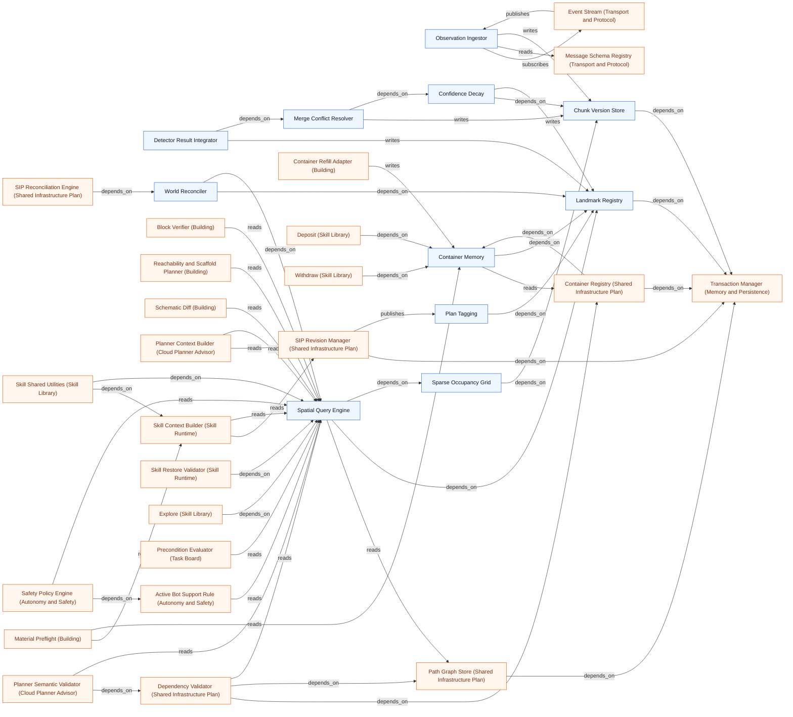
```mermaid
flowchart LR
n186["Observation Ingestor"]
n237["Chunk Version Store"]
n238["Sparse Occupancy Grid"]
n239["Merge Conflict Resolver"]
n240["Confidence Decay"]
n241["Landmark Registry"]
n242["Detector Result Integrator"]
n208["Plan Tagging"]
n206["Spatial Query Engine"]
n205["Container Memory"]
n207["World Reconciler"]
n108["Block Verifier (Building)"]
n110["Container Refill Adapter (Building)"]
n109["Material Preflight (Building)"]
n107["Reachability and Scaffold Planner (Building)"]
n104["Schematic Diff (Building)"]
n42["Planner Context Builder (Cloud Planner Advisor)"]
n45["Planner Semantic Validator (Cloud Planner Advisor)"]
n145["Active Bot Support Rule (Autonomy and Safety)"]
n147["Safety Policy Engine (Autonomy and Safety)"]
n193["Container Registry (Shared Infrastructure Plan)"]
n198["Dependency Validator (Shared Infrastructure Plan)"]
n168["SIP Reconciliation Engine (Shared Infrastructure Plan)"]
n196["SIP Revision Manager (Shared Infrastructure Plan)"]
n52["Skill Context Builder (Skill Runtime)"]
n89["Skill Restore Validator (Skill Runtime)"]
n243["Deposit (Skill Library)"]
n244["Explore (Skill Library)"]
n245["Skill Shared Utilities (Skill Library)"]
n246["Withdraw (Skill Library)"]
n214["Precondition Evaluator (Task Board)"]
n179["Event Stream (Transport and Protocol)"]
n165["Transaction Manager (Memory and Persistence)"]
n164["Message Schema Registry (Transport and Protocol)"]
n194["Path Graph Store (Shared Infrastructure Plan)"]
n108 -->|reads| n206
n110 -->|writes| n205
n109 -->|reads| n52
n109 -->|reads| n205
n107 -->|reads| n206
n104 -->|reads| n206
n42 -->|reads| n196
n42 -->|reads| n206
n45 -->|depends_on| n198
n45 -->|reads| n206
n145 -->|reads| n206
n147 -->|depends_on| n145
n147 -->|reads| n206
n193 -->|depends_on| n165
n193 -->|depends_on| n205
n198 -->|depends_on| n193
n198 -->|depends_on| n194
n198 -->|reads| n206
n194 -->|depends_on| n165
n168 -->|depends_on| n207
n196 -->|depends_on| n165
n196 -->|publishes| n208
n52 -->|reads| n196
n52 -->|reads| n206
n89 -->|depends_on| n206
n243 -->|depends_on| n205
n244 -->|depends_on| n206
n245 -->|depends_on| n52
n245 -->|depends_on| n206
n246 -->|depends_on| n205
n214 -->|reads| n206
n179 -->|publishes| n186
n237 -->|depends_on| n165
n240 -->|depends_on| n237
n240 -->|writes| n241
n205 -->|reads| n193
n205 -->|depends_on| n241
n242 -->|writes| n241
n242 -->|depends_on| n239
n241 -->|depends_on| n165
n239 -->|writes| n237
n239 -->|depends_on| n240
n186 -->|subscribes| n179
n186 -->|reads| n164
n186 -->|writes| n237
n238 -->|depends_on| n237
n208 -->|depends_on| n241
n206 -->|reads| n194
n206 -->|depends_on| n241
n206 -->|depends_on| n238
n207 -->|depends_on| n241
n207 -->|depends_on| n206
classDef internal fill:#eef6ff,stroke:#2563eb,color:#0f172a;
classDef external fill:#fff7ed,stroke:#ea580c,color:#7c2d12;
class n186,n237,n238,n239,n240,n241,n242,n208,n206,n205,n207 internal;
class n108,n110,n109,n107,n104,n42,n45,n145,n147,n193,n198,n168,n196,n52,n89,n243,n244,n245,n246,n214,n179,n165,n164,n194 external;
```

### Perception

Source: `docs/architecture/graphs/system-perception.mmd`

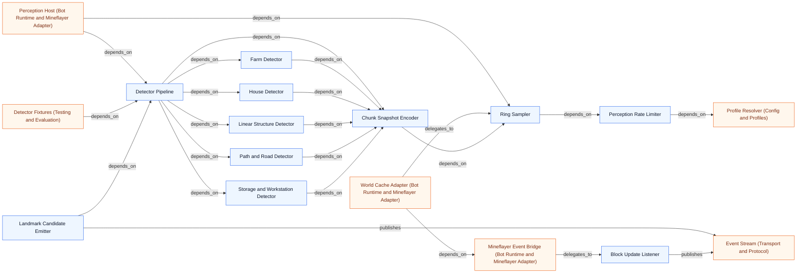
```mermaid
flowchart LR
n247["Ring Sampler"]
n248["Chunk Snapshot Encoder"]
n187["Block Update Listener"]
n249["Path and Road Detector"]
n250["House Detector"]
n251["Farm Detector"]
n252["Storage and Workstation Detector"]
n253["Linear Structure Detector"]
n254["Detector Pipeline"]
n184["Landmark Candidate Emitter"]
n255["Perception Rate Limiter"]
n55["Mineflayer Event Bridge (Bot Runtime and Mineflayer Adapter)"]
n135["Perception Host (Bot Runtime and Mineflayer Adapter)"]
n56["World Cache Adapter (Bot Runtime and Mineflayer Adapter)"]
n256["Detector Fixtures (Testing and Evaluation)"]
n179["Event Stream (Transport and Protocol)"]
n175["Profile Resolver (Config and Profiles)"]
n55 -->|delegates_to| n187
n135 -->|depends_on| n254
n135 -->|depends_on| n247
n56 -->|depends_on| n55
n56 -->|delegates_to| n247
n256 -->|depends_on| n254
n248 -->|depends_on| n247
n254 -->|depends_on| n248
n254 -->|depends_on| n251
n254 -->|depends_on| n250
n254 -->|depends_on| n253
n254 -->|depends_on| n249
n254 -->|depends_on| n252
n251 -->|depends_on| n248
n250 -->|depends_on| n248
n184 -->|depends_on| n254
n184 -->|publishes| n179
n253 -->|depends_on| n248
n249 -->|depends_on| n248
n255 -->|depends_on| n175
n247 -->|depends_on| n255
n252 -->|depends_on| n248
n187 -->|publishes| n179
classDef internal fill:#eef6ff,stroke:#2563eb,color:#0f172a;
classDef external fill:#fff7ed,stroke:#ea580c,color:#7c2d12;
class n247,n248,n187,n249,n250,n251,n252,n253,n254,n184,n255 internal;
class n55,n135,n56,n256,n179,n175 external;
```

### Laya Decision Service

Source: `docs/architecture/graphs/system-decision.mmd`

```mermaid
flowchart LR
n34["Model Loader"]
n35["Execution Provider Selector"]
n76["Decision Queue"]
n77["Decision Rate Limiter"]
n78["Digest Cache"]
n79["Digest Assembler"]
n36["Batch Runner"]
n37["Single In-flight Guard"]
n38["Output Parser"]
n39["Confidence Calibrator"]
n40["Timeout and Fallback Handler"]
n80["Latency Metrics"]
n70["Deterministic Policy (Brains)"]
n169["Config Schema Validator (Config and Profiles)"]
n164["Message Schema Registry (Transport and Protocol)"]
n257["Hardware Probe (Config and Profiles)"]
n153["Structured Logger (Ops and Observability)"]
n152["Metrics Registry (Ops and Observability)"]
n258["Laya Runtime Resolver (Config and Profiles)"]
n26(["ONNX Runtime / WebGPU Driver"])
n179["Event Stream (Transport and Protocol)"]
n175["Profile Resolver (Config and Profiles)"]
n259["Laya Benchmark Harness (Testing and Evaluation)"]
n154["Health and Readiness (Ops and Observability)"]
n260["Calibration Fitter (Laya Training)"]
n70 -->|subscribes| n179
n257 -->|depends_on| n175
n258 -->|depends_on| n257
n258 -->|depends_on| n175
n175 -->|depends_on| n169
n36 -->|depends_on| n78
n36 -->|depends_on| n34
n36 -->|depends_on| n76
n39 -->|proposes_to| n70
n39 -->|depends_on| n169
n39 -->|depends_on| n38
n79 -->|depends_on| n164
n78 -->|depends_on| n76
n35 -->|depends_on| n257
n35 -->|controls| n34
n35 -->|observes| n153
n80 -->|observes| n152
n80 -->|writes| n152
n34 -->|depends_on| n258
n34 -->|depends_on| n26
n38 -->|depends_on| n36
n38 -->|publishes| n179
n76 -->|subscribes| n179
n77 -->|depends_on| n175
n77 -->|depends_on| n76
n37 -->|controls| n36
n40 -->|controls| n38
n40 -->|depends_on| n76
n259 -->|depends_on| n80
n259 -->|depends_on| n34
n154 -->|depends_on| n34
n260 -->|reads| n39
classDef internal fill:#eef6ff,stroke:#2563eb,color:#0f172a;
classDef external fill:#fff7ed,stroke:#ea580c,color:#7c2d12;
class n34,n35,n76,n77,n78,n79,n36,n37,n38,n39,n40,n80 internal;
class n70,n169,n164,n257,n153,n152,n258,n179,n175,n259,n154,n260,n26 external;
```

### Cloud Planner Advisor

Source: `docs/architecture/graphs/system-planner.mmd`

```mermaid
flowchart LR
n41["OpenAI-Compatible Client"]
n42["Planner Context Builder"]
n43["Planner Trigger Evaluator"]
n44["Planner Schema Validator"]
n45["Planner Semantic Validator"]
n46["Planner Repair Loop"]
n47["SIP Mutation Translator"]
n48["Task DAG Translator"]
n49["Planner Budget Limiter"]
n81["Plan Cache"]
n50["Planner Arbitration Handler"]
n51["Keep Last Good Fallback"]
n82["Strategic Intent Store"]
n31["Global Scheduler (Coordinator Runtime)"]
n202["Compatibility Checker (Edit Grants and Collaboration)"]
n161["Grant Issuer (Edit Grants and Collaboration)"]
n179["Event Stream (Transport and Protocol)"]
n152["Metrics Registry (Ops and Observability)"]
n222["Bot Profile Store (Bot Registry and Profiles)"]
n196["SIP Revision Manager (Shared Infrastructure Plan)"]
n212["Task Repository (Task Board)"]
n206["Spatial Query Engine (World Model and Landmarks)"]
n169["Config Schema Validator (Config and Profiles)"]
n185["Secrets Loader (Config and Profiles)"]
n25(["Muse Spark Planner Endpoint"])
n165["Transaction Manager (Memory and Persistence)"]
n198["Dependency Validator (Shared Infrastructure Plan)"]
n195["Rules Store (Shared Infrastructure Plan)"]
n84["Skill Registry (Skill Runtime)"]
n199["SIP Mutation Proposer (Shared Infrastructure Plan)"]
n218["Dead Letter Manager (Task Board)"]
n64["Recovery Ladder (Autonomy and Safety)"]
n222 -->|depends_on| n165
n31 -->|delegates_to| n43
n202 -->|depends_on| n195
n161 -->|depends_on| n202
n50 -->|reads| n202
n50 -->|proposes_to| n161
n50 -->|subscribes| n179
n49 -->|observes| n152
n49 -->|controls| n41
n42 -->|reads| n222
n42 -->|reads| n196
n42 -->|reads| n212
n42 -->|reads| n206
n51 -->|depends_on| n81
n51 -->|reads| n196
n41 -->|depends_on| n169
n41 -->|depends_on| n185
n41 -->|depends_on| n25
n41 -->|delegates_to| n50
n81 -->|depends_on| n165
n46 -->|controls| n51
n46 -->|depends_on| n41
n46 -->|depends_on| n44
n46 -->|depends_on| n45
n44 -->|controls| n46
n45 -->|controls| n46
n45 -->|depends_on| n44
n45 -->|depends_on| n198
n45 -->|reads| n195
n45 -->|reads| n84
n45 -->|reads| n206
n47 -->|depends_on| n46
n47 -->|proposes_to| n199
n48 -->|depends_on| n46
n48 -->|proposes_to| n212
n43 -->|observes| n152
n43 -->|delegates_to| n42
n43 -->|reads| n196
n43 -->|reads| n218
n64 -->|proposes_to| n43
n64 -->|depends_on| n179
n198 -->|reads| n206
n199 -->|depends_on| n198
n199 -->|depends_on| n196
n196 -->|depends_on| n165
n196 -->|depends_on| n195
n195 -->|depends_on| n165
n218 -->|writes| n212
n212 -->|depends_on| n165
n82 -->|depends_on| n81
classDef internal fill:#eef6ff,stroke:#2563eb,color:#0f172a;
classDef external fill:#fff7ed,stroke:#ea580c,color:#7c2d12;
class n41,n42,n43,n44,n45,n46,n47,n48,n49,n81,n50,n51,n82 internal;
class n31,n202,n161,n179,n152,n222,n196,n212,n206,n169,n185,n165,n198,n195,n84,n199,n218,n64,n25 external;
```

### Skill Runtime

Source: `docs/architecture/graphs/system-skill-runtime.mmd`

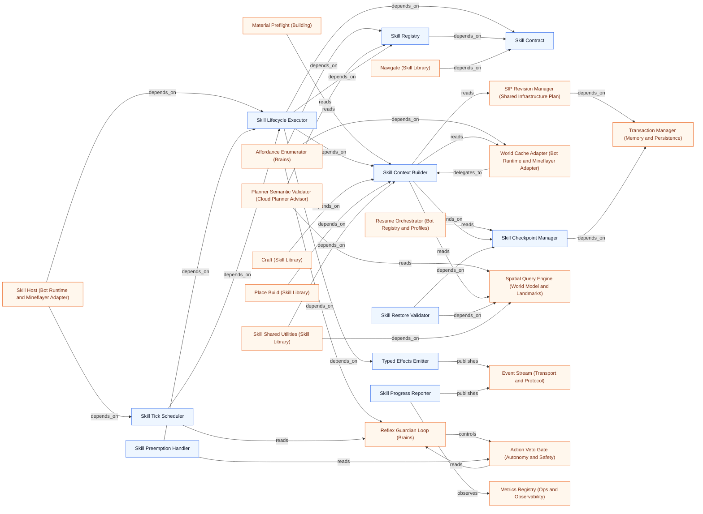
```mermaid
flowchart LR
n83["Skill Contract"]
n84["Skill Registry"]
n85["Skill Lifecycle Executor"]
n86["Skill Tick Scheduler"]
n52["Skill Context Builder"]
n87["Skill Progress Reporter"]
n88["Skill Checkpoint Manager"]
n89["Skill Restore Validator"]
n90["Typed Effects Emitter"]
n91["Skill Preemption Handler"]
n156["Affordance Enumerator (Brains)"]
n59["Skill Host (Bot Runtime and Mineflayer Adapter)"]
n56["World Cache Adapter (Bot Runtime and Mineflayer Adapter)"]
n173["Resume Orchestrator (Bot Registry and Profiles)"]
n109["Material Preflight (Building)"]
n45["Planner Semantic Validator (Cloud Planner Advisor)"]
n165["Transaction Manager (Memory and Persistence)"]
n196["SIP Revision Manager (Shared Infrastructure Plan)"]
n206["Spatial Query Engine (World Model and Landmarks)"]
n179["Event Stream (Transport and Protocol)"]
n63["Action Veto Gate (Autonomy and Safety)"]
n152["Metrics Registry (Ops and Observability)"]
n69["Reflex Guardian Loop (Brains)"]
n261["Craft (Skill Library)"]
n262["Navigate (Skill Library)"]
n263["Place Build (Skill Library)"]
n245["Skill Shared Utilities (Skill Library)"]
n156 -->|depends_on| n56
n156 -->|depends_on| n69
n156 -->|depends_on| n84
n59 -->|depends_on| n85
n59 -->|depends_on| n86
n56 -->|delegates_to| n52
n173 -->|reads| n88
n109 -->|reads| n52
n45 -->|reads| n84
n45 -->|reads| n206
n63 -->|reads| n69
n69 -->|controls| n63
n196 -->|depends_on| n165
n88 -->|depends_on| n165
n52 -->|reads| n56
n52 -->|reads| n196
n52 -->|depends_on| n88
n52 -->|reads| n206
n90 -->|publishes| n179
n85 -->|depends_on| n52
n85 -->|depends_on| n90
n85 -->|depends_on| n83
n85 -->|depends_on| n84
n91 -->|reads| n63
n91 -->|depends_on| n85
n87 -->|observes| n152
n87 -->|publishes| n179
n89 -->|depends_on| n88
n89 -->|depends_on| n206
n84 -->|depends_on| n83
n86 -->|reads| n69
n86 -->|depends_on| n85
n261 -->|depends_on| n52
n262 -->|depends_on| n83
n263 -->|depends_on| n52
n245 -->|depends_on| n52
n245 -->|depends_on| n206
classDef internal fill:#eef6ff,stroke:#2563eb,color:#0f172a;
classDef external fill:#fff7ed,stroke:#ea580c,color:#7c2d12;
class n83,n84,n85,n86,n52,n87,n88,n89,n90,n91 internal;
class n156,n59,n56,n173,n109,n45,n165,n196,n206,n179,n63,n152,n69,n261,n262,n263,n245 external;
```

### Skill Library

Source: `docs/architecture/graphs/system-skills.mmd`

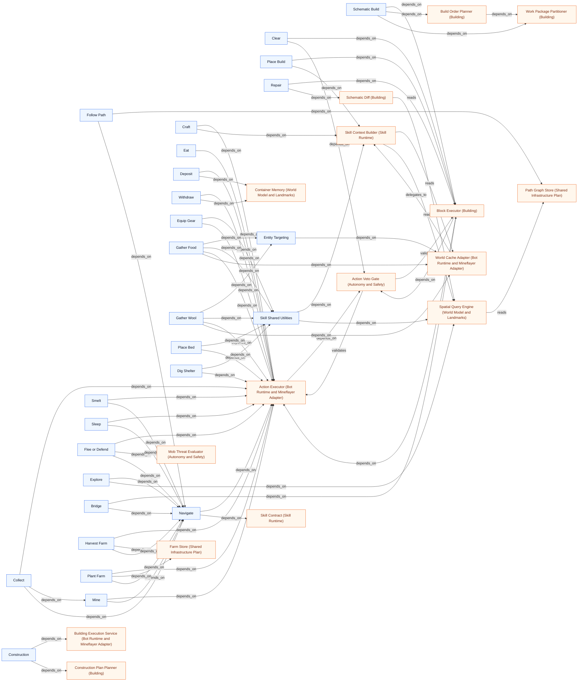
```mermaid
flowchart LR
n262["Navigate"]
n209["Follow Path"]
n264["Mine"]
n265["Collect"]
n261["Craft"]
n266["Smelt"]
n267["Eat"]
n243["Deposit"]
n246["Withdraw"]
n268["Sleep"]
n269["Flee or Defend"]
n244["Explore"]
n270["Bridge"]
n271["Clear"]
n263["Place Build"]
n272["Construction"]
n273["Schematic Build"]
n274["Repair"]
n210["Harvest Farm"]
n211["Plant Farm"]
n275["Entity Targeting"]
n276["Equip Gear"]
n277["Gather Food"]
n278["Gather Wool"]
n279["Place Bed"]
n280["Dig Shelter"]
n245["Skill Shared Utilities"]
n53["Block Executor (Building)"]
n63["Action Veto Gate (Autonomy and Safety)"]
n57["Action Executor (Bot Runtime and Mineflayer Adapter)"]
n52["Skill Context Builder (Skill Runtime)"]
n205["Container Memory (World Model and Landmarks)"]
n206["Spatial Query Engine (World Model and Landmarks)"]
n139["Mob Threat Evaluator (Autonomy and Safety)"]
n194["Path Graph Store (Shared Infrastructure Plan)"]
n192["Farm Store (Shared Infrastructure Plan)"]
n83["Skill Contract (Skill Runtime)"]
n104["Schematic Diff (Building)"]
n106["Build Order Planner (Building)"]
n105["Work Package Partitioner (Building)"]
n56["World Cache Adapter (Bot Runtime and Mineflayer Adapter)"]
n130["Building Execution Service (Bot Runtime and Mineflayer Adapter)"]
n124["Construction Plan Planner (Building)"]
n57 -->|depends_on| n63
n56 -->|delegates_to| n52
n53 -->|depends_on| n57
n53 -->|depends_on| n63
n106 -->|depends_on| n105
n104 -->|reads| n206
n63 -->|validates| n57
n63 -->|validates| n53
n52 -->|reads| n56
n52 -->|reads| n206
n270 -->|depends_on| n53
n270 -->|depends_on| n262
n271 -->|depends_on| n53
n271 -->|depends_on| n63
n265 -->|depends_on| n57
n265 -->|depends_on| n264
n265 -->|depends_on| n262
n261 -->|depends_on| n57
n261 -->|depends_on| n52
n243 -->|depends_on| n57
n243 -->|depends_on| n205
n267 -->|depends_on| n57
n244 -->|depends_on| n262
n244 -->|depends_on| n206
n269 -->|depends_on| n57
n269 -->|depends_on| n139
n269 -->|depends_on| n262
n209 -->|depends_on| n194
n209 -->|depends_on| n262
n210 -->|depends_on| n57
n210 -->|depends_on| n192
n210 -->|depends_on| n262
n264 -->|depends_on| n57
n264 -->|depends_on| n262
n262 -->|depends_on| n57
n262 -->|depends_on| n83
n263 -->|depends_on| n53
n263 -->|depends_on| n52
n211 -->|depends_on| n57
n211 -->|depends_on| n192
n211 -->|depends_on| n262
n274 -->|depends_on| n53
n274 -->|depends_on| n104
n273 -->|depends_on| n53
n273 -->|depends_on| n106
n273 -->|depends_on| n105
n245 -->|depends_on| n52
n245 -->|depends_on| n206
n268 -->|depends_on| n57
n268 -->|depends_on| n262
n266 -->|depends_on| n57
n266 -->|depends_on| n262
n246 -->|depends_on| n57
n246 -->|depends_on| n205
n206 -->|reads| n194
n275 -->|depends_on| n56
n276 -->|depends_on| n245
n276 -->|depends_on| n57
n277 -->|depends_on| n275
n277 -->|depends_on| n245
n277 -->|depends_on| n57
n277 -->|depends_on| n56
n278 -->|depends_on| n275
n278 -->|depends_on| n245
n278 -->|depends_on| n57
n278 -->|depends_on| n56
n279 -->|depends_on| n245
n279 -->|depends_on| n57
n280 -->|depends_on| n245
n280 -->|depends_on| n57
n272 -->|depends_on| n130
n272 -->|depends_on| n124
classDef internal fill:#eef6ff,stroke:#2563eb,color:#0f172a;
classDef external fill:#fff7ed,stroke:#ea580c,color:#7c2d12;
class n262,n209,n264,n265,n261,n266,n267,n243,n246,n268,n269,n244,n270,n271,n263,n272,n273,n274,n210,n211,n275,n276,n277,n278,n279,n280,n245 internal;
class n53,n63,n57,n52,n205,n206,n139,n194,n192,n83,n104,n106,n105,n56,n130,n124 external;
```

### Building

Source: `docs/architecture/graphs/system-building.mmd`

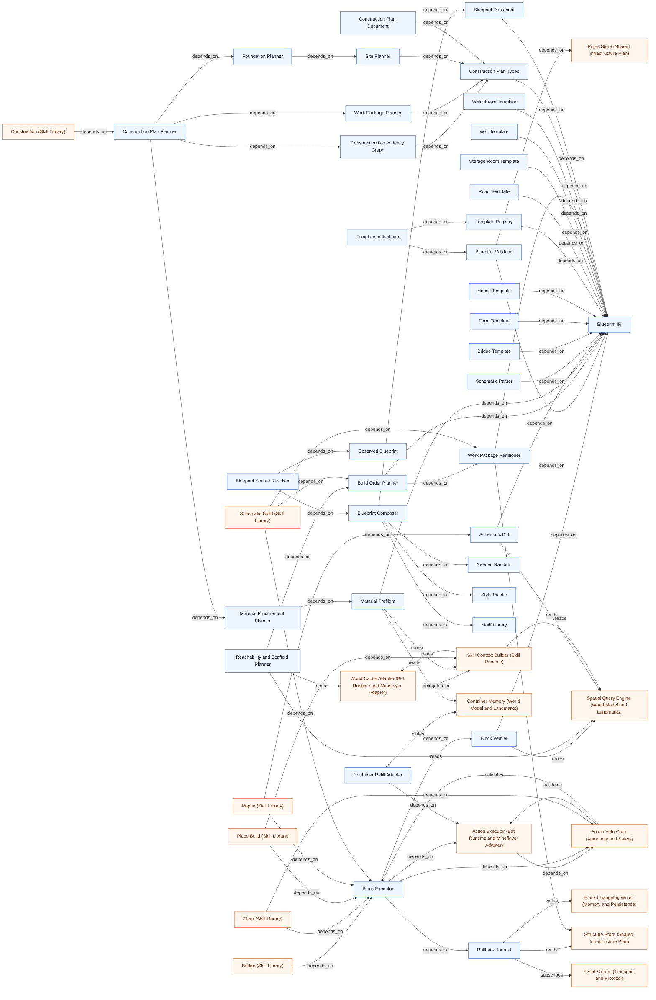
```mermaid
flowchart LR
n92["Blueprint IR"]
n93["Blueprint Validator"]
n94["Template Registry"]
n95["House Template"]
n96["Road Template"]
n97["Farm Template"]
n98["Wall Template"]
n99["Bridge Template"]
n100["Storage Room Template"]
n101["Watchtower Template"]
n102["Template Instantiator"]
n103["Schematic Parser"]
n104["Schematic Diff"]
n105["Work Package Partitioner"]
n106["Build Order Planner"]
n107["Reachability and Scaffold Planner"]
n108["Block Verifier"]
n53["Block Executor"]
n109["Material Preflight"]
n110["Container Refill Adapter"]
n111["Rollback Journal"]
n112["Construction Plan Types"]
n113["Blueprint Document"]
n114["Seeded Random"]
n115["Style Palette"]
n116["Motif Library"]
n117["Blueprint Composer"]
n118["Observed Blueprint"]
n119["Blueprint Source Resolver"]
n120["Site Planner"]
n121["Foundation Planner"]
n122["Construction Dependency Graph"]
n123["Work Package Planner"]
n124["Construction Plan Planner"]
n125["Construction Plan Document"]
n126["Material Procurement Planner"]
n57["Action Executor (Bot Runtime and Mineflayer Adapter)"]
n63["Action Veto Gate (Autonomy and Safety)"]
n206["Spatial Query Engine (World Model and Landmarks)"]
n195["Rules Store (Shared Infrastructure Plan)"]
n205["Container Memory (World Model and Landmarks)"]
n52["Skill Context Builder (Skill Runtime)"]
n56["World Cache Adapter (Bot Runtime and Mineflayer Adapter)"]
n281["Block Changelog Writer (Memory and Persistence)"]
n190["Structure Store (Shared Infrastructure Plan)"]
n179["Event Stream (Transport and Protocol)"]
n270["Bridge (Skill Library)"]
n271["Clear (Skill Library)"]
n263["Place Build (Skill Library)"]
n274["Repair (Skill Library)"]
n273["Schematic Build (Skill Library)"]
n272["Construction (Skill Library)"]
n57 -->|depends_on| n63
n56 -->|delegates_to| n52
n53 -->|depends_on| n57
n53 -->|depends_on| n108
n53 -->|depends_on| n111
n53 -->|depends_on| n63
n108 -->|depends_on| n92
n108 -->|reads| n206
n93 -->|depends_on| n92
n93 -->|depends_on| n195
n106 -->|depends_on| n92
n106 -->|depends_on| n105
n110 -->|depends_on| n57
n110 -->|writes| n205
n109 -->|depends_on| n92
n109 -->|reads| n52
n109 -->|reads| n205
n107 -->|reads| n56
n107 -->|depends_on| n106
n107 -->|reads| n206
n111 -->|writes| n281
n111 -->|reads| n190
n111 -->|subscribes| n179
n104 -->|depends_on| n92
n104 -->|reads| n206
n103 -->|depends_on| n92
n99 -->|depends_on| n92
n97 -->|depends_on| n92
n95 -->|depends_on| n92
n102 -->|depends_on| n93
n102 -->|depends_on| n94
n94 -->|depends_on| n92
n96 -->|depends_on| n92
n100 -->|depends_on| n92
n98 -->|depends_on| n92
n101 -->|depends_on| n92
n105 -->|depends_on| n92
n105 -->|reads| n190
n63 -->|validates| n57
n63 -->|validates| n53
n52 -->|reads| n56
n52 -->|reads| n206
n270 -->|depends_on| n53
n271 -->|depends_on| n53
n271 -->|depends_on| n63
n263 -->|depends_on| n53
n263 -->|depends_on| n52
n274 -->|depends_on| n53
n274 -->|depends_on| n104
n273 -->|depends_on| n53
n273 -->|depends_on| n106
n273 -->|depends_on| n105
n112 -->|depends_on| n92
n113 -->|depends_on| n92
n117 -->|depends_on| n113
n117 -->|depends_on| n114
n117 -->|depends_on| n115
n117 -->|depends_on| n116
n119 -->|depends_on| n117
n119 -->|depends_on| n118
n121 -->|depends_on| n120
n122 -->|depends_on| n112
n123 -->|depends_on| n112
n124 -->|depends_on| n121
n124 -->|depends_on| n122
n124 -->|depends_on| n123
n124 -->|depends_on| n126
n126 -->|depends_on| n109
n120 -->|depends_on| n112
n272 -->|depends_on| n124
n125 -->|depends_on| n112
classDef internal fill:#eef6ff,stroke:#2563eb,color:#0f172a;
classDef external fill:#fff7ed,stroke:#ea580c,color:#7c2d12;
class n92,n93,n94,n95,n96,n97,n98,n99,n100,n101,n102,n103,n104,n105,n106,n107,n108,n53,n109,n110,n111,n112,n113,n114,n115,n116,n117,n118,n119,n120,n121,n122,n123,n124,n125,n126 internal;
class n57,n63,n206,n195,n205,n52,n56,n281,n190,n179,n270,n271,n263,n274,n273,n272 external;
```

### Bot Runtime and Mineflayer Adapter

Source: `docs/architecture/graphs/system-bot-runtime.mmd`

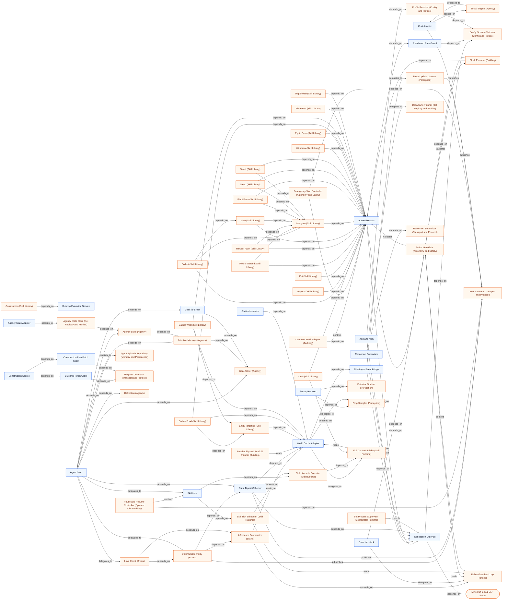
```mermaid
flowchart LR
n54["Connection Lifecycle"]
n127["Join and Auth"]
n55["Mineflayer Event Bridge"]
n56["World Cache Adapter"]
n128["Shelter Inspector"]
n129["Reach and Rate Guard"]
n57["Action Executor"]
n130["Building Execution Service"]
n131["Blueprint Fetch Client"]
n132["Construction Plan Fetch Client"]
n133["Construction Source"]
n134["State Digest Collector"]
n58["Guardian Hook"]
n59["Skill Host"]
n135["Perception Host"]
n60["Agent Loop"]
n136["Goal Tie-Break"]
n61["Chat Adapter"]
n137["Agency State Adapter"]
n62["Reconnect Supervisor"]
n63["Action Veto Gate (Autonomy and Safety)"]
n156["Affordance Enumerator (Brains)"]
n169["Config Schema Validator (Config and Profiles)"]
n24(["Minecraft 1.20.1 LAN Server"])
n70["Deterministic Policy (Brains)"]
n187["Block Update Listener (Perception)"]
n69["Reflex Guardian Loop (Brains)"]
n175["Profile Resolver (Config and Profiles)"]
n254["Detector Pipeline (Perception)"]
n247["Ring Sampler (Perception)"]
n200["Delta Sync Planner (Bot Registry and Profiles)"]
n181["Reconnect Supervisor (Transport and Protocol)"]
n85["Skill Lifecycle Executor (Skill Runtime)"]
n86["Skill Tick Scheduler (Skill Runtime)"]
n179["Event Stream (Transport and Protocol)"]
n52["Skill Context Builder (Skill Runtime)"]
n53["Block Executor (Building)"]
n110["Container Refill Adapter (Building)"]
n107["Reachability and Scaffold Planner (Building)"]
n67["Pause and Resume Controller (Ops and Observability)"]
n65["Emergency Stop Controller (Autonomy and Safety)"]
n265["Collect (Skill Library)"]
n261["Craft (Skill Library)"]
n243["Deposit (Skill Library)"]
n267["Eat (Skill Library)"]
n269["Flee or Defend (Skill Library)"]
n210["Harvest Farm (Skill Library)"]
n264["Mine (Skill Library)"]
n262["Navigate (Skill Library)"]
n211["Plant Farm (Skill Library)"]
n268["Sleep (Skill Library)"]
n266["Smelt (Skill Library)"]
n246["Withdraw (Skill Library)"]
n33["Bot Process Supervisor (Coordinator Runtime)"]
n282["Goal Arbiter (Agency)"]
n283["Intention Manager (Agency)"]
n236["Agency State (Agency)"]
n71["Laya Client (Brains)"]
n284["Social Engine (Agency)"]
n233["Agency State Store (Bot Registry and Profiles)"]
n285["Agent Episode Repository (Memory and Persistence)"]
n275["Entity Targeting (Skill Library)"]
n276["Equip Gear (Skill Library)"]
n277["Gather Food (Skill Library)"]
n278["Gather Wool (Skill Library)"]
n279["Place Bed (Skill Library)"]
n280["Dig Shelter (Skill Library)"]
n272["Construction (Skill Library)"]
n178["Request Correlator (Transport and Protocol)"]
n286["Reflection (Agency)"]
n57 -->|depends_on| n54
n57 -->|depends_on| n129
n57 -->|depends_on| n63
n156 -->|depends_on| n56
n156 -->|depends_on| n69
n54 -->|depends_on| n169
n54 -->|depends_on| n24
n70 -->|depends_on| n156
n70 -->|depends_on| n134
n70 -->|subscribes| n179
n55 -->|depends_on| n54
n55 -->|delegates_to| n187
n58 -->|depends_on| n63
n58 -->|delegates_to| n69
n127 -->|depends_on| n54
n127 -->|depends_on| n175
n135 -->|depends_on| n254
n135 -->|depends_on| n247
n129 -->|depends_on| n169
n62 -->|depends_on| n54
n62 -->|delegates_to| n200
n62 -->|depends_on| n181
n59 -->|depends_on| n85
n59 -->|depends_on| n86
n134 -->|depends_on| n54
n134 -->|depends_on| n56
n134 -->|publishes| n179
n56 -->|depends_on| n55
n56 -->|delegates_to| n247
n56 -->|delegates_to| n52
n53 -->|depends_on| n57
n53 -->|depends_on| n63
n110 -->|depends_on| n57
n107 -->|reads| n56
n175 -->|depends_on| n169
n67 -->|controls| n59
n67 -->|depends_on| n179
n63 -->|validates| n57
n63 -->|validates| n53
n63 -->|reads| n69
n65 -->|controls| n57
n65 -->|depends_on| n179
n69 -->|controls| n63
n52 -->|reads| n56
n85 -->|depends_on| n52
n86 -->|reads| n69
n86 -->|depends_on| n85
n265 -->|depends_on| n57
n265 -->|depends_on| n264
n265 -->|depends_on| n262
n261 -->|depends_on| n57
n261 -->|depends_on| n52
n243 -->|depends_on| n57
n267 -->|depends_on| n57
n269 -->|depends_on| n57
n269 -->|depends_on| n262
n210 -->|depends_on| n57
n210 -->|depends_on| n262
n264 -->|depends_on| n57
n264 -->|depends_on| n262
n262 -->|depends_on| n57
n211 -->|depends_on| n57
n211 -->|depends_on| n262
n268 -->|depends_on| n57
n268 -->|depends_on| n262
n266 -->|depends_on| n57
n266 -->|depends_on| n262
n246 -->|depends_on| n57
n33 -->|controls| n54
n71 -->|depends_on| n156
n71 -->|depends_on| n70
n187 -->|publishes| n179
n60 -->|depends_on| n282
n60 -->|depends_on| n283
n60 -->|depends_on| n236
n60 -->|delegates_to| n71
n60 -->|delegates_to| n70
n60 -->|depends_on| n134
n60 -->|delegates_to| n59
n61 -->|depends_on| n284
n61 -->|publishes| n179
n137 -->|persists_to| n233
n60 -->|persists_to| n285
n283 -->|depends_on| n282
n236 -->|depends_on| n283
n284 -->|proposes_to| n61
n233 -->|depends_on| n236
n275 -->|depends_on| n56
n276 -->|depends_on| n57
n277 -->|depends_on| n275
n277 -->|depends_on| n57
n277 -->|depends_on| n56
n278 -->|depends_on| n275
n278 -->|depends_on| n57
n278 -->|depends_on| n56
n279 -->|depends_on| n57
n280 -->|depends_on| n57
n128 -->|depends_on| n56
n272 -->|depends_on| n130
n133 -->|depends_on| n131
n131 -->|depends_on| n178
n60 -->|depends_on| n136
n136 -->|depends_on| n282
n132 -->|depends_on| n178
n133 -->|depends_on| n132
n60 -->|depends_on| n286
classDef internal fill:#eef6ff,stroke:#2563eb,color:#0f172a;
classDef external fill:#fff7ed,stroke:#ea580c,color:#7c2d12;
class n54,n127,n55,n56,n128,n129,n57,n130,n131,n132,n133,n134,n58,n59,n135,n60,n136,n61,n137,n62 internal;
class n63,n156,n169,n70,n187,n69,n175,n254,n247,n200,n181,n85,n86,n179,n52,n53,n110,n107,n67,n65,n265,n261,n243,n267,n269,n210,n264,n262,n211,n268,n266,n246,n33,n282,n283,n236,n71,n284,n233,n285,n275,n276,n277,n278,n279,n280,n272,n178,n286,n24 external;
```

### Autonomy and Safety

Source: `docs/architecture/graphs/system-safety.mmd`

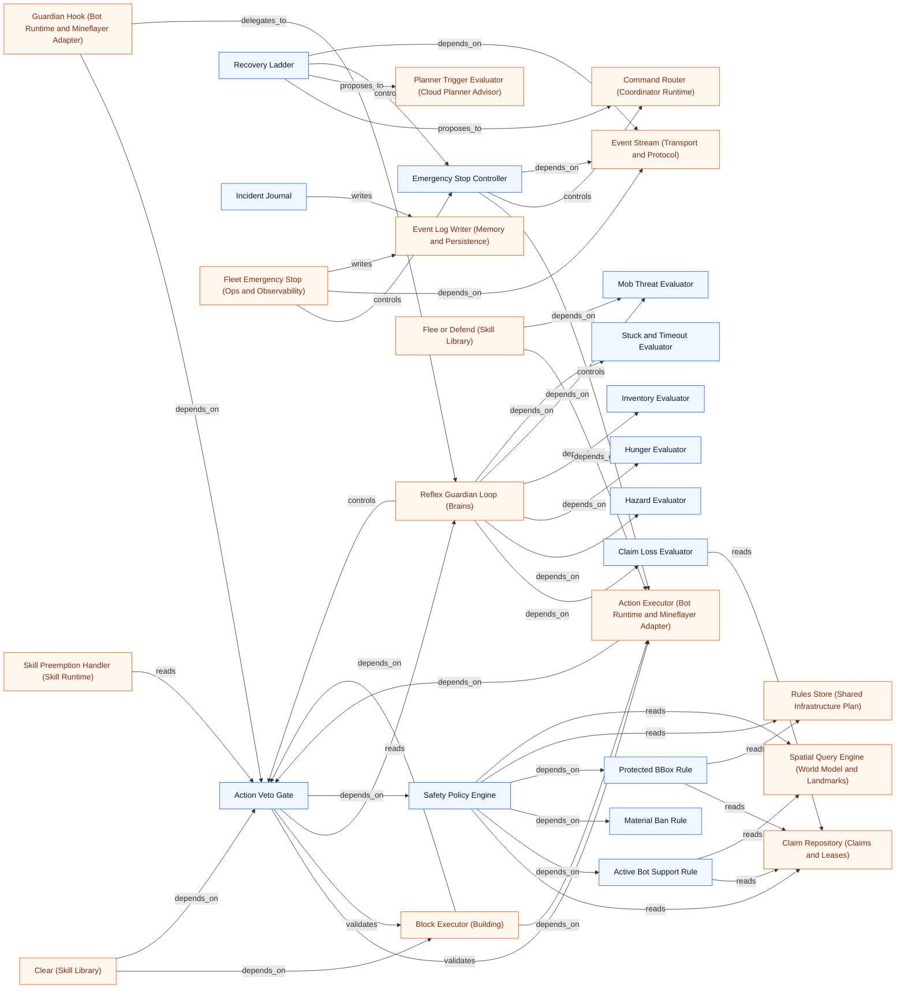
```mermaid
flowchart LR
n138["Hazard Evaluator"]
n139["Mob Threat Evaluator"]
n140["Hunger Evaluator"]
n141["Stuck and Timeout Evaluator"]
n142["Inventory Evaluator"]
n143["Claim Loss Evaluator"]
n144["Protected BBox Rule"]
n145["Active Bot Support Rule"]
n146["Material Ban Rule"]
n147["Safety Policy Engine"]
n63["Action Veto Gate"]
n64["Recovery Ladder"]
n65["Emergency Stop Controller"]
n148["Incident Journal"]
n57["Action Executor (Bot Runtime and Mineflayer Adapter)"]
n58["Guardian Hook (Bot Runtime and Mineflayer Adapter)"]
n53["Block Executor (Building)"]
n68["Fleet Emergency Stop (Ops and Observability)"]
n69["Reflex Guardian Loop (Brains)"]
n224["Claim Repository (Claims and Leases)"]
n206["Spatial Query Engine (World Model and Landmarks)"]
n29["Command Router (Coordinator Runtime)"]
n179["Event Stream (Transport and Protocol)"]
n223["Event Log Writer (Memory and Persistence)"]
n195["Rules Store (Shared Infrastructure Plan)"]
n43["Planner Trigger Evaluator (Cloud Planner Advisor)"]
n91["Skill Preemption Handler (Skill Runtime)"]
n271["Clear (Skill Library)"]
n269["Flee or Defend (Skill Library)"]
n57 -->|depends_on| n63
n58 -->|depends_on| n63
n58 -->|delegates_to| n69
n53 -->|depends_on| n57
n53 -->|depends_on| n63
n68 -->|controls| n65
n68 -->|depends_on| n179
n63 -->|validates| n57
n63 -->|validates| n53
n63 -->|reads| n69
n63 -->|depends_on| n147
n145 -->|reads| n224
n145 -->|reads| n206
n143 -->|reads| n224
n65 -->|controls| n57
n65 -->|controls| n29
n65 -->|depends_on| n179
n69 -->|controls| n63
n69 -->|depends_on| n143
n69 -->|depends_on| n138
n69 -->|depends_on| n140
n69 -->|depends_on| n142
n69 -->|depends_on| n139
n69 -->|depends_on| n141
n148 -->|writes| n223
n144 -->|reads| n224
n144 -->|reads| n195
n64 -->|proposes_to| n29
n64 -->|proposes_to| n43
n64 -->|controls| n65
n64 -->|depends_on| n179
n147 -->|reads| n224
n147 -->|depends_on| n145
n147 -->|depends_on| n146
n147 -->|depends_on| n144
n147 -->|reads| n195
n147 -->|reads| n206
n91 -->|reads| n63
n271 -->|depends_on| n53
n271 -->|depends_on| n63
n269 -->|depends_on| n57
n269 -->|depends_on| n139
n68 -->|writes| n223
classDef internal fill:#eef6ff,stroke:#2563eb,color:#0f172a;
classDef external fill:#fff7ed,stroke:#ea580c,color:#7c2d12;
class n138,n139,n140,n141,n142,n143,n144,n145,n146,n147,n63,n64,n65,n148 internal;
class n57,n58,n53,n68,n69,n224,n206,n29,n179,n223,n195,n43,n91,n271,n269 external;
```

### Memory and Persistence

Source: `docs/architecture/graphs/system-memory.mmd`

```mermaid
flowchart LR
n287["SQLite Runtime"]
n171["Migration Runner"]
n165["Transaction Manager"]
n223["Event Log Writer"]
n281["Block Changelog Writer"]
n167["Retention Pruner"]
n288["Snapshot Export"]
n289["Schema Version Registry"]
n290["Episode Store"]
n285["Agent Episode Repository"]
n222["Bot Profile Store (Bot Registry and Profiles)"]
n111["Rollback Journal (Building)"]
n160["Atomic Claim Acquirer (Claims and Leases)"]
n224["Claim Repository (Claims and Leases)"]
n158["Fencing Token Authority (Claims and Leases)"]
n30["Coordinator Epoch Authority (Coordinator Runtime)"]
n31["Global Scheduler (Coordinator Runtime)"]
n72["Process Bootstrap (Coordinator Runtime)"]
n32["Restart Recovery Orchestrator (Coordinator Runtime)"]
n291["Replay Engine (Testing and Evaluation)"]
n228["Grant Repository (Edit Grants and Collaboration)"]
n155["Audit Viewer (Ops and Observability)"]
n154["Health and Readiness (Ops and Observability)"]
n81["Plan Cache (Cloud Planner Advisor)"]
n148["Incident Journal (Autonomy and Safety)"]
n193["Container Registry (Shared Infrastructure Plan)"]
n192["Farm Store (Shared Infrastructure Plan)"]
n194["Path Graph Store (Shared Infrastructure Plan)"]
n196["SIP Revision Manager (Shared Infrastructure Plan)"]
n191["Road Store (Shared Infrastructure Plan)"]
n195["Rules Store (Shared Infrastructure Plan)"]
n190["Structure Store (Shared Infrastructure Plan)"]
n162["SIP Transactional Committer (Shared Infrastructure Plan)"]
n189["Zone Store (Shared Infrastructure Plan)"]
n88["Skill Checkpoint Manager (Skill Runtime)"]
n163["Atomic Task Claimer (Task Board)"]
n212["Task Repository (Task Board)"]
n219["Task State Machine (Task Board)"]
n292["Trace Exporter (Laya Training)"]
n237["Chunk Version Store (World Model and Landmarks)"]
n241["Landmark Registry (World Model and Landmarks)"]
n67["Pause and Resume Controller (Ops and Observability)"]
n68["Fleet Emergency Stop (Ops and Observability)"]
n60["Agent Loop (Bot Runtime and Mineflayer Adapter)"]
n233["Agency State Store (Bot Registry and Profiles)"]
n150["Agency Status View (Ops and Observability)"]
n222 -->|depends_on| n165
n111 -->|writes| n281
n111 -->|reads| n190
n160 -->|writes| n224
n160 -->|depends_on| n165
n224 -->|depends_on| n165
n158 -->|depends_on| n30
n158 -->|depends_on| n165
n30 -->|controls| n158
n30 -->|depends_on| n165
n31 -->|depends_on| n30
n31 -->|delegates_to| n167
n72 -->|depends_on| n32
n72 -->|depends_on| n171
n32 -->|depends_on| n165
n291 -->|depends_on| n223
n228 -->|depends_on| n165
n281 -->|depends_on| n165
n223 -->|depends_on| n165
n171 -->|depends_on| n287
n167 -->|depends_on| n281
n167 -->|depends_on| n223
n167 -->|depends_on| n165
n289 -->|depends_on| n171
n288 -->|depends_on| n165
n165 -->|depends_on| n287
n155 -->|reads| n281
n155 -->|reads| n223
n154 -->|depends_on| n287
n81 -->|depends_on| n165
n148 -->|writes| n223
n193 -->|depends_on| n165
n192 -->|depends_on| n165
n194 -->|depends_on| n165
n196 -->|depends_on| n165
n196 -->|depends_on| n195
n191 -->|depends_on| n165
n195 -->|depends_on| n165
n190 -->|depends_on| n165
n162 -->|depends_on| n165
n162 -->|writes| n193
n162 -->|writes| n192
n162 -->|writes| n194
n162 -->|depends_on| n196
n162 -->|writes| n191
n162 -->|writes| n195
n162 -->|writes| n190
n162 -->|writes| n189
n189 -->|depends_on| n165
n88 -->|depends_on| n165
n163 -->|depends_on| n165
n163 -->|writes| n212
n212 -->|depends_on| n165
n219 -->|depends_on| n223
n219 -->|writes| n212
n292 -->|reads| n223
n237 -->|depends_on| n165
n241 -->|depends_on| n165
n291 -->|reads| n290
n292 -->|reads| n290
n155 -->|reads| n290
n167 -->|depends_on| n290
n67 -->|writes| n223
n68 -->|writes| n223
n60 -->|persists_to| n285
n233 -->|depends_on| n165
n285 -->|depends_on| n165
n150 -->|reads| n233
n150 -->|reads| n285
classDef internal fill:#eef6ff,stroke:#2563eb,color:#0f172a;
classDef external fill:#fff7ed,stroke:#ea580c,color:#7c2d12;
class n287,n171,n165,n223,n281,n167,n288,n289,n290,n285 internal;
class n222,n111,n160,n224,n158,n30,n31,n72,n32,n291,n228,n155,n154,n81,n148,n193,n192,n194,n196,n191,n195,n190,n162,n189,n88,n163,n212,n219,n292,n237,n241,n67,n68,n60,n233,n150 external;
```

### Ops and Observability

Source: `docs/architecture/graphs/system-ops.mmd`

```mermaid
flowchart LR
n66["Ops API"]
n149["Status Aggregator"]
n150["Agency Status View"]
n67["Pause and Resume Controller"]
n68["Fleet Emergency Stop"]
n151["SIP Dump"]
n152["Metrics Registry"]
n153["Structured Logger"]
n154["Health and Readiness"]
n155["Audit Viewer"]
n226["Contention Metrics (Claims and Leases)"]
n35["Execution Provider Selector (Laya Decision Service)"]
n80["Latency Metrics (Laya Decision Service)"]
n293["Metrics Reporter (Testing and Evaluation)"]
n28(["Fleet Operator"])
n281["Block Changelog Writer (Memory and Persistence)"]
n223["Event Log Writer (Memory and Persistence)"]
n65["Emergency Stop Controller (Autonomy and Safety)"]
n179["Event Stream (Transport and Protocol)"]
n34["Model Loader (Laya Decision Service)"]
n287["SQLite Runtime (Memory and Persistence)"]
n164["Message Schema Registry (Transport and Protocol)"]
n59["Skill Host (Bot Runtime and Mineflayer Adapter)"]
n177["Presence Tracker (Bot Registry and Profiles)"]
n196["SIP Revision Manager (Shared Infrastructure Plan)"]
n224["Claim Repository (Claims and Leases)"]
n212["Task Repository (Task Board)"]
n49["Planner Budget Limiter (Cloud Planner Advisor)"]
n43["Planner Trigger Evaluator (Cloud Planner Advisor)"]
n87["Skill Progress Reporter (Skill Runtime)"]
n290["Episode Store (Memory and Persistence)"]
n233["Agency State Store (Bot Registry and Profiles)"]
n285["Agent Episode Repository (Memory and Persistence)"]
n226 -->|depends_on| n224
n226 -->|observes| n152
n35 -->|controls| n34
n35 -->|observes| n153
n80 -->|observes| n152
n80 -->|writes| n152
n293 -->|observes| n152
n28 -->|controls| n66
n155 -->|reads| n281
n155 -->|reads| n223
n68 -->|controls| n65
n68 -->|depends_on| n179
n154 -->|depends_on| n34
n154 -->|depends_on| n287
n154 -->|depends_on| n149
n66 -->|depends_on| n68
n66 -->|depends_on| n67
n66 -->|depends_on| n149
n66 -->|depends_on| n164
n67 -->|controls| n59
n67 -->|depends_on| n177
n67 -->|depends_on| n179
n151 -->|depends_on| n196
n149 -->|depends_on| n177
n149 -->|reads| n224
n149 -->|observes| n152
n149 -->|reads| n196
n149 -->|reads| n212
n49 -->|observes| n152
n43 -->|observes| n152
n43 -->|reads| n196
n65 -->|depends_on| n179
n87 -->|observes| n152
n87 -->|publishes| n179
n155 -->|reads| n290
n67 -->|writes| n223
n68 -->|writes| n223
n150 -->|reads| n233
n150 -->|reads| n285
n66 -->|depends_on| n150
classDef internal fill:#eef6ff,stroke:#2563eb,color:#0f172a;
classDef external fill:#fff7ed,stroke:#ea580c,color:#7c2d12;
class n66,n149,n150,n67,n68,n151,n152,n153,n154,n155 internal;
class n226,n35,n80,n293,n281,n223,n65,n179,n34,n287,n164,n59,n177,n196,n224,n212,n49,n43,n87,n290,n233,n285,n28 external;
```

### Config and Profiles

Source: `docs/architecture/graphs/system-config.mmd`

```mermaid
flowchart LR
n170["Environment Parser"]
n169["Config Schema Validator"]
n175["Profile Resolver"]
n257["Hardware Probe"]
n185["Secrets Loader"]
n235["Name Pool Validator"]
n258["Laya Runtime Resolver"]
n294["Fail Fast Handler"]
n54["Connection Lifecycle (Bot Runtime and Mineflayer Adapter)"]
n127["Join and Auth (Bot Runtime and Mineflayer Adapter)"]
n129["Reach and Rate Guard (Bot Runtime and Mineflayer Adapter)"]
n176["Bot Identity Authenticator (Bot Registry and Profiles)"]
n234["Name Pool Allocator (Bot Registry and Profiles)"]
n27(["Host Hardware"])
n72["Process Bootstrap (Coordinator Runtime)"]
n73["Service Composition (Coordinator Runtime)"]
n39["Confidence Calibrator (Laya Decision Service)"]
n35["Execution Provider Selector (Laya Decision Service)"]
n34["Model Loader (Laya Decision Service)"]
n77["Decision Rate Limiter (Laya Decision Service)"]
n255["Perception Rate Limiter (Perception)"]
n41["OpenAI-Compatible Client (Cloud Planner Advisor)"]
n182["Transport Authentication (Transport and Protocol)"]
n157["Tactical Decision Policy (Brains)"]
n54 -->|depends_on| n169
n127 -->|depends_on| n54
n127 -->|depends_on| n175
n129 -->|depends_on| n169
n176 -->|depends_on| n185
n234 -->|depends_on| n235
n169 -->|depends_on| n170
n294 -->|depends_on| n169
n257 -->|depends_on| n175
n257 -->|depends_on| n27
n258 -->|depends_on| n257
n258 -->|depends_on| n175
n235 -->|depends_on| n169
n175 -->|depends_on| n169
n185 -->|depends_on| n170
n72 -->|depends_on| n169
n72 -->|depends_on| n170
n72 -->|depends_on| n73
n73 -->|depends_on| n175
n39 -->|depends_on| n169
n35 -->|depends_on| n257
n35 -->|controls| n34
n34 -->|depends_on| n258
n77 -->|depends_on| n175
n255 -->|depends_on| n175
n41 -->|depends_on| n169
n41 -->|depends_on| n185
n182 -->|depends_on| n176
n182 -->|depends_on| n185
n157 -->|depends_on| n169
classDef internal fill:#eef6ff,stroke:#2563eb,color:#0f172a;
classDef external fill:#fff7ed,stroke:#ea580c,color:#7c2d12;
class n170,n169,n175,n257,n185,n235,n258,n294 internal;
class n54,n127,n129,n176,n234,n72,n73,n39,n35,n34,n77,n255,n41,n182,n157,n27 external;
```

### Testing and Evaluation

Source: `docs/architecture/graphs/system-eval.mmd`

```mermaid
flowchart LR
n295["Unit Fixtures"]
n256["Detector Fixtures"]
n296["Docker Server Harness"]
n297["Scenario Runner"]
n291["Replay Engine"]
n221["Contention Harness"]
n293["Metrics Reporter"]
n298["Soak Runner"]
n299["Architecture Guard Tests"]
n259["Laya Benchmark Harness"]
n224["Claim Repository (Claims and Leases)"]
n212["Task Repository (Task Board)"]
n254["Detector Pipeline (Perception)"]
n24(["Minecraft 1.20.1 LAN Server"])
n80["Latency Metrics (Laya Decision Service)"]
n34["Model Loader (Laya Decision Service)"]
n152["Metrics Registry (Ops and Observability)"]
n223["Event Log Writer (Memory and Persistence)"]
n300["Promotion Gate (Laya Training)"]
n290["Episode Store (Memory and Persistence)"]
n80 -->|observes| n152
n80 -->|writes| n152
n299 -->|depends_on| n295
n221 -->|depends_on| n224
n221 -->|delegates_to| n297
n221 -->|depends_on| n212
n256 -->|depends_on| n295
n256 -->|depends_on| n254
n296 -->|depends_on| n295
n296 -->|depends_on| n24
n259 -->|depends_on| n80
n259 -->|depends_on| n34
n259 -->|delegates_to| n297
n293 -->|observes| n152
n291 -->|depends_on| n297
n291 -->|depends_on| n223
n297 -->|controls| n296
n297 -->|publishes| n293
n298 -->|depends_on| n293
n298 -->|delegates_to| n297
n300 -->|depends_on| n259
n291 -->|reads| n290
classDef internal fill:#eef6ff,stroke:#2563eb,color:#0f172a;
classDef external fill:#fff7ed,stroke:#ea580c,color:#7c2d12;
class n295,n256,n296,n297,n291,n221,n293,n298,n299,n259 internal;
class n224,n212,n254,n80,n34,n152,n223,n300,n290,n24 external;
```

### Laya Training

Source: `docs/architecture/graphs/system-training.mmd`

```mermaid
flowchart LR
n292["Trace Exporter"]
n301["Labeling Pipeline"]
n302["Reward Computer"]
n303["Fine-tune Runner"]
n304["ONNX Exporter"]
n260["Calibration Fitter"]
n300["Promotion Gate"]
n39["Confidence Calibrator (Laya Decision Service)"]
n259["Laya Benchmark Harness (Testing and Evaluation)"]
n223["Event Log Writer (Memory and Persistence)"]
n290["Episode Store (Memory and Persistence)"]
n260 -->|reads| n39
n260 -->|depends_on| n292
n303 -->|depends_on| n301
n303 -->|depends_on| n302
n301 -->|depends_on| n292
n304 -->|depends_on| n303
n300 -->|depends_on| n259
n300 -->|depends_on| n260
n300 -->|depends_on| n304
n302 -->|depends_on| n292
n292 -->|reads| n223
n292 -->|reads| n290
classDef internal fill:#eef6ff,stroke:#2563eb,color:#0f172a;
classDef external fill:#fff7ed,stroke:#ea580c,color:#7c2d12;
class n292,n301,n302,n303,n304,n260,n300 internal;
class n39,n259,n223,n290 external;
```

### Brains

Source: `docs/architecture/graphs/system-brains.mmd`

```mermaid
flowchart LR
n69["Reflex Guardian Loop"]
n156["Affordance Enumerator"]
n70["Deterministic Policy"]
n71["Laya Client"]
n157["Tactical Decision Policy"]
n56["World Cache Adapter (Bot Runtime and Mineflayer Adapter)"]
n84["Skill Registry (Skill Runtime)"]
n134["State Digest Collector (Bot Runtime and Mineflayer Adapter)"]
n231["Behavior Profile Manager (Bot Registry and Profiles)"]
n179["Event Stream (Transport and Protocol)"]
n58["Guardian Hook (Bot Runtime and Mineflayer Adapter)"]
n39["Confidence Calibrator (Laya Decision Service)"]
n63["Action Veto Gate (Autonomy and Safety)"]
n143["Claim Loss Evaluator (Autonomy and Safety)"]
n138["Hazard Evaluator (Autonomy and Safety)"]
n140["Hunger Evaluator (Autonomy and Safety)"]
n142["Inventory Evaluator (Autonomy and Safety)"]
n139["Mob Threat Evaluator (Autonomy and Safety)"]
n141["Stuck and Timeout Evaluator (Autonomy and Safety)"]
n86["Skill Tick Scheduler (Skill Runtime)"]
n172["WebSocket Codec (Transport and Protocol)"]
n60["Agent Loop (Bot Runtime and Mineflayer Adapter)"]
n169["Config Schema Validator (Config and Profiles)"]
n156 -->|depends_on| n56
n156 -->|depends_on| n69
n156 -->|depends_on| n84
n70 -->|depends_on| n156
n70 -->|depends_on| n134
n70 -->|reads| n231
n70 -->|subscribes| n179
n58 -->|depends_on| n63
n58 -->|delegates_to| n69
n134 -->|depends_on| n56
n134 -->|publishes| n179
n39 -->|proposes_to| n70
n39 -->|depends_on| n169
n63 -->|reads| n69
n69 -->|controls| n63
n69 -->|depends_on| n143
n69 -->|depends_on| n138
n69 -->|depends_on| n140
n69 -->|depends_on| n142
n69 -->|depends_on| n139
n69 -->|depends_on| n141
n86 -->|reads| n69
n179 -->|depends_on| n172
n71 -->|depends_on| n156
n71 -->|depends_on| n172
n71 -->|depends_on| n70
n60 -->|delegates_to| n71
n60 -->|delegates_to| n70
n60 -->|depends_on| n134
n71 -->|depends_on| n157
n157 -->|depends_on| n169
classDef internal fill:#eef6ff,stroke:#2563eb,color:#0f172a;
classDef external fill:#fff7ed,stroke:#ea580c,color:#7c2d12;
class n69,n156,n70,n71,n157 internal;
class n56,n84,n134,n231,n179,n58,n39,n63,n143,n138,n140,n142,n139,n141,n86,n172,n60,n169 external;
```

### Agency

Source: `docs/architecture/graphs/system-agency.mmd`

```mermaid
flowchart LR
n305["Personality Model"]
n306["Needs Model"]
n307["Goal Catalog"]
n308["Goal Generator"]
n282["Goal Arbiter"]
n283["Intention Manager"]
n309["Routine Model"]
n310["Item Knowledge"]
n311["Night Preparation Config"]
n312["Shelter Strategy"]
n313["Shelter Plan"]
n314["Night Readiness"]
n284["Social Engine"]
n315["Working Memory"]
n316["Project Focus Policy"]
n236["Agency State"]
n317["Strategic Intent Policy"]
n286["Reflection"]
n60["Agent Loop (Bot Runtime and Mineflayer Adapter)"]
n61["Chat Adapter (Bot Runtime and Mineflayer Adapter)"]
n233["Agency State Store (Bot Registry and Profiles)"]
n136["Goal Tie-Break (Bot Runtime and Mineflayer Adapter)"]
n60 -->|depends_on| n282
n60 -->|depends_on| n283
n60 -->|depends_on| n236
n61 -->|depends_on| n284
n308 -->|depends_on| n307
n308 -->|depends_on| n306
n308 -->|depends_on| n305
n282 -->|depends_on| n308
n282 -->|depends_on| n306
n282 -->|depends_on| n305
n283 -->|depends_on| n282
n284 -->|depends_on| n305
n236 -->|depends_on| n306
n236 -->|depends_on| n305
n236 -->|depends_on| n283
n236 -->|depends_on| n309
n236 -->|depends_on| n315
n316 -->|depends_on| n315
n284 -->|proposes_to| n61
n233 -->|depends_on| n236
n314 -->|depends_on| n310
n314 -->|depends_on| n311
n314 -->|depends_on| n309
n314 -->|depends_on| n313
n314 -->|depends_on| n312
n312 -->|depends_on| n311
n308 -->|depends_on| n311
n308 -->|depends_on| n314
n308 -->|depends_on| n309
n317 -->|depends_on| n282
n317 -->|depends_on| n315
n60 -->|depends_on| n136
n136 -->|depends_on| n282
n60 -->|depends_on| n286
classDef internal fill:#eef6ff,stroke:#2563eb,color:#0f172a;
classDef external fill:#fff7ed,stroke:#ea580c,color:#7c2d12;
class n305,n306,n307,n308,n282,n283,n309,n310,n311,n312,n313,n314,n284,n315,n316,n236,n317,n286 internal;
class n60,n61,n233,n136 external;
```

### Bootstrap and Toolchain

Source: `docs/architecture/graphs/system-toolchain.mmd`

```mermaid
flowchart LR
n318["Bootstrap Orchestrator"]
n319["Capability Check"]
n320["Python Environment"]
n321["Minecraft Server Controller"]
n322["Firefox SVG Renderer"]
n318 -->|depends_on| n319
n318 -->|depends_on| n320
n318 -->|depends_on| n321
n318 -->|depends_on| n322
classDef internal fill:#eef6ff,stroke:#2563eb,color:#0f172a;
classDef external fill:#fff7ed,stroke:#ea580c,color:#7c2d12;
class n318,n319,n320,n321,n322 internal;
```
